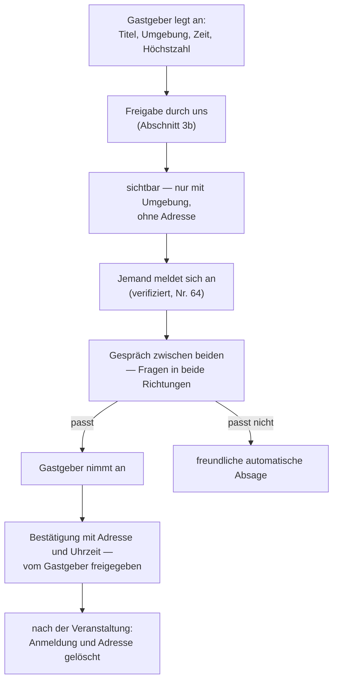

# Veranstaltungen, Safe Spaces und die Kommerzialisierung

> **ENTWURF · Fassung 2 · Stand 21.09.2026 · Aufgaben A-47 und A-55 · Rolle: Veranstaltungsstratege**
> **Seit Fassung 1 entschieden:** Der Strang kommt (Nr. 74), für **jedes verifizierte Konto** — auch Community-Gruppen, Stammtische, Hauspartys; anfangs mit redaktioneller Freigabe, später schalten professionelle Konten selbst. **Keine gekaufte Sichtbarkeit** (Nr. 65). **Private Veranstaltungen mit Anmeldung und Adresse erst nach Zusage** (Nr. 82). **Die Ampel** für Termine mit sexuellem Kern (Nr. 55). Neu in Fassung 2: Abschnitte 0, 3a, 3b, 5a und die Rechtsfragen V10 bis V13. Nichts davon ist gebucht oder Dritten zugesagt.

---

## Auf einen Blick

| | |
|---|---|
| Was heute schon da ist | **fünf MVP-Funktionen** (F30 bis F34) und **sechs Funktionen in Phase 2** (F35 bis F40), dazu eine Erlöszeile „Ticketbeteiligung" im Finanzmodell |
| Was fehlt | Die Stufe dazwischen: eigene Veranstaltungen. Heute ist Cruizy ein **Verzeichnis fremder Termine**, kein Veranstalter |
| Der eigentliche Grund, es zu tun | **Nicht der Erlös, sondern der Kaltstart.** Eine Veranstaltung erzeugt Gleichzeitigkeit auf Bestellung — genau das, was ein leeres Raster nicht hat |
| Geschätzte Wirkung | Eine Veranstaltung mit 150 Menschen bringt bei 60 % Installationsquote rund **90 Installationen zu 5,56 € je Stück** — teurer als der tragbare Preis von 1,97 €, aber **11- bis 27-mal billiger als bezahlte Werbung** (60 bis 150 €) |
| Größtes Risiko | Haftung und Kapazität. Ein eigener Veranstalter zu sein ist ein zweites Unternehmen neben dem ersten |
| Empfehlung | Stufe 1 und 2 vor dem Start, Stufe 3 nach Tor 3, Stufe 4 frühestens nach der zweiten Stadt |
| **Fassung 2 — wer veranstalten darf** | **jedes verifizierte Konto** (Nr. 74) — Gemeinschaft und Gewerbe, mit zwei Kontoarten und einer Freigabe, die mit dem Vertrauen wächst (Abschnitt 3b) |
| **Fassung 2 — Erlös** | **ohne gekaufte Sichtbarkeit:** Gemeinschaft kostenlos · Werkzeugabo für Veranstalter · Ticketanteil **unter** dem Marktüblichen · Kontingente · freiwilliger Zuschuss (Abschnitt 5a) |
| **Fassung 2 — private Veranstaltungen** | Anmeldung, Gespräch, Zusage einzeln, **Adresse erst danach**, Gästeliste nur für den Gastgeber (Abschnitt 3a) |

---

## 0 · Was seit Fassung 1 entschieden ist

| Nr. | Frage | Entscheidung |
|---|---|---|
| **74** | Kommt der Strang, und für wen? | **Ja.** Veranstaltungen „überall", von Community-Gruppen (Stammtische, Hauspartys) ebenso wie professionell. Anlegen nur mit **verifiziertem Konto**. Anfangs lesen die Gründer jede Veranstaltung gegen, bevor sie sichtbar wird; später schalten **professionelle Konten** selbst |
| **65** | Darf Sichtbarkeit gekauft werden? | **Nein.** Der Erlös kommt aus Vermittlung, Werkzeug und freiwilligem Zuschuss |
| **82** | Private Veranstaltungen | Höchstzahl · Anmeldung · Gespräch vor der Zusage · Zusage einzeln durch den Gastgeber · **Adresse erst nach Zusage** · freundliche automatische Absage · **Gästeliste nur für den Gastgeber** · Hinweis in den Bedingungen |
| **55** | Termine mit sexuellem Kern | **Ampel:** grün öffentlich · gelb nüchtern · rot nie öffentlich |
| **74** | Muss es Geld bringen? | **Ja** — über Kontingente, Anteile oder Zuschüsse; günstig und attraktiv für Veranstalter, aber für uns rechnend. Mit freiwilliger Zuschussfunktion |

**Was damit aus Fassung 1 wegfällt:** der „hervorgehobene Termin" in Stufe 4 (gesperrt durch Nr. 65) und die drei offenen Entscheidungen aus Abschnitt 8.

---

## 1 · Warum das mehr ist als eine Erlösquelle

Handbuch B beschreibt das Kernproblem jeder solchen App in einem Satz: **Echtzeit braucht Gleichzeitigkeit.** Ein Raster ist leer, nicht weil zu wenige Menschen die App haben, sondern weil sie nicht zur selben Zeit am selben Ort sind. Deshalb steht im Skalierungs-Playbook die Dichte vor der Fläche, und deshalb ist die Schwelle für Tor 3 nicht „3.500 Nutzer irgendwo", sondern 3.500 in einer Stadt.

**Eine Veranstaltung löst dieses Problem direkt.** Sie bringt hundert oder zweihundert Menschen aus der Zielgruppe zur selben Zeit an denselben Ort. Wer an diesem Abend die App öffnet, sieht kein leeres Raster — er sieht den Raum, in dem er steht. Das ist der einzige Hebel im ganzen Wachstumsplan, der Dichte **herstellt**, statt auf sie zu warten.

**Die zweite Wirkung ist die Ortsbeziehung.** Das Skalierungs-Playbook nennt rund 40 Ortsvereinbarungen je Stadt als den unkopierbaren Vorteil, und das Kontaktanlässe-Playbook beschreibt, wie man sie anbahnt: mit einem Anlass statt mit einem Kaltbesuch. **Eine gemeinsame Veranstaltung ist der stärkste denkbare Anlass.** Ein Ort, mit dem man einen Abend gemacht hat, ist kein Kontakt mehr, sondern ein Partner.

**Die dritte Wirkung ist das, was das Produkt ohnehin verspricht.** Das Schutzversprechen lautet „Was dich schützt, kostet nie etwas". Ein Raum, in dem Menschen sich sicher treffen können, ist die physische Entsprechung dieses Satzes. Wer ihn nur in einer App behauptet, behauptet ihn; wer ihn einmal im Monat herstellt, zeigt ihn.

**Und die vierte, unbequeme Wirkung:** Es macht aus zwei Gründern Veranstalter. Mit Haftung, Meldepflichten, Versicherung und Nächten, die im Kalender stehen. Abschnitt 7 sagt, was das an Kapazität kostet.

---

## 2 · Was im Produkt schon angelegt ist

Das Veranstaltungsthema fängt nicht bei null an — es steht zur Hälfte in der Produktspezifikation, nur unter anderem Namen.

| Funktion | Was sie tut | Stand |
|---|---|---|
| **F30** Karte mit Clustern | zeigt, wo etwas ist, ohne einzelne Personen zu zeigen | MVP, AP-12 |
| **F31** Ortsverzeichnis mit Beanspruchung | Orte vorangelegt oder vom Betreiber bestätigt | MVP, AP-12, Alleinstellungsmerkmal |
| **F32** Ereignisse mit Zusage | Termin an einem Ort, „Ich komme" | MVP, AP-12, Alleinstellungsmerkmal |
| **F33** Temporäre Ereignisgruppen | Gruppen, die sich zwei Stunden vorher öffnen | MVP, AP-12 |
| **F34** E-Mail-Einreichung | Veranstalter schicken Termine per Mail | MVP, AP-12 |
| **F35** Auslastungsanzeige | wie voll es gerade ist | Phase 2 |
| **F36** Eigenes Treffen anlegen | Nutzer legen selbst Treffen an | Phase 2 |
| **F37** Kalender-Abonnement | Termine im eigenen Kalender | Phase 2 |
| **F38** Beitragstext einfügen | Veranstalter liefern Text mit | Phase 2 |
| **F39** Veranstalterportal | Orte und Veranstalter pflegen selbst | Phase 2 |
| **F40** Ortskanäle | dauerhafte Kanäle je Ort | Phase 2 |

**Außerdem bereits vorhanden:** der Terminservice vor dem Start (`../30-marketing-kanaele/terminservice-konzept.md`), die Ortsliste Köln, das Kontaktanlässe-Playbook — und im Finanzmodell eine Erlöszeile **Ticketbeteiligung** mit 0,0525 € je aktivem Nutzer und Monat ab Monat 18 und 20.000 Nutzern.

**Der Befund:** Das Produkt kann Termine **zeigen**. Es kann keine Veranstaltung **durchführen** und keine **verkaufen**. Zwischen F34 (jemand schickt uns einen Termin) und F39 (jemand pflegt ihn selbst) fehlt die Stufe, um die es hier geht: **wir machen selbst einen.**

---

## 3 · Fünf Stufen

Jede Stufe setzt die vorige voraus. Wer eine überspringt, kauft Risiko, das er nicht kennt.

### Stufe 0 · Termine anderer zeigen — *läuft bereits*

Der Terminservice vor dem Start und im Produkt die Funktionen F30 bis F34. **Kein eigenes Risiko, keine Haftung, kein Erlös.** Der Zweck ist, dass die Gründer die Szene und die Veranstalter kennen, bevor sie selbst etwas machen.

**Startet:** läuft ab Kanalstart (V3) · **Kosten:** im Terminservice-Konzept bereits gerechnet · **Erlös:** keiner

### Stufe 1 · Gast beim Ort — der erste eigene Abend ohne eigenes Risiko

Ein bestehender Ort ist **Veranstalter**, Cruizy ist **Partner**: Wir bringen Ankündigung, Reichweite und Gestaltung, der Ort bringt Raum, Genehmigung, Personal und Haftung. Format zum Beispiel ein Abend unter eigenem Namen, monatlich, in einer Bar oder einem Café.

| | |
|---|---|
| **Wer haftet** | der Ort. Das ist der ganze Punkt dieser Stufe |
| **Kosten** | 0 bis 300 € je Abend (Gestaltung, Aushänge, ggf. ein Getränkebudget) |
| **Was es bringt** | die Ortsbeziehung aus dem Kontaktanlässe-Playbook, eine wiederkehrende Gelegenheit, Menschen zu treffen, und die erste Gleichzeitigkeit im Raster |
| **Was zu klären ist** | ob unser Name auf der Ankündigung uns zum Mitveranstalter macht — das ist eine Anwaltsfrage und steht unten |
| **Frühestens** | V3, sobald die Kanäle laufen und ein Ort zugesagt hat |

**Das ist die Stufe, die ich zuerst machen würde.** Sie kostet fast nichts, sie ist reversibel, und sie beantwortet die einzige Frage, die zählt: Kommt überhaupt jemand?

### Stufe 2 · Eigener Safe Space — klein, regelmäßig, in eigener Verantwortung

Ein eigenes Format in einem angemieteten Raum: Community-Treffen, 30 bis 80 Menschen, kein Alkoholausschank in eigener Regie, kein Eintritt oder Eintritt zum Selbstkostenpreis. Abschnitt 4 beschreibt, was „Safe Space" hier konkret heißt.

| | |
|---|---|
| **Wer haftet** | wir |
| **Kosten** | 200 bis 600 € je Abend (Raum, Versicherung anteilig, Material) |
| **Pflichtprogramm** | Veranstalterhaftpflicht · Hausordnung und Awareness-Konzept · benannte Ansprechperson vor Ort · Zutrittsregel bei einer Altersgrenze · Meldeweg bei Vorfällen |
| **Was es bringt** | Glaubwürdigkeit, die sich nicht kaufen lässt; ein Raum, über den geredet wird; und ein Format, das später Künstler und Partner tragen kann |
| **Frühestens** | nach dem Start, wenn das Produkt läuft und die Moderationslast bekannt ist |

### Stufe 3 · Veranstalterportal — andere stellen ein

Das ist **F39** aus der Spezifikation, heute Phase 2. Orte und Veranstalter pflegen ihre Termine selbst, mit redaktioneller Freigabe (die Beanspruchung von Orten läuft schon über M70 im Moderations-Backend).

| | |
|---|---|
| **Kosten** | Entwicklung: ein Arbeitspaket in Phase 2, heute nicht geplant (Lücke L7 in `../70-entwicklung-ab-monat-4/entwicklungsmodelle.md`) |
| **Was es bringt** | Der Terminbestand wächst ohne unsere Arbeitszeit. Das ist die Voraussetzung für jede Stadt nach Köln |
| **Frühestens** | nach Tor 3, zusammen mit der zweiten Stadt |

### Stufe 4 · Kommerzialisierung — Ticketing, Konzerthäuser, Künstler

Erst hier entsteht Geld. Vier Bausteine, von leicht nach schwer:

| Baustein | Wie es funktioniert | Erlös |
|---|---|---|
| **Ticketbeteiligung** | Ein Veranstalter verkauft über uns oder mit unserem Verweis; wir bekommen einen Anteil | im Modell: 0,0525 € je Nutzer und Monat ab 20.000 Nutzern |
| ~~**Hervorgehobener Termin**~~ | ~~Ein Veranstalter zahlt für Sichtbarkeit~~ | **entfällt — Nr. 65 vom 19.09.2026.** Der Erlös kommt stattdessen aus Abschnitt 5a |
| **Künstlerformate** | Auftritt queerer Künstler in Partnerräumen, gemeinsam vermarktet | offen |
| **Konzerthäuser** | Kooperation für eine Reihe; wir bringen Publikum und Ansprache, das Haus bringt Raum und Technik | offen, frühestens nach mehreren Städten |

**Die unbequeme Wahrheit zu Stufe 4:** Konzerthäuser und etablierte Veranstalter arbeiten mit Reichweite. Mit 3.500 aktiven Nutzern in einer Stadt ist man für sie kein Partner, sondern ein Bittsteller. Diese Stufe wird erst interessant, wenn zwei oder drei Städte laufen — im Finanzmodell also frühestens im dritten Jahr.

---

## 3a · Private Veranstaltungen — Hauspartys, Stammtische in Wohnungen

*Neu in Fassung 2 — Entscheidung Nr. 82.* Eine Privatadresse in einer einsehbaren Liste ist ein Sicherheits- und ein Datenschutzproblem zugleich — und in einer App, in der Anwesenheit ein Outing sein kann, trifft es nicht nur den Gastgeber.

| Regel | Warum |
|---|---|
| **Höchstzahl** — der Gastgeber legt fest, wie viele kommen können | Die Veranstaltung ist voll, wenn sie voll ist; es gibt keine Warteliste, die jemanden unter Druck setzt |
| **Anmelden kann nur, wer verifiziert ist** | Nr. 64: Buchen jeder Art setzt die Altersprüfung voraus |
| **Gespräch vor der Zusage** | Beide Seiten können fragen. Der Gastgeber entscheidet nicht über ein Profil, sondern nach einem Austausch |
| **Die Adresse geht nur an den, der angenommen ist** | Sie erscheint nie in einer Liste, nie in einer Suche, nie in einer Vorschau |
| **Die Gästeliste sieht nur der Gastgeber** | Keine Gästeliste für Gäste. Wer kommt, erfährt man vor Ort — oder gar nicht |
| **Die Absage ist freundlich und automatisch** | Dieselbe Logik wie beim höflichen Ausstieg aus einem Gespräch: niemand muss begründen, niemand wird beschämt (Text ST-EVT-05) |
| **Nach der Veranstaltung wird gelöscht** | Anmeldungen und Adresse sind P-VERANSTALTUNG-LOESCHUNG nach dem Termin weg. Die Teilnahme an einer queeren Party ist ein Datum nach Art. 9 DSGVO (V8) |

**Zu „wir sind dann abgesichert, weil er bestätigt hat, nicht wir":** Das trifft zu, soweit wir die Zusage nicht selbst geben — **aber nur im Rahmen der Haftungsprivilegien für Vermittlungsdienste, und nur, wenn wir auf Meldungen reagieren.** Ein Hinweis in den Bedingungen ist nötig und sinnvoll; er ist kein Freibrief. Der Formulierungsvorschlag steht im AGB-Gerüst, Abschnitt 3c. **Neue Anwaltsfrage V10.**

**Die Ampel gilt auch hier:** Eine private Veranstaltung, deren Kern sexuell ist, ist „rot" — sie erscheint **nie** außerhalb der App und in der App nur für verifizierte Konten.

---

## 3b · Wer veranstalten darf und wie freigegeben wird

*Neu in Fassung 2 — Entscheidung Nr. 74.*

### Zwei Kontoarten

| | **Gemeinschaft** | **Gewerblich** |
|---|---|---|
| **Wer** | jedes verifizierte Konto — Stammtische, Hauspartys, Gruppen, Freundeskreise | Orte, Clubs, Bars, Veranstalter, Künstler — mit Veranstalterkonto |
| **Was sie anlegen** | öffentliche und private Veranstaltungen | öffentliche Veranstaltungen, Serien, Veranstaltungen mit Tickets |
| **Was es kostet** | **nichts** — Gemeinschaft erzeugt Dichte, und Dichte ist das Produkt | Grundfunktionen kostenlos, Werkzeug im Abo (Abschnitt 5a) |
| **Nachweis** | Altersprüfung wie für alle | dazu Angaben nach § 5 DDG, weil gewerblich |

### Freigabe, die mit dem Vertrauen wächst

| Phase | Wie | Wann |
|---|---|---|
| **1 · Alles wird gegengelesen** | Jede Veranstaltung, jedes Inserat, jeder Ort geht vor der Veröffentlichung durch eine Freigabe im Moderations-Backend (neuer Bildschirm **M75**, nach dem Muster von M70) | **ab Start** — so beschlossen |
| **2 · Gewerbliche Konten schalten selbst** | Nach P-FREIGABE-VERTRAUEN beanstandungsfreien Veranstaltungen veröffentlicht ein gewerbliches Konto ohne Vorprüfung; geprüft wird danach, wie bei jedem anderen Inhalt | wenn die Menge es verlangt |
| **3 · Gemeinschaft auf Vertrauen** | bleibt vorgeprüft, bis die Menge es unmöglich macht — dann ebenfalls nach beanstandungsfreien Veranstaltungen | später |

**Was bei der Freigabe geprüft wird — kurz, damit es schnell geht:**

1. Hält die Ankündigung die **Ampel** ein?
2. Steht **keine Privatadresse** im Text?
3. Ist die Veranstaltung **ab 18** und sagt das?
4. Verspricht sie nichts, was nicht zu halten ist — kein „sicher", kein „garantiert"?
5. Bei gewerblich: stimmen die Anbieterangaben?

**Aufwand, geschätzt:** zwei bis fünf Minuten je Veranstaltung (**ANNAHME**). Bei 20 Veranstaltungen in der Woche sind das ein bis zwei Stunden. Das ist tragbar — und es ist der Grund, warum Phase 2 kommen muss, sobald es 100 in der Woche sind.

---

## 4 · Was „Safe Space" konkret heißt

Der Begriff wird viel benutzt und selten eingelöst. Wenn Cruizy ihn verwendet, muss dahinter etwas Nachprüfbares stehen — sonst ist es dieselbe leere Behauptung, gegen die sich das ganze Produkt positioniert.

| Was | Konkret |
|---|---|
| **Eine Hausordnung, die vorher sichtbar ist** | Nicht als Aushang neben der Tür, sondern in der Ankündigung. Wer kommt, weiß vorher, was gilt |
| **Eine benannte Ansprechperson** | Mit Namen, erkennbar, den ganzen Abend da. Nicht „wendet euch an das Personal" |
| **Ein Weg, etwas zu melden, ohne dabei gesehen zu werden** | Eine Nummer, an die man aus der Toilette schreiben kann. Das ist der Unterschied zwischen einem Konzept und einem Satz |
| **Eine Regel, was bei einem Vorfall passiert** | Wer entscheidet, was der Person geschieht, die stört, und was der Person geschieht, der etwas geschehen ist. Vorher festgelegt, nicht im Moment |
| **Barrierefreiheit, ehrlich benannt** | Wenn der Raum nicht barrierefrei ist, steht das in der Ankündigung. Nicht schönreden |
| **Keine Fotos ohne Einwilligung** | In einem Raum, in dem Anwesenheit ein Outing sein kann, ist das keine Etikette, sondern Schutz |
| **Eine Altersgrenze und wie sie geprüft wird** | Das Produkt ist ab 18. Bei einer Veranstaltung ist das eine Frage an der Tür, nicht im Code |

**Die Verbindung zum Produkt:** Dieselben Grundsätze, die in der Moderationsarchitektur stehen — Meldeweg, Frist, Vieraugenprinzip, keine stille Entscheidung — gelten im Raum. Das macht die Sache konsistent und spart Arbeit: Das Meldekonzept existiert bereits, es muss nur übersetzt werden.

**Was dagegen spricht, es „Safe Space" zu nennen:** Der Begriff verspricht Sicherheit, die niemand garantieren kann. Das Einwand-Handbuch hat für die App dieselbe Frage schon beantwortet — wir versprechen Vorbereitung, nicht Unversehrtheit. Für die Veranstaltung gilt derselbe Satz, und er gehört in die Ankündigung.

---

## 5 · Die Rechnung: was eine Veranstaltung bringt

Alle Zahlen sind **ANNAHMEN**, gekennzeichnet als solche, und dienen dem Größenvergleich — nicht der Planung.

**Ausgangsgrößen aus dem Finanzmodell und Handbuch B:**

| Größe | Wert | Herkunft |
|---|---|---|
| Tragbarer Preis je gewonnener Installation | **1,97 €** | Finanzmodell seit A-52: Erlös je aktivem Nutzer im Monat 36 (0,33 €), dazu Verweildauer 18 Monate und Relation 3 : 1 aus Handbuch B. Bis zum 21.09.2026 stand hier 2,04 € aus Handbuch B |
| Preis einer bezahlten Installation am Markt | **60 bis 150 €** | Handbuch B |
| CSD-Auftritt, budgetiert | **6.000 €** zum Start, danach **4.000 €** je Stadt und Jahr | Finanzmodell, eigene Zeile (Nr. 45, 80) |
| Zusatzkosten einer Stadt insgesamt | **733 €** je Monat | Skalierungs-Playbook |

**Beispielrechnung für einen eigenen Abend (Stufe 2):**

| Posten | ANNAHME |
|---|---|
| Kosten des Abends | 500 € |
| Besucher | 150 |
| davon, die die App installieren | 60 % = **90** |
| **Kosten je Installation** | **5,56 €** |
| Verhältnis zur bezahlten Werbung (60 bis 150 €) | **11- bis 27-mal billiger** |
| Verhältnis zum tragbaren Preis (1,97 €) | **2,8-mal teurer** |

**Wie das zu lesen ist:** Eine Veranstaltung ist keine tragfähige Akquise — dafür ist sie zu teuer, wie jede bezahlte Akquise in diesem Modell. Sie ist aber **die mit Abstand billigste Form bezahlter Akquise**, und sie liefert etwas, das keine Werbung liefert: 150 Menschen, die zur selben Zeit am selben Ort die App öffnen. Für den Kaltstart ist das der Unterschied zwischen einem leeren und einem vollen Raster.

**Der ehrliche Gegenwert:** Zwölf Abende im Jahr zu je 500 € sind 6.000 € — so viel wie der CSD-Auftritt zum Start und gut ein Zehntel der Einmalkosten von 55.900 €. **Wenn dieser Strang kommt, muss er im Finanzmodell stehen**, und zwar als eigene Zeile, nicht versteckt im Marketingposten von 250 € im Monat. *Seit dem 21.09.2026 steht er dort:* 2.000 € je Stadt und Jahr ab Monat 1 (A-52) — die Empfehlung für den Einstieg unten.

| Umfang | Kosten im Jahr | Einzutragen als |
|---|---|---|
| Stufe 1, monatlich (Gast beim Ort) | 0 bis 3.600 € | Marketing, variabel |
| Stufe 2, monatlich (eigener Raum) | 2.400 bis 7.200 € | **eigene Zeile**, ab dem Monat der Entscheidung |
| Stufe 2, vierteljährlich | 800 bis 2.400 € | dieselbe Zeile |

**Empfehlung für den Einstieg:** Stufe 1 monatlich, Stufe 2 vierteljährlich. Das sind rund 2.000 € im Jahr und zwölf bis sechzehn Abende — genug für eine Gewohnheit, wenig genug, um es neben allem anderen zu tragen.

---

## 5a · Das Erlösmodell — ohne gekaufte Sichtbarkeit

*Neu in Fassung 2 — Entscheidungen Nr. 74 und Nr. 65.* **Die Vorgabe:** für Veranstalter günstig und attraktiv, für uns rechnend, mit freiwilliger Zuschussfunktion — und nach Nr. 65 **ohne** dass sich jemand Aufmerksamkeit kauft.

**Die Trennlinie:** Geld darf für **Werkzeug** und **Vermittlung** fließen, nie für **Platzierung**. Die Reihenfolge von Veranstaltungen in jeder Liste ist **Zeit, dann Entfernung** — nie Zahlung.

| | Erlösquelle | Wie | Für den Veranstalter | Warum Prinzip 5 nicht berührt ist |
|---|---|---|---|---|
| **1** | **Gemeinschaft** | kostenlos | — | kein Geld, keine Frage |
| **2** | **Ticketanteil** | ein Anteil am Ticketpreis, wenn über Cruizy verkauft wird — **Vorschlag: 3 Prozent**, gedeckelt | **günstiger als der Markt:** Eventbrite nimmt in Deutschland 5,5 Prozent, im größeren Paket 5,5 Prozent plus 0,99 € je Ticket; pretix 2,5 Prozent, höchstens 15 € | Vermittlung einer Leistung, keine Sichtbarkeit |
| **3** | **Werkzeugabo** für gewerbliche Konten | Einlass per Code auf der Bestätigung, Serien, Kontingentverwaltung, anonyme Summen („42 Zusagen"), mehrere Verantwortliche — **Vorschlag: 19 bis 39 € im Monat** (**ANNAHME**, Modell rechnet mit 29 €) | zahlt nur, wer die Werkzeuge braucht; **Grundfunktionen und der Eintrag selbst bleiben frei** | Werkzeug, keine Reichweite |
| **4** | **Kontingent** | der Veranstalter gibt Cruizy einige Plätze je Veranstaltung, die wir an Nutzer weitergeben — etwa über Codes (Codesystem, Art F) | kostet ihn Plätze, nicht Geld; bringt ihm Publikum | wir verteilen Plätze, nicht Aufmerksamkeit |
| **5** | **Freiwilliger Zuschuss** | wie der Unterstützerbeitrag der Nutzer (Z-08): ein Betrag ohne Gegenleistung | für Veranstalter, die das Projekt tragen wollen | **ausdrücklich keine Gegenleistung** — kein Abzeichen, keine Hervorhebung |

> ### Was am 26.09.2026 dazu entschieden wurde — und der Widerspruch, der daraus folgt
>
> **Nr. 87:** Hinweise auf **fremde** Orte und Veranstaltungen gelten als **bezahlt**, weil Business-Konten ab dem zweiten Jahr Geld kosten (in der Beta nicht). Aufnahme im **Einzelfall**, redaktionell; **wir können jederzeit kostenfrei eintragen**; wo eine Gegenleistung fließt, wird **gekennzeichnet** (§ 5a Abs. 4 UWG, Art. 26 DSA).
>
> **Nr. 91:** **Keine Hervorhebung, auch nicht im Tausch.** Die Tauschstufe aus Handbuch B („QR-Code gegen Hervorhebung") entfällt.
>
> **⚠ W-31, daraus entstanden:** Wenn nur zahlende Konten selbst eintragen können, füllt sich das Verzeichnis mit zahlenden Orten — der Sache nach gekaufte Sichtbarkeit, auch wenn die Reihenfolge neutral bleibt. **Auflösungsvorschlag (Entscheidung Nr. 96):** Eintragen ist **immer kostenlos** möglich — jeder Ort schickt seine Termine, wir tragen sie ein. Das Werkzeugabo kauft **Selbstbedienung und Werkzeuge**, nie Sichtbarkeit. Gekennzeichnet wird, was von einem zahlenden Konto kommt; redaktionelle Einträge tragen kein Kennzeichen, weil sie keines brauchen.
>
> **Rechtsfragen dazu:** **W17** in `../10-recht-gruendung/anwaltstermin/nachtrag-05-fragen-26-september-2026.md`.

**Quellen der Vergleichswerte:** [Eventbrite · Gebühren für Veranstalter](https://www.eventbrite.de/help/de/articles/755615/was-kostet-die-verwendung-von-eventbrite-als-veranstalter/) · [pretix · Preise](https://pretix.eu/about/de/pricing), beide abgerufen 21.09.2026.

**Ein technischer Fund dabei:** **pretix** ist quelloffen, selbst betreibbar und kommt nach den Angaben auf der Preisseite aus Deutschland. Statt ein Ticketsystem selbst zu bauen, ließe sich pretix im Selbstbetrieb anbinden — das passt zu Grundsatz G-01 und zum Baumodell A. **Zu prüfen in Phase 2**, zusammen mit dem Veranstalterportal (L7). **Eine Grenze dabei, gefunden in A-52:** Handbuch B macht zur Auflage, Tickets **nicht selbst abzuwickeln** — „eigene Zahlungsabwicklung für Dritte hat aufsichtsrechtliche Folgen“. Selbst betriebenes pretix geht deshalb nur so, dass das Geld nie über ein Konto von Cruizy läuft: über den eigenen Zahlungsdienst des Veranstalters oder einen lizenzierten Zahlungsdienst, der den Anteil einbehält. Das gehört zur Anwaltsfrage **V12**.

### Was das rechnerisch heißt — Größenordnung, keine Planung

| | ANNAHME | Ergebnis |
|---|---|---|
| Veranstaltungen mit Ticket je Monat, eine Stadt | 8 | |
| Tickets je Veranstaltung | 80 | 640 Tickets |
| Ticketpreis | 12 € | 7.680 € Umsatz der Veranstalter |
| **Anteil 3 Prozent** | | **rund 230 € im Monat** |
| Werkzeugabos | 5 zu 29 € | **145 € im Monat** |
| **Zusammen** | | **rund 375 € im Monat, 4.500 € im Jahr** |

**Einordnung:** Das deckt die Kosten des eigenen Veranstaltungsprogramms aus Abschnitt 5 (2.000 € im Jahr) mehr als doppelt — aber es trägt die Firma nicht. **Der Strang ist in erster Linie Akquise und Dichte, erst in zweiter Linie Erlös.** Genau so steht er in Abschnitt 1, und die Zahlen bestätigen es. Ins Finanzmodell geht er als eigene, vorsichtige Zeile ab dem zweiten Jahr (A-52). **So steht er dort seit dem 21.09.2026:** Werkzeugabo und Ticketanteil je Stadt ab Monat 13, zusätzlich an die Reichweitenschwellen aus Handbuch B gebunden (8.000 und 20.000 aktive Nutzer); das eigene Programm mit 2.000 € je Stadt und Jahr ab Monat 1 als eigene Kostenzeile (`../40-finanzen-foerderung/finanzmodell.xlsx`, Blatt „Annahmen“, Abschnitte 3 und 7a).

---

## 6 · Rechtsfragen — für den Anwaltstermin

Diese Fragen kommen als eigener Block zu den 65 aus `../10-recht-gruendung/anwaltstermin/nachtrag-03-fragen-september-2026.md`; gesammelt und nach Rang sortiert stehen sie seit dem 21.09.2026 in `../10-recht-gruendung/anwaltstermin/nachtrag-04-fragen-19-bis-21-september-2026.md`. **Keine davon wird hier beantwortet.**

| # | Frage | Wofür sie entscheidet | Rang |
|---|---|---|---|
| V1 | **Macht uns eine Nennung auf der Ankündigung zum Mitveranstalter?** Wenn ein Ort einlädt und unser Name darauf steht — haften wir mit? | ob Stufe 1 wirklich risikofrei ist; das ist die Grundannahme der ganzen Stufenlogik | **K** |
| V2 | **Welche Versicherung braucht Stufe 2**, und deckt eine Veranstalterhaftpflicht auch Vorfälle zwischen Gästen? | ob der eigene Abend tragbar ist | **K** |
| V3 | **Jugendschutz vor Ort.** Das Angebot ist ab 18. Welche Prüfpflicht trifft uns an der Tür, und was gilt, wenn ein Ort selbst eine andere Altersgrenze hat? | Zutrittsregel und Haftung | **K** |
| V4 | **Ticketing als Vermittler.** Der BGH hat 2022 entschieden, dass bei terminierten Freizeitveranstaltungen kein Widerrufsrecht besteht — auch für Vorverkaufsstellen, die im eigenen Namen auf Rechnung des Veranstalters verkaufen. Gilt das für unser Modell, und was müssen wir dafür genau so und nicht anders machen? | ob Ticketing überhaupt ohne Widerrufsverfahren geht | W |
| V5 | **Musiknutzung.** Bei Musik im Raum entstehen Pflichten gegenüber der Verwertungsgesellschaft. Wer meldet an, wer zahlt — der Ort oder wir? | Kosten und Pflichten bei Stufe 1 und 2 | W |
| V6 | **Steuersatz und Einordnung.** Welcher Umsatzsteuersatz gilt für Eintritt, und ändert eine Veranstaltungstätigkeit etwas an der steuerlichen Einordnung der GmbH? | Erlösrechnung, gehört zum Steuerberater | W |
| V7 | **Fotos und Aufnahmen.** In einem Raum, in dem Anwesenheit ein Outing sein kann: Welche Regel trägt, und was gilt, wenn ein Gast filmt? | Hausordnung und Haftung | W |
| V8 | **Teilnehmerdaten.** Wenn es eine Anmeldung gibt — wie lange dürfen die Daten liegen, und ist die Anmeldung zu einem queeren Abend bereits ein Datum nach Art. 9 DSGVO? | dieselbe Frage wie bei der Warteliste und beim Crowdfunding (**Nr. 61**, R5) | W |
| V9 | **Gaststättenrecht.** Ab wann brauchen wir eine eigene Erlaubnis — und vermeidet Stufe 2 das sicher, wenn kein Ausschank in eigener Regie stattfindet? | ob Stufe 2 in dieser Form geht | W |
| V10 | **Private Veranstaltungen.** Wie weit tragen die Haftungsprivilegien für Vermittlungsdienste, wenn ein Gastgeber seine Adresse selbst an angenommene Gäste freigibt — und reicht der Hinweis in den Bedingungen (AGB-Gerüst, Abschnitt 3c)? *Neu, Nr. 82* | ob private Veranstaltungen so gebaut werden können | **K** |
| V11 | **Nachricht an eine dritte Person.** Beim Check-in geht im Ernstfall eine Nachricht an eine Vertrauensperson, die dem nie zugestimmt hat. Welche Pflichten entstehen daraus? *Neu, Nr. 66, Nr. 83* | ob die Vertrauensperson-Funktion so bleibt | W |
| V12 | **Ticketanteil als Vermittler.** Wer ist Vertragspartner des Ticketkäufers, wer belehrt, und gilt die BGH-Linie aus V4 auch für einen Anteil statt eines Verkaufs im eigenen Namen? **Ergänzt 21.09.2026:** Genügt es für die Auflage „nicht selbst abwickeln“ aus Handbuch B, wenn das Geld über den Zahlungsdienst des Veranstalters oder einen lizenzierten Plattform-Zahlungsdienst läuft und nie über ein Konto von Cruizy? *Neu, Abschnitt 5a* | ob Erlösquelle 2 so geht | W |
| V13 | **Anonyme Summen für Veranstalter** („42 Zusagen") — ab welcher Zahl sind sie sicher nicht mehr personenbezogen? *Neu, Abschnitt 5a; verwandt mit O4* | ob das Werkzeugabo diese Anzeige haben darf | W |

---

## 7 · Kapazität — die ehrliche Grenze

Das Finanzmodell rechnet mit zwei Gründern ohne Gehalt bis mindestens Monat 26. Der Terminservice kostet Gründer 2 bereits unter drei Stunden je Woche, die Ortsakquise kostet ein bis zwei Tage je Woche, die Moderation kommt dazu.

| Stufe | Aufwand je Termin | Realistische Frequenz |
|---|---|---|
| Stufe 1 (Gast) | 4 bis 6 Stunden Vorlauf, ein Abend | monatlich tragbar |
| Stufe 2 (eigener Raum) | 10 bis 16 Stunden Vorlauf, ein Abend, Nachbereitung | **vierteljährlich**, nicht monatlich |
| Stufe 3 (Portal) | einmalige Entwicklung, danach redaktionelle Freigabe | erst nach Tor 3 |
| Stufe 4 (Kommerzialisierung) | Akquise, Verträge, Abrechnung | nicht neben allem anderen |

**Die Regel, die ich vorschlagen würde:** Solange die Moderationsfristen aus der Moderationsarchitektur nicht sicher gehalten werden, findet keine Stufe-2-Veranstaltung statt. Das Skalierungs-Playbook nennt gerissene Moderationsfristen bereits als Abbruchkriterium für die Expansion — dieselbe Schwelle sollte für Veranstaltungen gelten. **Ein Abend im Monat ist kein Grund, einen Meldefall zwei Tage liegen zu lassen.**

---

## 8 · Was zu entscheiden war — und entschieden ist

*Stand Fassung 2: Punkt 1 und 3 sind entschieden (Nr. 74, Nr. 65). Punkt 2 bleibt offen und hängt an Nr. 5.* Die drei Fragen aus Fassung 1:

1. **Kommt der Veranstaltungsstrang überhaupt?** Wenn ja, ab welcher Stufe und ab wann — und mit welcher Zeile im Finanzmodell.
2. **Wie heißt das Format, und trägt es den Produktnamen?** Ein Abend unter dem App-Namen macht jede Veranstaltung zur Visitenkarte des Produkts; ein eigener Name trennt die Risiken. Das hängt auch an **Nr. 5** (Name) und **Nr. 62** (Öffentlichkeit vor dem Start).
3. **Gilt der Ausschluss gekaufter Sichtbarkeit auch für Veranstaltungen?** Handbuch A schließt einen „Ort, an dem Aufmerksamkeit gekauft wird" aus (**Nr. 65**). Ein hervorgehobener Termin gegen Geld wäre genau das — und zugleich der naheliegendste Erlös in Stufe 4.

---

## 9 · Was dieses Dokument nicht ist

- **Keine Zusage an irgendjemanden.** Kein Ort, kein Künstler, kein Haus ist angefragt.
- **Keine Rechtsauskunft.** Die neun Fragen in Abschnitt 6 sind Fragen, keine Antworten. Der eine belegte Punkt (BGH zum Widerrufsrecht) ist eine Fundstelle, keine Anwendung auf unseren Fall.
- **Keine Finanzplanung.** Die Zahlen in Abschnitt 5 sind Annahmen zum Größenvergleich. Erst wenn Stufe und Frequenz entschieden sind, kommt eine Zeile ins Finanzmodell.
- **Kein Ersatz für die Produktspezifikation.** F30 bis F40 bleiben, wie sie dort stehen; dieses Dokument ergänzt, was zwischen ihnen fehlt.

---

## Quellen

- **BGH, Urteil vom 13.07.2022, VIII ZR 317/21** zu § 312g Abs. 2 Nr. 9 BGB: Bei auf einen bestimmten Termin festgelegten Freizeitveranstaltungen besteht kein fernabsatzrechtliches Widerrufsrecht; das gilt auch für Vorverkaufsstellen, die im eigenen Namen und auf Rechnung des Veranstalters verkaufen. Abgerufen am 19.09.2026: <https://www.it-recht-kanzlei.de/bgh-widerrufsausschluss-veranstaltungstickets.html>
- Projektintern: `../50-produkt-prototyp/produktspezifikation.md` (F30 bis F40) · `../01-steuerung/skalierungs-playbook.md` (Dichte vor Fläche, Stadtkosten, Abbruchkriterien) · `../30-marketing-kanaele/terminservice-konzept.md` · `../60-orte-b2b/kontaktanlaesse-playbook.md` · `../40-finanzen-foerderung/finanzmodell.xlsx` (Akquise-Ökonomie, Einmalposten, Erlöszeile Ticketing) · `../40-finanzen-foerderung/einwand-handbuch.md` (die Antwort auf „was, wenn etwas passiert")
- Alle Zahlen in Abschnitt 5, die nicht ausdrücklich einer Quelle zugeordnet sind, sind **ANNAHMEN**.
