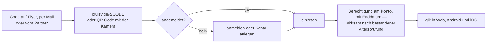
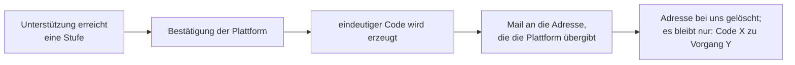

# Codesystem — Unterstützer, Partner, Flyer, Einladungen

> ## ⚠ Konzept, keine Zusage
>
> **Stand 21.09.2026 · Beschluss Nr. 60 vom 21.09.2026**
> Alle Codes sind **befristet**. Einlösungsbedingungen und die Klausel zu Auflösung und Insolvenz sind **Entwürfe für den Anwalt**, keine geltenden Bedingungen.

---

## Auf einen Blick

| | |
|---|---|
| **Beschlossen** | Codes für Crowdfunding, Werbepartner (Streamer, Influencer), Flyer und Einladungen. **Immer befristet.** Verfall bei Auflösung oder Insolvenz. Automatischer Versand ab einer Unterstützungssumme |
| **Fünf Code-Arten** | Unterstützer · Partner · Flyer · Einladung · Start — mit je eigener Regel für Gültigkeit, Mehrfachnutzung und Obergrenze |
| **Wo eingelöst wird** | **immer auf der Webseite.** Apples Richtlinie 3.1.1 verbietet in der iOS-App „eigene Mechanismen, um Inhalte freizuschalten, etwa Lizenzschlüssel und QR-Codes". Nach 3.1.3(b) darf die App aber anerkennen, was auf der Webseite freigeschaltet wurde |
| **Der QR-Code auf dem Flyer** | ist erlaubt — ihn liest die **Kamera** des Telefons und öffnet die Webseite, nicht die App |
| **Was ein Code nie bringt** | Schutzfunktionen (die sind ohnehin kostenlos, Prinzip 6) und Sichtbarkeit (Prinzip 5) |
| **Die Stelle, an der ich widerspreche** | Werbepartner mit **jungem Publikum** — ein Streamer, dessen Zuschauer teils minderjährig sind, darf für eine Cruising-App nicht werben. Das ist keine Geschmacks-, sondern eine Jugendschutzfrage |

---

## 1 · Die fünf Code-Arten

| | Art | Wofür | Eindeutig oder mehrfach | Gültigkeit | Obergrenze |
|---|---|---|---|---|---|
| **U** | **Unterstützer** | Crowdfunding, freiwillige Unterstützung ab einer Summe | **eindeutig**, je Person einer | Einlösung bis 12 Monate nach Ausgabe; Wirkung je nach Stufe (Abschnitt 3) | einer je Unterstützung |
| **P** | **Partner** | Streamer, Influencer, befreundete Projekte | **mehrfach**, ein Wort je Partner (etwa `LUCA28`) | 60 Tage ab Freischaltung | je Partner festgelegt, etwa 200 Einlösungen |
| **F** | **Flyer** | CSD, Partys, Bars, Konzerte | **mehrfach**, ein Code je Auflage (etwa `CSDKOELN28`) | 30 bis 60 Tage | je Auflage, etwa 500 Einlösungen |
| **E** | **Einladung** | Testphase (A-56) | **eindeutig** | zwei Wochen je Welle | durch die Wellen festgelegt |
| **S** | **Start** | der dritte Einladungscode (A-56) | **eindeutig** | ab öffentlichem Start, 90 Tage | einer je Beta-Teilnehmer |

**Warum Partner- und Flyercodes mehrfach nutzbar sind:** Ein eindeutiger Code je Flyer bräuchte variablen Druck und eine Liste, welcher Flyer an wen ging. Ein Code je Auflage ist billig und anonym. Der Preis dafür: Er landet früher oder später im Netz. **Die Obergrenze ist deshalb keine Verknappung, sondern eine Schadensbegrenzung.**

**Warum Unterstützercodes eindeutig sind:** Sie sind eine Gegenleistung für Geld. Wer 30 € gegeben hat, soll nicht erleben, dass sein Code schon verbraucht ist, weil jemand ihn fotografiert hat.

---

## 2 · Wie eingelöst wird — und warum nur auf der Webseite

### Die Regel aus Apples Richtlinien

| Richtlinie | Wortlaut (gekürzt) | Folge |
|---|---|---|
| **3.1.1** | „Apps may not use their own mechanisms to unlock content or functionality, such as license keys, augmented reality markers, QR codes …" | **Kein Codefeld in der iOS-App.** Auch kein QR-Scanner, der freischaltet |
| **3.1.3(b)** | Apps dürfen Inhalte und Abos zugänglich machen, die „on other platforms or your web site" erworben wurden, „provided those items are also available as in-app purchases within the app" | Was auf der Webseite freigeschaltet wurde, **gilt auch in der App** — wenn dieselbe Stufe dort auch zu kaufen ist |

**Quelle:** [Apple · App Review Guidelines](https://developer.apple.com/app-store/review/guidelines/), abgerufen 21.09.2026.

### Der Weg

**Wann die Altersprüfung nötig ist (FV-93):** Zuordnen lässt sich ein Code **ohne** Prüfung — damit der Moment am Flyer keine Hürde hat. **Wirksam wird die Berechtigung aber erst nach bestandener Altersprüfung.** So bekommt ein Konto, das die Prüfung nicht besteht, nie etwas freigeschaltet; das ist die Regel 4 aus dem Crowdfunding-Konzept, und sie bleibt erhalten.

**Für Android** gilt der Einfachheit halber derselbe Weg. Google hat eigene Aktionscodes über die Play Console; die genauen Google-Regeln werden vor dem Store-Antrag geprüft (Sitzung S16 in `../70-entwicklung-ab-monat-4/bauplan-zwei-plattformen.md`).

---

## 3 · Was ein Code bringt

**Grundsatz:** Ein Code schaltet **eine Abostufe für eine begrenzte Zeit** frei. Sonst nichts.

| Art | Wirkung (Vorschlag) |
|---|---|
| **U** — Unterstützer | nach Unterstützungsstufe: 1, 3, 6 oder 12 Monate der **ersten** Abostufe; ab einer hohen Stufe die **zweite** |
| **P** — Partner | 1 Monat der ersten Abostufe |
| **F** — Flyer | 1 Monat der ersten Abostufe |
| **E** — Einladung | Zugang zur Testphase (keine Abostufe — in der Testphase gibt es noch keine) |
| **S** — Start | 1 Monat der ersten Abostufe |

**Was ein Code nie bringt:**

- **Schutz.** Inkognito ist nach Nr. 48 im Abo, aber der Ersatzpunkt, das Sicherheitszentrum, Check-in, Blockieren und Melden sind für alle kostenlos. Ein Code, der Schutz verspricht, würde andeuten, dass Schutz sonst etwas kostet.
- **Sichtbarkeit.** Kein Code hebt ein Profil hervor, sortiert es nach oben oder macht es auffälliger. Prinzip 5 und Nr. 65.
- **Etwas Dauerhaftes.** Weg B ist beschlossen; es gibt keine lebenslangen Berechtigungen.

### Stapeln

**Regel (Vorschlag):** Codes verlängern eine bestehende Berechtigung, aber ein Konto kann über Codes **höchstens zwölf Monate** kostenlose Abostufe im Jahr ansammeln. Ohne Grenze lässt sich mit geteilten Flyercodes ein Dauerabo zusammenstückeln.

---

## 4 · Automatischer Versand bei Unterstützung

**Die Datenschutzfrage dabei:** Nach der Anwaltsfrage **R5** ist schon die Unterstützung einer solchen Kampagne vermutlich ein Rückschluss auf die sexuelle Orientierung — Art. 9 DSGVO. Deshalb:

1. Die Mailadresse wird **nur für den Versand** verwendet und danach gelöscht.
2. Gespeichert bleibt nur die Zuordnung **Code → Vorgangsnummer der Plattform**, damit ein Unterstützer seinen Code wiederbekommt, wenn er ihn verliert.
3. Die Mail ist neutral: kein Produktname im Betreff, kein Anlass im ersten Satz — dieselbe Überlegung wie bei Nr. 46 und beim Kontaktservice.

**Versandweg:** der beschlossene Maildienst (Nr. 63, nach dem Nachtrag vom 20.09.2026 voraussichtlich listmonk selbst betrieben mit europäischem Versandweg).

---

## 5 · Werbepartner — was vereinbart werden muss

Codes für Streamer und Influencer sind beschlossen. Drei Dinge müssen **vor** dem ersten Partnercode schriftlich stehen:

| | Was | Warum |
|---|---|---|
| 1 | **Das Publikum des Partners ist erwachsen** — nachweisbar, nicht behauptet | Eine Cruising-App vor einem teils minderjährigen Publikum zu bewerben, ist ein Jugendschutzproblem (JMStV) und ein Store-Problem (Googles Bedingung „kein Ruf als sexuelle Plattform"). **Das ist die Stelle, an der ich ausdrücklich widerspreche, falls jemand mit jungem Publikum angefragt wird** |
| 2 | **Kennzeichnung als Werbung** | § 5a Abs. 4 UWG und § 6 DDG. Ein Code gegen Gegenleistung ist Werbung, auch wenn kein Geld fließt |
| 3 | **Keine falschen Versprechen** | Der Partner darf nicht sagen, die App mache Treffen „sicher" — das darf auch die App selbst nicht (ST-FEST-04, § 5 UWG) |

**Was der Partner zu sehen bekommt:** nur die **Zahl** der Einlösungen seines Codes. Nie, wer eingelöst hat.

**Neue Anwaltsfrage R14:** Wie muss eine Partnervereinbarung aussehen, damit Kennzeichnung, Altersnachweis des Publikums und Aussagenkontrolle vertraglich gesichert sind?

---

## 6 · Die Klausel zu Auflösung und Insolvenz — Entwurf

*Zur Aufnahme in die Bedingungen (AGB-Gerüst, neuer § 5a). Entwurf, vom Anwalt zu prüfen.*

> **§ 5a Codes**
>
> **(1)** Codes schalten eine Bezahlstufe für den im Code genannten Zeitraum frei. Sie sind nur bis zu dem angegebenen Datum einlösbar und nur auf unserer Webseite.
>
> **(2)** Ein Code gewährt keinen Anspruch auf eine bestimmte Funktion über den Zeitraum hinaus, für den er gilt, und keinen Anspruch auf Auszahlung.
>
> **(3)** Wird die Gesellschaft aufgelöst oder ein Insolvenzverfahren über ihr Vermögen eröffnet, **erlöschen nicht eingelöste Codes**. Bereits eingelöste Codes wirken bis zur Einstellung des Dienstes.
>
> **(4)** Wer über ein Konto mehr als zwölf Monate kostenlose Bezahlstufe im Jahr aus Codes ansammelt, erhält darüber hinaus keine weitere Verlängerung.

**Was der Anwalt dazu klären muss (neue Frage R15):** Ob Absatz 3 gegenüber einem **Insolvenzverwalter** trägt. Ein Unterstützercode ist eine Gegenleistung für eine Zahlung; in der Insolvenz werden daraus womöglich Forderungen, über die eine Klausel nicht einfach verfügen kann. Für Partner- und Flyercodes, für die niemand gezahlt hat, ist das unproblematisch — für Unterstützercodes nicht.

**Was damit erledigt ist:** Die Anwaltsfrage **R3** („lebenslang" ohne Einschränkung ist nicht haltbar) ist durch Weg B **gegenstandslos**, weil es nichts Lebenslanges mehr gibt.

---

## 7 · Was das technisch braucht

| | Was | Wo | Wann |
|---|---|---|---|
| 1 | **Codetabelle** — Code (nur als Prüfwert gespeichert), Art, Partner oder Auflage, Gültigkeit, Obergrenze, Zähler | Datenmodell | AP-1 |
| 2 | **Einlösungstabelle** — Konto, Code, Zeitpunkt | Datenmodell | AP-1 |
| 3 | **Berechtigung mit Enddatum** am Konto, unabhängig vom Zahlungsweg | Datenmodell | AP-1 — **nachträglich teuer**, siehe Nr. 60 |
| 4 | **Einlöseseite** `cruizy.de/c/CODE` | Web | Phase 2 |
| 5 | **Erzeugen und Versenden** eindeutiger Codes aus einer Bestätigung | Betriebswerkzeug | vor der Kampagne |
| 6 | **Zählansicht für Partner** — nur Zahlen | Betriebswerkzeug | vor dem ersten Partnercode |
| 7 | **Missbrauchserkennung** — ein Code, der ungewöhnlich schnell verbraucht wird, wird angehalten | Betriebswerkzeug | Phase 2 |

**Warum der Code nur als Prüfwert gespeichert wird:** Wer die Datenbank liest, soll daraus keine gültigen Codes abschreiben können.

---

## 8 · Wie sich das zu den übrigen Dokumenten verhält

| Dokument | Verhältnis |
|---|---|
| `../30-marketing-kanaele/beta-vergabe.md` | Einladungs- und Startcodes sind die Arten **E** und **S** dieses Systems; die Wellenrechnung gilt unverändert |
| `crowdfunding/crowdfunding-konzept.md` | Die Stufen mit Codes als Gegenleistung folgen Abschnitt 3; lebenslange Stufen entfallen |
| `preise-und-bezahlstufen.md` | Codes schalten nur die Abostufen frei, die dort stehen |
| `../10-recht-gruendung/rechtstexte-entwuerfe/agb-geruest-ENTWURF.md` | bekommt § 5a |

---

## 9 · Offene Punkte

| | Punkt |
|---|---|
| 1 | **Wirkungen je Unterstützungsstufe** — hängen an den Crowdfunding-Stufen (Nr. 60, Teil a bis d) und an den Abostufen (Nr. 67) |
| 2 | **Obergrenzen je Partner und Auflage** — die Zahlen oben sind Vorschläge |
| 3 | **Anwaltsfragen R14 und R15** — gesammelt in `../10-recht-gruendung/anwaltstermin/nachtrag-04-fragen-19-bis-21-september-2026.md` |
| 4 | **Google-Regeln** zu Aktionscodes vor dem Store-Antrag |

---

## Quellen

| Quelle | Inhalt | Abgerufen |
|---|---|---|
| [Apple · App Review Guidelines](https://developer.apple.com/app-store/review/guidelines/) | 3.1.1 (keine eigenen Freischaltmechanismen, auch keine QR-Codes in der App), 3.1.3(b) (auf der Webseite Erworbenes darf gelten, wenn auch als In-App-Kauf erhältlich) | 21.09.2026 |
| Beschluss **Nr. 60** vom 21.09.2026 | Weg B, Verfall bei Auflösung und Insolvenz, Flyer, automatischer Versand | — |
| `crowdfunding/crowdfunding-konzept.md` | Anwaltsfragen R1 bis R13, insbesondere R3 und R5 | — |
