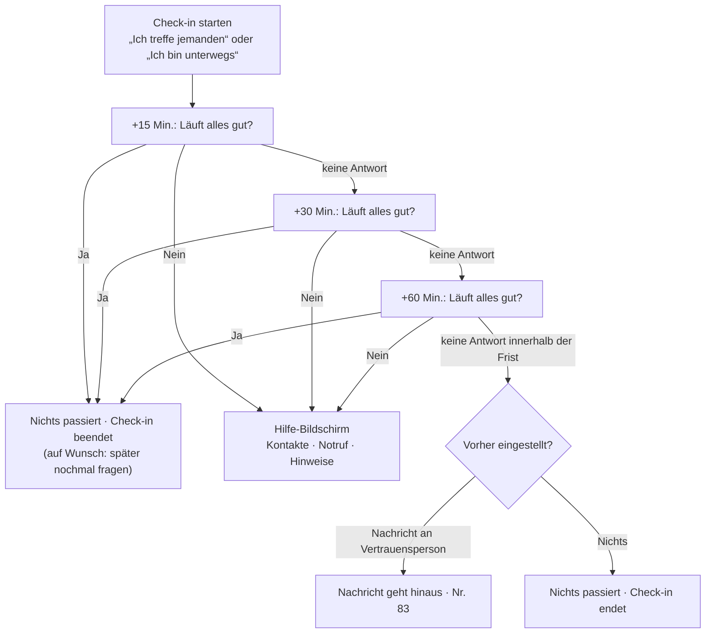

# Check-in — Konzept nach den Beschlüssen vom 21. und 26.09.2026

> ## ⚠ Konzept, keine Zusage an Nutzer
>
> **Stand 26.09.2026 · Beschlüsse Nr. 66 (21.09.2026), Nr. 83 und Nr. 84 (26.09.2026) · offen: nichts Entscheidendes mehr**
> Dieses Dokument ersetzt die beiden Fassungen, die in der Produktspezifikation unter F55 zur Wahl standen. Es setzt Henrys Ablauf um und benennt die zwei Stellen, an denen die Technik ihm Grenzen setzt. **Nichts davon ist Nutzern zugesagt**; die Texte in Abschnitt 7 sind Entwürfe.

---

## Auf einen Blick

| | |
|---|---|
| **Der Ablauf** | Frage nach **15 Minuten** · bei „Nein" sofort Kontakte, Notruf und Hinweise · ohne Antwort Nachfragen bei **30** und **60 Minuten** · danach das, was die Person **vorher** eingestellt hat |
| **Wo die Daten liegen** | Kontakte, Ort, Zeit, Gegenüber, Nachrichtentext: **nur auf dem Telefon** |
| **Was Pflicht ist** | nichts. Niemand muss eine Vertrauensperson hinterlegen |
| **Stiller Notruf** | Aus einer App heraus **nicht möglich.** Es gibt aber **nora**, die Notruf-App der Bundesländer, mit einem lautlosen Chat-Notruf — wenn man sich **vorher** registriert hat. Der Check-in empfiehlt das beim Einrichten |
| **Die harte Grenze** | Die Nachricht nach 60 Minuten kann **nicht vom Telefon selbst** als SMS hinausgehen — iOS verbietet das. Sie läuft über unseren Server. **Entschieden mit Nr. 83:** Durchreichen ist voreingestellt, Hinterlegen ist einschaltbar — nur damit geht die Nachricht auch bei ausgeschaltetem Telefon hinaus |
| **Zwei Formen** | „Ich treffe jemanden" und „Ich bin unterwegs" — **beschlossen mit Nr. 84** am 26.09.2026 |
| **Notrufnummern** | **nach Aufenthaltsland** (Teil 4, 26.09.2026): Deutschland 110 und nora, Österreich 133 und DEC112, Schweiz 117 — **112 immer** |

---

## 1 · Der Ablauf

| Zeitpunkt | Was geschieht | Woher die Vorgabe kommt |
|---|---|---|
| **Start** | „Beginnt jetzt" oder zu einer gewählten Uhrzeit | Henry |
| **+15 Min.** | Mitteilung mit neutralem Text: „Läuft alles gut?" — zwei Knöpfe, **Ja** und **Nein** | Henry |
| **Ja** | Kein Alarm, der Check-in endet. Darunter klein: „Frag mich in 30 Minuten nochmal" | Henry; der kleine Zusatz ist ein **Vorschlag** — ein Treffen kann nach 20 Minuten kippen |
| **Nein** | **Sofort** der Hilfe-Bildschirm (Abschnitt 2) | Henry |
| **Keine Antwort** | dieselbe Frage bei **+30** und **+60 Minuten** | Henry |
| **+60 Min. unbeantwortet** | nach einer Frist von P-CHECKIN-FRIST (Vorschlag: 10 Minuten) die **vorher eingestellte Wirkung** | Henry; die Frist ist ein **Vorschlag**, damit niemand eine Sekunde nach der letzten Frage alarmiert |
| **Ende** | Alle Angaben dieses Check-ins werden **auf dem Telefon gelöscht** | Datensparsamkeit |

**Die Parameter**, ohne Codeänderung einstellbar: P-CHECKIN-ERSTE (15 Min.) · P-CHECKIN-ZWEITE (30 Min.) · P-CHECKIN-DRITTE (60 Min.) · P-CHECKIN-FRIST (10 Min.).

---

## 2 · Der Hilfe-Bildschirm — was bei „Nein" erscheint

Drei Bereiche, in dieser Reihenfolge, **alles auf einem Bildschirm** und ohne weiteren Tipp erreichbar:

### 2.1 Deine Vertrauenspersonen

Jede hinterlegte Person mit einem Knopf **„Jetzt informieren"**. Ein Tipp öffnet die eigene SMS- oder Nachrichten-App des Telefons mit einem **vorgefertigten Text** — die Person muss nur noch auf Senden tippen.

**Warum über die eigene Nachrichten-App und nicht über uns:** Die Nachricht kommt dann **von der eigenen Nummer**. Eine Vertrauensperson erkennt sie sofort. Eine Nachricht von einer unbekannten Nummer, in der steht „jemand braucht Hilfe", wird oft für Betrug gehalten.

Ist niemand hinterlegt, steht hier ein Satz: *„Du hast niemanden hinterlegt. Das ist in Ordnung — Notruf und Hinweise sind trotzdem da."*

### 2.2 Notruf

| Knopf | Was passiert | Wofür |
|---|---|---|
| **110 anrufen** | Das Telefon wählt die Polizei — ein normaler Anruf, **mit Ton** | wenn Sprechen möglich ist |
| **Lautlos Hilfe holen (nora)** | öffnet die Notruf-App **nora**, falls sie installiert ist; sonst ein Hinweis, wie man sie einrichtet | wenn Sprechen gefährlich wäre |

**Was nora ist:** die offizielle Notruf-App der Bundesländer. Sie hat einen **stillen Notruf**: Die Leitstelle kommuniziert „ausschließlich lautlos über den Chat", ruft nicht zurück, und die App gibt keine Töne von sich. Während des Notrufs wird der Standort übermittelt. Sie ist ausdrücklich **für alle** gedacht, nicht nur für Menschen mit Hör- oder Sprachbehinderung.

**Was sie verlangt und warum das für uns zählt:** Eine **Registrierung vorher**, mit Überprüfung der Rufnummer — **im Ernstfall lässt sie sich nicht einrichten.** Außerdem ist nora nach eigener Auskunft **für andere Apps nicht angebunden**; eine Öffnung für Drittanbieter ist geplant, aber nicht da. Wir können sie öffnen, aber keinen Notruf für die Person auslösen.

**Was daraus folgt:** Der Check-in empfiehlt nora **beim ersten Einrichten**, nicht erst im Ernstfall (Text ST-CHK-06). Das ist der eigentliche Wert dieses Befunds: Wer nora vorher einrichtet, hat im schlimmsten Fall einen lautlosen Weg zur Polizei.

**Was wir ausdrücklich nicht tun:** automatisch 110 anrufen oder einen Notruf auslösen, ohne dass die Person es will. Ein Fehlalarm bei der Polizei ist kein Kavaliersdelikt, und eine App, die das tut, würde ihn erzeugen.

**Nachtrag vom 21.09.2026 — die Nummer gilt nur in Deutschland.** 110 und nora sind deutsche Wege. In **Österreich** ist der Polizeinotruf **133**, dazu der Euronotruf 112; einen stillen Notruf per Chat bietet dort die App **DEC112**. In der **Schweiz** ist der Polizeinotruf **117**; 112 verbindet dort „in jeder Notlage mit der Alarmzentrale der Polizei“. Für den Start in Köln ändert das nichts — für Reisende (Travel), für Grenzregionen und für die erste Stadt außerhalb Deutschlands schon. **Vorschlag:** Die Knöpfe richten sich nach dem Land des gerundeten Standorts — Deutschland 110 und nora, Österreich 133 und DEC112, Schweiz 117 —, und **112 steht in allen drei Ländern zusätzlich** darunter. Ohne Standort gilt das Land der eingestellten Stadt. Abschnitt 9 führt das als offenen Punkt.

### 2.3 Wenn du dich unwohl fühlst — Hinweise

*Entwurf für den Bildschirm; kurz, weil niemand in einer bedrohlichen Lage lange liest.*

> **Du musst dich nicht erklären. Du darfst einfach gehen.**
>
> - **Bleib, wo Menschen sind.** Nimm nicht den kürzeren Weg durch eine Seitenstraße, einen Park oder ein Treppenhaus.
> - **Sag klar, was du willst:** „Ich gehe jetzt." Mehr nicht.
> - **Such dir Licht und Leute** — eine Bar, eine Tankstelle, einen Kiosk — und sprich dort jemanden an.
> - **Gib nichts heraus**, was dich auffindbar macht: Adresse, Arbeitgeber, Nachnamen.
> - **Bei Bedrohung: 110.** Wenn Sprechen gefährlich ist: nora.
> - **Du hast nichts falsch gemacht.** Hilfe zu holen ist richtig.
>
> Nach einem Übergriff, auch Tage später: **Opfer-Telefon 116 006** — kostenlos, anonym, täglich 7 bis 22 Uhr.

Dazu wie bisher: **Melden** und **Blockieren** der Person, mit der das Treffen verabredet war — nur in der Form „Ich treffe jemanden".

---

## 3 · Die Einstellung für den Fall ohne Antwort

Beim ersten Check-in — und jederzeit in den Einstellungen — wählt die Person, was nach der letzten unbeantworteten Frage geschieht:

| Wahl | Was passiert | Voreinstellung |
|---|---|---|
| **Nichts** | Der Check-in endet ohne weitere Wirkung | **ja** — niemand wird ohne eigene Entscheidung benachrichtigt |
| **Nachricht an meine Vertrauenspersonen** | eine neutrale Nachricht an alle hinterlegten Personen (Abschnitt 5) | nur wählbar, wenn mindestens eine Person hinterlegt ist |

**Warum „Nichts" voreingestellt ist:** Eine Nachricht an Dritte ist eine Entscheidung, die niemand für die Person treffen sollte — auch keine Voreinstellung. Wer sie will, schaltet sie einmal ein.

---

## 4 · Wo welche Daten liegen

**Beschlossen:** Kontakte, Ort, Zeit, Gegenüber und Nachrichtentext liegen **nur auf dem Telefon.** Daran ändert dieses Konzept nichts. Ehrlich festzuhalten ist, **was trotzdem den Server berührt** — und warum.

| Angabe | Wo | Warum |
|---|---|---|
| Vertrauenspersonen | **nur Telefon**, verschlüsselt | Beschluss |
| Ort, Uhrzeit, Gegenüber | **nur Telefon**, verschlüsselt | Beschluss |
| Nachrichtentext | **nur Telefon** | Beschluss |
| **„Für dieses Konto läuft ein Check-in, nächste Frage um 22:15 Uhr"** | **Server**, bis der Check-in endet | Siehe unten |
| **Die Nachricht nach 60 Minuten** | wird über den Server **durchgereicht** | Siehe Abschnitt 5 |

**Warum der Server die Uhrzeit kennen muss:** In der **Web-Fassung** kann eine Seite, die nicht geöffnet ist, keine Erinnerung auslösen — die Mitteilung muss vom Server kommen. In den **nativen Apps** gehen die Fragen auch als rein lokale Erinnerung, **aber** die automatische Nachricht nach 60 Minuten braucht, dass die App zur richtigen Minute läuft — und das erzwingt auf iOS nur ein Weckruf vom Server.

**Was der Server dabei weiß:** dass ein Check-in läuft und wann die nächste Frage fällig ist. **Nicht wo, nicht mit wem, nicht an wen die Nachricht ginge.** Mit dem Ende des Check-ins ist auch diese Angabe gelöscht.

**Die einzige Fassung ganz ohne Server:** native App, Einstellung „Nichts". Dann laufen die drei Fragen als lokale Erinnerungen, und der Server erfährt vom Check-in überhaupt nichts.

---

## 5 · Die Nachricht nach 60 Minuten — die harte Grenze

### Warum sie nicht vom Telefon selbst ausgehen kann

- **iOS** erlaubt Apps nicht, eine SMS **ohne Tippen** zu verschicken. Das Nachrichtenfenster lässt sich öffnen, abschicken muss der Mensch.
- **Android** erlaubt das technisch, aber Google Play beschränkt die dafür nötige Berechtigung auf wenige App-Arten.
- **Die Web-Fassung** kann gar keine SMS verschicken.

**Folge:** Eine Nachricht, die ohne Zutun der Person hinausgeht, muss über einen Versanddienst laufen — also über unseren Server. **Das gilt schon bei eingeschaltetem Telefon.**

### Wie sie trotzdem ohne Speicherung auskommt

Das Telefon hält Kontakte und Text. Zur fälligen Minute schickt es beides an den Server, der Server reicht es an den Versanddienst weiter und **löscht es sofort** — nichts wird abgelegt. Das hält die Zusage „nie auf unseren Servern **gespeichert**".

**Was diese Fassung nicht kann:** Sie funktioniert nur, **wenn das Telefon an ist, Netz hat und die App geweckt werden kann.** Wenn jemand das Telefon wegnimmt oder es ausschaltet — also genau im schlimmsten Fall —, geht nichts hinaus.

### Die Entscheidung, die daraus folgt — Nr. 83, **entschieden am 26.09.2026**

| | Wie | Was es kann | Was es kostet |
|---|---|---|---|
| **(a) nur Durchreichen** | wie oben | funktioniert, **solange das Telefon an ist** | im schlimmsten Fall nichts |
| **(b) zusätzlich wählbar: Hinterlegen** | Beim Start des Check-ins liegt die fertige Nachricht **verschlüsselt** bei uns; sie geht hinaus, wenn die Frist abläuft, und ist mit dem Ende des Check-ins gelöscht | funktioniert **auch bei ausgeschaltetem Telefon** | bricht für die Dauer eines Check-ins die Zusage „nie auf unseren Servern" — **nur für wer es ausdrücklich wählt** |

**Beschlossen am 26.09.2026:** **(a) als Voreinstellung, (b) als ausdrücklich zu wählende Zusatzstufe** mit dem Satz *„Damit das auch klappt, wenn dein Telefon aus ist, liegt die Nachricht für die Dauer des Check-ins verschlüsselt bei uns. Danach ist sie weg."* Wer das nicht will, wählt es nicht.

**Was der Beschluss an der großen Zusage ändert — offen gesagt.** „Nie auf unseren Servern" gilt ab jetzt mit einer Einschränkung, und die muss überall mitgesagt werden, wo die Zusage steht: **„für die Dauer eines laufenden Check-ins, wenn du es einschaltest."** Ohne diesen Zusatz wäre die Zusage falsch. Betroffene Stellen: Systemtexte, Datenschutzhinweis, Verarbeitungsübersicht, Landingpage.

**Was (b) nicht kann:** Ein Check-in, der nie gestartet wurde, hilft auch mit (b) nicht. (b) wirkt ab der Sekunde, in der der Check-in läuft — und genau das war der Fall, um den es ging.

### Was in der Nachricht steht

**Neutral, ohne Produktname, ohne Anlass**, weil die Vertrauensperson sie vielleicht in Gegenwart anderer liest:

> Automatische Nachricht von [Name, wie die Person ihn selbst eingetragen hat]: Ich habe mich seit einer Stunde nicht gemeldet, obwohl ich das wollte. [Falls eingetragen: Zuletzt geplant: Ort, Uhrzeit.] Bitte versuch, mich zu erreichen. Wenn das nicht geht und du dir Sorgen machst, ruf 110.

**Absender:** neutral, **nie „Cruizy"**. Die Person bekommt beim Einrichten die Möglichkeit, ihre Vertrauensperson **vorab** von der eigenen Nummer zu informieren, damit die Nachricht später nicht für Betrug gehalten wird (Text ST-CHK-09).

**Versanddienst:** nach dem Maildienst-Nachtrag vom 20.09.2026 kommt **Sweego** in Frage — französischer Anbieter mit EU-Hosting, der auch SMS versendet. Unter Grundsatz G-01 zu prüfen.

---

## 6 · Die zwei Formen — Nr. 84, **beschlossen am 26.09.2026**

| | **„Ich treffe jemanden"** | **„Ich bin unterwegs"** |
|---|---|---|
| **Wofür** | eine Verabredung aus der App | ein Ort, keine bestimmte Person: Park, Sauna, Darkroom, Party, nachts allein nach Hause |
| **Gegenüber** | aus dem Gespräch vorausgefüllt | keins |
| **Melden und Blockieren im Hilfe-Bildschirm** | ja | nein — es gibt niemanden |
| **Ablauf danach** | identisch | identisch |

**Warum die zweite Form die wichtigere sein kann:** Cruising heißt oft gerade nicht, sich mit einer bestimmten Person zu verabreden. Ein Check-in, der nur mit Chatpartner geht, schützt genau die Situationen nicht, die für diese Zielgruppe typisch sind.

**Was das technisch kostet:** nichts. Das Gegenüber ist im Datenmodell ohnehin freiwillig.

**Was der Beschluss darüber hinaus bedeutet:** Der Check-in ist damit **keine Chatfunktion mehr**. Er braucht einen eigenen, erreichbaren Platz — im Sicherheitszentrum und im Schnellzugriff, nicht nur im Gespräch (AK-F55-19). Das betrifft die Navigation (S51.03) und den Ablauf AB-04.

---

## 7 · Die Texte (Entwürfe)

| ID | Ort | Text |
|---|---|---|
| ST-CHK-01 | Start, Auswahl | Ich treffe jemanden · Ich bin unterwegs |
| ST-CHK-02 | Start, Zeit | Beginnt jetzt · Beginnt um {uhrzeit} |
| ST-CHK-03 | Mitteilung | Läuft alles gut? |
| ST-CHK-04 | Knöpfe | Ja · Nein |
| ST-CHK-05 | nach „Ja", klein | Frag mich in 30 Minuten nochmal |
| ST-CHK-06 | Ersteinrichtung, nora | Tipp: Richte dir jetzt die Notruf-App nora ein. Mit ihr kannst du im Notfall lautlos die Polizei rufen — per Chat, ohne zu sprechen. Das geht nur, wenn du dich vorher registriert hast. |
| ST-CHK-07 | Einstellung | Wenn ich mich nach der letzten Frage nicht melde: Nichts tun · Meine Vertrauenspersonen benachrichtigen |
| ST-CHK-08 | Hinweis zur Einstellung | Deine Vertrauenspersonen liegen nur auf deinem Telefon. Wir wissen nicht, wer sie sind. |
| ST-CHK-09 | Ersteinrichtung, Vorabinfo | Sag deiner Vertrauensperson Bescheid, dass sie im Ernstfall eine automatische Nachricht bekommen könnte — sonst hält sie sie vielleicht für Betrug. [Jetzt Bescheid sagen] |
| ST-CHK-10 | Hilfe-Bildschirm, Titel | Hol dir Hilfe. Du musst nichts erklären. |
| ST-CHK-11 | Knopf je Person | Jetzt informieren |
| ST-CHK-12 | Knopf | 110 anrufen |
| ST-CHK-13 | Knopf | Lautlos Hilfe holen (nora) |
| ST-CHK-14 | ohne Vertrauensperson | Du hast niemanden hinterlegt. Das ist in Ordnung — Notruf und Hinweise sind trotzdem da. |
| ST-CHK-15 | Einstellung, Zusatzstufe Nr. 83 (b) | Auch benachrichtigen, wenn mein Telefon aus ist. Dafür liegt die Nachricht für die Dauer des Check-ins verschlüsselt bei uns. Danach ist sie weg. |
| ST-CHK-16 | Ehrlichkeitssatz, Nr. 83 (a) | Die Nachricht geht nur hinaus, solange dein Telefon an ist und Netz hat. |

**AK-F55-07 gilt unverändert:** Jeder Text beschreibt **genau** die gebaute Fassung und nicht mehr. **Seit Nr. 83 (26.09.2026)** gilt ST-CHK-16 in der Voreinstellung und ST-CHK-15 für alle, die Hinterlegen einschalten. Ein Satz, der verspricht, dass die Nachricht in jedem Fall ankommt, erscheint nirgends — auch mit Hinterlegen nicht, weil ein nie gestarteter Check-in nichts sendet.

---

## 8 · Was sich in der Spezifikation ändert

| Stelle | Änderung |
|---|---|
| **F55** | Fassung 1 und 2 ersetzt durch diesen Ablauf; Akzeptanzkriterien AK-F55-09 bis AK-F55-16, **seit dem 26.09.2026 dazu AK-F55-17 (Notruf nach Land), AK-F55-18 (Hinterlegen) und AK-F55-19 (ohne Gespräch erreichbar)** |
| **FV-65** | ersetzt: Die Zwischenlösung „bis zur Entscheidung Fassung 1" ist erledigt |
| **W-21** | erledigt durch Nr. 66 |
| **Verarbeitungsübersicht** | Check-in-Daten als Datenart, die **nicht** bei uns liegt — mit der ausdrücklich benannten Ausnahme aus Nr. 83 (b): verschlüsselte Nachricht für die Dauer eines laufenden Check-ins |
| **Ablauf AB-04** | Rückmeldung nach dem Treffen folgt diesem Ablauf |

---

## 9 · Offene Punkte

| | Punkt |
|---|---|
| ~~**Nr. 83**~~ | **entschieden 26.09.2026:** Durchreichen voreingestellt, Hinterlegen einschaltbar |
| ~~**Nr. 84**~~ | **entschieden 26.09.2026:** ja, zwei Formen |
| **Vorschlag** | **Stille Antwort:** Wer beobachtet wird, kann nicht gut „Nein" drücken und einen großen Hilfe-Bildschirm öffnen. Eine unauffällige dritte Antwort — etwa „Später" —, die im Hintergrund die Vertrauenspersonen benachrichtigt, wäre eine Lösung. Sie setzt Nr. 83 voraus, weil dabei nichts auf dem Bildschirm getippt werden darf |
| **Anbieter** | SMS-Versand nach G-01 prüfen (Sweego oder andere) |
| ~~**Vorschlag**~~ | **Notrufnummer nach Land beschlossen am 26.09.2026 (Teil 4)** (Abschnitt 2.2): 110 und nora nur in Deutschland; Österreich 133 und DEC112, Schweiz 117; 112 überall zusätzlich. Gebaut mit AK-F55-17 |
| **Anwalt** | Neue Frage **V14 (Nachtrag 05):** Was bedeutet das Hinterlegen einer Nachricht für die Dauer eines Check-ins datenschutzrechtlich, und genügt die ausdrückliche Wahl als Rechtsgrundlage? |
| **Anwalt** | Frage **V11:** Welche Pflichten entstehen, wenn wir eine Nachricht an eine dritte Person versenden, die dem nicht zugestimmt hat — und wie verhält sich das zur Datensparsamkeit? |

---

## Quellen

| Quelle | Inhalt | Abgerufen |
|---|---|---|
| [nora · Häufige Fragen](https://www.nora-notruf.de/de-as/fragen/faq) | stiller Notruf per Chat, keine Rückrufe, keine Töne; Registrierung vorher Pflicht; Standortübermittlung; keine Anbindung für Drittanbieter | 21.09.2026 |
| [Netzwelt · Notruf ohne zu sprechen](https://www.netzwelt.de/news/257197-notruf-ohne-sprechen-nora-app-alarmiert-polizei-rettung-lautlos.html) | Anwendungsfälle, Datenverbindung nötig; Artikel vom 11.08.2026 | 21.09.2026 |
| [Weisser Ring · Opfer-Telefon](https://weisser-ring.de/hilfe-fuer-opfer/opfer-telefon) | 116 006, kostenlos, anonym, täglich 7 bis 22 Uhr | 21.09.2026 |
| [Polizei Österreich · Notrufe](https://www.polizei.gv.at/alle/notrufe.html) | Polizei-Notruf 133 und Euro-Notruf 112; textbasierter und stiller Notruf über die App DEC112 | 21.09.2026 |
| [ch.ch · Notfälle in der Schweiz](https://www.ch.ch/de/sicherheit-und-recht/gefahren-und-notfalle/) | Polizei 117; 112 „verbindet Sie in jeder Notlage mit der Alarmzentrale der Polizei“ | 21.09.2026 |
| `../10-recht-gruendung/maildienst-nachtrag-2026-09.md` | Sweego als europäischer Versanddienst mit SMS | — |
| Beschluss **Nr. 66** vom 21.09.2026 | Henrys Ablauf im Wortlaut | — |
