# Nutzerabläufe — vom ersten bis zum letzten Schritt

> ## ⚠ VORFASSUNG — vor den Interviews
>
> **Zweck:** Einzelne Funktionen können vollständig spezifiziert und der Weg dazwischen trotzdem kaputt sein. Dieses Dokument geht die elf Wege ab, die jede Person nimmt, und schreibt auf, wo sie abbrechen und was dann geschieht.
>
> **Verhältnis zur Spezifikation:** `produktspezifikation.md` (A-29) sagt, **was** eine Funktion tut. Dieses Dokument sagt, **in welcher Reihenfolge** das geschieht und was passiert, wenn es schiefgeht. Wo beide dasselbe beschreiben, gilt die Spezifikation; Abweichungen stehen hier als offener Punkt.
>
> **Zeitplan-Regel:** Was von den Interviews abhängt, wird vor den Interviews nicht finalisiert. Reihenfolgen, Namen und Texte kommen nach A-19 und dem Prototyptest noch einmal auf den Tisch.
>
> Produktname: **Cruizy** — seit Nr. 5 (19.09.2026) als Arbeitstitel ausgeschrieben; endgültig entscheidet er sich nach den Interviews.

Erstellt: 17.09.2026 · Aufgabe A-30 · Rolle: Interaction Designer · Fenster **V2**, als Vorfassung vorgezogen
Grundlagen: Handbuch A (Funktionskatalog, Mikro-UX, „Nicht verhandelbar“) · `produktspezifikation.md` (A-29) · `moderationsarchitektur.md` (A-37, **verbindlich** für alles, was Prüfung, Meldungen und Zugriffe betrifft) · `systemtexte-ENTWURF.md` (A-14) · `wireframes-textspezifikation.md` (A-15) · `../01-steuerung/offene-entscheidungen.md`
Gehört zu: A-29 (Spezifikation) · A-36 (Trefferprozess) · A-40 (Eisbrecher) · A-41 (Moderations-Backend) · Code: Sitzungen S4 bis S13

---

## Auf einen Blick

- **11 Abläufe** mit **112 Schritten**, **57 beschriebenen Abbruchfällen** und **33 Stolperstellen** aus vergleichbaren Apps; je Ablauf ein Diagramm (11 insgesamt). *Stand 21.09.2026 — die Erstfassung vom 17.09.2026 hatte 10 Abläufe, 100 Schritte und 51 Abbruchfälle; AB-11 kam am 20.09.2026 hinzu, der Check-in in AB-04 wurde am 21.09.2026 nach Nr. 66 neu gefasst.*
- Jeder Ablauf hat mindestens einen Abbruchfall mit Systemantwort — das ist das Abnahmekriterium dieser Aufgabe, und es ist überall erfüllt.
- Alle Verweise auf Bildschirme, Text-IDs, Funktionen, Festlegungen und Parameter sind gegen A-14, A-15 und die Spezifikation geprüft (Abschnitt 17).

**Was beim Abgehen der Wege aufgefallen ist:**

1. **Der Zugang kann endgültig verloren gehen.** Wer sein E-Mail-Postfach verliert oder die Apple-Verbindung trennt, kommt nicht mehr hinein — die App speichert bewusst nichts, womit sich jemand ausweisen könnte. Das ist die Kehrseite der Datensparsamkeit und bisher nirgends entschieden → **neue Entscheidung Nr. 69** (AB-10). **Entschieden am 21.09.2026:** Jeder bekommt einen Wiederherstellungscode, alles andere ist freiwillig, und wer nichts davon hat, erfährt vorher offen, dass das Konto dann verloren ist (Z-09).
2. **Ob ein neues Passwort andere Geräte abmeldet, steht in keinem Dokument.** Für ein verlorenes Gerät ist das der entscheidende Punkt (AB-10-A4, ebenfalls Nr. 69). **Gelöst durch FV-94:** Jede Wiederherstellung und jedes neue Passwort beenden alle anderen Sitzungen.
3. **Der Check-in bleibt ein Versprechen ohne Mechanismus.** In Fassung 1 geschieht nach zwei Nachfragen nichts; die App sagt das, und der Text dazu bleibt leer, bis Nr. 66 entschieden ist (AB-04). **Entschieden am 21.09.2026 (Nr. 66):** drei Fragen nach 15, 30 und 60 Minuten, bei „Nein“ sofort Hilfe, danach die vorher eingestellte Wirkung; offen bleibt nur, ob die Nachricht auch bei ausgeschaltetem Telefon ankommt (Nr. 83).
4. **Ohne Nr. 67 gibt es keinen Kaufbildschirm.** Der Abo-Ablauf steht vollständig, aber sein zweiter Schritt ist ein Platzhalter (AB-08). *Stand 21.09.2026: Richtung entschieden (zwei Abostufen), Zuschnitt vorgeschlagen (PLUS mit Inkognito, PRO mit Travel) — bis zur Bestätigung bleibt der Platzhalter.*
5. **Zwei Texte tragen dieselbe ID.** Der Hinweis beim Tipp auf eine Gastkachel und das Ende der Gastzeit teilen sich ST-KON-03 (AB-02).

---

## 0 · Wie man dieses Dokument liest

| Zeichen | Bedeutung |
|---|---|
| `AB-01` … `AB-11` | Ablauf. Die Reihenfolge folgt dem Auftrag, nicht der Häufigkeit. |
| `AB-06-A3` | Abbruchfall innerhalb eines Ablaufs, mit Auslöser und Systemantwort |
| **S31.09** · **ST-CHAT-04** | Bildschirm und Anker aus A-15 · Text-ID aus A-14 — beide werden dort gepflegt, nicht hier |
| `F41`, `Q-06`, `Z-03`, `M-03`, `X-02` | Einträge der Produktspezifikation |
| `FV-27` | Festlegung der Spezifikation; `⚠ W-08` ein dort benannter Widerspruch |
| `P-ARCHIV` | Parameter; alle Werte stehen in der Spezifikation, Abschnitt 15 |
| **Nr. 66** | Eintrag in `../01-steuerung/offene-entscheidungen.md` |

**Aufbau eines Ablaufs:** Kopf mit Zweck, Beteiligten, Vorbedingungen und Ergebnis · Diagramm · Schritttabelle mit drei Spalten — was die Person sieht, was das System tut, welcher Abbruchfall hier lauert · die Abbruchfälle mit Systemantwort · drei Stellen, an denen dieser Ablauf in vergleichbaren Apps scheitert · offene Punkte.

**Was „Stolperstelle“ heißt:** bekannte Muster aus Dating- und Kontaktapps, wie sie in Erfahrungsberichten, Rezensionen und der Auswertung von Handbuch A vorkommen. Sie sind **nicht gemessen** und tragen deshalb keine Zahlen; sie stehen hier, weil ein Ablauf, der sie nicht bedenkt, an genau diesen Stellen bricht.

**Was dieses Dokument nicht entscheidet:** nichts. Wo eine Entscheidung fehlt, steht sie als Nummer da, und der Ablauf beschreibt, was bis dahin gebaut wird.

---

## 1 · Was in jedem Ablauf gilt

Diese Regeln stehen in der Spezifikation und werden in den Abläufen nicht wiederholt.

| Regel | Woher |
|---|---|
| Fehlermeldungen folgen dem Dreiermuster: was ist passiert, warum, was jetzt. | Handbuch A, Mikro-UX; A-14 |
| Ohne Verbindung erscheint die Offline-Leiste über dem Inhalt, ohne ihn zu verdecken; Geschriebenes wartet im Ausgang. | AK-RA-06, ST-FEH-01, ST-LEER-31 |
| Keine Bestätigungsdialoge, sondern fünf Sekunden Rücknahme; nie ein blockierendes Fenster. | Q-01, Q-06 |
| Rechte werden im Zusammenhang abgefragt, mit eigener Erklärung davor — nie auf Vorrat. | AK-Q06-07, AK-Q06-08, S14 |
| Mitteilungen kommen ohne Absendername und Vorschau, höchstens eine je Absender in 15 Minuten, nie für Anfragen, Ruhezeit 23 bis 8 Uhr. | Q-06 |
| Sicherheitsmitteilungen und Entscheidungen stehen nur im Mitteilungsbereich, nie im Text einer E-Mail oder SMS; im Ernstfall geht nur ein Hinweis ohne Inhalt an den gewählten Weg (Nr. 46). | Z-01, ST-KON-29, ST-MAIL-07 bis 09 |
| Der Server liefert nie eine genauere Entfernung als ein Band; jede Position wird auf eine Rasterzelle gerundet. | F70, FV-02 |
| Was schützt, ist kostenlos und steht nie im Abo. | Q-04 |
| Ohne bestandene Stufe 1 wird nichts gesendet und nichts gebucht; „Später“ schickt nichts ab (**Nr. 64**, 19.09.2026). Die Modellmarken [A] und [B] sind damit entfallen. | Spezifikation, Abschnitt 4.0 |

---

## Die elf Abläufe

| Ablauf | Titel | Bauphase | Schritte | Abbruchfälle |
|---|---|---|---|---|
| AB-01 | Erstinstallation bis zur ersten gesendeten Nachricht | 1b | 12 | 7 |
| AB-02 | Gastmodus bis zur Registrierung | 1b | 7 | 4 |
| AB-03 | Altersprüfung in beiden Stufen | 1b | 10 | 6 |
| AB-04 | Erstkontakt bis zum Treffen, mit Check-in und Rückmeldung danach | 1b und 1c | 12 | 8 |
| AB-05 | Höflicher Ausstieg aus einem Gespräch | 1b | 8 | 4 |
| AB-06 | Melden bis zur Entscheidung — aus beiden Blickwinkeln | 1b | 11 | 6 |
| AB-07 | Blockieren und was dabei sonst noch endet | 1b | 10 | 4 |
| AB-08 | Abo abschließen und kündigen | 2 | 10 | 4 |
| AB-09 | Datenkonto: Export und vollständige Löschung | 1a und 1c | 10 | 5 |
| AB-10 | Zugang verloren — Gerät weg, Passwort vergessen, Anmeldeweg entfällt | 1b | 10 | 5 |
| AB-11 | Hilfe suchen und einen Vorgang verfolgen | 1a und 1c | 12 | 4 |

## 2 · AB-01 · Erstinstallation bis zur ersten gesendeten Nachricht

**Bauphase 1b** · Bezug: F01, F02, F03, F05, F04, F10, F14, F23, F41, F42, F43, Q-09, Z-04, Z-09, Z-10 · Weg über die Bildschirme: S02 → S03 → S04 → S05 → S06 → S10 → S20 → S31 → S34 → S31

|  |  |
|---|---|
| **Zweck** | Von der leeren App zur ersten Nachricht, ohne dass unterwegs etwas abgefragt wird, das nicht gebraucht wird. |
| **Beteiligte** | Neue Person · Server · Prüfpartner (nur in Schritt 10) · Empfängerin oder Empfänger der ersten Nachricht |
| **Vorbedingungen** | Keine. Die Web-App läuft im Browser; ein Konto entsteht erst in Schritt 2. |
| **Ergebnis** | Konto mit Einwilligung, sichtbares Profil, eine zugestellte oder bewusst zurückgehaltene Erstnachricht. |
| **Wenn es schiefgeht** | Die Person bleibt ohne Konto zurück, oder die erste Nachricht liegt ungesendet auf dem Gerät — in beiden Fällen sagt die App, woran es liegt und was der nächste Schritt ist. |

**Der Weg als Diagramm**

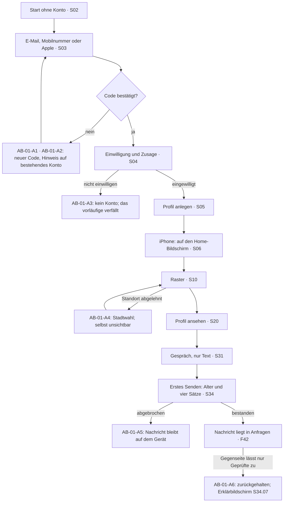

**Die Schritte**

| # | Was die Person sieht | Was das System tut | Abbruch oder Fehler |
|---|---|---|---|
| 1 | „So läuft es hier“ in drei Zeilen: Standortstufe, erste Nachricht nur Text, Alter vor der ersten Nachricht (S02.02 bis S02.04, ST-KON-10, ST-KON-11). | Nichts wird gespeichert, keine Rechteabfrage — die erste Abfrage kommt erst, wenn sie gebraucht wird (AK-Q06-07). | — |
| 2 | „Konto anlegen“: E-Mail-Adresse und Passwort (S03.04, S03.05, ST-KON-21) — oder stattdessen die Mobilnummer (Z-10) — oder „Mit Apple anmelden“ mit dem Hinweis auf „E-Mail verbergen“ (ST-KON-23, ST-KON-24). Google und Meta gibt es nicht (ST-KON-25). | Der Server legt ein vorläufiges Konto an und schickt einen sechsstelligen Code von einem neutralen Absender (ST-MAIL-01 bis ST-MAIL-04), bei der Mobilnummer per SMS ohne Produktnamen und ohne Anlass (FV-95). Er gilt `P-CODE-GUELTIG`. | AB-01-A1 |
| 3 | Code eingeben (S03.08). „Code nicht bekommen?“ bietet „Neu senden“. | Der Server prüft den Code und bestätigt die Adresse oder Nummer; nach `P-CODE-VERSUCHE` Fehlversuchen ist ein neuer Code nötig (FV-13). | AB-01-A2 |
| 4 | Einwilligung nach Art. 9 DSGVO mit dem Rahmensatz ST-KON-26 und dem Wortlaut des Anwalts (S04.02 bis S04.04); darunter die Zusage, dass Sicherheitsmitteilungen nur in der App kommen (ST-KON-28 bis ST-KON-31). Nach der Einwilligung zeigt die App einmal den Wiederherstellungscode (ST-WHR-02) und empfiehlt einen zweiten Anmeldeweg — mit einem Tipp überspringbar (Z-09). | Der Server speichert die Einwilligung mit Zweck, Textstand und Zeitpunkt, getrennt widerrufbar (Q-09); den Wiederherstellungscode nur als Prüfwert (AK-Z09-01). | AB-01-A3 |
| 5 | Profil in einem Bildschirm: Foto zeigen, Foto unkenntlich machen oder farbige Initiale (ST-KON-42 bis ST-KON-46), Name (ST-KON-47), Absicht (ST-KON-48, ST-KON-49). | Das Foto geht ohne Ortsangaben in die Prüfkette; bis zur Entscheidung steht es auf „in Prüfung“ (S23.06, M-02). Der Name ist die einzige Pflichtangabe (FV-22). | AB-01-A7 |
| 6 | Nur auf dem iPhone: „Auf den Home-Bildschirm legen“ mit Symbolwahl vorher (S06, ST-KON-60 bis ST-KON-64). | Ohne diesen Schritt kommen auf iOS keine Mitteilungen an; die App sagt das, statt es zu verschweigen (Z-04, FV-69). | — |
| 7 | Erster Blick ins Raster: zuerst die eigene Erklärung, warum der Standort gebraucht wird (S14, ST-REC-01 bis ST-REC-04), dann erst die Abfrage des Browsers. | Der Server rundet die Position sofort auf eine Rasterzelle und liefert nur Entfernungsbänder (F70, FV-02). | AB-01-A4 |
| 8 | Ein Profil ansehen (S20) und „Schreiben“ tippen (S20.10). | Das Gespräch wird angelegt, aber noch nichts zugestellt. | — |
| 9 | Im Gespräch sind die Knöpfe für Bilder ausgegraut; ein Tipp darauf erklärt, warum (ST-CHAT-04, ST-FEH-30). | Der Server weist Medien vor der ersten Antwort auch dann ab, wenn die Schnittstelle direkt aufgerufen wird (F43). | — |
| 10 | Erstes „Senden“ (S31.09) — ebenso vor der ersten Zusage oder Buchung (Nr. 64): Die Nachricht bleibt auf dem Gerät, stattdessen öffnet sich der gebündelte Ablauf (ST-CV-00) — Schritt A Altersprüfung, Schritt B die vier Sätze (S34.02 bis S34.05). | Erst nach Schritt B geht die Nachricht hinaus; die Zustimmung wird mit Textversion und Zeitpunkt gespeichert (F04, F05). | AB-01-A5 |
| 11 | Die Nachricht ist gesendet. Bei der Gegenseite liegt sie in „Anfragen“ — ohne Mitteilung und ohne Zählmarke (S30.01, ST-CHAT-03). | Der Server prüft Blockierung und Erstkontakt-Regeln (F41). Die Einstellung „Nur Verifizierte zulassen“ (F08) ruht nach Nr. 64 bis Nr. 40. | AB-01-A6 |
| 12 | Erst jetzt fragt die App nach Mitteilungen, mit eigener Erklärung vorweg (S14, ST-REC-10 bis ST-REC-16). | Anfragen lösen nie eine Mitteilung aus; zwischen 23 und 8 Uhr ist Ruhe (Q-06). | — |

**Abbruchfälle**

- **AB-01-A1 · Der Code kommt nicht an** — Die Person wartet auf die E-Mail oder SMS, oder die Adresse hat längst ein Konto → Der Bildschirm nennt den Spam-Ordner und „Neu senden“ und sagt: Kommt kein Code, gibt es vielleicht schon ein Konto — dann anmelden. An bestehende Adressen geht keine E-Mail hinaus, weil die Person sie nicht selbst angestoßen hat (FV-13).
- **AB-01-A2 · Code falsch oder abgelaufen** — Mehr als `P-CODE-VERSUCHE` Fehlversuche oder mehr als `P-CODE-GUELTIG` vergangen → Meldung im Dreiermuster „Was ist passiert · Warum · Was jetzt“ und ein neuer Code; das vorläufige Konto verfällt nach `P-KONTO-VORLAEUFIG` (ST-FEH-02).
- **AB-01-A3 · „Nicht einwilligen“** — Die Person lehnt die Einwilligung nach Art. 9 DSGVO ab (S04.07) → Ohne Einwilligung entsteht kein Konto: Der Server speichert außer den Anmeldedaten nichts und löscht auch diese (AK-Q09-01). Die App erklärt das und führt zurück in den Gastmodus (A-15, S04.07).
- **AB-01-A4 · Standort abgelehnt oder vom Browser blockiert** — Die Person tippt „Ohne Standort weiter“, oder der Browser blockiert die Abfrage → Stadtwahl statt Entfernungsbändern (ST-REC-05, ST-REC-06); die Person selbst erscheint dann in keinem Raster (FV-39). Das Raster bleibt nie leer, es zeigt Ersatzinhalte (F29).
- **AB-01-A5 · Alter oder vier Sätze abgebrochen** — Die Person schließt S34 in Schritt A oder B → Nichts wird gespeichert und nichts gesendet; die Nachricht bleibt als Entwurf auf dem Gerät (ST-FEH-40). Seit **Nr. 64** lässt sich Schritt A nicht mehr auf „Später“ schieben: „Später“ schließt den Ablauf, gesendet wird nichts.
- **AB-01-A6 · Die erste Nachricht wird zurückgehalten** *(ruht mit F08 bis Nr. 40, siehe Nr. 64)* — Die Gegenseite lässt nur geprüfte Profile zu, und der Absender ist ungeprüft (F08) → Beim Absender steht „nicht zugestellt“ mit einem Tipp auf den Erklärbildschirm (S34.07, ST-VER-01 bis ST-VER-05). Die Nachricht bleibt `P-HALTEN` liegen und wird nach bestandener Prüfung zugestellt, sonst gelöscht (FV-21).
- **AB-01-A7 · Das erste Foto wird abgelehnt** — Die Prüfkette lehnt das Foto ab (M-02) → Der Status in S23.06 nennt Grund und Bildbereich, dazu den Weg zum Einspruch; bis dahin zeigt das Profil die farbige Initiale (ST-FEH-12, M-06).

**Die drei Stellen, an denen dieser Ablauf in vergleichbaren Apps scheitert**

| Stelle | Wie es dort schiefgeht | Was hier dagegen steht |
|---|---|---|
| Die Anmeldung verlangt zu viel | Telefonnummer, Klarname oder ein Konto bei Google oder Meta als einziger Weg — wer sich nicht outen will, bricht hier ab. | E-Mail-Adresse und Passwort genügen; wer lieber will, nimmt stattdessen die Mobilnummer — Pflicht ist keine von beiden (Z-10). Apple nur mit dem Hinweis auf „E-Mail verbergen“; Google und Meta sind gestrichen (F02, F03, Streichliste 9). |
| Rechte werden auf Vorrat abgefragt | Standort, Mitteilungen und Kamera kommen als Systemabfragen, bevor klar ist, wofür — die Ablehnung ist dann endgültig. | Jede Abfrage kommt im Zusammenhang und mit eigener Erklärung davor (S14, AK-Q06-07, AK-Q06-08). |
| Die erste Nachricht verschwindet stumm | Sie wird gefiltert, und der Absender erfährt nie, warum niemand antwortet. | Wer ohne Altersprüfung schreiben will, sieht sofort den Grund und den einen nächsten Schritt (F09 an der Schwelle, Nr. 64). Zurückgehaltene Erstnachrichten gibt es erst wieder mit F08 nach Nr. 40 (FV-21). |

**Offene Punkte**

- ~~Ob die Altersprüfung aufschiebbar ist, entscheidet **Nr. 64**~~ — entschieden am 19.09.2026: Sie ist nicht aufschiebbar; Schritt 11 wartet mit F08 auf Nr. 40.
- Der Satz zur Rückverfolgbarkeit in Schritt 10 hängt an **Nr. 51**.
- Die Grenzen der Web-App in Schritt 6: Nach **Nr. 47** (19.09.2026) werden beide Plattformen gebaut; im Web gilt, was technisch geht, mit offenem Hinweis.

## 3 · AB-02 · Gastmodus bis zur Registrierung

**Bauphase 1b** · Bezug: F01, F02, F23, F29, Q-01 · Weg über die Bildschirme: S01 → S14 → S01 → S02 → S03

|  |  |
|---|---|
| **Zweck** | In drei Minuten sehen, dass die App lebt — ohne Konto, ohne Daten, ohne Druck. |
| **Beteiligte** | Person ohne Konto · Server |
| **Vorbedingungen** | Keine. |
| **Ergebnis** | Entweder ein Konto (weiter in AB-01 ab Schritt 2) oder eine beendete Gastsitzung, von der nichts bleibt. |
| **Wenn es schiefgeht** | Die Gastzeit läuft ab, ohne dass die Person ein Konto anlegt — die App zeigt dann einen ruhigen Abschluss statt einer Sperre. |

**Der Weg als Diagramm**

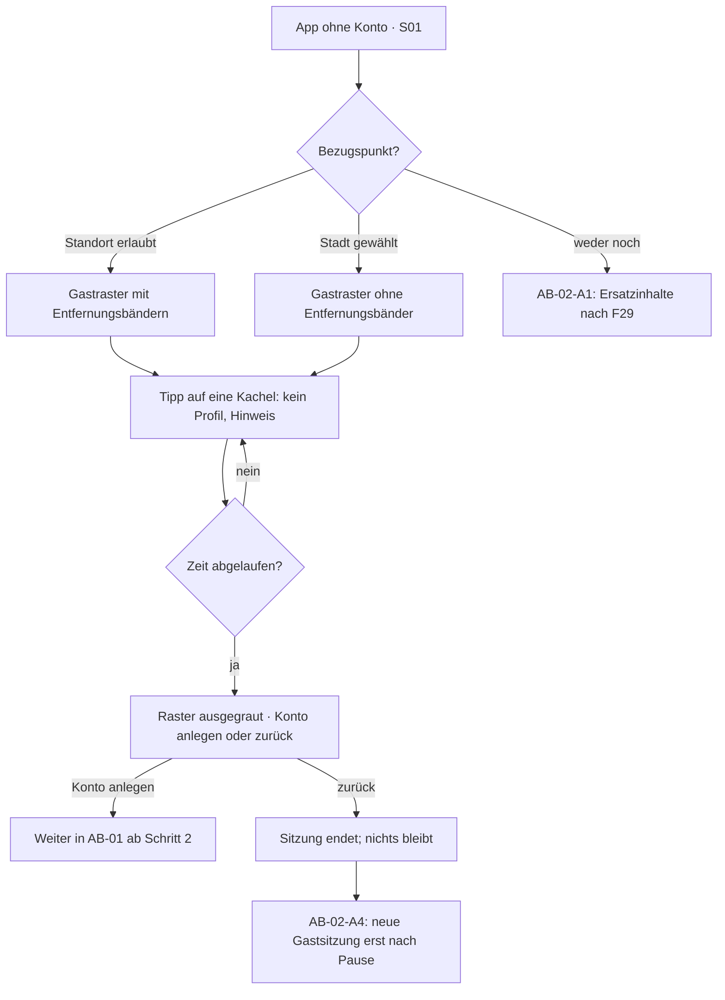

**Die Schritte**

| # | Was die Person sieht | Was das System tut | Abbruch oder Fehler |
|---|---|---|---|
| 1 | Oben die Leiste „Du schaust als Gast“ (ST-KON-01) und die Restzeit in ganzen Minuten (ST-KON-02, S01.01, S01.02). | Der Server vergibt eine Gastsitzung über `P-GAST-DAUER` und begrenzt sie je Netzadresse (FV-12). | AB-02-A3 |
| 2 | Für das Raster braucht es einen Bezugspunkt: erst die eigene Erklärung (S14), dann die Abfrage des Browsers — oder eine Stadt aus der Liste. | Ohne Standort gibt es keine Entfernungsbänder; die Netzadresse wird nicht zur Ortung benutzt (FV-10). | AB-02-A1 |
| 3 | Das Gastraster zeigt unkenntliche Fotos, keine Namen, keine Antwortquote und kein Aktivitätsband (S01.03). | Der Server liefert eine eigene Gastfassung der Daten aus (FV-11). | AB-02-A2 |
| 4 | Ein Tipp auf eine Kachel öffnet kein Profil, sondern erklärt, dass es dafür ein Konto braucht (F01). | Es wird kein Profil ausgeliefert, auch nicht in Teilen. | — |
| 5 | Nach `P-GAST-DAUER` ist das Raster ausgegraut; es stehen „Konto anlegen“ (ST-KON-04) und „Zurück zum Start“ (ST-KON-05) bereit (ST-KON-03). | Kein blockierendes Fenster, keine Zahlungsaufforderung, kein Countdown-Druck (Q-01). | — |
| 6 | „Konto anlegen“ führt in den Onboarding-Schritt 2 (S03); die drei Minuten haben nichts erzeugt, was übernommen werden müsste. | Aus der Gastsitzung wird nichts übertragen; es entsteht ein frisches vorläufiges Konto (F02). | — |
| 7 | „Zurück zum Start“ beendet die Sitzung. Eine neue Gastsitzung ist erst nach `P-GAST-PAUSE` möglich. | Der Server hält nur fest, dass diese Netzadresse eine Sitzung hatte — keine Profil- oder Standortdaten (FV-12). | AB-02-A4 |

**Abbruchfälle**

- **AB-02-A1 · Kein Standort und keine Stadt** — Die Person lehnt den Standort ab und wählt auch keine Stadt → Hinweis ST-REC-05 und Ersatzinhalte nach F29 statt eines leeren Rasters; „Konto anlegen“ bleibt erreichbar.
- **AB-02-A2 · Keine Verbindung** — Das Netz fällt während der Gastsitzung aus → Offline-Leiste ST-FEH-01 über dem Inhalt; „Konto anlegen“ bleibt bedienbar, die Gastzeit läuft weiter (AK-RA-06).
- **AB-02-A3 · Zu viele Gastsitzungen aus einem Netz** — Die Begrenzung je Netzadresse greift → Vorübergehend kein Gastzugang, mit Verweis auf „Konto anlegen“ — ohne Vorwurf und ohne Zeitangabe, die sich ausnutzen ließe (FV-12).
- **AB-02-A4 · Die Person kommt gleich wieder** — Sitzungsmarke gelöscht oder neuer Browser → Eine neue Gastsitzung ist erst nach `P-GAST-PAUSE` möglich; die Begrenzung je Netzadresse greift unabhängig davon (F01).

**Die drei Stellen, an denen dieser Ablauf in vergleichbaren Apps scheitert**

| Stelle | Wie es dort schiefgeht | Was hier dagegen steht |
|---|---|---|
| Der Gastmodus wird zum Dauerzustand | Ohne Grenze schauen Menschen monatelang zu, und die App wirkt tot, weil niemand schreibt. | Drei Minuten, danach ein ruhiger Abschluss und eine Pause vor der nächsten Sitzung (F01, FV-12). |
| Gäste sehen mehr, als die Gezeigten erwarten | Namen, Aktivität und scharfe Fotos liegen offen und lassen sich abgreifen. | Nur unkenntliche Fotos, keine Namen, keine Antwortquote, kein Aktivitätsband (FV-11) — ob Nutzer das zusätzlich abschalten können, ist offen (⚠ W-07). |
| Am Ende steht eine Wand | Ein nicht wegklickbares Fenster verlangt Registrierung oder Zahlung. | Nie ein blockierendes Fenster, jede Aufforderung wegwischbar (Q-01). |

**Offene Punkte**

- Beim Tipp auf eine Kachel zeigt die Spezifikation denselben Text wie am Ende der Gastzeit (ST-KON-03). Bei der Überarbeitung von A-14 gehören das zwei Texte.
- Ob Nutzer ihre Sichtbarkeit gegenüber Gästen abschalten können, gehört zu **Nr. 68** (⚠ W-07).

## 4 · AB-03 · Altersprüfung in beiden Stufen

**Bauphase 1b** · Bezug: F04, F05, F06, F08, F09, Z-03, M-01 · Weg über die Bildschirme: S31 → S34 → Prüfpartner → S34 → S31 · für Stufe 2: S33 → S34.08 → S33

|  |  |
|---|---|
| **Zweck** | Volljährigkeit belegen, ohne dass die App erfährt, wer die Person ist — und ohne dass der Weg vor der ersten Nachricht zur Sackgasse wird. |
| **Beteiligte** | Person · Server · Prüfpartner mit Vertrag nach Art. 28 DSGVO · bei Stufe 2 zusätzlich das Gerät der Person |
| **Vorbedingungen** | Konto mit Einwilligung; für Stufe 2 zusätzlich ein eingeschalteter Schalter nach Nr. 1 und Nr. 40. |
| **Ergebnis** | Im Konto steht „ja“ oder „nein“ zur Volljährigkeit — mehr nicht. Nach Stufe 2 zusätzlich eine Authentifizierung auf dem Gerät. |
| **Wenn es schiefgeht** | Die Prüfung bricht ab oder endet ohne Ergebnis; die Person bleibt im Zustand davor und erfährt, was sie als Nächstes tun kann. |

**Der Weg als Diagramm**

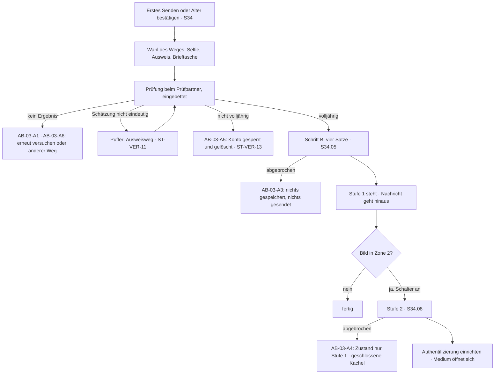

**Die Schritte**

| # | Was die Person sieht | Was das System tut | Abbruch oder Fehler |
|---|---|---|---|
| 1 | Auslöser: das erste „Senden“ in einem Gespräch oder „Alter bestätigen“ in der eigenen Profilvorschau (S21). Es erscheint ST-CV-00 mit zwei Schritten. | Die Nachricht bleibt auf dem Gerät; der Server weiß von ihr noch nichts (F04). | — |
| 2 | Schritt A beginnt mit der festgelegten Formulierung ST-FEST-01 und dem Link „Warum?“ (S34.02). | Welcher Text hinter „Warum?“ steht, hängt am Prüfweg: nach reiner Schätzung stimmt der Satz zur Rückverfolgbarkeit nicht (ST-VER-10, Nr. 51). | — |
| 3 | Wahl des Weges (S34.03): Selfie ohne Ausweis, Online-Ausweisfunktion, digitale Brieftasche (ST-VER-06 bis ST-VER-09). | Es stehen immer mindestens zwei Wege bereit, einer davon ohne Biometrie (FV-15). | AB-03-A2 |
| 4 | Beim Selfie-Weg steht vorher ST-FEST-02: Das Bild geht an den Prüfpartner und wird sofort gelöscht. | Die Prüfung läuft eingebettet beim Prüfpartner; die App sieht das Bild nie (F04, M-01). | AB-03-A1 |
| 5 | Ergebnis (S34.04): „Danke, dein Alter ist bestätigt“ (ST-VER-12), „Die Schätzung war nicht eindeutig“ (ST-VER-11) oder die Ablehnung (ST-VER-13, ST-VER-14). | Der Prüfpartner meldet signiert; gespeichert wird nur ja oder nein, kein Geburtsdatum und kein Bild (FV-16). | AB-03-A5 |
| 6 | Bei „nicht eindeutig“ folgt der Ausweisweg — ohne Vorwurf, mit dem Hinweis, dass das oft jüngere Gesichter trifft (ST-VER-11). | Der Rückfallweg ist Teil des Weges 4 nach Nr. 39; unter der Puffergrenze wird immer ein zweiter Weg angeboten (FV-15). | AB-03-A6 |
| 7 | Schritt B: die vier Sätze, jeder mit eigenem Kontrollkästchen, keines vorangekreuzt (S34.05, ST-CV-01 bis ST-CV-08). | Der Server speichert Zeitpunkt, Textversion und Satzfassung; erst danach geht die zurückgehaltene Nachricht hinaus (F05). | AB-03-A3 |
| 8 | Stufe 2 beginnt erst, wenn ein Bild in Zone 2 im Spiel ist — ein privates Album oder ein Bild im Gespräch (S33.02, S34.08, ST-VER-40, ST-VER-41). | Stufe 2 gilt für jedes Bild in Zone 2, in beide Richtungen — sonst ließe sich die Schranke umgehen (FV-85). | — |
| 9 | Die Person wählt einen Weg nach Nr. 39; bei Weg 4 kommt zuerst die Schätzung, unter der Puffergrenze der Ausweis- oder Brieftaschenweg. | Nach bestandener Prüfung richtet die App die Authentifizierung ein: Geräteschlüssel oder Gerätesperre, je Sitzung und nach einer Pause (FV-87). | AB-03-A4 |
| 10 | Danach öffnet sich das Album oder das Bild im Gespräch. Ohne Stufe 2 bleibt an dieser Stelle eine geschlossene Kachel (ST-VER-43). | Ein zurückgehaltenes Bild wird nach `P-HALTEN` gelöscht; der Absender erfährt davon nichts (FV-86). | — |

**Abbruchfälle**

- **AB-03-A1 · Prüfpartner nicht erreichbar** — Die eingebettete Prüfung startet nicht oder antwortet nicht → ST-FEH-42 mit dem Angebot, es später zu versuchen. Seit Nr. 64 bleibt die Nachricht Entwurf; bei Stufe 2 bleibt es beim Zustand „nur Stufe 1“ (Nr. 64).
- **AB-03-A2 · Kamera verweigert, zu dunkel, kein Gesicht erkannt** — Der Selfie-Weg lässt sich nicht durchführen → ST-FEH-41 und sofort das Angebot eines anderen Weges — die Prüfung endet nie in einer Sackgasse (FV-15).
- **AB-03-A3 · Schritt B abgebrochen** — Die Person schließt die vier Sätze, ohne sie zu bestätigen → Nichts wird gespeichert, nichts gesendet und nichts gebucht. Beim nächsten Versuch beginnt Schritt B erneut (F05).
- **AB-03-A4 · Stufe 2 abgebrochen** — Die Person schließt die zusätzliche Prüfung → ST-VER-42: Alles andere funktioniert weiter, nur Bilder in Zone 2 bleiben geschlossen. Der Zustand heißt „nur Stufe 1“ und ist jederzeit nachholbar (FV-86).
- **AB-03-A5 · Ergebnis „nicht volljährig“** — Ein Ausweis- oder Brieftaschenweg ergibt eindeutig unter 18 → ST-VER-13 erklärt die Sperre, ST-VER-14 nennt eine Anlaufstelle. Das Konto wird gesperrt und ohne Karenz gelöscht (FV-17); ein Verweis auf den Ausweis unterbleibt, wenn genau dieser Weg die Ablehnung ergeben hat (Abschnitt 16.3).
- **AB-03-A6 · Die Rückmeldung bleibt aus** — Der Prüfpartner meldet innerhalb von `P-PRUEF-TIMEOUT` nichts → Der Zustand „Prüfung läuft“ bleibt sichtbar, danach ST-FEH-41 und ein neuer Versuch. Doppelte oder falsch signierte Rückmeldungen werden verworfen (F04).

**Die drei Stellen, an denen dieser Ablauf in vergleichbaren Apps scheitert**

| Stelle | Wie es dort schiefgeht | Was hier dagegen steht |
|---|---|---|
| Die Prüfung steht am Anfang | Wer bei der Registrierung einen Ausweis zeigen soll, bricht ab, bevor er die App gesehen hat. | Die Prüfung kommt vor der ersten Nachricht, nicht bei der Registrierung (F04) — und gebündelt mit den vier Sätzen, damit es ein Ablauf bleibt statt zweier. |
| Es gibt nur einen Weg | Nur Selfie oder nur Ausweis schließt Menschen aus: kein Ausweis zur Hand, keine Kamera, ein Gesicht, das die Schätzung nicht einordnet. | Mindestens zwei Wege, einer ohne Biometrie, plus Rückfallweg unter der Puffergrenze (FV-15, Nr. 39). |
| Die Prüfung hinterlässt Daten | Geburtsdatum, Ausweisnummer oder Selfie bleiben beim Anbieter oder in der App liegen — bei dieser Zielgruppe ist das der gefährlichste Datensatz überhaupt. | Gespeichert wird nur ja oder nein (FV-16); die Sofortlöschung beim Prüfpartner ist vertraglich zugesichert (Handbuch A, F04). |

**Offene Punkte**

- **Nr. 1** (JMStV) entscheidet, welche Prüftiefe überhaupt verlangt ist, **Nr. 39** den Weg, **Nr. 40** die Stufen.
- ~~**Nr. 64** entscheidet, ob Schritt A aufschiebbar ist.~~ Entschieden am 19.09.2026: nicht aufschiebbar.
- Dass Stufe 2 auch Bilder im Gespräch erfasst, macht den angenommenen Anteil von 35 Prozent fraglich (⚠ W-18, Anwaltsfrage AF-06 der Spezifikation).

## 5 · AB-04 · Erstkontakt bis zum Treffen, mit Check-in und Rückmeldung danach

**Bauphase 1b und 1c** · Bezug: F41, F42, F43, F44, F12, F48, F56, F55, Z-01, Z-03 · Weg über die Bildschirme: S30 → S31 → S32 → S33 → S53 → S31 → S52 → S55

|  |  |
|---|---|
| **Zweck** | Aus einer Anfrage wird ein Gespräch, aus dem Gespräch ein Treffen — und nach dem Treffen meldet sich die Person zurück. |
| **Beteiligte** | Zwei Personen · Server · Ortsverzeichnis · Mitteilungsbereich |
| **Vorbedingungen** | Beide haben ein Konto; die schreibende Seite hat Stufe 1 bestanden. |
| **Ergebnis** | Ein Gespräch im zweiten Postfach, ein verabredeter Treffpunkt und ein Check-in, der nach dem Treffen abgeschlossen wird. |
| **Wenn es schiefgeht** | Alle drei Fragen des Check-ins bleiben unbeantwortet. Dann tritt ein, was die Person vorher eingestellt hat — nichts oder eine Nachricht an ihre Vertrauenspersonen —, und die Nachricht geht nur hinaus, solange das Telefon an ist und Netz hat (**Nr. 66**, offen **Nr. 83**). |

**Der Weg als Diagramm**

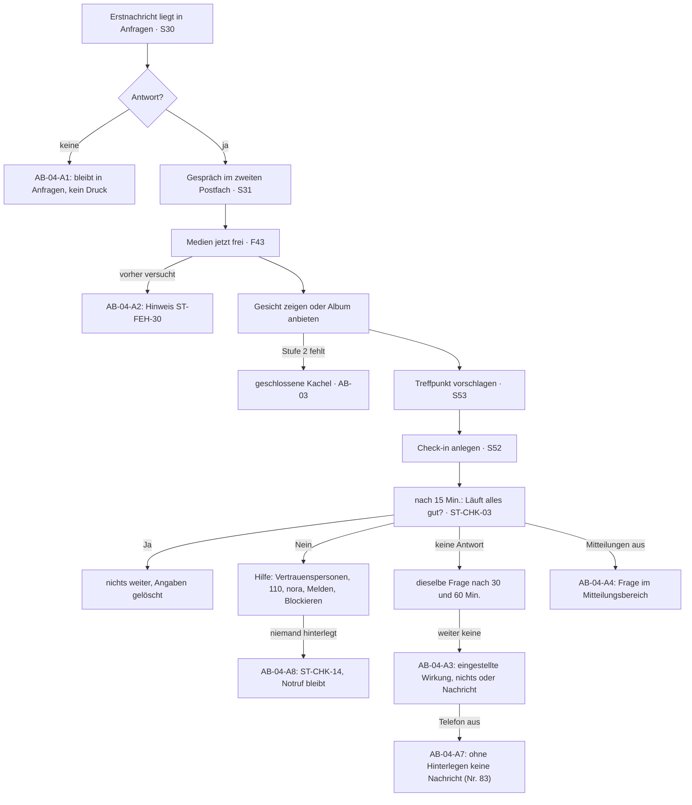

**Die Schritte**

| # | Was die Person sieht | Was das System tut | Abbruch oder Fehler |
|---|---|---|---|
| 1 | Die Erstnachricht liegt bei der Gegenseite in „Anfragen“ — ohne Mitteilung, ohne Zählmarke (S30.01, ST-CHAT-03). | Der Reiter „Chats“ zeigt dafür keine Zählmarke; das Postfach wird aus eigenem Antrieb geöffnet (AK-RA-04). | AB-04-A1 |
| 2 | Die Gegenseite antwortet. Damit steht das Gespräch bei beiden im zweiten Postfach. | Ab jetzt gelten die normalen Mitteilungsregeln (F42, Q-06). | — |
| 3 | Beim Einstieg hilft „Einstieg vorschlagen“: zwei bis drei feste Vorlagen, gefüllt mit Angaben aus beiden Profilen (S31.07, S32, ST-CHAT-05). | Die Vorlage landet im Eingabefeld, nicht im Versand; es gibt keine erzeugten Texte (F44, Q-12). | — |
| 4 | Erst wenn beide Seiten Text geschrieben haben, werden die Knöpfe für Bilder aktiv (S31.08). | Der Server setzt das durch, auch bei direktem Aufruf der Schnittstelle (F43, FV-57). | AB-04-A2 |
| 5 | „Gesicht zeigen“ schaltet die unkenntlichen Fotos für dieses eine Gespräch frei (S31.03, ST-CHAT-50 bis ST-CHAT-52). | Die freien Fassungen tragen ein unsichtbares Wasserzeichen mit der Kennung der empfangenden Person; die Rücknahme wirkt nur vorwärts (F12, FV-27). | — |
| 6 | „Privates Album teilen“: eine Seite bietet an, die andere nimmt an (ST-CHAT-40 bis ST-CHAT-42). | Verlangt der Schalter Stufe 2, kommt vorher die zusätzliche Prüfung (Z-03); sonst bleibt das Album geschlossen (ST-VER-43). | — |
| 7 | „Treffpunkt vorschlagen“ zeigt geöffnete Orte in der Nähe beider (S53, ST-SIC-20, ST-SIC-21). | Die Vorschläge entstehen aus gerundeten Positionen; niemand erfährt die Entfernung zur Gegenseite genauer als ein Band (F56, FV-66). | AB-04-A6 |
| 8 | Aus dem Gespräch heraus ein Tipp auf „Sicherheit“ (S31.02) und dann „Check-in“ (S51.03, S52) — oder direkt über die Karte im Gespräch (S31.06). | Der Sicherheitsbereich ist aus jedem Gespräch mit einem Tipp erreichbar und vollständig kostenlos (F54, Q-04). | — |
| 9 | Check-in anlegen: Form „Ich treffe jemanden“, das Gegenüber ist aus dem Gespräch vorausgefüllt; optional der Ort; dann „Beginnt jetzt“ oder eine Uhrzeit (S52.02 bis S52.04, ST-CHK-01, ST-CHK-02). Beim ersten Mal empfiehlt die App, die Notruf-App nora einzurichten und die Vertrauensperson vorab zu informieren (ST-CHK-06, ST-CHK-09). | Alle Angaben liegen nur verschlüsselt auf dem Gerät. Der Server erfährt nur, dass ein Check-in läuft und wann die nächste Frage fällig ist; die Gegenseite erfährt nichts (F55, AK-F55-02, AK-F55-16). | — |
| 10 | `P-CHECKIN-ERSTE` nach Beginn kommt eine neutrale Mitteilung, die von einem „Termin“ spricht (ST-PUSH-12), dann die Frage „Läuft alles gut?“ mit „Ja“ und „Nein“ (ST-CHK-03, ST-CHK-04). | Auf dem Sperrbildschirm steht weder Name noch Inhalt (Q-06, AK-F55-03). | AB-04-A4 |
| 11 | „Ja“: Es geschieht nichts weiter; auf Wunsch fragt die App später noch einmal (ST-CHK-05). „Nein“: sofort der Hilfe-Bildschirm — Vertrauenspersonen mit „Jetzt informieren“, „110 anrufen“, „Lautlos Hilfe holen (nora)“, Verhaltenshinweise, dazu Melden und Blockieren (S52.07, ST-CHK-10 bis ST-CHK-14). | „Jetzt informieren“ öffnet die Nachrichten-App des Geräts mit vorgefertigtem Text, gesendet von der eigenen Nummer; die App löst nie selbst einen Notruf aus (AK-F55-06, AK-F55-12, AK-F55-13). Melden führt in AB-06 (F62). | AB-04-A5, AB-04-A8 |
| 12 | Keine Antwort: dieselbe Frage bei `P-CHECKIN-ZWEITE` und `P-CHECKIN-DRITTE` nach Beginn. Bleibt auch die dritte `P-CHECKIN-FRIST` unbeantwortet, tritt ein, was die Person vorher eingestellt hat: nichts (voreingestellt) oder die neutrale Nachricht an ihre Vertrauenspersonen (ST-CHK-07, ST-CHK-08). | Das Gerät reicht die Nachricht zur fälligen Minute an den Server, der sie weitergibt und sofort verwirft (AK-F55-10, AK-F55-14, AK-F55-15). Danach sind alle Angaben gelöscht, und der Server vergisst den Zeitplan (AK-F55-05). | AB-04-A3, AB-04-A7 |

**Abbruchfälle**

- **AB-04-A1 · Die Anfrage bleibt unbeantwortet** — Die Gegenseite öffnet „Anfragen“ nicht oder antwortet nicht → Die Nachricht bleibt liegen; es gibt keine Lesebestätigung, keinen „gesehen“-Hinweis und keine Erinnerung an die Gegenseite (Streichliste 13, F42).
- **AB-04-A2 · Bild vor der ersten Antwort** — Jemand versucht, vor der ersten Antwort ein Bild zu schicken → Der Knopf ist aus, ein Tipp erklärt es (ST-FEH-30); ein Versuch über die Schnittstelle wird abgewiesen und ohne Inhalt protokolliert (F43).
- **AB-04-A3 · Keine Rückmeldung nach dem Treffen** — Alle drei Fragen bleiben unbeantwortet → Es tritt genau die vorher eingestellte Wirkung ein und keine andere: nichts, oder die Nachricht an die Vertrauenspersonen (AK-F55-10, AK-F55-11). Kein Text verspricht mehr, als gebaut ist (AK-F55-07).
- **AB-04-A4 · Mitteilungen sind aus** — Die Person hat Mitteilungen nie erlaubt oder später abgeschaltet → Die Frage steht beim nächsten Öffnen im Mitteilungsbereich (Z-01, S55), die Fristen laufen trotzdem; die Zahl ungelesener Mitteilungen steht im Reiter „Ich“ (S50.02).
- **AB-04-A5 · Das Treffen läuft schlecht** — Die Person antwortet mit „Nein“ → Ohne weiteren Tipp der Hilfe-Bildschirm: Vertrauenspersonen mit „Jetzt informieren“, 110, nora, Verhaltenshinweise, Melden und Blockieren (ST-CHK-10 bis ST-CHK-13). Melden führt nach AB-06, Blockieren nach AB-07.
- **AB-04-A6 · Kein Ort in der Nähe** — Das Verzeichnis kennt in der Umgebung nichts Geöffnetes → ST-LEER-21 statt einer leeren Liste; eine freie Adresse lässt sich trotzdem eintragen (F56, S52.03).
- **AB-04-A7 · Das Telefon ist aus oder ohne Netz** — Die letzte Frist läuft ab, aber das Gerät kann nichts senden → In der **Voreinstellung** geht die Nachricht nicht hinaus, und die App hat das beim Einstellen gesagt (ST-CHK-16). **Wer „Hinterlegen“ eingeschaltet hat (Nr. 83 b, entschieden 26.09.2026), bei dem geht sie hinaus** — die Nachricht liegt dann für die Dauer des laufenden Check-ins verschlüsselt bei uns (ST-CHK-15, AK-F55-18).
- **AB-04-A8 · Keine Vertrauensperson hinterlegt** — Die Person hat niemanden eingetragen → Der Hilfe-Bildschirm zeigt ST-CHK-14 statt einer leeren Liste; Notruf und Hinweise sind da, und „Meine Vertrauenspersonen benachrichtigen“ ist als Wirkung nicht wählbar (F55).

**Die drei Stellen, an denen dieser Ablauf in vergleichbaren Apps scheitert**

| Stelle | Wie es dort schiefgeht | Was hier dagegen steht |
|---|---|---|
| Sicherheit kostet Geld | Check-in, Blockieren oder Meldungen liegen im Abo — genau die Funktionen, die die Gefährdetsten brauchen. | Nichts, was schützt, liegt hinter der Bezahlschranke; das Sicherheitszentrum ist vollständig kostenlos (Q-04). |
| Der Treffpunkt verrät die Wohnung | Kartenpins oder genaue Entfernungen zum Vorschlagszeitpunkt machen aus einem Treffpunkt eine Adresse. | Vorschläge entstehen aus gerundeten Positionen, ohne Entfernungsangabe zur Gegenseite (FV-66, F70). |
| Der Check-in ist eine Beruhigungspille | Die App fragt nach, aber niemand reagiert, wenn keine Antwort kommt — das Versprechen ist größer als die Funktion. | Nach drei Fragen tritt genau ein, was die Person vorher gewählt hat, und die App sagt offen, wann eine Nachricht nicht ankommt (ST-CHK-16, **Nr. 83**). Niemand muss eine Vertrauensperson hinterlegen (**Nr. 66**; W-21 damit aufgelöst). |

**Offene Punkte**

- ~~**Nr. 66**~~ **entschieden 21.09.2026** — drei Fragen, Hilfe bei „Nein“, eingestellte Wirkung nach der letzten Frage (`check-in-konzept.md`).
- ~~**Nr. 83**~~ **entschieden 26.09.2026:** Durchreichen ist voreingestellt, Hinterlegen einschaltbar (AB-04-A7 oben).
- ~~**Nr. 84**~~ **entschieden 26.09.2026: ja** — „Ich bin unterwegs“ beginnt im Sicherheitszentrum und ist damit ein **eigener Ablauf neben AB-04**; der weitere Verlauf ist identisch. Der Check-in ist keine Chatfunktion mehr (AK-F55-19).
- Notrufnummer nach Land: 110 und nora gelten nur in Deutschland (Vorschlag in `check-in-konzept.md`, Abschnitt 2.2).
- Stufe 2 für Bilder im Gespräch hängt an **Nr. 40** und **Nr. 1**.
- Die Inhalte der Eisbrecher-Vorlagen kommen aus Aufgabe A-40, nicht aus diesem Dokument.

## 6 · AB-05 · Höflicher Ausstieg aus einem Gespräch

**Bauphase 1b** · Bezug: F45, F46, F47, F61, F62, X-01, X-02 · Weg über die Bildschirme: S31 → S31.03 → S30.04 → S31

|  |  |
|---|---|
| **Zweck** | Ein Gespräch beenden, ohne zu verschwinden und ohne jemanden abzuwerten — mit einem Tipp und einem festen Satz. |
| **Beteiligte** | Aussteigende Person · Gegenseite · Server |
| **Vorbedingungen** | Ein laufendes Gespräch in einem der beiden Postfächer. |
| **Ergebnis** | Beide sehen das Gespräch als beendet; es liegt `P-ARCHIV` im Archiv und ist danach bei beiden gelöscht. |
| **Wenn es schiefgeht** | Die Absage lässt sich fünf Sekunden lang zurücknehmen; danach ist sie gesendet und wird nicht zurückgeholt. |

**Der Weg als Diagramm**

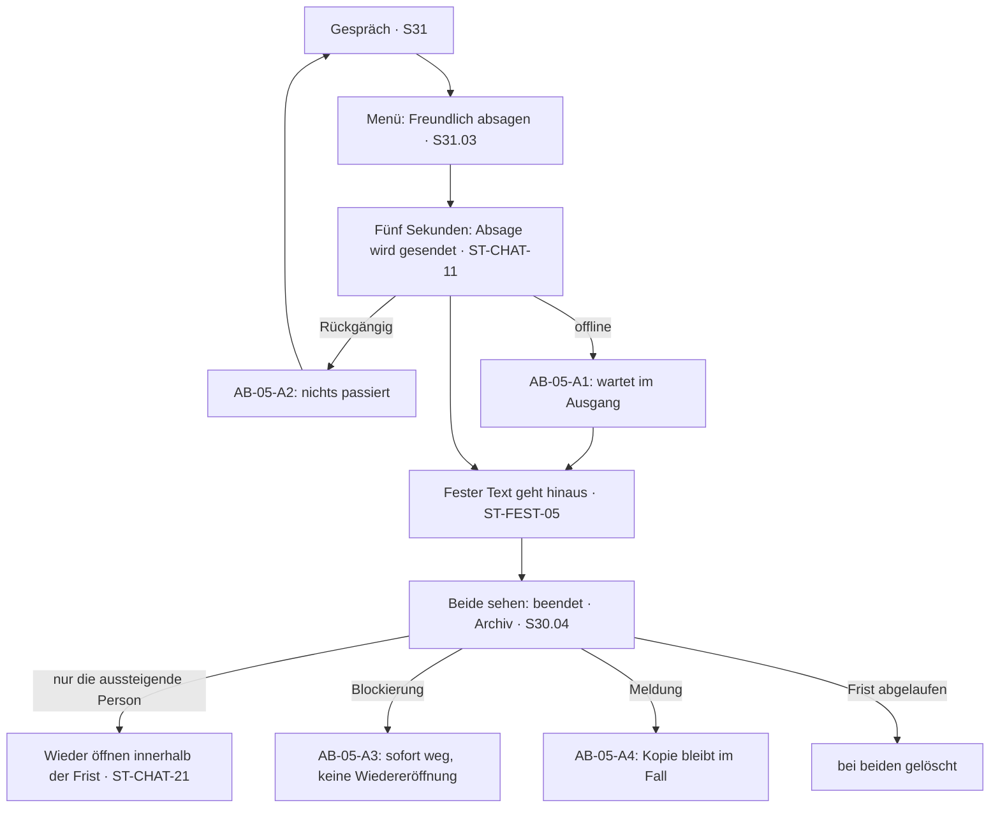

**Die Schritte**

| # | Was die Person sieht | Was das System tut | Abbruch oder Fehler |
|---|---|---|---|
| 1 | Im Gespräch das Menü öffnen und „Freundlich absagen“ wählen (S31.03, S31.07). | Kein Bestätigungsdialog — die Mikro-UX von Handbuch A verlangt Rücknahme statt Rückfrage (Q-06). | — |
| 2 | Fünf Sekunden lang steht „Absage wird gesendet …“ mit „Rückgängig“ (ST-CHAT-11). | Erst nach Ablauf der fünf Sekunden geht etwas hinaus (F45). | AB-05-A2 |
| 3 | Danach erscheint im Verlauf der festgelegte Satz — im Namen der Person, aber erkennbar als feste Formulierung (ST-FEST-05). | Der Wortlaut stammt wörtlich aus Handbuch A und endet dort mit einem Ausrufezeichen, das die Tonregel sonst verbietet (⚠ W-04). | AB-05-A1 |
| 4 | Beide sehen das Gespräch als beendet (ST-CHAT-12, ST-CHAT-13); es steht im Archiv am Ende der Liste (S30.04, ST-CHAT-20). | Ins Archiv kommen nur Gespräche nach einem Ausstieg — nicht jedes beendete Gespräch (FV-61). | — |
| 5 | Nur die aussteigende Person kann das Gespräch innerhalb von `P-ARCHIV` wieder öffnen (ST-CHAT-21). | Die Gegenseite kann das nicht — sonst wäre der Ausstieg keiner (FV-60). | — |
| 6 | Wieder geöffnet steht das Gespräch bei beiden im zweiten Postfach, mit einem Hinweis im Verlauf. | Zugestellte Nachrichten werden dabei nicht zurückgeholt (F46). | — |
| 7 | Nach `P-ARCHIV` ist das Gespräch bei beiden verschwunden; der leere Zustand erklärt das (ST-LEER-12). | Der Server löscht es; nur in einem Fall gesicherte Inhalte bleiben (FV-61, M-03). | AB-05-A4 |
| 8 | Sind verfallende Nachrichten eingeschaltet, verschwinden einzelne Nachrichten auch im Archiv schon vorher. | Die kürzere Frist gewinnt: `P-VERFALL` vor `P-ARCHIV` (X-01, F47). | — |

**Abbruchfälle**

- **AB-05-A1 · Offline beim Absagen** — Keine Verbindung im Moment des Tippens → Die Absage wartet im Ausgang (ST-LEER-31) und geht mit der Verbindung hinaus; das Gespräch gilt auf dem Gerät schon als beendet (F45).
- **AB-05-A2 · Rückgängig innerhalb von fünf Sekunden** — Die Person tippt „Rückgängig“ → Es wird nichts gesendet und nichts archiviert; das Gespräch steht unverändert da (ST-CHAT-11).
- **AB-05-A3 · Blockierung während der Archivzeit** — Eine der beiden Seiten blockiert die andere, während das Gespräch im Archiv liegt → Das Gespräch verschwindet sofort aus dem Archiv und lässt sich nicht wieder öffnen (X-02, F61).
- **AB-05-A4 · Meldung aus dem Archiv** — Die Person meldet Nachrichten, solange das Gespräch im Archiv liegt → Das geht, solange das Gespräch dort liegt; die gemeldeten Inhalte bleiben als Kopie im Fall, auch nach Ablauf der Archivfrist (M-03, X-11).

**Die drei Stellen, an denen dieser Ablauf in vergleichbaren Apps scheitert**

| Stelle | Wie es dort schiefgeht | Was hier dagegen steht |
|---|---|---|
| Es gibt nur Schweigen oder Blockieren | Wer nicht weiterschreiben will, verschwindet — die Gegenseite bleibt mit einer offenen Frage zurück, und das Klima kippt. | Ein Tipp, ein fester Text, für beide sichtbar beendet; das ist Merkmal 5 aus Handbuch A (F45). |
| Der Ausstieg wird mit Rückfragen verstellt | „Willst du wirklich?“, „Warum gehst du?“, eine Umfrage — Reibung an genau der Stelle, an der jemand aussteigen will. | Keine Rückfrage, sondern fünf Sekunden Rücknahme (Q-06, Q-01). |
| Der Ausstieg lässt sich von außen aufheben | Die Gegenseite schreibt weiter oder öffnet das Gespräch wieder — der Ausstieg war nur ein Vorschlag. | Wieder öffnen kann nur, wer ausgestiegen ist; nach der Archivfrist ist das Gespräch weg (FV-60, FV-61). |

**Offene Punkte**

- Das Ausrufezeichen im festgelegten Absagetext bleibt ein benannter Widerspruch zur Tonregel (⚠ W-04); der Wortlaut steht in Handbuch A und wird hier nicht geändert.
- Ob der Ausstieg als Antwort in die Antwortquote zählt, regelt F19; die Bänder kommen nach den Interviews.

## 7 · AB-06 · Melden bis zur Entscheidung — aus beiden Blickwinkeln

**Bauphase 1b** · Bezug: F62, F61, M-02, M-03, M-05, M-06, M-07, M-08, M-10, Z-01, Q-11 · Weg über die Bildschirme: S31 oder S20 oder S42 oder S70 → S70.01 bis S70.06 → S56 → S55

|  |  |
|---|---|
| **Zweck** | Eine Meldung, die nachvollziehbar entschieden wird — mit Fallnummer für die meldende und Begründung samt Widerspruch für die gemeldete Seite. |
| **Beteiligte** | Meldende Person · gemeldete Person · zwei Moderierende, anfangs die Gründer · Server |
| **Vorbedingungen** | Keine. Melden geht auch ohne Konto über ein Webformular (Art. 16 Abs. 1 DSA). |
| **Ergebnis** | Ein Fall mit Nummer, eine Entscheidung eines Menschen innerhalb der Frist und zwei begründete Mitteilungen. |
| **Wenn es schiefgeht** | Kein Fall geht verloren: Offline wartet die Meldung im Ausgang, gelöschte Inhalte bleiben als Kopie im Fall, und ein Konto, das es nicht mehr gibt, verhindert die Prüfung nicht. |

**Der Weg als Diagramm**

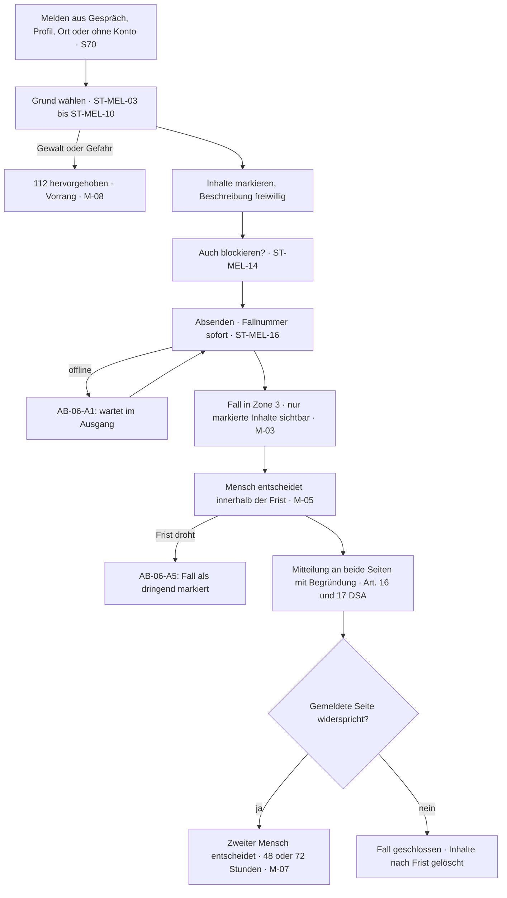

**Die Schritte**

| # | Was die Person sieht | Was das System tut | Abbruch oder Fehler |
|---|---|---|---|
| 1 | Melden ist aus dem Profil, aus der Gesprächsliste, aus dem Gespräch, aus einem Album, aus einer Ereignisgruppe und aus dem Sicherheitszentrum erreichbar — und ohne Konto über ein Webformular (S70, S51.10, F62, FV-72). | Art. 16 Abs. 1 DSA verlangt einen Meldeweg für jede Person und jede Einrichtung, auch ohne Konto (Q-11). | AB-06-A4 |
| 2 | Schritt 1: Grund wählen (S70.01, ST-MEL-02, ST-MEL-03 bis ST-MEL-10). Der Notfallhinweis mit „112 anrufen“ steht immer sichtbar (ST-MEL-11). | Beim Grund „Gewalt oder Gefahr für jemanden“ bekommt der Fall Vorrang und wird nach Art. 18 DSA geprüft (M-08). | — |
| 3 | Schritt 2: freiwillige Beschreibung und Markieren der betroffenen Nachrichten oder Bilder (S70.02, S70.03, ST-MEL-12). | Nur die markierten Inhalte werden in den Fall kopiert; bei Bildern steht vorher der Hinweis ST-MEL-13 (M-03). | — |
| 4 | Option „Auch blockieren“ (S70.04, ST-MEL-14). | Blockieren und Melden bleiben getrennte Vorgänge; die Meldung läuft weiter, auch wenn blockiert wird (F61, F62). | — |
| 5 | Absenden (S70.05). Sofort erscheint die Bestätigung mit Fallnummer (S70.06, ST-MEL-16, ST-MEL-17). | Die Fallnummer entsteht automatisch und ohne Wartezeit; der Fall steht unter „Meine Meldungen“ (S56.01, M-05). | AB-06-A1 |
| 6 | Blickwinkel der meldenden Person: Der Fall zeigt Status und Verlauf (S56.01, S56.02, ST-MEL-18 bis ST-MEL-20). | Der Fall liegt in Zone 3; nur über ihn sieht ein Mensch die markierten Inhalte, und jeder Zugriff wird protokolliert (M-03, M-06). | AB-06-A2 |
| 7 | Ein Mensch entscheidet innerhalb von `P-FRIST-MELDUNG`; bei einer Kontosperre entscheiden zwei. | Automatisch darf nur ein Bild gesperrt oder in die Warteschlange gelegt werden, nie ein Konto (M-06, Art. 22 DSGVO). | AB-06-A5 |
| 8 | Beide Seiten erhalten die Entscheidung im Mitteilungsbereich, mit Begründung (ST-MEL-21 bis ST-MEL-24, Z-01). | Art. 16 Abs. 5 DSA verlangt die Rückmeldung an die meldende Seite, Art. 17 DSA die Begründung an die betroffene (Q-11). | — |
| 9 | Blickwinkel der gemeldeten Person: Die Mitteilung nennt Maßnahme, Grund und den Weg zum Widerspruch (S56.03, ST-MEL-25, ST-MEL-26). | Zwei Vorgänge, zwei Fristen: Einspruch gegen eine Bildablehnung `P-FRIST-EINSPRUCH-BILD`, jeder andere Widerspruch `P-FRIST-WIDERSPRUCH` (FV-81). | AB-06-A6 |
| 10 | Über den Widerspruch entscheidet — wenn zwei Personen da sind — nicht dieselbe wie zuvor. | War die erste Entscheidung automatisch, prüft beim Einspruch immer ein Mensch (M-07). | — |
| 11 | Ist der Fall geschlossen, bleiben seine Inhalte `P-FALL-AUFBEWAHRUNG` nach der letzten Entscheidung gespeichert und werden dann gelöscht. | Ausnahme: behördliche Vorgaben (FV-78, Anwaltsfrage AF-12 der Spezifikation). | AB-06-A3 |

**Abbruchfälle**

- **AB-06-A1 · Offline beim Absenden** — Keine Verbindung im Moment des Absendens → Die Meldung wartet im Ausgang und geht mit der Verbindung hinaus; die Fallnummer kommt danach (F62).
- **AB-06-A2 · Die gemeldeten Inhalte verschwinden** — Verfallende Nachrichten, Archivfrist oder Löschung durch die gemeldete Person → Im Fall bleibt die Kopie der markierten Inhalte; sie überlebt Verfall und Löschung (M-03, X-11).
- **AB-06-A3 · Das gemeldete Konto gibt es nicht mehr** — Die gemeldete Person hat ihr Konto gelöscht → Der Fall wird trotzdem angelegt und geprüft; die Entscheidung erreicht die Person nicht mehr, weil ihr Mitteilungsbereich mit dem Konto gelöscht ist (F68, Z-01).
- **AB-06-A4 · Meldung ohne Konto** — Jemand ohne Konto meldet über das Webformular → Das Formular erhebt die Angaben nach Art. 16 Abs. 2 DSA und gibt eine Fallnummer aus; die Rückmeldung geht an die dort angegebene Adresse (FV-72).
- **AB-06-A5 · Die Frist droht abzulaufen** — Ein Fall nähert sich `P-FRIST-MELDUNG` → Das Werkzeug markiert ihn als dringend; wird die Frist überschritten, steht das im Fall und in der Monatsauswertung (M-05).
- **AB-06-A6 · Widerspruch gegen die Entscheidung** — Die gemeldete Person widerspricht aus der App → Die Bestätigung nennt die geltende Frist; entschieden wird von einem Menschen, möglichst nicht von derselben Person (M-07).

**Die drei Stellen, an denen dieser Ablauf in vergleichbaren Apps scheitert**

| Stelle | Wie es dort schiefgeht | Was hier dagegen steht |
|---|---|---|
| Melden führt ins Leere | Keine Fallnummer, kein Status, keine Antwort — die meldende Person erfährt nie, ob etwas geschah, und meldet beim nächsten Mal nicht mehr. | Fallnummer sofort, Status im Fall, begründete Entscheidung an beide Seiten — was Art. 16 und 17 DSA ohnehin verlangen (F62, Q-11). |
| Die Moderation liest das ganze Gespräch | Eine Meldung öffnet die gesamte Unterhaltung, oft auch private Bilder, die niemand gemeldet hat. | Eine Meldung öffnet die Vertraulichkeit nur für die markierten Inhalte; jeder Zugriff ist protokolliert (AK-M03-04, M-06). |
| Das Konto sperrt eine Maschine | Ein Schwellenwert sperrt automatisch, der Widerspruch verläuft im Sand — nach Art. 22 DSGVO angreifbar und für die Betroffenen existenziell. | Automatisch geht nur die Bildsperre; Kontosperren brauchen zwei Menschen, und der Widerspruch hat eine feste Frist (M-06, M-07). |

**Offene Punkte**

- Was der hochladenden Person bei einem Hash-Treffer gesagt wird, entscheidet A-36; bis dahin bleibt ST-FEH-17 bewusst leer (M-04).
- Die Belastungsgrenzen für Moderierende legen die Gründer fest (M-10).
- Ob der Meldeweg ohne Konto zusätzliche Angaben erhebt, hängt an der Anwaltsfrage AF-07 der Spezifikation.

## 8 · AB-07 · Blockieren und was dabei sonst noch endet

**Bauphase 1b** · Bezug: F61, F12, F48, F46, F47, F08, F62, X-02 · Weg über die Bildschirme: S31 oder S20 oder S70 → S71 → S72

|  |  |
|---|---|
| **Zweck** | Eine Person aus dem eigenen Erleben entfernen — sofort, beidseitig und ohne dass sie es erfährt. |
| **Beteiligte** | Blockierende Person · blockierte Person · Server |
| **Vorbedingungen** | Ein Gespräch, ein Profil oder ein Meldeablauf, aus dem heraus blockiert wird. |
| **Ergebnis** | Die Verbindung ist beendet: kein Gespräch, kein Profil, keine Freischaltung, keine Albumfreigabe — `P-BLOCK-RUECKNAHME` lang rücknehmbar, danach endgültig. |
| **Wenn es schiefgeht** | Blockieren wirkt auch offline sofort auf dem Gerät und wird nachgereicht; rückgängig machen geht nur innerhalb der Frist. |

**Der Weg als Diagramm**

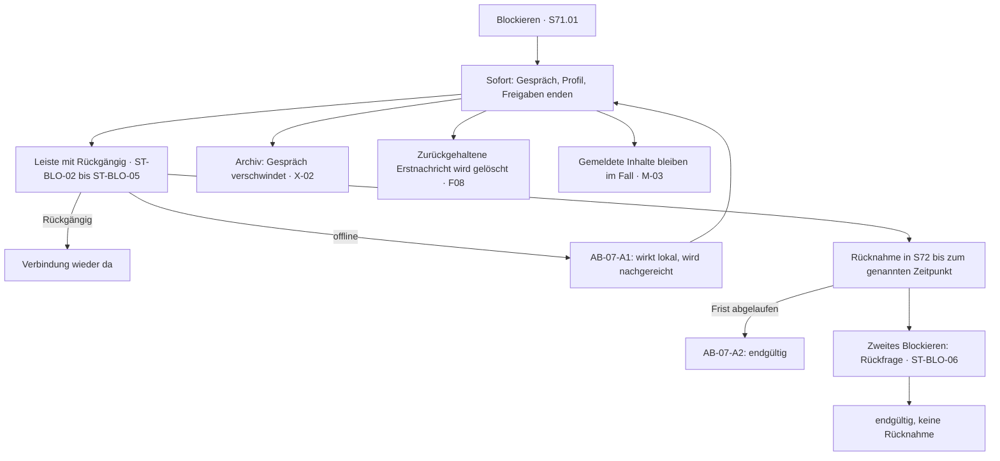

**Die Schritte**

| # | Was die Person sieht | Was das System tut | Abbruch oder Fehler |
|---|---|---|---|
| 1 | „Blockieren“ aus dem Gespräch, aus dem Profil oder am Ende des Meldens (S71.01, ST-BLO-01, ST-MEL-14). | Beim ersten Mal ohne Rückfrage — Schutz darf nicht an einem Dialog hängen (F61). | — |
| 2 | Sofort verschwinden Gespräch und Profil bei beiden Seiten. | Freischaltungen des Gesichts (F12), Albumfreigaben (F48) und spätere Ortsfreigaben (F50, Phase 2) enden im selben Moment. | AB-07-A1 |
| 3 | Eine Leiste erklärt, was passiert ist, und bietet „Rückgängig“ (ST-BLO-02 bis ST-BLO-05, S71.02). | Die Leiste steht `P-BLOCK-LEISTE` lang; danach geht die Rücknahme in der Liste blockierter Profile (S72). | — |
| 4 | In S72 steht je Eintrag, bis wann die Rücknahme möglich ist (S72.02, ST-BLO-09, ST-BLO-10). | Nach `P-BLOCK-RUECKNAHME` ist die Blockierung endgültig (FV-71). | AB-07-A2 |
| 5 | Wird dieselbe Person nach einer Rücknahme erneut blockiert, kommt eine Rückfrage (ST-BLO-06 bis ST-BLO-08, S71.03). | Die zweite Sperre ist endgültig — so steht es im Katalog (F61). | — |
| 6 | Auf der Gegenseite fehlt das Gespräch einfach. Das Wort „blockiert“ fällt nirgends. | Die Liste blockierter Profile sieht nur, wer blockiert hat; die blockierte Person erfährt nichts (F41, F61). | AB-07-A3 |
| 7 | Lag das Gespräch im Archiv, ist es sofort weg und lässt sich nicht wieder öffnen. | Blockieren schlägt Archiv (X-02, F46). | — |
| 8 | War eine Erstnachricht zurückgehalten, weil die Gegenseite nur geprüfte Profile zulässt, wird sie gelöscht. | Das Gespräch verschwindet beim Absender; er erfährt nicht, dass blockiert wurde (F08). | — |
| 9 | Gemeldete Inhalte bleiben von alldem unberührt. | Die Kopie im Fall überlebt Blockierung, Verfall und Archivfrist (M-03). | — |
| 10 | Sind beide in derselben temporären Ereignisgruppe, sehen sie einander dort nicht mehr. | Die Nachrichten der jeweils anderen Seite sind gegenseitig unsichtbar; die Gruppe selbst bleibt bestehen (F33, F61). | AB-07-A4 |

**Abbruchfälle**

- **AB-07-A1 · Offline beim Blockieren** — Keine Verbindung im Moment des Tippens → Die Blockierung wirkt auf dem Gerät sofort und wird nachgereicht, sobald Verbindung besteht (F61).
- **AB-07-A2 · Rücknahme zu spät** — Die Person will nach `P-BLOCK-RUECKNAHME` zurücknehmen → Die Rücknahme ist nicht mehr möglich; der Eintrag in S72 sagt das vorher, mit Datum (FV-71).
- **AB-07-A3 · Die blockierte Person legt ein neues Konto an** — Sie registriert sich erneut mit einer anderen Adresse → Das wird im MVP nicht erkannt. Die Warnung bei Kontowiederkehr kommt erst in Phase 2 und nur für gesperrte Konten (F67).
- **AB-07-A4 · Beide sind in derselben Ereignisgruppe** — Blockierung zwischen zwei Teilnehmenden einer temporären Gruppe → Ihre Nachrichten sind füreinander unsichtbar; niemand wird aus der Gruppe entfernt, und niemand erfährt den Grund (F33).

**Die drei Stellen, an denen dieser Ablauf in vergleichbaren Apps scheitert**

| Stelle | Wie es dort schiefgeht | Was hier dagegen steht |
|---|---|---|
| Die Blockierung überlebt nichts | Nach Neuinstallation oder auf einem zweiten Gerät ist die Liste weg, und die blockierte Person steht wieder im Raster. | Die Blockierliste liegt serverseitig und ist unveränderlich; sie überlebt Update und Neuinstallation (F61). |
| Die blockierte Person merkt es sofort | Eine Fehlermeldung „Du wurdest blockiert“ liefert genau die Information, die zur Eskalation führt. | Das Gespräch verschwindet ohne Wort; es gibt keinen Hinweis und keine andere Fehlermeldung als bei einem gelöschten Konto (F41). |
| Blockieren löscht die Beweise | Wer blockiert, verliert den Verlauf — und damit das, was eine Meldung oder ein Gericht später bräuchte. | Gemeldete Inhalte bleiben im Fall gesichert; dass es außerhalb einer Meldung keine Sicherung gibt, ist benannt und liegt beim Anwalt (⚠ W-17). |

**Offene Punkte**

- Ob es einen Weg geben soll, Inhalte ohne Meldung zu sichern, hängt an der Anwaltsfrage AF-05 der Spezifikation (⚠ W-17).
- Die Warnung bei Kontowiederkehr (F67) ist Phase 2 und ändert an AB-07-A3 bis dahin nichts.

## 9 · AB-08 · Abo abschließen und kündigen

**Bauphase 2** · Bezug: Z-05, Z-01, F60, F68, Q-01 · Weg über die Bildschirme: S50 → S61 → Zahlung → S62 → S55

|  |  |
|---|---|
| **Zweck** | Ein Abo abschließen und wieder loswerden, ohne dass Verbraucherrecht und Diskretion sich gegenseitig aufheben. |
| **Beteiligte** | Person · Zahlungsdienst oder App-Store · Server · Mitteilungsbereich |
| **Vorbedingungen** | Konto. Welche Leistungen die Stufen enthalten, ist offen (**Nr. 67**) — dieser Ablauf beschreibt den Weg, nicht das Angebot. |
| **Ergebnis** | Ein aktives Abo mit Bestätigung in Textform — oder eine Kündigung mit Bestätigung in Textform, beides im Mitteilungsbereich. |
| **Wenn es schiefgeht** | Bleibt die Bestätigung des Stores aus, sagt die App das offen (ST-FEH-51) statt eine Leistung zu zeigen, die noch nicht bezahlt ist. |

**Der Weg als Diagramm**

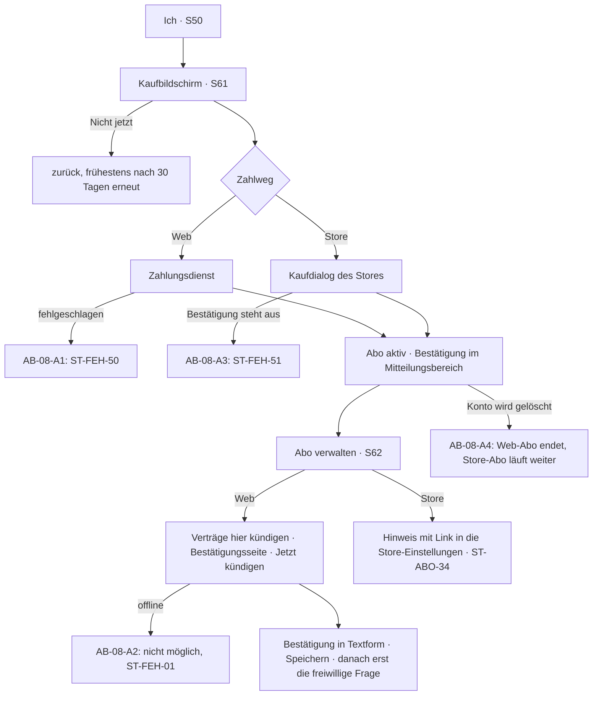

**Die Schritte**

| # | Was die Person sieht | Was das System tut | Abbruch oder Fehler |
|---|---|---|---|
| 1 | „Abo“ im Reiter „Ich“ (S50.03) oder eine Aufforderung an der Stelle, an der eine Funktion fehlt. | Nie blockierend, nie im Gespräch, höchstens alle 30 Tage je Funktion; „Nicht jetzt“ steht oben (ST-ABO-21, Q-01). | — |
| 2 | Kaufbildschirm S61: Einleitung, Leistungen, Laufzeiten, rechtliche Angaben (S61.02 bis S61.05). | Die Leistungen der Stufen sind in keinem Dokument festgelegt; ST-ABO-03 und ST-ABO-04 bleiben Platzhalter bis **Nr. 67**. | — |
| 3 | Laufzeiten: je Laufzeit stehen Laufzeit, Gesamtpreis und Monatswert gleich deutlich nebeneinander (S61.04, ST-ABO-10 bis ST-ABO-17). | Seit **Nr. 50** (19.09.2026) ist die Jahreslaufzeit vorausgewählt; jede Laufzeit steht gleich deutlich da, die Verlängerung wird vor dem Kauf genannt (FV-88, § 309 Nr. 9 BGB). | — |
| 4 | Kaufschaltfläche mit dem gesetzlichen Wortlaut (ST-ABO-20) und den Pflichtangaben daneben (S61.06, ST-ABO-18, ST-ABO-19, ST-ABO-22). | § 312j BGB verlangt die eindeutige Beschriftung; der Preis steht unmittelbar davor. | — |
| 5 | Web-Weg: Zahlung beim Zahlungsdienst, danach ist das Abo aktiv. | Die Bestätigung kommt in den Mitteilungsbereich und steht in S62.01 — nicht per E-Mail mit erkennbarem Betreff (Z-01, Nr. 49). | AB-08-A1 |
| 6 | Store-Weg: der Kaufdialog des Stores; solange dessen Bestätigung aussteht, sagt die App das (ST-FEH-51). | Freigeschaltet wird erst nach der Bestätigung des Stores (Z-05). | AB-08-A3 |
| 7 | Kündigen im Web: „Verträge hier kündigen“ (S62.02, ST-ABO-30) führt direkt zur Bestätigungsseite (S62.03) mit „Jetzt kündigen“ (ST-ABO-31). | § 312k BGB verlangt eine Kündigungsschaltfläche, die ohne Umwege erreichbar ist — kein Anruf, kein Chat, keine Rückgewinnungsstrecke. | AB-08-A2 |
| 8 | Danach erscheint die Bestätigung mit Zeitpunkt und Vertragsende (ST-ABO-32) und „Speichern“ für eine Datei (S62.04). | Dieselbe Bestätigung liegt in Textform im Mitteilungsbereich; ob zusätzlich eine E-Mail erlaubt oder geboten ist, hängt an **Nr. 49** (§ 312k Abs. 4 BGB). | — |
| 9 | Erst nach der Bestätigung kommt die freiwillige Frage nach dem Grund (S62.05, ST-ABO-33). | Die Frage darf die Kündigung nicht aufhalten (Q-01). | — |
| 10 | Store-Abo kündigen: Hinweis mit Link in die Abo-Einstellungen des Stores (S62.06, ST-ABO-34). | Ein Store-Abo läuft auch nach einer Kontolöschung weiter, bis es dort gekündigt wird (ST-DAT-16). | AB-08-A4 |

**Abbruchfälle**

- **AB-08-A1 · Zahlung fehlgeschlagen** — Der Zahlungsdienst lehnt ab oder bricht ab → ST-FEH-50 im Dreiermuster; es wird nichts freigeschaltet und nichts abgebucht, der Kaufbildschirm bleibt offen (Z-05).
- **AB-08-A2 · Kündigen ohne Verbindung** — Kein Netz im Moment der Kündigung → Die Kündigung lässt sich nicht absenden; die App sagt das offen (ST-FEH-01), statt eine Bestätigung zu zeigen, die nirgends ankommt.
- **AB-08-A3 · Die Bestätigung des Stores bleibt aus** — Der Store meldet den Kauf nicht oder verzögert → Der Zustand „Kauf wird geprüft“ mit ST-FEH-51; die Leistung bleibt gesperrt, bis die Bestätigung da ist (Z-05).
- **AB-08-A4 · Konto wird während des Abos gelöscht** — Die Person löscht ihr Konto (AB-09) → Das Web-Abo endet mit der Löschung. Ein Store-Abo läuft weiter, bis es im Store gekündigt wird — darauf weist ST-DAT-16 vor der Löschung hin (F68).

**Die drei Stellen, an denen dieser Ablauf in vergleichbaren Apps scheitert**

| Stelle | Wie es dort schiefgeht | Was hier dagegen steht |
|---|---|---|
| Die Kündigung ist versteckt | Abschließen dauert zwei Tipps, kündigen führt über Support-Chat, Telefon oder ein Formular mit Rückgewinnungsstrecke. | Kündigungsschaltfläche im Abo-Bereich, Bestätigungsseite, Bestätigung in Textform — die Reihenfolge des § 312k BGB (Z-05). |
| Die günstige Laufzeit wird groß, der Gesamtpreis klein | Der Monatswert steht fett, der Gesamtpreis klein, die lange Laufzeit ist vorausgewählt — formal korrekt, praktisch ein dunkles Muster. | Laufzeit, Gesamtpreis und Monatswert gleich deutlich; die Vorauswahl der Jahreslaufzeit verstärkt nichts davon (**Nr. 50**, FV-88, Q-01). |
| Die Abrechnung outet | Ein sprechender Name auf dem Kontoauszug oder ein Absender im Postfach verrät die App an Menschen, die mitlesen. | Abrechnungsname und Absender sind als Entscheidung benannt und gehören zum Diskretionsversprechen (**Nr. 49**). |

**Offene Punkte**

- **Nr. 67** (Inhalte von PLUS und PRO) blockiert die Schritte 2 und 3; ohne sie gibt es keinen Kaufbildschirm.
- **Nr. 49** entscheidet über Kündigungsbestätigung, Abrechnungsname und Absender.
- ~~**Nr. 50** entscheidet über die Vorauswahl der Laufzeit.~~ Entschieden am 19.09.2026: Jahreslaufzeit vorausgewählt, alle Laufzeiten gleich deutlich.

## 10 · AB-09 · Datenkonto: Export und vollständige Löschung

**Bauphase 1a und 1c** · Bezug: F68, F71, Z-01, Q-09, M-03 · Weg über die Bildschirme: S50 → S60 → S60.05 oder S60.06 → S55

|  |  |
|---|---|
| **Zweck** | Sehen, was gespeichert ist, alles mitnehmen und alles löschen — je mit einem Tipp. |
| **Beteiligte** | Person · Server · Mitteilungsbereich |
| **Vorbedingungen** | Konto. |
| **Ergebnis** | Eine verschlüsselte Exportdatei im Datenkonto oder eine laufende Löschung mit `P-KARENZ` Karenz. |
| **Wenn es schiefgeht** | Ein fehlgeschlagener Export wird automatisch wiederholt; eine begonnene Löschung lässt sich in der Karenz jederzeit abbrechen. |

**Der Weg als Diagramm**

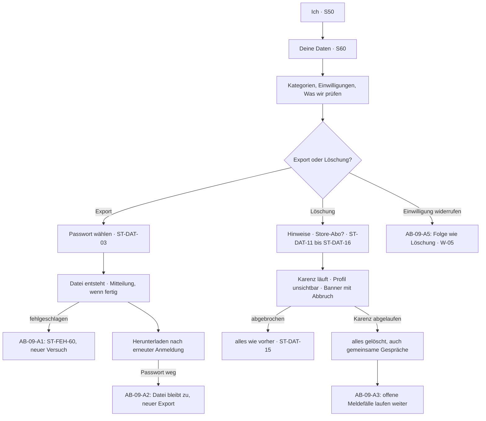

**Die Schritte**

| # | Was die Person sieht | Was das System tut | Abbruch oder Fehler |
|---|---|---|---|
| 1 | „Deine Daten“ im Reiter „Ich“ (S50.03, S60.01, ST-DAT-01, ST-DAT-02). | Das Datenkonto ist kein Formular und keine Anfrage, sondern ein Bildschirm (F68). | — |
| 2 | S60.02 zeigt die Kategorien: Konto, Profil, Nachrichten, Standortstufe, Einwilligungen, Meldungen. S60.03 listet die erteilten Einwilligungen mit Datum und „Widerrufen“. | Jede Einwilligung ist einzeln widerrufbar und mit Textstand gespeichert (Q-09). | AB-09-A5 |
| 3 | S60.04 „Was wir prüfen“ (ST-DAT-20) erklärt, was in Zone 1 und Zone 2 geschieht. | Die Fassung des Textes richtet sich nach der Stellung des Schalters für Zone 2 (M-09). | — |
| 4 | Export: ein Tipp auf ST-DAT-03, dann ein selbst gewähltes Passwort (ST-DAT-04). | Die Datei entsteht innerhalb von `P-EXPORT-DAUER`, ist verschlüsselt und steht `P-EXPORT-BEREIT` lang bereit (FV-76). | AB-09-A1 |
| 5 | Ist der Export fertig, kommt eine Mitteilung im Mitteilungsbereich; das Herunterladen verlangt eine erneute Anmeldung (ST-DAT-05, ST-DAT-06). | Der Download erscheint im Datenkonto, nie als E-Mail-Anhang (AK-F68-01, Z-01). | AB-09-A2 |
| 6 | Der Export enthält alle Daten des Kontos, eigene Nachrichten und Fotos eingeschlossen. | Ob und wie Nachrichten der Gegenseite enthalten sein dürfen, ist eine Anwaltsfrage (AF-09 der Spezifikation). | — |
| 7 | Löschen: ein Tipp auf ST-DAT-10, dann die Hinweise ST-DAT-11 bis ST-DAT-13 — bei einem Store-Abo zusätzlich ST-DAT-16. | Mit dem Tipp beginnt die Karenz von `P-KARENZ` (FV-77). | AB-09-A4 |
| 8 | Ab sofort ist das Profil für niemanden sichtbar, und niemand kann der Person schreiben, auch nicht in bestehenden Gesprächen. | Die Gespräche bleiben für die Gegenseite bis zum Ende der Karenz lesbar; auf allen Bildschirmen stehen der Countdown (ST-DAT-13) und die Schaltfläche „Löschung abbrechen“ (ST-DAT-14, FV-77). | — |
| 9 | Abbrechen innerhalb der Karenz: ST-DAT-15, und alles ist wie vorher. | Es gibt keine Rückgewinnungsstrecke und keine Nachfrage, warum (Q-01). | — |
| 10 | Nach `P-KARENZ` löscht der Server alle Daten des Kontos, auch die gemeinsamen Gespräche bei der Gegenseite. | Ausgenommen sind Inhalte, die in einem Fall gesichert sind, und Nachweise, die ein Gesetz aufzubewahren verlangt (FV-77, M-03). | AB-09-A3 |

**Abbruchfälle**

- **AB-09-A1 · Export fehlgeschlagen** — Die Datei lässt sich nicht erzeugen → ST-FEH-60 und ein automatischer neuer Versuch; die Person muss nichts tun (F68).
- **AB-09-A2 · Das Export-Passwort ist weg** — Die Person kennt das selbst gewählte Passwort nicht mehr → Die Datei bleibt verschlüsselt und lässt sich nicht öffnen — niemand kann sie aufschließen. Ein neuer Export ist jederzeit möglich (FV-76).
- **AB-09-A3 · Offene Meldefälle bei der Löschung** — Ein Fall der Person ist noch nicht entschieden → Der Fall läuft weiter; nach der Löschung erfährt die Person das Ergebnis nicht mehr, weil ihr Mitteilungsbereich gelöscht ist (F68, Z-01).
- **AB-09-A4 · Store-Abo bei der Löschung** — Die Person hat ein Abo über einen App-Store → ST-DAT-16 sagt vor der Löschung, dass das Abo dort weiterläuft und im Store gekündigt werden muss (AB-08).
- **AB-09-A5 · Einwilligung widerrufen statt löschen** — Die Person widerruft die Einwilligung nach Art. 9 DSGVO in S60.03 → Die App erklärt die Folge: Ohne Einwilligung ist kein Profil möglich, der Widerruf startet die Löschung wie F68; das Profil ist sofort unsichtbar. Ob eine Karenz dabei zulässig ist, prüft der Anwalt (⚠ W-05, AF-10).

**Die drei Stellen, an denen dieser Ablauf in vergleichbaren Apps scheitert**

| Stelle | Wie es dort schiefgeht | Was hier dagegen steht |
|---|---|---|
| Der Export ist ein Feigenblatt | Eine Datei mit Kontoname und Registrierungsdatum, verschickt per E-Mail, ohne Nachrichten und ohne Fotos. | Vollständigkeit wird gegen das Datenmodell getestet; der Download liegt im Datenkonto, nicht im Postfach (AK-F68-02, AK-F68-01). |
| Löschen heißt Deaktivieren | Das Konto verschwindet aus der Ansicht, die Daten bleiben — samt Nachrichten bei den Gesprächspartnern. | Nach der Karenz wird alles gelöscht, auch die gemeinsamen Gespräche; Ausnahmen sind benannt (FV-77). |
| Die Karenz wird zur Rückholstrecke | „Wir vermissen dich“-Mails, Rabatte, Umfragen — die Löschung wird zur Verhandlung. | In der Karenz ist das Profil sofort unsichtbar; es gibt nur ein Banner mit „Löschung abbrechen“ und keine Werbung (FV-77, Q-01). |

**Offene Punkte**

- Was mit Nachrichten der Gegenseite im Export geschieht, ist eine Anwaltsfrage (AF-09).
- Ob die Karenz nach einem Widerruf der Einwilligung zulässig ist, ebenfalls (⚠ W-05, AF-10).

## 11 · AB-10 · Zugang verloren — Gerät weg, Passwort vergessen, Anmeldeweg entfällt

**Bauphase 1b** · Bezug: F02, F03, F55, F58, F68, Z-03, Z-09, Z-10, Q-11 · Weg über die Bildschirme: S03.10 → E-Mail → S03 → S63.04 · bei neuem Gerät zusätzlich S34.08

|  |  |
|---|---|
| **Zweck** | Wieder hineinkommen — bei einer App, die bewusst nichts speichert, womit sich eine Person identifizieren ließe. |
| **Beteiligte** | Person · Server · E-Mail-Postfach, Mobilnummer oder Apple · auf Wunsch Vertrauenspersonen |
| **Vorbedingungen** | Ein bestehendes Konto. |
| **Ergebnis** | Zugang wiederhergestellt — oder die ehrliche Auskunft, dass er es nicht werden kann. |
| **Wenn es schiefgeht** | Wer den Wiederherstellungscode verloren und keinen anderen Weg eingerichtet hat, verliert das Konto. Das ist die Kehrseite der Datensparsamkeit — seit dem 21.09.2026 so beschlossen und vorher offen gesagt (**Nr. 69**, ST-WHR-01). |

**Der Weg als Diagramm**

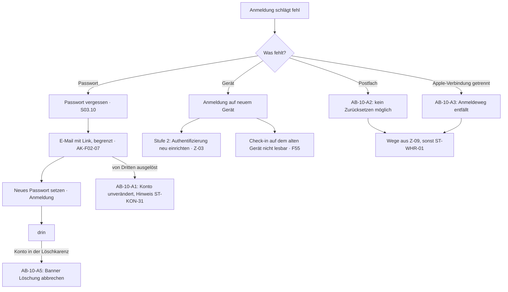

**Die Schritte**

| # | Was die Person sieht | Was das System tut | Abbruch oder Fehler |
|---|---|---|---|
| 1 | „Passwort vergessen“ im Anmeldemodus (S03.10). | Der Server schickt nur an bestehende Adressen etwas; innerhalb von `P-RESET-SPERRE` geht höchstens eine E-Mail hinaus (AK-F02-07). | AB-10-A1 |
| 2 | Die E-Mail kommt von einem neutralen Absender und nennt die App nicht im Betreff (ST-MAIL-01, ST-MAIL-05, ST-MAIL-06). | Die Zusage ST-KON-30 stimmt hier nicht ganz: Eine Passwort-Anfrage kann auch ein Dritter mit fremder Adresse auslösen (⚠ W-08); der Text wird angepasst (Spezifikation, Abschnitt 16.3). | — |
| 3 | Neues Passwort setzen, danach anmelden. | Das Passwort liegt nur als Hash mit einem langsamen Verfahren (AK-F02-05). | AB-10-A4 |
| 4 | Neues Gerät: Anmeldung mit E-Mail und Passwort, mit der Mobilnummer oder mit Apple; das Konto ist unverändert. | Die Blockierliste, die Meldungen und der Mitteilungsbereich liegen serverseitig und sind sofort wieder da (F61, Z-01). | — |
| 5 | Wer Stufe 2 hat, richtet die Authentifizierung auf dem neuen Gerät neu ein — ohne neue Identifizierung. | Der Prüfstatus bleibt am Konto, nicht am Gerät (Z-03, FV-87). | — |
| 6 | Ein Check-in, der auf dem verlorenen Gerät angelegt wurde, ist nicht mehr lesbar. | Alle Angaben liegen nur verschlüsselt auf dem Gerät; der Server kennt nur den Zeitplan und vergisst ihn spätestens nach `P-CHECKIN-LOESCHUNG` (F55). | — |
| 7 | Wer die App getarnt hat, findet sie unter dem Tarnsymbol; die PIN liegt nur auf dem alten Gerät. | Auf einem neuen Gerät gilt die normale Anmeldung; die PIN ist vom Passwort unabhängig und wird nicht übertragen (FV-68). | — |
| 8 | Ist das E-Mail-Postfach selbst verloren oder die Apple-Verbindung getrennt, greifen die Wege aus **Z-09**: Wiederherstellungscode, der freiwillige zweite Anmeldeweg, Vertrauenspersonen, Zahlungsbeleg. | Die App speichert weiterhin weder Klarname noch Geburtsdatum; die Mobilnummer nur, wenn die Person sie selbst als zweiten Weg gewählt hat (Nr. 69, Nr. 79). | AB-10-A2 |
| 9 | Vorbeugend lassen sich in „Zugang sichern“ (S63.04) ein zweiter Anmeldeweg und Vertrauenspersonen einrichten; der Code wird beim Anlegen gezeigt und nach sieben Tagen einmal nachgefragt. | **Entschieden 21.09.2026 (Nr. 69):** Die App weist beim Anlegen freundlich und überspringbar darauf hin, danach nicht mehr ungefragt (AK-Z09-02, AK-Z09-03). | AB-10-A3 |
| 10 | Wer sich während der Löschkarenz anmeldet, sieht das Banner „Löschung abbrechen“. | Das Profil bleibt unsichtbar, bis die Löschung abgebrochen ist (FV-77). | AB-10-A5 |

**Abbruchfälle**

- **AB-10-A1 · Jemand Fremdes fordert ein neues Passwort an** — Eine dritte Person gibt die Adresse im Anmeldebildschirm ein → Das Konto bleibt unverändert; es geht höchstens eine E-Mail je `P-RESET-SPERRE` hinaus, und sie erklärt, dass niemand ohne Zugriff auf das Postfach etwas ändern kann (ST-KON-31, AK-F02-07).
- **AB-10-A2 · Das E-Mail-Postfach ist verloren** — Die hinterlegte Adresse existiert nicht mehr → Die App bietet die Wege, die die Person eingerichtet hat: Code, zweiter Anmeldeweg, Vertrauenspersonen, Zahlungsbeleg (Z-09). Hat sie keinen, sagt die App das ohne Umschweife (ST-WHR-01, AK-Z09-06).
- **AB-10-A3 · Die Apple-Verbindung ist getrennt** — Der Anmeldeweg entfällt → dieselben Wege wie bei AB-10-A2 (Z-09). Hat die Person keinen davon, endet der Zugang, und die App sagt es offen.
- **AB-10-A4 · Ein fremdes Gerät ist noch angemeldet** — etwa nach einem Diebstahl → **Gelöst durch FV-94:** Jede Wiederherstellung und jedes neue Passwort beenden alle anderen Sitzungen.
- **AB-10-A5 · Anmeldung während der Löschkarenz** — Die Person hatte die Löschung begonnen → Der Countdown (ST-DAT-13) und die Schaltfläche ST-DAT-14 stehen auf allen Bildschirmen; erst nach dem Abbruch ist das Profil wieder sichtbar (ST-DAT-15, FV-77).

**Die drei Stellen, an denen dieser Ablauf in vergleichbaren Apps scheitert**

| Stelle | Wie es dort schiefgeht | Was hier dagegen steht |
|---|---|---|
| Die Wiederherstellung verlangt Ausweis oder Telefonnummer | Wer wieder hineinwill, soll sich ausweisen — bei einer App für schwule Männer entsteht damit genau der Datensatz, den es nicht geben soll. | Es gibt weder Klarname noch Geburtsdatum, und eine Mobilnummer nur, wenn die Person sie selbst wählt (Z-10); die Prüfung speichert nur ja oder nein (F02, FV-16). Der Preis dafür ist AB-10-A2 und AB-10-A3 — offen benannt statt stillschweigend gelöst. |
| Die Zurücksetz-E-Mail outet | Absender und Betreff nennen die App, und das Postfach wird mitgelesen. | Neutraler Absender, neutraler Betreff, keine Inhalte in der Vorschau (ST-MAIL-01, Z-01). |
| Der Support stellt den Zugang „nach Rückfragen“ her | Wer genug über eine Person weiß, übernimmt ihr Konto — der bequemste Weg ist auch der unsicherste. | Hinein kommt nur, wer einen der selbst eingerichteten Wege hat: Postfach, Mobilnummer, Apple, Code, Vertrauenspersonen oder Zahlungsbeleg (Z-09). Der Kontaktservice stellt keinen Zugang her; das ist unbequem und beabsichtigt (Q-11 nennt die Kontaktstellen, keine Wiederherstellung). |

**Offene Punkte**

- ~~**Nr. 69**~~ **entschieden 21.09.2026** — Code für alle, alles andere freiwillig, keine Passkeys; Einzelheiten in Z-09.
- ~~**Nr. 86**~~ **entschieden 26.09.2026: Schwelle 1** — eine hinterlegte Vertrauensperson genügt; das Schwellenverfahren nach Shamir entfällt, jede erhält eine vollständige verschlüsselte Kopie. **Der Weg wird erst gebaut, wenn die Schutzvorkehrungen aus Nr. 95 entschieden sind** (Wartefrist, Benachrichtigung, Abbruchrecht).
- Texte ST-WHR-01 bis ST-WHR-05 in den Systemtexten.

## 12 · AB-11 · Hilfe suchen und einen Vorgang verfolgen

**Bauphase 1a (Grundlage) und 1c (Oberfläche)** · Bezug: F75, F54, F61, F62, F68, M50, M85 · Weg über die Bildschirme: S57 → S57.04 → S57.06 (neu, siehe Spezifikation 16.3) · ohne Konto über die Webseite

|  |  |
|---|---|
| **Zweck** | Hilfe bekommen — bei Konto, Zahlung, Technik, Missbrauch und Rechten nach der Datenschutz-Grundverordnung. Auch dann, wenn das Konto nicht mehr erreichbar ist. |
| **Beteiligte** | Person (mit oder ohne Konto) · Server · Moderation (M85) |
| **Vorbedingungen** | **keine** — das ist der Kern dieses Ablaufs. |
| **Ergebnis** | Ein Vorgang mit Fallnummer besteht, die Frist läuft sichtbar, und die Antwort erreicht die Person auf dem Weg, den sie gewählt hat. |
| **Wenn es schiefgeht** | Ohne diesen Ablauf ist AB-10 ohne Ausgang: Wer nicht mehr in sein Konto kommt, kann niemanden erreichen (**Nr. 69**, **Nr. 75**). Einen Zugang stellt aber auch dieser Ablauf nicht her — er erklärt die Wege aus Z-09. |

**Der Weg als Diagramm**

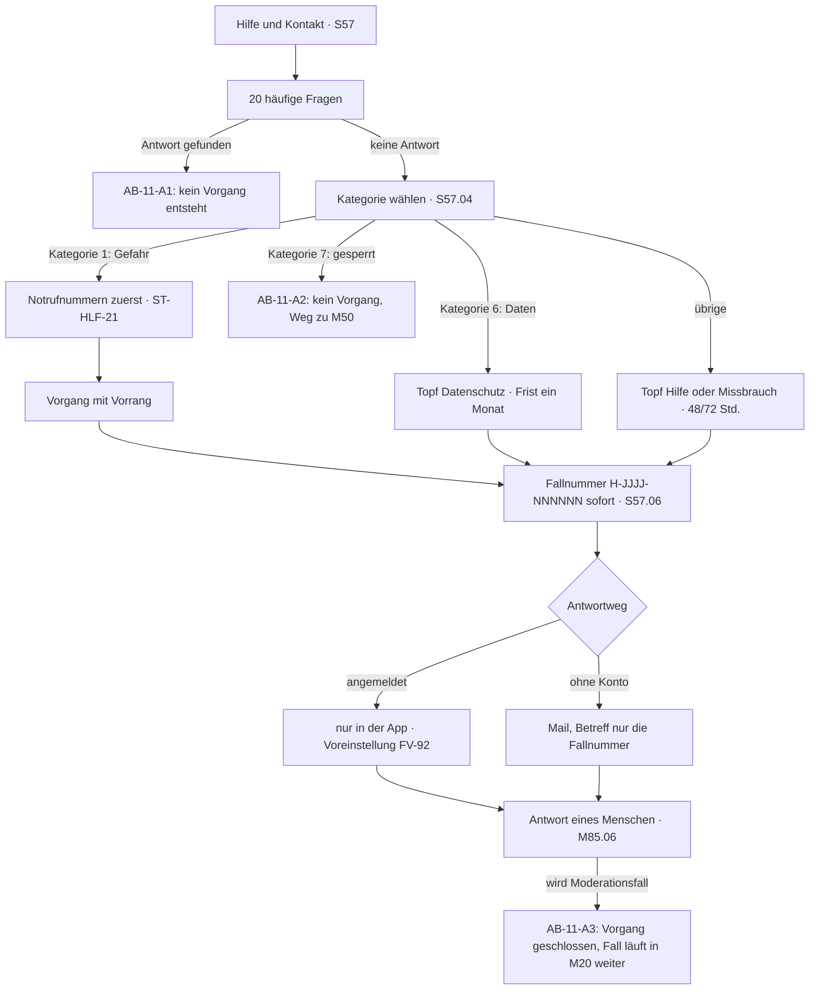

**Die Schritte**

| # | Was die Person sieht | Was das System tut | Abbruch oder Fehler |
|---|---|---|---|
| 1 | „Hilfe und Kontakt“ im Reiter „Ich“, im Sicherheitszentrum und im Bezahlbereich. | Der Aufruf aus mehreren Orten verletzt Prinzip 7 nicht (FV-05). | — |
| 2 | Zwanzig häufige Fragen, ausgeschrieben beantwortet. | Nichts wird gespeichert; das Lesen erzeugt keinen Vorgang. | AB-11-A1 |
| 3 | Eine von zehn Kategorien wählen (S57.04). | Die Kategorie bestimmt Topf und Frist (F75, Abschnitt 2.3). | — |
| 4 | Bei „Jemand ist in Gefahr“: zuerst Notrufnummern und der Satz, dass wir kein Notdienst sind (ST-HLF-21). | Der Vorgang bekommt Vorrang vor allen Töpfen und läuft ohne Fristrechnung (M85, Zustände). | — |
| 5 | Bei „Mein Konto wurde eingeschränkt“: Weiterleitung zum Einspruch. | **Es entsteht kein Vorgang** (AK-F75-07) — sonst liefen zwei Verfahren mit zwei Fristen nebeneinander. | AB-11-A2 |
| 6 | Beschreibung schreiben, freiwillig ein Bild anhängen. | Ein Anhang läuft durch dieselbe Prüfkette wie jedes andere Bild (M-02). | — |
| 7 | Antwortweg wählen: „nur in der App“ (voreingestellt) oder eine Adresse. | Ohne Konto ist „nur in der App“ nicht möglich; das Formular sagt das vorher (ST-HLF-22). | — |
| 8 | Die Fallnummer erscheint sofort, ohne weiteren Schritt (AK-F75-01). | Format `H-JJJJ-NNNNNN` ohne genaues Datum, ohne Kontokennung, ohne Kategorie (FV-91). | — |
| 9 | Der Stand ist in der App einsehbar: eingegangen, in Bearbeitung, beantwortet, geschlossen. | Die Restfrist bestimmt die Sortierung in M85 — nicht der Eingang. | — |
| 10 | Die Antwort kommt von einem Menschen. | Vorlagen sind immer bearbeitbar und werden nie automatisch versandt (M85.06). | — |
| 11 | Geht eine Mail hinaus, nennt der Betreff nur die Fallnummer. | Dieselbe Outing-Überlegung wie bei **Nr. 46** (FV-92, AK-F75-05). Ohne Konto wird der Vorgang nach Antwort und Frist vollständig gelöscht (D17). | AB-11-A4 |
| 12 | Wird aus dem Vorgang ein Moderationsfall, sagt das die Antwort. | Der Vorgang wird geschlossen und verweist auf den Fall (M85.07). | AB-11-A3 |

**Abbruchfälle**

- **AB-11-A1 · Die Antwort steht schon in den zwanzig Fragen** — Die Person findet ihre Frage beantwortet → Kein Vorgang. Das ist der Erfolgsfall, nicht der Ausfall — jede beantwortete Frage ist ein Vorgang, der nicht entsteht.
- **AB-11-A2 · „Mein Konto wurde eingeschränkt“** — Die Person wählt Kategorie 7 → Kein Vorgang, Weiterleitung zum Einspruch (M50); dessen Fristen gelten (AK-F75-07).
- **AB-11-A3 · Der Vorgang wird zum Moderationsfall** — Die Beschreibung betrifft Missbrauch → Der Vorgang wird geschlossen, der Fall läuft in M20 weiter; die Person bekommt beide Nummern (M85.07).
- **AB-11-A4 · Vorgang ohne Konto ist erledigt** — Frist abgelaufen und beantwortet → Vollständige Löschung, einschließlich der Adresse (D17).

**Die drei Stellen, an denen dieser Ablauf in vergleichbaren Apps scheitert**

| Stelle | Wie es dort schiefgeht | Was hier dagegen steht |
|---|---|---|
| Hilfe nur mit Konto | Das Hilfeformular steht hinter der Anmeldung — wer ausgesperrt ist, erreicht niemanden. | Dieser Ablauf hat keine Vorbedingung; das Formular steht auch auf der Webseite, ohne Konto (F75). |
| Die Maschine als Mauer | Automatische Antworten, die wie Menschen klingen, und kein Weg zu einem Menschen. | Antworten kommen von Menschen; Vorlagen werden nie automatisch versandt (M85.06), und eine menschenähnliche Automatikantwort gibt es nicht (Moderations-Backend, Abschnitt 13). |
| Die Antwortmail outet | Ein Betreff wie „Dein Konto bei …“ im gemeinsam gelesenen Postfach. | Antwort nur in der App ist voreingestellt; geht doch eine Mail hinaus, nennt der Betreff nur die Fallnummer (FV-92). |

**Offene Punkte**

- Die Bildschirmnummer: Bis zum 21.09.2026 stand hier S52 — das ist der Check-in. „Hilfe und Kontakt“ wird in A-15 als **S57** neu angelegt (Spezifikation 16.3).
- Die zwanzig Antworten sind Entwürfe (`kontaktservice-und-tickets.md`, Abschnitt 2.1).

**Was dieser Ablauf über das Produkt sagt**

Er ist der einzige Ablauf im ganzen Dokument, der **ohne Vorbedingung** funktioniert. Alle anderen setzen ein Konto voraus, und AB-10 endet ohne ihn in einer Sackgasse. Das ist kein Nebeneffekt: Ein Produkt, das Menschen schützt, muss erreichbar sein, gerade wenn an ihrem Konto etwas nicht stimmt.

---

## 13 · Wechselwirkungen

Handbuch A verlangt unter „Nicht verhandelbar“ drei Wechselwirkungstests. Die Spezifikation führt sie als X-01 bis X-03 und hat 19 weitere gefunden. Hier steht, **in welchem Ablauf** sie sichtbar werden — geprüft wird gegen die Kriterien der Spezifikation, Abschnitt 14.

### 13.1 Die drei aus Handbuch A

| Wechselwirkung | Wo sie im Ablauf auftaucht | Was dabei gilt |
|---|---|---|
| **X-01** Archiv × verfallende Chats | AB-05, Schritt 8 | Die kürzere Frist gewinnt: `P-VERFALL` vor `P-ARCHIV`. Eine Wiedereröffnung holt verfallene Nachrichten nicht zurück. |
| **X-02** Blockieren × Archiv | AB-05-A3 und AB-07, Schritt 7 | Blockieren schlägt Archiv: Das Gespräch verschwindet sofort und lässt sich nicht wieder öffnen. |
| **X-03** Eisbrecher × Antwortquote | AB-04, Schritt 3 | Eine Erstnachricht mit Eisbrecher zählt wie jede andere; wer viele sendet, verändert damit seine eigene Quote nicht. |

### 13.2 Die weiteren, sortiert nach Ablauf

| Ablauf | Wechselwirkungen aus der Spezifikation |
|---|---|
| AB-03 Altersprüfung | X-14 (Nur Verifizierte × Erstkontakt-Verlangsamung) · X-15 (Erstkontakt nur Text × Stufe 2) |
| AB-04 Erstkontakt bis Treffen | X-08 (Blockieren × Check-in und Treffpunkt) · X-12 (Standortzonen × Karte, Wochenaktive, Gastmodus, Treffpunkt) · X-17 (Standortstufe „Aus“) |
| AB-05 Ausstieg | X-04 (Höflicher Ausstieg × Antwortquote) · X-11 (Verfallende Nachrichten × Meldung) |
| AB-06 Melden | X-09 (Kontolöschung × Meldungen und Fälle) · X-11 · X-22 (Hash-Treffer × Kontolöschung) |
| AB-07 Blockieren | X-05 (Blockieren × Antwortquote) · X-06 (Ereignisse und Gruppen) · X-07 (Freischaltung, Album, Ortsfreigabe) · X-08 |
| AB-08 Abo | X-10 (Kontolöschung × Abo) |
| AB-09 Datenkonto | X-09 · X-10 · X-22 |
| AB-01 Erstinstallation | X-18 (Antwortquote aus × Sortierung) · X-19 (Geschlechtsidentität × Wen ich sehen möchte) |
| später (Phase 2) | X-13 (Text-Verschlüsselung × Melden, Export, Verfall) · X-20 (Ortsfreigabe × Standortunschärfe) · X-21 (Reiseankündigung × Standortzonen) |

### 13.3 Was dabei auffällt

- **Blockieren ist die Wechselwirkung mit den meisten Enden.** Sechs der 22 Einträge hängen daran; deshalb beschreibt AB-07 nicht nur die Sperre, sondern auch, was gleichzeitig endet.
- **Löschung und Fall ziehen in verschiedene Richtungen.** Die Löschpflicht (F68) und die Beweissicherung im Fall (M-03) sind in X-09 und X-22 aufgelöst: Fallinhalte überleben die Löschung, sonst nichts.
- **Die Antwortquote berührt vier Abläufe** (X-03, X-04, X-05, X-18) und kommt trotzdem erst in Phase 1c — bis dahin bleibt an ihrer Stelle ein Platzhalter (F19).
- **X-16 (Schnellverstecken × Mitteilungen)** betrifft keinen der elf Abläufe, sondern den Zustand dazwischen: Eine Mitteilung darf die getarnte App nicht verraten.

---

## 14 · Alle Abbruchfälle auf einen Blick

Das Abnahmekriterium der Aufgabe lautet: Zu jedem Ablauf existiert mindestens ein beschriebener Abbruchfall mit Systemantwort. Die Prüfung dazu läuft im Bauskript (Abschnitt 17).

| ID | Ablauf | Auslöser | Was das System tut |
|---|---|---|---|
| **AB-01-A1** | AB-01 | Der Code kommt nicht an (E-Mail oder SMS) | Der Bildschirm nennt den Spam-Ordner und „Neu senden“ und sagt: Kommt kein Code, gibt es vielleicht schon ein Konto — dann anmelden. An bestehende Adressen geht keine E-Mail hinaus, weil die Person sie nicht selbst angestoßen hat (FV-13). |
| **AB-01-A2** | AB-01 | Code falsch oder abgelaufen | Meldung im Dreiermuster „Was ist passiert · Warum · Was jetzt“ und ein neuer Code; das vorläufige Konto verfällt nach `P-KONTO-VORLAEUFIG` (ST-FEH-02). |
| **AB-01-A3** | AB-01 | „Nicht einwilligen“ | Ohne Einwilligung entsteht kein Konto: Der Server speichert außer den Anmeldedaten nichts und löscht auch diese (AK-Q09-01). Die App erklärt das und führt zurück in den Gastmodus (A-15, S04.07). |
| **AB-01-A4** | AB-01 | Standort abgelehnt oder vom Browser blockiert | Stadtwahl statt Entfernungsbändern (ST-REC-05, ST-REC-06); die Person selbst erscheint dann in keinem Raster (FV-39). Das Raster bleibt nie leer, es zeigt Ersatzinhalte (F29). |
| **AB-01-A5** | AB-01 | Alter oder vier Sätze abgebrochen | Nichts wird gespeichert und nichts gesendet; die Nachricht bleibt als Entwurf auf dem Gerät (ST-FEH-40). Seit **Nr. 64** lässt sich Schritt A nicht mehr auf „Später“ schieben: „Später“ schließt den Ablauf, gesendet wird nichts. |
| **AB-01-A6** | AB-01 | Die erste Nachricht wird zurückgehalten | Beim Absender steht „nicht zugestellt“ mit einem Tipp auf den Erklärbildschirm (S34.07, ST-VER-01 bis ST-VER-05). Die Nachricht bleibt `P-HALTEN` liegen und wird nach bestandener Prüfung zugestellt, sonst gelöscht (FV-21). |
| **AB-01-A7** | AB-01 | Das erste Foto wird abgelehnt | Der Status in S23.06 nennt Grund und Bildbereich, dazu den Weg zum Einspruch; bis dahin zeigt das Profil die farbige Initiale (ST-FEH-12, M-06). |
| **AB-02-A1** | AB-02 | Kein Standort und keine Stadt | Hinweis ST-REC-05 und Ersatzinhalte nach F29 statt eines leeren Rasters; „Konto anlegen“ bleibt erreichbar. |
| **AB-02-A2** | AB-02 | Keine Verbindung | Offline-Leiste ST-FEH-01 über dem Inhalt; „Konto anlegen“ bleibt bedienbar, die Gastzeit läuft weiter (AK-RA-06). |
| **AB-02-A3** | AB-02 | Zu viele Gastsitzungen aus einem Netz | Vorübergehend kein Gastzugang, mit Verweis auf „Konto anlegen“ — ohne Vorwurf und ohne Zeitangabe, die sich ausnutzen ließe (FV-12). |
| **AB-02-A4** | AB-02 | Die Person kommt gleich wieder | Eine neue Gastsitzung ist erst nach `P-GAST-PAUSE` möglich; die Begrenzung je Netzadresse greift unabhängig davon (F01). |
| **AB-03-A1** | AB-03 | Prüfpartner nicht erreichbar | ST-FEH-42 mit dem Angebot, es später zu versuchen. Seit Nr. 64 bleibt die Nachricht Entwurf; bei Stufe 2 bleibt es beim Zustand „nur Stufe 1“ (Nr. 64). |
| **AB-03-A2** | AB-03 | Kamera verweigert, zu dunkel, kein Gesicht erkannt | ST-FEH-41 und sofort das Angebot eines anderen Weges — die Prüfung endet nie in einer Sackgasse (FV-15). |
| **AB-03-A3** | AB-03 | Schritt B abgebrochen | Nichts wird gespeichert, nichts gesendet und nichts gebucht. Beim nächsten Versuch beginnt Schritt B erneut (F05). |
| **AB-03-A4** | AB-03 | Stufe 2 abgebrochen | ST-VER-42: Alles andere funktioniert weiter, nur Bilder in Zone 2 bleiben geschlossen. Der Zustand heißt „nur Stufe 1“ und ist jederzeit nachholbar (FV-86). |
| **AB-03-A5** | AB-03 | Ergebnis „nicht volljährig“ | ST-VER-13 erklärt die Sperre, ST-VER-14 nennt eine Anlaufstelle. Das Konto wird gesperrt und ohne Karenz gelöscht (FV-17); ein Verweis auf den Ausweis unterbleibt, wenn genau dieser Weg die Ablehnung ergeben hat (Abschnitt 16.3). |
| **AB-03-A6** | AB-03 | Die Rückmeldung bleibt aus | Der Zustand „Prüfung läuft“ bleibt sichtbar, danach ST-FEH-41 und ein neuer Versuch. Doppelte oder falsch signierte Rückmeldungen werden verworfen (F04). |
| **AB-04-A1** | AB-04 | Die Anfrage bleibt unbeantwortet | Die Nachricht bleibt liegen; es gibt keine Lesebestätigung, keinen „gesehen“-Hinweis und keine Erinnerung an die Gegenseite (Streichliste 13, F42). |
| **AB-04-A2** | AB-04 | Bild vor der ersten Antwort | Der Knopf ist aus, ein Tipp erklärt es (ST-FEH-30); ein Versuch über die Schnittstelle wird abgewiesen und ohne Inhalt protokolliert (F43). |
| **AB-04-A3** | AB-04 | Keine Rückmeldung nach dem Treffen | Es tritt genau die vorher eingestellte Wirkung ein und keine andere: nichts, oder die Nachricht an die Vertrauenspersonen (AK-F55-10, AK-F55-11). Kein Text verspricht mehr, als gebaut ist (AK-F55-07). |
| **AB-04-A4** | AB-04 | Mitteilungen sind aus | Die Frage steht beim nächsten Öffnen im Mitteilungsbereich (Z-01, S55), die Fristen laufen trotzdem; die Zahl ungelesener Mitteilungen steht im Reiter „Ich“ (S50.02). |
| **AB-04-A5** | AB-04 | Das Treffen läuft schlecht | Ohne weiteren Tipp der Hilfe-Bildschirm: Vertrauenspersonen mit „Jetzt informieren“, 110, nora, Verhaltenshinweise, Melden und Blockieren (ST-CHK-10 bis ST-CHK-13). Melden führt nach AB-06, Blockieren nach AB-07. |
| **AB-04-A6** | AB-04 | Kein Ort in der Nähe | ST-LEER-21 statt einer leeren Liste; eine freie Adresse lässt sich trotzdem eintragen (F56, S52.03). |
| **AB-04-A7** | AB-04 | Das Telefon ist aus oder ohne Netz | In der Voreinstellung geht die Nachricht nicht hinaus (ST-CHK-16). Mit eingeschaltetem „Hinterlegen“ geht sie hinaus — **Nr. 83 (b), entschieden 26.09.2026**; die Nachricht liegt dafür für die Dauer des laufenden Check-ins verschlüsselt bei uns. |
| **AB-04-A8** | AB-04 | Keine Vertrauensperson hinterlegt | ST-CHK-14 statt einer leeren Liste; Notruf und Hinweise sind da, und „Meine Vertrauenspersonen benachrichtigen“ ist als Wirkung nicht wählbar (F55). |
| **AB-05-A1** | AB-05 | Offline beim Absagen | Die Absage wartet im Ausgang (ST-LEER-31) und geht mit der Verbindung hinaus; das Gespräch gilt auf dem Gerät schon als beendet (F45). |
| **AB-05-A2** | AB-05 | Rückgängig innerhalb von fünf Sekunden | Es wird nichts gesendet und nichts archiviert; das Gespräch steht unverändert da (ST-CHAT-11). |
| **AB-05-A3** | AB-05 | Blockierung während der Archivzeit | Das Gespräch verschwindet sofort aus dem Archiv und lässt sich nicht wieder öffnen (X-02, F61). |
| **AB-05-A4** | AB-05 | Meldung aus dem Archiv | Das geht, solange das Gespräch dort liegt; die gemeldeten Inhalte bleiben als Kopie im Fall, auch nach Ablauf der Archivfrist (M-03, X-11). |
| **AB-06-A1** | AB-06 | Offline beim Absenden | Die Meldung wartet im Ausgang und geht mit der Verbindung hinaus; die Fallnummer kommt danach (F62). |
| **AB-06-A2** | AB-06 | Die gemeldeten Inhalte verschwinden | Im Fall bleibt die Kopie der markierten Inhalte; sie überlebt Verfall und Löschung (M-03, X-11). |
| **AB-06-A3** | AB-06 | Das gemeldete Konto gibt es nicht mehr | Der Fall wird trotzdem angelegt und geprüft; die Entscheidung erreicht die Person nicht mehr, weil ihr Mitteilungsbereich mit dem Konto gelöscht ist (F68, Z-01). |
| **AB-06-A4** | AB-06 | Meldung ohne Konto | Das Formular erhebt die Angaben nach Art. 16 Abs. 2 DSA und gibt eine Fallnummer aus; die Rückmeldung geht an die dort angegebene Adresse (FV-72). |
| **AB-06-A5** | AB-06 | Die Frist droht abzulaufen | Das Werkzeug markiert ihn als dringend; wird die Frist überschritten, steht das im Fall und in der Monatsauswertung (M-05). |
| **AB-06-A6** | AB-06 | Widerspruch gegen die Entscheidung | Die Bestätigung nennt die geltende Frist; entschieden wird von einem Menschen, möglichst nicht von derselben Person (M-07). |
| **AB-07-A1** | AB-07 | Offline beim Blockieren | Die Blockierung wirkt auf dem Gerät sofort und wird nachgereicht, sobald Verbindung besteht (F61). |
| **AB-07-A2** | AB-07 | Rücknahme zu spät | Die Rücknahme ist nicht mehr möglich; der Eintrag in S72 sagt das vorher, mit Datum (FV-71). |
| **AB-07-A3** | AB-07 | Die blockierte Person legt ein neues Konto an | Das wird im MVP nicht erkannt. Die Warnung bei Kontowiederkehr kommt erst in Phase 2 und nur für gesperrte Konten (F67). |
| **AB-07-A4** | AB-07 | Beide sind in derselben Ereignisgruppe | Ihre Nachrichten sind füreinander unsichtbar; niemand wird aus der Gruppe entfernt, und niemand erfährt den Grund (F33). |
| **AB-08-A1** | AB-08 | Zahlung fehlgeschlagen | ST-FEH-50 im Dreiermuster; es wird nichts freigeschaltet und nichts abgebucht, der Kaufbildschirm bleibt offen (Z-05). |
| **AB-08-A2** | AB-08 | Kündigen ohne Verbindung | Die Kündigung lässt sich nicht absenden; die App sagt das offen (ST-FEH-01), statt eine Bestätigung zu zeigen, die nirgends ankommt. |
| **AB-08-A3** | AB-08 | Die Bestätigung des Stores bleibt aus | Der Zustand „Kauf wird geprüft“ mit ST-FEH-51; die Leistung bleibt gesperrt, bis die Bestätigung da ist (Z-05). |
| **AB-08-A4** | AB-08 | Konto wird während des Abos gelöscht | Das Web-Abo endet mit der Löschung. Ein Store-Abo läuft weiter, bis es im Store gekündigt wird — darauf weist ST-DAT-16 vor der Löschung hin (F68). |
| **AB-09-A1** | AB-09 | Export fehlgeschlagen | ST-FEH-60 und ein automatischer neuer Versuch; die Person muss nichts tun (F68). |
| **AB-09-A2** | AB-09 | Das Export-Passwort ist weg | Die Datei bleibt verschlüsselt und lässt sich nicht öffnen — niemand kann sie aufschließen. Ein neuer Export ist jederzeit möglich (FV-76). |
| **AB-09-A3** | AB-09 | Offene Meldefälle bei der Löschung | Der Fall läuft weiter; nach der Löschung erfährt die Person das Ergebnis nicht mehr, weil ihr Mitteilungsbereich gelöscht ist (F68, Z-01). |
| **AB-09-A4** | AB-09 | Store-Abo bei der Löschung | ST-DAT-16 sagt vor der Löschung, dass das Abo dort weiterläuft und im Store gekündigt werden muss (AB-08). |
| **AB-09-A5** | AB-09 | Einwilligung widerrufen statt löschen | Die App erklärt die Folge: Ohne Einwilligung ist kein Profil möglich, der Widerruf startet die Löschung wie F68; das Profil ist sofort unsichtbar. Ob eine Karenz dabei zulässig ist, prüft der Anwalt (⚠ W-05, AF-10). |
| **AB-10-A1** | AB-10 | Jemand Fremdes fordert ein neues Passwort an | Das Konto bleibt unverändert; es geht höchstens eine E-Mail je `P-RESET-SPERRE` hinaus, und sie erklärt, dass niemand ohne Zugriff auf das Postfach etwas ändern kann (ST-KON-31, AK-F02-07). |
| **AB-10-A2** | AB-10 | Das E-Mail-Postfach ist verloren | Die App bietet die Wege, die die Person eingerichtet hat: Code, zweiter Anmeldeweg, Vertrauenspersonen, Zahlungsbeleg (Z-09). Hat sie keinen, sagt die App das ohne Umschweife (ST-WHR-01, AK-Z09-06). |
| **AB-10-A3** | AB-10 | Die Apple-Verbindung ist getrennt | Dieselben Wege wie bei AB-10-A2 (Z-09). Hat die Person keinen davon, endet der Zugang, und die App sagt es offen (**Nr. 69**, F03). |
| **AB-10-A4** | AB-10 | Ein fremdes Gerät ist noch angemeldet | Gelöst durch FV-94: Jede Wiederherstellung und jedes neue Passwort beenden alle anderen Sitzungen. |
| **AB-10-A5** | AB-10 | Anmeldung während der Löschkarenz | Der Countdown (ST-DAT-13) und die Schaltfläche ST-DAT-14 stehen auf allen Bildschirmen; erst nach dem Abbruch ist das Profil wieder sichtbar (ST-DAT-15, FV-77). |
| **AB-11-A1** | AB-11 | Die Antwort steht schon in den zwanzig Fragen | Kein Vorgang — der Erfolgsfall, nicht der Ausfall. |
| **AB-11-A2** | AB-11 | „Mein Konto wurde eingeschränkt“ | Kein Vorgang, Weiterleitung zum Einspruch (M50); dessen Fristen gelten (AK-F75-07). |
| **AB-11-A3** | AB-11 | Der Vorgang wird zum Moderationsfall | Vorgang geschlossen, Fall läuft in M20 weiter; die Person bekommt beide Nummern (M85.07). |
| **AB-11-A4** | AB-11 | Vorgang ohne Konto ist erledigt | Vollständige Löschung, einschließlich der Adresse (D17). |

---

## 15 · Offene Punkte aus diesen Abläufen

**Neu aus diesem Dokument:**

- ~~**Nr. 69 · Wiederherstellung des Zugangs.**~~ **Entschieden am 21.09.2026:** Code für alle, zweiter Anmeldeweg, Vertrauenspersonen und Zahlungsbeleg freiwillig, keine Passkeys; ein neues Passwort beendet alle anderen Sitzungen (FV-94). Offen daraus: **Nr. 86** (Vertrauenspersonen über einen geteilten Schlüssel).
- **Zwei Texte, eine ID:** ST-KON-03 dient in der Spezifikation sowohl dem Hinweis beim Tipp auf eine Gastkachel als auch dem Ende der Gastzeit. Bei der Überarbeitung von A-14 werden daraus zwei Texte (AB-02).
- ~~**Fehlende Texte in A-14**~~ **seit dem 21.09.2026 vorhanden:** der verlorene Zugang (ST-WHR-01 bis ST-WHR-05) und der Check-in (ST-CHK-01 bis ST-CHK-16; ST-SIC-12 entfällt).
- **Neu am 21.09.2026:** Nr. 83 und Nr. 84 (AB-04); die Bildschirmnummer von „Hilfe und Kontakt“ (AB-11, S57 statt S52).
- **Fortgeschrieben am 26.09.2026 (A-65):** Nr. 83, 84 und 86 sind entschieden; AB-04-A7 und AB-10 folgen den Beschlüssen. Neu offen ist **Nr. 95** (Schutz der Wiederherstellung bei Schwelle 1) — bis dahin wird der Weg über Vertrauenspersonen nicht gebaut.

**Schon bekannt, hier bestätigt:**

| Nummer | Wirkt auf | Was bis zur Entscheidung gebaut wird |
|---|---|---|
| **Nr. 64** | AB-01, AB-03 | *Entschieden am 19.09.2026:* Schranke vor Schreiben und Buchen; F08 und F57 folgen nach Nr. 40 |
| ~~**Nr. 66**~~ | AB-04 | **entschieden 21.09.2026** — gebaut wird der Ablauf aus Nr. 66; ~~offen bleiben Nr. 83 und Nr. 84~~ **beide am 26.09.2026 entschieden** |
| **Nr. 67** | AB-08 | Kaufbildschirm ohne Leistungsliste — Platzhalter, bis der am 21.09.2026 vorgeschlagene Zuschnitt bestätigt ist |
| **Nr. 49** | AB-08 | Bestätigung in Textform im Mitteilungsbereich; die Vorauswahl der Laufzeit ist seit **Nr. 50** (19.09.2026) entschieden |
| **Nr. 40, Nr. 1, Nr. 39** | AB-03, AB-04 | Stufe 2 mit Wegen 0 bis 4 und Rückfallweg |
| **Nr. 30, Nr. 31** | AB-06 | Beide Schalterstellungen für Zone 2; beide Stellungen bei Hash-Treffern |
| **Nr. 47** | AB-01 | *Entschieden am 19.09.2026:* beide Plattformen; im Web die schwächere Fassung mit offen benannter Grenze |
| **Nr. 13** | AB-01 | Taxonomie-Texte als Platzhalter |

---

## 16 · Was dieses Dokument nicht ist

- **Keine Spezifikation.** Was eine Funktion leistet, steht in `produktspezifikation.md`; hier steht nur die Reihenfolge und das Verhalten an den Bruchstellen.
- **Kein Gestaltungsdokument.** Wie ein Bildschirm aussieht, beschreibt A-15; die Texte stehen in A-14.
- **Keine Entscheidung.** Offene Punkte bleiben offen und tragen ihre Nummer.
- **Keine Messung.** Die Stolperstellen sind Erfahrungsmuster aus vergleichbaren Apps, keine erhobenen Daten. Was wirklich bricht, zeigen der Prototyptest und die Beta.
- **Keine Abläufe für die Moderationsseite.** Das interne Werkzeug beschreibt A-41; hier steht nur, was die beiden beteiligten Personen davon sehen.
- **Nicht vollständig für Phase 2 und 3.** Abläufe für Reiseankündigung, Ortsfreigabe, Ortskanäle und Veranstalterportal entstehen, wenn diese Funktionen anstehen.

---

## 17 · Prüfprotokoll

Programmatisch geprüft am 17.09.2026 mit dem Bauskript dieses Dokuments.

| Prüfung | Ergebnis |
|---|---|
| Abläufe mit mindestens einem Abbruchfall samt Systemantwort | 10 von 10 |
| Abbruchfälle insgesamt, jeder in einer Schrittzeile oder im Diagramm genannt | 51 |
| Stolperstellen: genau drei je Ablauf | 30 |
| Text-IDs aus A-14 verwendet und vorhanden | alle |
| Bildschirme und Anker aus A-15 verwendet und vorhanden | alle |
| Verweise auf Einträge, Festlegungen, Widersprüche und Parameter der Spezifikation | alle vorhanden |
| Verweise auf Entscheidungen in `offene-entscheidungen.md` | alle vorhanden |
| Mermaid-Diagramme fehlerfrei erzeugt | 10 von 10 |

**Nachprüfung am 21.09.2026** — nach AB-11 (20.09.2026) und dem Check-in nach Nr. 66, mit einem Prüfskript nach denselben Regeln:

| Prüfung | Ergebnis |
|---|---|
| Abläufe mit mindestens einem Abbruchfall samt Systemantwort | 11 von 11 |
| Abbruchfälle insgesamt, jeder in einer Schrittzeile oder im Diagramm genannt, alle in Abschnitt 14 | 57 |
| Schritte insgesamt | 112 |
| Stolperstellen: genau drei je Ablauf | 33 |
| Text-IDs aus A-14 verwendet und vorhanden | alle |
| Bildschirme und Anker aus A-15 verwendet und vorhanden | alle bis auf **S57** („Hilfe und Kontakt“) — neu anzulegen, geführt in der Spezifikation, Abschnitt 16.3 |
| Verweise auf Einträge, Festlegungen, Widersprüche, Parameter und Backend-Bildschirme | alle vorhanden |
| Verweise auf Entscheidungen in `offene-entscheidungen.md` | alle vorhanden |
| Mermaid-Diagramme fehlerfrei erzeugt | 11 von 11 |

**Dabei behoben:** AB-11 nutzte seit dem 20.09.2026 die Nummer S52 — die gehört dem Check-in. AB-11 hatte weder die drei Stolperstellen noch einen Eintrag in Abschnitt 14, und AB-04 verwies noch auf die entfallenen Parameter P-CHECKIN-NACHFRAGE und P-CHECKIN-ESKALATION. Die Kopfzahlen standen seit dem 20.09.2026 auf dem Stand vom 17.09.2026.

**Nachgezogen am 22.09.2026 (Abgleich mit allen Beschlüssen):** Nr. 64 (keine aufschiebbare Prüfung, Schranke auch vor dem Buchen; F08 und AB-01-A6 ruhen bis Nr. 40), Nr. 47 (beide Plattformen), Nr. 50 (Jahresabo vorausgewählt) und Nr. 5 (Arbeitstitel Cruizy). Schritte, Abbruchfälle und Stolperstellen bleiben bei 112, 57 und 33.

**Was die Prüfung nicht leistet:** Sie prüft Vollständigkeit und Verweise, nicht Wahrheit. Ob ein Ablauf sich richtig anfühlt, zeigt erst der Prototyptest mit Menschen aus der Zielgruppe.

---

## Quellen

- `00-grundlagen/handbuch-a-produkt-technik-recht.html` — Funktionskatalog, Streichliste, Mikro-UX, „Nicht verhandelbar“, Bauplan
- `50-produkt-prototyp/produktspezifikation.md` (A-29) — Einträge, Festlegungen, Parameter, Wechselwirkungen
- `50-produkt-prototyp/moderationsarchitektur.md` (A-37) — Zonen, Prüfkette, Fristen, Zugriffsregeln
- `50-produkt-prototyp/systemtexte-ENTWURF.md` (A-14) — alle Text-IDs
- `50-produkt-prototyp/wireframes-textspezifikation.md` (A-15) — alle Bildschirme und Anker
- `01-steuerung/offene-entscheidungen.md` — Nr. 1, 5, 13, 30, 31, 39, 40, 46, 47, 49, 50, 64, 66, 67, 69, 75, 79, 83, 84, 86
- `30-marketing-kanaele/krisenkommunikation-vorlagen.md` (A-18) — Mitteilungsbereich und Statusseite
- Rechtsgrundlagen im Wortlaut: Art. 9, 15, 17, 20, 22, 34 DSGVO · Art. 16, 17, 18 DSA · § 312j, § 312k, § 309 Nr. 9 BGB · § 25 TDDDG
