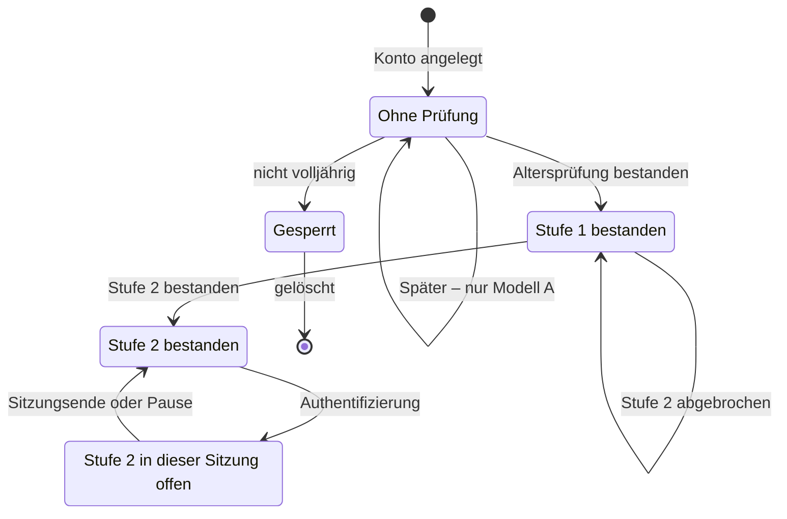

# Produktspezifikation — der Funktionskatalog als prüfbare Fassung

> ## ⚠ VORFASSUNG — vor den Interviews
>
> **Zweck:** Gegen dieses Dokument soll ab T0 entwickelt und getestet werden können, ohne dass jemand Handbuch A gelesen hat. Jede Funktion hat Zweck, Auslöser, Vorbedingungen, Ablauf, Nachbedingungen, Fehler- und Randfälle, betroffene Daten, Rechtsbezug, Abhängigkeiten und Akzeptanzkriterien in der Form „Wenn … dann …“.
>
> **Zeitplan-Regel:** Was von den Interviews abhängt, wird vor den Interviews nicht finalisiert. Solche Stellen tragen die Marke **[A-19]**; die Überarbeitung folgt nach der Auswertung und dem Prototyptest.
>
> **Wahrheitsquelle bleibt Handbuch A.** Wo es schweigt, trifft diese Vorfassung eine **Festlegung (FV)**, die gilt, bis die Gründer anders entscheiden (Entscheidung Nr. 68). Wo sich Quellen widersprechen, steht **⚠ W-nn** mit Fundstelle — nichts davon ist stillschweigend aufgelöst.
>
> Produktname: **Cruizy** — seit Nr. 5 (19.09.2026) als Arbeitstitel ausgeschrieben statt als Platzhalter; endgültig entscheidet sich der Name nach den Interviews.

Erstellt: 17.09.2026 · Aufgabe A-29 · Rolle: Produktarchitekt · Fenster **V2**, als Vorfassung vorgezogen
Grundlagen: Handbuch A (vollständig) · Handbuch B (Erlöse, Abonnements, Feedbackwege) · `moderationsarchitektur.md` (A-37, **verbindlich übernommen**) · `systemtexte-ENTWURF.md` (A-14) · `wireframes-textspezifikation.md` (A-15) · `../70-entwicklung-ab-monat-4/code-planer.md` und `../02-ki-aufgaben/aufgaben-entwicklung.md` · `../30-marketing-kanaele/krisenkommunikation-vorlagen.md` (A-18) · `../40-finanzen-foerderung/kapitalbedarf-gegenrechnung.md` (A-13) · `../40-finanzen-foerderung/crowdfunding/crowdfunding-konzept.md` (A-21) · `../10-recht-gruendung/jmstv-problem-und-einschaetzung.md` · `../01-steuerung/wettbewerbsbeobachtung-log.md` (R-01) · `../01-steuerung/offene-entscheidungen.md`
Gehört zu: A-30 (Nutzerabläufe) · A-36 (Trefferprozess) · A-40 (Eisbrecher) · A-41 (Moderations-Backend) · Code: AP-0 bis AP-15, Sitzungen S0 bis S13

---

## Auf einen Blick

- **75 Funktionen** — 74 aus dem Katalog (F01 bis F74) und **F75 „Hilfe und Kontakt“**, neu am 20.09.2026 aus Entscheidung Nr. 75 —, **16 produktweite Anforderungen**, **10 Zusatzanforderungen** (Z-09 Wiederherstellung und Z-10 Mobilnummer kamen am 21.09.2026 hinzu), **10 Moderationsregeln aus A-37** und **22 Wechselwirkungen** — zusammen **674 geltende Akzeptanzkriterien** in der Form „Wenn … dann …“ (am 21.09.2026 neu: 8 zum Check-in, 6 zu den Zonen, 3 zu den Codes, 7 zur Wiederherstellung, 6 zur Mobilnummer; am 22.09.2026 nach Nr. 64 zwei neu und sieben entfallen; am 26.09.2026 nach den Beschlüssen dieses Tages zehn neu und eines entfallen, am 27.09.2026 drei neu zum Übergangszustand des Hash-Abgleichs und vierzehn neu aus den zwölf beantworteten Festlegungen — die entfallenen stehen durchgestrichen mit ihrer Nummer da).
- Die Streichliste steht unverändert als Abschnitt 13, mit einem Prüfkriterium je Eintrag; die Moderationsarchitektur (A-37) ist als Abschnitt 11 übernommen, nicht überschrieben.
- **97 Festlegungen** füllen Lücken, die Handbuch A lässt (FV-91 und FV-92 kamen am 20.09.2026 mit F75 hinzu, FV-93 bis FV-95 am 21.09.2026 mit Codes, Wiederherstellung und Mobilnummer; **FV-96 und FV-97 am 27.09.2026** mit der Bildfreigabe je Person und der Nachlauffrist nach der Kontolöschung); **32 Widersprüche und offene Fragen** sind benannt (W-27 kam am 21.09.2026 hinzu, W-28 bis W-30 am 22.09.2026, **W-31 am 26.09.2026**), keiner ist stillschweigend aufgelöst — W-01, W-14, W-21, W-25, W-27, W-28, W-29 und W-30 sind durch Beschlüsse aufgelöst und so gekennzeichnet; **13 Fragen** gehen an den Fachanwalt. Die Sammelliste aus A-14 (21 Punkte) und die offenen Punkte aus A-15 (29 Punkte) sind vollständig zugeordnet (Abschnitt 16).
- **Programmatisch geprüft** (Abschnitt 20, zuletzt nachgeprüft am 22.09.2026, dazu der Abgleich mit allen Beschlüssen): alle 75 Funktionen genau einmal, jedes Kriterium mit „Wenn … dann“, alle 209 verwendeten Text-IDs vorhanden, alle Verweise auf Bildschirme in A-14 und A-15 vorhanden bis auf den neu anzulegenden Bildschirm S57 „Hilfe und Kontakt“, alle Festlegungen, Widersprüche und 107 Parameter definiert und verwendet. *(Zuletzt nachgeprüft am 27.09.2026 — Abschnitt 20.)*

**Die Befunde, die vor dem Bau entschieden sein müssen:**

1. **„Verifiziert“ hat in Handbuch A zwei mögliche Bedeutungen.** Kann ohne Altersprüfung niemand schreiben, laufen „Nur Verifizierte zulassen“, der Erklärbildschirm und die Grenze für Erstnachrichten ins Leere. Beide Lesarten sind spezifiziert → **Nr. 64**.
2. **Stufe 2 der Altersprüfung muss auch Bilder im Gespräch erfassen**, sonst lässt sich die Schranke umgehen, indem dieselben Bilder direkt geschickt werden. Damit wird die Planungsgröße fraglich, dass nur 35 Prozent der Nutzer Stufe 2 brauchen — und mit ihr der Kapitalbedarf (Nr. 40 ergänzt).
3. **Niemand hat festgelegt, was PLUS und PRO enthalten.** Im Reifezustand sollen 65 Prozent der Erlöse aus Abos kommen (Handbuch B), und die Prinzipien schließen die üblichen Bezahlfunktionen aus → **Nr. 67**.
4. **Der Check-in hat keinen Mechanismus.** Handbuch A sagt nicht, was geschieht, wenn sich jemand nach einem Treffen nicht zurückmeldet. Ein Schutz, der nichts auslöst, darf auch nichts versprechen → **Nr. 66**.
5. **Handbuch B verkauft Orten „Hervorhebung“ und „Vorabplatzierung“; Handbuch A schließt gekaufte Aufmerksamkeit aus** → **Nr. 65**.
6. **Art. 19 DSA nimmt kleine Online-Plattformen vom ganzen Abschnitt 3 des Kapitels III aus** (Art. 20 bis 28, außer Art. 24 Abs. 3) — nicht nur von den vier Pflichten, die Handbuch A nennt. Damit gelten auch das Werbeverbot mit sensiblen Daten (Art. 26 Abs. 3) und der Minderjährigenschutz (Art. 28) zunächst nicht. Die Produktentscheidungen bleiben richtig, stützen sich aber auf DSGVO und JMStV → Nr. 28 ergänzt.
7. **Weitere Lücken:** ein Altersfilter ohne Altersfeld, ein angekündigter Positionsfilter ohne Profilfeld, eine Statusseite, die der Krisenplan früher braucht, als der Katalog sie vorsieht, und ein Meldeweg ohne Konto, den Art. 16 DSA verlangt. Außerdem nennt die Kopfzeile von Handbuch A 46 MVP-Funktionen, der Katalog selbst weist 54 aus.
8. **Alle Festlegungen dieser Vorfassung** gelten, bis die Gründer anders entscheiden → **Nr. 68**.

---

## 0 · Wie man dieses Dokument liest

| Zeichen | Bedeutung |
|---|---|
| `F01` … `F74` | Nummer im Funktionskatalog von Handbuch A (dort ohne führende Null). F74 steht im Katalog zwischen F53 und F54 und hier ebenso. |
| **MVP · 1b** | Stufe laut Katalog; dahinter die Bauphase aus dem Bauplan (1a Fundament · 1b Kernprodukt · 1c Sicherheit, Datenhoheit, „Heute“ · 1d Härten und Beta). Katalogstufe **V2** = Phase 2 (Monat 10–21), **V3** = Phase 3 (ab Monat 22); Monate zählen ab T0. Nicht zu verwechseln mit den Vorbereitungsfenstern V0 bis V4 aus `zeitplan-bis-start.md` — nur das „Fenster V2“ im Kopf dieses Dokuments meint ein solches Fenster. |
| **USP · Arch.** | Marken aus dem Katalog: Alleinstellung · nachträglich nicht einbaubar |
| `AP-n` | Arbeitspaket aus dem Code-Planer |
| **Zitatblock „Handbuch A, Funktionskatalog“** | wörtlicher Katalogtext; er gilt vor jeder Auslegung in diesem Dokument |
| `AK-F04-01` | Akzeptanzkriterium: „Wenn … dann …“. Jedes ist einzeln testbar; „nie“ und „immer“ sind als Testauftrag gemeint. |
| `FV-nn` | Festlegung dieser Vorfassung, wo Handbuch A schweigt — Liste in Abschnitt 18, Bestätigung über Nr. 68 |
| `⚠ W-nn` | Widerspruch oder offene Frage — Register in Abschnitt 17 |
| **[A-19]** | hängt an den Interviews; nicht vor der Auswertung finalisieren |
| `Nr. n` | Eintrag in `01-steuerung/offene-entscheidungen.md` |
| `P-…` | Parameter; alle Werte zentral in Abschnitt 15 |
| **S31 · ST-CHAT-04** | Bildschirm aus A-15 · Text-ID aus A-14. Texte werden dort gepflegt, nicht hier. |
| **[A] / [B]** | Kriterium galt nur in Modell A oder Modell B der Altersschranke (W-01). Seit Nr. 64 (19.09.2026) gibt es keine Modellmarken mehr; entfallene Kriterien stehen durchgestrichen da (4.0) |
| **Zone 1 / 2 / 3** | immer die **Moderationszonen** aus A-37. Die Zonen aus F60 heißen hier **Standortzonen**. |

**Aufbau eines Eintrags:** Kopf mit Stufe, Phase, Arbeitspaket und Marken · wörtlicher Katalogtext · Steckbrief (Zweck, Auslöser, Vorbedingungen, Nachbedingungen, Daten, Recht, Abhängigkeiten, Bildschirme und Texte) · Ablauf in nummerierten Schritten · Fehler- und Randfälle · Akzeptanzkriterien · offene Punkte.

**Was „prüfbar“ hier heißt:** Ein Kriterium beschreibt beobachtbares Verhalten — was der Nutzer sieht, was der Server ausliefert oder speichert, was nicht geschieht. Wo das Verhalten von einer offenen Entscheidung abhängt, ist das Kriterium für beide Stellungen formuliert oder ausdrücklich als „folgt nach Nr. …“ markiert.

---

## 1 · Geltung, Quellenrang, Begriffe

### 1.1 Quellenrang

1. **Handbuch A** — Funktionskatalog, Streichliste, Prinzipien, Mikro-UX, Gestaltungssystem, Rechtsauflagen, „Nicht verhandelbar“, Bauplan, KI-Regeln.
2. **Entschiedene Einträge** in `offene-entscheidungen.md`.
3. **Moderationsarchitektur (A-37)** — für alles, was Prüfung, Sichtbarkeit von Bildern, Meldungen und Zugriffe betrifft. Sie wird in Abschnitt 11 übernommen, nicht überschrieben.
4. **Diese Spezifikation** — Auslegung und Festlegungen (FV).
5. **Systemtexte (A-14) und Wireframes (A-15)** — Vorfassungen für Texte und Bildschirme. Wo sie von dieser Spezifikation abweichen, ist das in Abschnitt 16 oder 17 vermerkt und wird dort korrigiert.

Handbuch B gilt für Wirtschaftliches. Funktionen, die nur Handbuch B oder der Bauplan nennen, stehen in Abschnitt 12.9 und brauchen vor dem Bau eine Katalognummer (W-02).

### 1.2 Begriffe

| Begriff | Bedeutung in diesem Dokument |
|---|---|
| **Gast** | Person ohne Konto im Gastmodus (F01) |
| **Konto** | angelegt mit E-Mail und Passwort oder mit Apple (F02, F03), nach erteilter Einwilligung (Q-09) |
| **Profil** | die für andere sichtbaren Angaben eines Kontos |
| **Altersprüfung, Stufe 1** | Nachweis der Volljährigkeit vor der ersten Nachricht (F04); mehrere Wege |
| **Altersprüfung, Stufe 2** | zusätzliche Prüfung nach dem AVS-Raster der KJM für den privaten expliziten Bereich (Z-03, Nr. 40): einmalige Identifizierung, Authentifizierung vor jeder Nutzung |
| **verifiziert** | ⚠ **mehrdeutig in Handbuch A** (W-01). Modell A: Stufe 1 der Altersprüfung bestanden. Modell B: Fotoprüfung (F06) bestanden. Betrifft F08, F09 und F57; Abschnitt 4.0. |
| **Prüfzeichen** | sichtbares Zeichen nach bestandener Fotoprüfung (F06); nie gleichbedeutend mit „sicher“ |
| **Erstnachricht** | die erste Nachricht in einem Gespräch, das es vorher nicht gab |
| **Anfrage** | ein Gespräch, in dem bisher nur die andere Seite geschrieben hat (Postfach „Anfragen“, F42) |
| **Antwort** | jede Nachricht der angeschriebenen Person im selben Gespräch **oder** ihr höflicher Ausstieg (F45) |
| **Gespräch** | ein Chat zwischen genau zwei Konten (F41); Gruppen gibt es nur als temporäre Ereignisgruppen (F33) |
| **Genauigkeitsstufe** | wie grob der eigene Standort verarbeitet wird (F69, FV-01) |
| **Rasterzelle** | Fläche, auf die ein Standort vor jeder Berechnung gerundet wird (F70, FV-02); ihre Größe folgt aus der Genauigkeitsstufe |
| **Entfernungsband** | genau vier: unter 1 km · 1–3 km · 3–10 km · über 10 km |
| **Aktivitätsband** | genau fünf: jetzt · unter 1 Std. · heute · diese Woche · länger her |
| **Nähe / Ferne** | im Raster sichtbar getrennte Abschnitte (F25); Grenze 10 km (FV-03) |
| **Standortzone** | vom Nutzer gesetzter Bereich, in dem sein Standort anders behandelt wird (F60, Nr. 48) |
| **Moderationszone 1 / 2 / 3** | öffentlich · privat · gemeldet (A-37, Abschnitt 11) |
| **Ort** | Eintrag im Ortsverzeichnis (F31): **vorangelegt** (aus öffentlichen Quellen) oder **beansprucht** (vom Betreiber bestätigt) |
| **Ereignis · Zusage** | Termin an einem Ort (F32) · die Erklärung „Ich komme“ |
| **Mitteilung** | Benachrichtigung des Geräts (Push); standardmäßig ohne Absender und Vorschau |
| **Sicherheitsmitteilung** | Nachricht im Mitteilungsbereich der App (Z-01); ihr Inhalt steht nie in einer E-Mail oder SMS — im Ernstfall geht dorthin nur ein Hinweis ohne Inhalt (Nr. 46) |
| **Fall · Fallnummer** | Vorgang nach einer Meldung, einem Einspruch oder einem Hash-Treffer (F62, A-37) |
| **einschränken · sperren** | Inhalte werden eingeschränkt oder entfernt, **Konten** werden gesperrt (Art. 22 DSGVO trennt beides) |
| **Web-App · native App** | Phase 1 ist ausschließlich eine Web-App (PWA); native Apps folgen in Phase 2 |
| **MAU in der Stadt** | monatlich aktive Konten mit Standort in der jeweiligen Stadt; Auslöser mehrerer Funktionen |

---

## 2 · Produktweite Anforderungen

Diese Anforderungen gelten für jede Funktion. Sie stehen einmal hier und werden in den Einträgen nicht wiederholt.

### Q-01 · Keine dunklen Muster (Prinzip 1)

**Handbuch A:** „Kein künstlicher Mangel, keine Geisterprofile, keine Zähler ohne Einblick, nie ein blockierendes Fenster. Jede Bezahlaufforderung wegwischbar, Wiederholung frühestens nach 30 Tagen.“ Mikro-UX: „Nie blockierend, nie im Chat, höchstens alle 30 Tage je Funktion.“ Haptik „niemals bei Bezahlaufforderungen“.

- **AK-Q01-01** Wenn eine Bezahlaufforderung erscheint, dann lässt sie sich mit einer Wischgeste und mit „Nicht jetzt“ schließen, ohne dass danach ein anderer Bildschirm gesperrt ist.
- **AK-Q01-02** Wenn eine Bezahlaufforderung zu einer Funktion geschlossen wurde, dann erscheint für dieselbe Funktion und dasselbe Konto frühestens nach 30 Tagen eine weitere.
- **AK-Q01-03** Wenn ein Gespräch geöffnet ist, dann enthält kein Element dieses Bildschirms eine Bezahlaufforderung.
- **AK-Q01-04** Wenn eine Bezahlaufforderung angezeigt wird, dann löst das Gerät keine Haptik aus.
- **AK-Q01-05** Wenn Daten in die Produktivumgebung geschrieben werden, dann stammen sie ausschließlich von echten Konten; ein Prüflauf findet keine erzeugten Testprofile (KI-Regeln: „Nie in die Produktivumgebung“).
- **AK-Q01-06** Wenn die App eine Zahl anzeigt, die sich auf andere Personen bezieht, dann kann der Nutzer sehen, was gezählt wird; eine Zahl, deren Auflösung verkauft wird, gibt es nicht (Streichliste).

### Q-02 · Der Standort gehört dem Nutzer (Prinzip 2)

Umgesetzt in F69, F70 und F60. **AK-Q02-01** Wenn ein neues Konto angelegt wird, dann ist die ungenaueste Genauigkeitsstufe voreingestellt.

### Q-03 · Alles Sichtbare ist erklärbar (Prinzip 5)

**Handbuch A:** „Sortierung benannt und umschaltbar. Keine verdeckte Gewichtung.“

- **AK-Q03-01** Wenn eine Liste von Personen, Orten oder Ereignissen angezeigt wird, dann ist die angewandte Reihenfolge mit Namen sichtbar und ihre Regel mit einem Tipp nachlesbar.
- **AK-Q03-02** Wenn zwei Einträge nach der benannten Regel gleichrangig sind, dann entscheidet die ebenfalls benannte Nachrangregel (FV-04) — kein weiterer, nicht genannter Wert.
- **AK-Q03-03** Wenn ein Eintrag wegen einer Zahlung oder einer Gegenleistung hervorgehoben ist, dann ist er als solcher gekennzeichnet (§ 6 Abs. 1 DDG) — gegen Geld gibt es sie nach Nr. 65 (19.09.2026) nicht; ob es sie im Tausch gibt, entscheidet Nr. 91.

### Q-04 · Sicherheit ist Kernfunktion (Prinzip 6, Merkmal 13)

**Handbuch A:** „Nichts, was schützt, liegt je hinter einer Bezahlschranke.“ Fünf Sätze: „Was dich schützt, kostet nie etwas.“
Schutzfunktionen im Sinne dieser Regel: F04 bis F06, F08, F09, F11, F12, F43, F47, F48, alle Funktionen der Gruppe Sicherheit (F54 bis F67), F68 bis F72 sowie Z-01 bis Z-03. Die Standortzonen (F60) stehen unter dem Vorbehalt von Nr. 48.

- **AK-Q04-01** Wenn der Code einer Schutzfunktion ausgeführt wird, dann fragt er den Abo-Status nicht ab (statische Prüfung im CI).
- **AK-Q04-02** Wenn ein Konto ohne Abo eine Schutzfunktion nutzt, dann verhält sie sich exakt wie bei einem Konto mit Abo (Vergleichstest je Funktion).
- **AK-Q04-03** Wenn eine Schutzfunktion angezeigt wird, dann trägt sie kein Abo-Zeichen und keinen Hinweis auf ein Abo.

### Q-05 · Eine Handlung, ein Ort (Prinzip 7)

**Handbuch A:** „Keine Funktion hat zwei Einstiegspunkte.“ Zugleich F54: „Aus jedem Chat mit einem Tipp erreichbar.“ → **⚠ W-03**
**FV-05 (Auslegung):** Ein „Ort“ ist die eine Stelle, an der eine Handlung ausgeführt oder eine Einstellung geändert wird — ein Ablauf, ein Bildschirm. Aufrufe aus dem Zusammenhang (Melden aus einem Chat, Sicherheitszentrum aus einem Chat) führen an genau diese Stelle und sind keine zweiten Orte.

- **AK-Q05-01** Wenn eine Einstellung an zwei Bildschirmen schaltbar wäre, dann ist das ein Fehler: Jede Einstellung hat genau einen Schalter (Prüfliste aller Schalter gegen die Bildschirmkarte).
- **AK-Q05-02** Wenn eine Handlung aus verschiedenen Bildschirmen aufgerufen wird, dann läuft sie immer über denselben Ablauf mit denselben Schritten.
- *Korrektur für A-15:* Der Schalter für die Antwortquote steht dort zweimal, in S22.08 und in S63.03. **FV-06:** Er gehört in den Profil-Editor (S22.08), weil er bestimmt, was andere sehen; S63.03 wird bei der Überarbeitung zu einem Verweis (Abschnitt 16.3).

### Q-06 · Bedienung (Mikro-UX, verbindlich)

| Bereich | Anforderung | Prüfung |
|---|---|---|
| Entfernungen | genau vier Bänder, keine Meterangabe | **AK-Q06-01** Wenn der Server eine Antwort an einen Client sendet, dann enthält sie keine Entfernung in Metern oder Kilometern außer den vier Bandbezeichnungen. |
| Aktivität | genau fünf Bänder, kein grüner Onlinepunkt | **AK-Q06-02** Wenn eine Person angezeigt wird, dann ist ihre Aktivität eines der fünf Bänder; einen Onlinepunkt gibt es nicht. |
| Mitteilungen, Frequenz | gebündelt, höchstens eine je Absender in 15 Minuten; Ruhezeit 23–8 Uhr voreingestellt; Anfragen nie | **AK-Q06-03** Wenn ein Absender innerhalb von 15 Minuten mehrere Nachrichten schickt, dann erhält das Gerät höchstens eine Mitteilung. **AK-Q06-04** Wenn eine Nachricht zwischen 23 und 8 Uhr eingeht und die Ruhezeit unverändert ist, dann wird keine Mitteilung ausgelöst. **AK-Q06-05** Wenn eine Erstnachricht eingeht, dann wird keine Mitteilung ausgelöst. |
| Mitteilungen, Inhalt | ohne Absendername und Vorschau, solange der Nutzer das nicht ändert | **AK-Q06-06** Wenn ein Konto die Voreinstellung nicht geändert hat, dann enthält keine Mitteilung einen Namen, einen Nachrichtentext oder den Produktnamen im Text. |
| Rechteabfragen | nie auf Vorrat: Standort beim ersten Rasteraufruf, Mitteilungen bei der ersten Nachricht, Kamera beim ersten Upload; zuerst die eigene Erklärung (S14) | **AK-Q06-07** Wenn ein Konto angelegt wird, dann fragt die App weder Standort noch Mitteilungen noch Kamera ab. **AK-Q06-08** Wenn eine System- oder Browserabfrage erscheint, dann ging ihr im selben Ablauf die eigene Erklärung voraus. |
| Bewegung, Haptik | 150–200 ms, ease-out, kein Konfetti; Haptik nur bei Nachrichteneingang, Verifizierung, Sicherheitsalarm | **AK-Q06-09** Wenn eine Übergangsanimation läuft, dann dauert sie zwischen 150 und 200 ms. **AK-Q06-10** Wenn Haptik ausgelöst wird, dann aus einem der drei genannten Anlässe. |
| Berührflächen | mindestens 44 × 44 pt; Hauptaktionen im unteren Drittel | **AK-Q06-11** Wenn ein Bedienelement bedienbar ist, dann misst seine Berührfläche mindestens 44 × 44 pt. **AK-Q06-12** Wenn ein Bildschirm eine Hauptaktion hat, dann liegt sie im unteren Bildschirmdrittel. |
| Schriftgröße | dynamische Größen bis „sehr groß“ ohne Abschneiden | **AK-Q06-13** Wenn die größte Systemschrift eingestellt ist, dann ist auf keinem Bildschirm Text abgeschnitten. |
| Kontrast, Vorlesen | WCAG AA durchgängig; vollständige Beschriftungen für VoiceOver und TalkBack, auch für Rasterkacheln | **AK-Q06-14** Wenn eine Rasterkachel vorgelesen wird, dann nennt der Vorlesetext Name, Entfernungsband, Absicht, Antwortquoten-Band und Prüfstatus. |
| Fehlermeldungen | immer: was passiert ist, was zu tun ist, wie es weitergeht; nie „Ein Fehler ist aufgetreten“ | **AK-Q06-15** Wenn eine Fehlermeldung erscheint, dann stammt ihr Text aus ST-FEH-* und hat die drei Teile. |
| Offline | letztes Raster und alle Chats lesbar | **AK-Q06-16** Wenn die Verbindung abbricht, dann bleiben das zuletzt geladene Raster und alle Gespräche lesbar, und die Offline-Leiste erscheint. |
| Startzeit | unter 1,2 Sekunden bis zum ersten Raster auf einem vier Jahre alten Android-Gerät | **AK-Q06-17** Wenn die App auf dem Referenzgerät aus dem Gerätepool kalt startet, dann ist das erste Raster nach weniger als 1,2 Sekunden sichtbar (Messung in CI und am Gerät). |
| Kündigung | zwei Tipps aus dem Konto, ohne Rückhaltefragen | siehe Z-05 |

### Q-07 · Gestaltungssystem

Grundton sehr dunkles, leicht kühles Neutral, nicht reines Schwarz · ein einziger kräftiger, kühler Akzent, unterscheidbar von Grindr-Gelb, ROMEO-Orange, Scruff-Rot und Sniffies-Grün · kein Regenbogen in der Grundoberfläche · Tonfall: Du, kurze Sätze, keine Ausrufezeichen und keine Emojis in Systemtexten · Sicherheitsaussagen nie absolut, „verifiziert“ nie gleich „sicher“ · App-Symbol abstrakt, ohne Personen, ohne Regenbogen, mindestens vier Alternativen.

- **AK-Q07-01** Wenn ein Systemtext ausgeliefert wird, dann enthält er kein Ausrufezeichen und kein Emoji — Ausnahme bis zur Entscheidung: ST-FEST-05 (W-04).
- **AK-Q07-02** Wenn ein Text die Wörter „sicher“, „100 %“, „garantiert“ oder „anonym“ enthält, dann steht die Fundstelle in der Beobachtungsliste von A-14 mit Begründung.
- **AK-Q07-03** Wenn die Grundoberfläche dargestellt wird, dann enthält sie keine Regenbogenfarben (Sichtprüfung je Hauptbildschirm).

### Q-08 · Architektur, die sich nachträglich nicht einbauen lässt („Nicht verhandelbar“)

1. Serverseitige Standortunschärfe vor der ersten Zeile Anwendungscode (F70).
2. Bildaufbereitung: Weichzeichnung über verkleinerte Zwischenstufe, getrennte nicht ableitbare Ablage, EXIF-Entfernung, Moderationsprüfung auf dem Original (F11, F72, Abschnitt 11).
3. Löschbarkeit und Export ab Tag eins (F68).
4. Keine US-Auftragsverarbeiter — Hosting, Medien, Verifizierung, Analytik, Fehlerprotokolle, Chat. Seit dem 19.09.2026 Grundsatz G-01 (Nr. 58); die Alternativen sind geprüft (A-53): Fehlerprotokolle mit GlitchTip oder Bugsink im Selbstbetrieb, keine Abo-Verwaltung eines US-Anbieters, Zahlung über einen EU-Anbieter (`../70-entwicklung-ab-monat-4/eu-alternativen-stack.md`).
5. Kennzahlenhistorie: Kohortendaten ab Tag eins erheben und monatlich archivieren (Q-16).
6. Hash-Abgleich vor Veröffentlichung (Abschnitt 11) · Blockierlisten unveränderlich (F61) · Sicherheit nie hinter der Bezahlschranke (Q-04).

- **AK-Q08-01** Wenn eine Abhängigkeit hinzukommt, dann prüft das CI sie gegen die Verbotsliste (Werbe-SDKs, US-Tracker) und die Lizenzprüfung; ein Treffer bricht den Bau ab.
- **AK-Q08-02** Wenn ein Dienstleister personenbezogene Daten verarbeitet, dann ist er im Verarbeitungsverzeichnis mit Sitz und Datenstandort geführt; ein Sitz oder Datenstandort außerhalb der EU ist nur als begründete, dokumentierte und befristete Ausnahme nach Grundsatz G-01 zulässig (Nr. 58).

### Q-09 · Einwilligung nach Art. 9 DSGVO

**Handbuch A:** „Nur ausdrückliche Einwilligung trägt … Die bloße Registrierung offenbart bereits die Orientierung. Gilt gleichermaßen für die Geschlechtsidentität.“ Dazu „Rechtsnachfolge“: Die Datenschutzerklärung muss einen Eigentümerwechsel vorsehen (Nr. 12).
**Ablauf:** nach der Code-Eingabe oder der Apple-Anmeldung, vor jeder weiteren Speicherung (S04). Wortlaut ausschließlich vom Fachanwalt (ST-KON-27).

- **AK-Q09-01** Wenn ein Konto die Einwilligung nicht erteilt hat, dann speichert der Server außer den Anmeldedaten nichts und löscht diese, sobald „Nicht einwilligen“ bestätigt ist.
- **AK-Q09-02** Wenn die Einwilligung erteilt wird, dann speichert der Server Zeitpunkt, Zweck und Textversion.
- **AK-Q09-03** Wenn sich der Einwilligungstext ändert, dann bleibt die Version, der ein Konto zugestimmt hat, nachweisbar; eine neue Zustimmung wird nur eingeholt, wenn der Anwalt das für die Änderung verlangt.
- **AK-Q09-04** Wenn die Einwilligung im Datenkonto widerrufen wird, dann endet die Verarbeitung nach der Regel aus F68 (⚠ W-05).
- **AK-Q09-05** Wenn das Kontrollkästchen angezeigt wird, dann ist es nicht vorangekreuzt.

### Q-10 · Endgerätezugriff und Analytik (§ 25 TDDDG) — ⚠ W-06

**Handbuch A:** Rechtsauflage „Einwilligung für Zugriff auf Endgeräteinformationen, die nicht technisch erforderlich sind — auch für Analytik.“ Stack: PostHog selbst gehostet, „DSGVO-tauglich ohne Einwilligungsakrobatik“. Beides passt nicht ohne Weiteres zusammen: Selbst gehostet ändert nichts am Zugriff auf das Endgerät.
**FV-07:** Kennzahlen entstehen serverseitig aus Ereignissen, die ohnehin anfallen (Konto angelegt, Nachricht gesendet, Gespräch beantwortet), ohne zusätzliche Speicherung auf dem Gerät. Eine Messung im Client, die Informationen auf dem Gerät speichert oder ausliest, läuft nur mit Einwilligung.
Rechtliche Prüfung: AF-01.

- **AK-Q10-01** Wenn keine Einwilligung zur Analytik vorliegt, dann schreibt und liest die App auf dem Gerät nur, was für den Betrieb technisch erforderlich ist (Liste im Verarbeitungsverzeichnis).
- **AK-Q10-02** Wenn die App gestartet wird, dann lädt sie keinen Code eines Werbe- oder Analyseanbieters von fremden Servern.

### Q-11 · Pflichtangaben und Kontaktstellen

§ 5 DDG „vollständig, jederzeit erreichbar, auch in der App“ · Art. 11 und 12 DSA: zwei getrennte Kontaktstellen, Behörden und Nutzer · Art. 14 DSA: Moderationsregeln klar und öffentlich, einschließlich der automatisierten Mittel; der Community-Vertrag ist Kurzfassung, kein Ersatz.

- **AK-Q11-01** Wenn der Bereich „Ich“ geöffnet ist, dann erreicht der Nutzer Impressum, Nutzungsbedingungen, Datenschutzerklärung und beide Kontaktstellen mit höchstens zwei Tipps — auch ohne Anmeldung aus dem Gastmodus.
- **AK-Q11-02** Wenn die Nutzungsbedingungen angezeigt werden, dann beschreiben sie die Prüfkette aus Abschnitt 11 einschließlich Klassifikator und Hash-Abgleich und nennen die Fristen aus A-37, Abschnitt 5.

### Q-12 · KI im Produkt

**Handbuch A:** „KI auf Nutzerdaten: praktisch nie — und niemals über einen Anbieter außerhalb der EU.“ Zulässig, selbst gehostet und „als Vorschlag, nicht als endgültige Entscheidung“: Terminparser, Bild-Vorfilter, Textprüfung. Nie: Eisbrecher, Profiltexte, Nachrichten; Nutzerdaten an externe Modellanbieter; Sperrentscheidung ohne Mensch.

- **AK-Q12-01** Wenn ein Text im Namen eines Nutzers entsteht, dann stammt er von ihm selbst oder aus einer festen Vorlage — nie aus einem generativen Modell.
- **AK-Q12-02** Wenn ein Modell Nutzerdaten verarbeitet, dann läuft es auf eigenen Servern in der EU, und sein Ergebnis ist ein Vorschlag, den eine Regel oder ein Mensch umsetzt.
- **AK-Q12-03** Wenn ein Konto gesperrt wird, dann ist im Fall ein Mensch als Entscheider eingetragen (Abschnitt 11).

### Q-13 · Barrierefreiheit

WCAG AA (Q-06) · Prüfung durch Betroffene vor Version 1.0 (Bauplan 1d) · Pflichtlage nach dem Barrierefreiheitsstärkungsgesetz offen (Nr. 27).

- **AK-Q13-01** Wenn eine Geste eine Aktion auslöst (Ziehen, Wischen, Mehrfachtipp), dann gibt es für dieselbe Aktion einen Weg ohne diese Geste.

### Q-14 · Web-App-Grenzen (Nr. 47)

Phase 1 ist eine Web-App. Wo eine Funktion dort anders arbeitet als in Handbuch A beschrieben, zeigt die App die Grenze offen (A-15, Abschnitt 12). Betroffen: F58, F59, F63, Mitteilungen.

**Entschieden am 19.09.2026 (Nr. 47, Nr. 76):** Web und native Apps werden beide gebaut. F58, F59 und F63 bekommen ihre volle Fassung in den nativen Apps; im Web wird umgesetzt, was technisch geht — vorher auf den Zielgeräten geprüft —, und was dort nicht geht, entfällt dort mit offenem Hinweis. Wann die nativen Apps erscheinen, ist offen. **Dazu Nr. 71 (Richtung, 19.09.2026):** In den nativen Apps erscheinen Profilbilder mit Nacktheit unkenntlich und lassen sich dort nicht freischalten; das Web zeigt sie. Wie weit das reicht, ist ⚠ W-30 (Nr. 92).

- **AK-Q14-01** Wenn eine Funktion in der Web-App weniger leistet als beschrieben, dann steht an ihrer Stelle ein Hinweis, der genau das sagt; kein Text verspricht die volle Fassung.

### Q-15 · Sprache

Deutsch im MVP; Mehrsprachigkeit ab der ersten Auslandsstadt (Bauplan Phase 3).

- **AK-Q15-01** Wenn ein Text in der Oberfläche erscheint, dann stammt er aus einer Textdatei mit ID (keine fest eingebauten Texte), damit spätere Sprachfassungen ohne Codeänderung möglich sind.

### Q-16 · Kennzahlen

**Handbuch A:** Leitkennzahl „Zahl zustande gekommener Kontakte je Nutzer und Monat“ (Prinzip 4) · Beta: „Wie viele öffnen die App an Tag 7 erneut?“ · Kohortendaten ab Tag eins, monatlich archiviert.
**FV-08:** Ein **zustande gekommener Kontakt** ist ein Gespräch, in dem beide Seiten mindestens eine Nachricht geschrieben haben; ein höflicher Ausstieg als einzige Antwort zählt nicht. Ob die Leitkennzahl später auch Treffen erfasst (etwa über den Check-in), entscheiden die Gründer mit Nr. 68.
**FV-09:** Monatliche Archive enthalten nur Summen je Kohorte, keine Einzelereignisse. Einzelereignisse sind Teil des Kontos und werden mit ihm gelöscht (F68).

- **AK-Q16-01** Wenn ein Monat endet, dann entsteht ein unveränderliches Archiv mit Kohortengrößen, Wiederkehr an Tag 1, 7 und 30 und der Leitkennzahl — ohne Konto-IDs.
- **AK-Q16-02** Wenn ein Konto endgültig gelöscht ist, dann findet eine Abfrage auf den Ereignisdaten keinen Eintrag mit seiner ID; die Archive bleiben unverändert.
- **AK-Q16-03** Wenn der Koordinator für digitale Dienste oder die Kommission die durchschnittliche Zahl der monatlich aktiven Nutzer in der Union anfordert, dann lässt sich diese Zahl ohne Handarbeit für jeden Stichtag berechnen (Art. 24 Abs. 3 DSA — die eine Pflicht aus Abschnitt 3 des Kapitels III, die auch für Kleinunternehmen gilt).

## 3 · Aufbau und Rahmen

### 3.1 Vier Reiter

Wörtlich aus Handbuch A, Abschnitt 3:

| Reiter | Aufgabe | Enthält | Enthält bewusst nicht |
|---|---|---|---|
| **Nähe** (Start) | Wer ist in meiner Umgebung und passt zu meiner Absicht? | Raster in drei Spalten, elastische Reichweite, vier Sortierungen, Absichtsfilter | Werbung, Karte, Ereignisse, Wischmechanik |
| **Heute** | Was passiert hier gerade — und wo lohnt es sich hinzugehen? | Karte mit Personenclustern, Ortsverzeichnis mit Auslastung, Ereignisse mit Zusagen, temporäre Gruppen | Personen-Einzelpins, Feed, Beiträge |
| **Chats** | Mit wem spreche ich gerade? | Zwei Postfächer, Echtzeit-Nachrichten, Eisbrecher, private Alben, höflicher Ausstieg, Archiv | **Jede Werbung.** Nachrichtenlimits. Lesebestätigung. Videoanrufe. |
| **Ich** | Wer bin ich hier, was ist gespeichert, wie schütze ich mich? | Profil, Verifizierung, Sicherheitszentrum, Datenkonto, Abo | Profilaufruf-Statistiken als Bezahlköder |

- **AK-RA-01** Wenn ein Konto angemeldet ist, dann zeigt die Reiterleiste genau vier Reiter in der Reihenfolge Nähe, Heute, Chats, Ich, jeweils mit Symbol und Beschriftung; einen fünften Reiter oder einen Plus-Knopf gibt es nicht.
- **AK-RA-02** Wenn die App nach der Anmeldung geöffnet wird, dann ist „Nähe“ der Startreiter. Ein zeitabhängiger Startreiter wird frühestens in Phase 2 getestet, und erst, wenn „Heute“ gefüllt ist (Nr. 14).
- **AK-RA-03** Wenn ein Reiter angezeigt wird, dann enthält er keines der Elemente, die die Tabelle für ihn unter „Enthält bewusst nicht“ nennt (Prüfliste je Reiter vor jeder Freigabe).
- **AK-RA-04** Wenn im Postfach „Anfragen“ neue Nachrichten liegen, dann zeigt der Reiter „Chats“ dafür keine Zählmarke; die Zählmarke zählt nur ungelesene Gespräche im anderen Postfach (F42).

### 3.2 Rahmen jedes Hauptbildschirms

Kopfzeile mit der Standortstufe (F69), darunter bei Bedarf die Offline-Leiste, dann der Inhalt, unten die Reiterleiste. Aufbau im Einzelnen: A-15, S00.

- **AK-RA-05** Wenn ein Hauptbildschirm angezeigt wird, dann steht die Standortstufe in der Kopfzeile, und ein Tipp darauf öffnet die Auswahl (S13) — auf „Nähe“ und „Heute“ als Text, auf „Chats“ und „Ich“ mindestens als Symbol mit Vorlesetext.
- **AK-RA-06** Wenn die Verbindung fehlt, dann erscheint die Offline-Leiste (ST-LEER-30) unter der Kopfzeile und verschiebt den Inhalt, ohne ihn zu verdecken.
- **AK-RA-07** Wenn die Web-App im Browser oder als Home-Bildschirm-App läuft, dann verdeckt weder die Browseroberfläche noch ein Sicherheitsabstand des Geräts ein Bedienelement (Prüfung auf allen Geräten des Gerätepools).

### 3.3 Wie Orte in die App kommen

Wörtlich aus Handbuch A, Abschnitt 3. Die MVP-Wege sind in F31 (vorangelegt, beansprucht) und F34 (E-Mail-Einreichung) spezifiziert, die V2-Wege in F37, F38 und F39.

| Weg | Stufe | Aufwand Ort | Ablauf |
|---|---|---|---|
| **Vorangelegt** | MVP | null | Top-40-Orte je Stadt aus öffentlichen Quellen. Der Ort existiert, bevor der Betreiber davon weiß. |
| **Beansprucht** | MVP | 5 Min. | Betreiber bestätigt Eigentum. Prüfung über Adresse unter der Impressum-Domain, ersatzweise Gewerbeanmeldung, manuell binnen 24 Std. **Der Unterschied zwischen „anlegen" und „bestätigen" entscheidet über die Annahmequote.** |
| **E-Mail-Einreichung** | MVP | null | Der Ort setzt *termine@* in seinen bestehenden Verteiler. Unelegant — und in den ersten zwölf Monaten der wirksamste Weg, weil niemand etwas Neues lernen muss. |
| **Kalender-Abonnement** | V2 | 5 Min. einmalig | Adresse des bestehenden Kalenders hinterlegen, nächtlicher Abgleich. |
| **Beitragstext einfügen** | V2 | 30 Sek. | Text kopieren, Parser erkennt Datum und Uhrzeit. **Kein automatischer Abgleich mit sozialen Netzwerken.** |
| **Portal** | V2 | hoch | Für die Minderheit, die Kontrolle will. Auslöser: 10 beanspruchte Orte je Stadt. |

### 3.4 Wo die Funktionen liegen

Die Bildschirmkarte mit allen 39 Bildschirmen steht in A-15, Abschnitt 2, und wird hier nicht wiederholt. Diese Tabelle ordnet die Funktionen den Bereichen zu.

| Bereich | Funktionen |
|---|---|
| Einstieg (vor dem ersten Reiter) | F01 Gastmodus · F02, F03 Konto · Q-09 Einwilligung · Z-04 Hinweis für das iPhone |
| Reiter „Nähe“ | F23 bis F29 · F69 in der Kopfzeile jedes Hauptbildschirms |
| Reiter „Heute“ | F30 bis F40 |
| Reiter „Chats“ | F41 bis F48 · F57 · F63 · F12 · V2: F49, F50, F74 · V3: F51 · Einstieg in F04, F05, F08, F09 und Z-03 beim ersten Senden |
| Reiter „Ich“ | Profil F06, F10 bis F22 · Sicherheitszentrum F54 bis F56, F58 bis F62 und F64 bis F66, dazu F08 · Mitteilungen Z-01 · Datenkonto F68 · Abo Z-05, Z-06, Z-08 · Einstellungen · Rückmeldung Z-07 · Rechtliches (Q-11) |
| Ohne eigene Oberfläche | F70 bis F72 (Architektur) · F67 (serverseitig) · Moderation Abschnitt 11 (internes Werkzeug, A-41) |
| Außerhalb der App | Z-02 und F73 Statusseite · Beanspruchen von Orten und Veranstalterportal (F31, F39) · Meldeformular ohne Konto (F62) |
| Nicht gebaut | F52, F53 und die Streichliste in Abschnitt 13 |

## 4 · Konto und Identität

### 4.0 Die Altersschranke — zwei Lesarten von Handbuch A

> ### ⚠ K1 ist vertagt — was hier steht, ruht auf einer Annahme (27.09.2026)
>
> Am 27.09.2026 ist beschlossen, den Fachanwalt **erst nach dem Bau** zu beauftragen. Die Jugendschutzfrage **K1** — löst das Produktkonzept die Pflicht zur geschlossenen Benutzergruppe nach **§ 4 Abs. 2 JMStV** aus? — bleibt damit bis dahin unbeantwortet.
>
> **Die Annahme, auf der der ganze Abschnitt ruht:** Der öffentliche Bereich (Zone 1) löst die Pflicht **nicht** aus; nur Zone 2 verlangt eine Altersprüfung. Verwirft der Anwalt sie, verlangt **jeder** Zugang eine Prüfung **vor** dem Eintritt: der Gastzustand fällt weg oder wird leer, die Prüfung wandert von Sitzung S10 an den Anfang des Anmeldewegs, und Zone 1 und Zone 2 fallen zusammen.
>
> **Was gebaut wird, damit der Fall billig bleibt:** Die Prüfung ist eine **Schranke im Anmeldeweg**, gesteuert über `P-PRUEFUNG-VOR-EINTRITT` — **beide Stellungen werden gebaut und geprüft**, nicht nur die angenommene. Die Zonenregeln (welche Zone welchen Inhalt zeigt) stehen als **Daten in einer Tabelle**, nicht als Bedingungen im Programmtext. Der Prüfanbieter hängt an einer **Schnittstelle mit Attrappe**, wie der Hash-Abgleich, damit S10 ohne Vertrag gebaut und geprüft werden kann.
>
> Herleitung und die Reihenfolge der Prüfstellen: `../01-steuerung/beschluesse-2026-09-27.md`, Abschnitt 9.6.

Handbuch A legt drei Dinge fest, die nicht zugleich wörtlich gelten können:

1. **F04:** Die Altersprüfung wird „vor der ersten Nachricht“ ausgelöst. Die festgelegte Formulierung dazu: „Damit hier echte Menschen schreiben und keine Bots: Bestätige einmal kurz, dass du 18+ bist.“
2. **F08 und F09:** „Nur Verifizierte zulassen“ ist „kostenlos und standardmäßig an“; ein Erklärbildschirm sagt Unverifizierten, „warum die Nachricht nicht ankam“.
3. **F57:** „Neue unverifizierte Konten: max. 5 Erstnachrichten in 24 Std.“

Kann niemand ohne Altersprüfung schreiben, kommt nie eine Nachricht eines Unverifizierten an — dann laufen F08, F09 und F57 ins Leere, sofern „verifiziert“ die Altersprüfung meint. **⚠ W-01.** Die Entwürfe sind uneinheitlich: A-14 geht überwiegend von Lesart A aus (ST-VER-02, ST-FEH-31, ST-CHAT-60), während ST-FEH-40 und A-15 (S31.09, S34) das Schreiben ohne Prüfung sperren.

| | **Modell A — Altersprüfung mit Aufschub** | **Modell B — Altersprüfung als harte Schranke** |
|---|---|---|
| „verifiziert“ bedeutet | Stufe 1 der Altersprüfung bestanden | Fotoprüfung (F06) bestanden |
| erste Nachricht ohne Altersprüfung | Die Prüfung startet; wer „Später“ wählt, sendet trotzdem — als ungeprüfte Nachricht | nicht möglich; die Nachricht bleibt als Entwurf auf dem Gerät, bis die Prüfung bestanden ist |
| F08 „Nur Verifizierte zulassen“ | lässt nur Nachrichten altersgeprüfter Konten durch | lässt nur Nachrichten fotogeprüfter Konten durch |
| F09 Erklärbildschirm | beim Absender ohne Altersprüfung | beim Absender ohne Fotoprüfung |
| F57 Grenze von fünf Erstnachrichten | für Konten ohne Altersprüfung | für Konten ohne Fotoprüfung |
| Community-Vertrag (F05) | vor der ersten Nachricht, nicht aufschiebbar | vor der ersten Nachricht, im selben Ablauf |
| Wirkung | niedrigere Hürde; viele ungeprüfte Nachrichten werden zurückgehalten | eine Prüfung für alle, die schreiben; die „freiwillige“ Fotoprüfung wird praktisch zur Bedingung, weil F08 standardmäßig an ist |
| Kosten | Prüfkosten nur für die, die prüfen | Prüfkosten für alle, die schreiben, dazu die Fotoprüfung für die meisten — sie steht im Finanzmodell nicht als eigene Zeile |

*Stand vom 17.09.2026, überholt durch Nr. 64 (siehe direkt darunter):* **Diese Vorfassung entscheidet nicht.** F04, F05, F08, F09 und F57 sind für beide Modelle spezifiziert; Kriterien mit **[A]** oder **[B]** gelten nur im jeweiligen Modell. Entscheidung: **Nr. 64**. Für die zweite Interviewrunde (Prototyptest) bietet es sich an, beide Fassungen zu zeigen.

**Entschieden am 19.09.2026 (Nr. 64) — in dieser Spezifikation nachgezogen am 22.09.2026.** An die Stelle der zwei Modelle treten drei Zustände:

| Zustand | Was geht | Was nicht geht |
|---|---|---|
| **Gast** — Stufe 1 nicht bestanden, mit oder ohne Konto (nicht zu verwechseln mit dem Gastmodus F01) | App öffnen, Einführung, umsehen; mit Konto auch das eigene Profil | schreiben, buchen, Termine zusagen, sich in eine Gästeliste eintragen |
| **Geprüft** — Stufe 1 bestanden | alles Übrige | — |
| **Identifiziert** — *offen, Nr. 40* | der private explizite Bereich (Z-03) | — |

Was das für diese Spezifikation heißt:

1. **Die Schranke wirkt wie in Modell B.** Ohne bestandene Stufe 1 wird nichts gesendet und nichts gebucht; „Später“ schickt nichts ab. „Buchen“ ist jede verbindliche Handlung gegenüber Dritten — Ticket, Zusage zu einem Termin, Eintrag in eine Gästeliste (AK-F04-08, AK-F04-11).
2. **„Geprüft“ bedeutet wie in Modell A: Stufe 1 der Altersprüfung bestanden.** Die Fotoprüfung (F06) bleibt ein freiwilliges Zeichen und wird nicht zur Bedingung.
3. **F09 erscheint an der Schwelle** — beim ersten Versuch zu schreiben oder zu buchen, als Beginn des gebündelten Ablaufs (AK-F09-05).
4. **F08 und F57 folgen nach Nr. 40.** Wer schreiben kann, hat Stufe 1 bestanden; solange „geprüft“ nur „Alter geprüft“ heißt, hätten beide nichts zu tun. Sinnvoll werden sie erst mit einer dritten Stufe — das wird nach dem Beschluss mit Nr. 40 entschieden. X-14 ruht mit ihnen.
5. **Die Modellmarken entfallen.** Kriterien mit [A] entfallen; Kriterien mit [B] gelten, soweit sie die Schranke betreffen, und entfallen, wo sie die Fotoprüfung zum Maßstab machen. Entfallene Kriterien bleiben durchgestrichen mit ihrer Nummer stehen, damit Verweise nicht ins Leere laufen: AK-F04-07, AK-F06-07, AK-F09-04, AK-F57-01, AK-F57-02, AK-X14-01 und AK-X14-02.

Wortlaut und Herleitung: `../01-steuerung/beschluesse-2026-09-19.md`, Abschnitt 3. ⚠ W-01 ist damit aufgelöst.

### 4.1 Die Funktionen

### F01 · Gastmodus, 3 Minuten

**MVP** · Phase 1b · AP-5

> **Handbuch A, Funktionskatalog:** Raster mit unkenntlichen Fotos ohne Konto. Der Nutzer sieht zuerst, dass die App lebt.

| | |
|---|---|
| **Zweck** | Zeigen, dass die App lebt, bevor jemand ein Konto anlegt. |
| **Auslöser** | Erster Aufruf ohne angemeldetes Konto (S01). |
| **Vorbedingungen** | Keine. |
| **Nachbedingungen** | Nach Ablauf der Zeit ist das Raster ausgegraut. Gespeichert ist nichts außer der Sitzungsmarke für die Zeitgrenze. |
| **Daten** | Keine Kontodaten. Der Standort wird nur für die jeweilige Anfrage verwendet und nicht gespeichert. Im Browser liegt eine technisch nötige Sitzungsmarke; der Server begrenzt Anfragen je Netzadresse, ohne die Adresse länger als P-GAST-PAUSE zu speichern. |
| **Recht** | Sitzungsmarke nach § 25 Abs. 2 Nr. 2 TDDDG (⚠ W-06). Profile Dritter werden Personen ohne Konto, Einwilligung und Altersprüfung gezeigt — deshalb nur unkenntlich und ohne Namen (⚠ W-07). |
| **Abhängigkeiten** | F11 (unkenntliche Fassung), F23 (Kachel), F29 (nie leer), F70 (Bänder), Q-11 (Pflichtangaben auch für Gäste). |
| **Bildschirme · Texte** | S01, S14 · ST-KON-01 bis 05, ST-REC-01 bis 06 |

**FV-10:** Der Gastmodus fragt nach dem Muster S14 nach dem Standort, weil das Raster ihn braucht. Ohne Freigabe wählt der Gast eine Stadt aus der Liste der Startstädte; das Raster zeigt dann keine Entfernungsbänder. Eine Ortung über die Netzadresse gibt es nicht.

**FV-11:** Gäste sehen von jedem Profil nur die unkenntliche Fassung des Fotos — auch wenn das Foto sonst frei sichtbar ist —, keinen Namen, keine Antwortquote und kein Aktivitätsband. Sichtbar sind Absicht und, mit Standort, das Entfernungsband.

**FV-12:** Eine Gastsitzung dauert P-GAST-DAUER. Eine neue ist im selben Browser erst nach P-GAST-PAUSE möglich; zusätzlich begrenzt der Server die Zahl der Gastsitzungen je Netzadresse.

**Ablauf**

1. Die App startet ohne Konto und zeigt die Hinweisleiste (ST-KON-01) und die Restzeit in ganzen Minuten (ST-KON-02).
2. Für das Raster braucht es einen Bezugspunkt: eigene Erklärung nach S14, danach die Abfrage des Browsers — oder die Stadtwahl.
3. Der Server liefert das Raster in der Gastfassung.
4. Ein Tipp auf eine Kachel zeigt den Hinweis ST-KON-03, keine Profilansicht.
5. Nach Ablauf der Zeit ist das Raster ausgegraut; angeboten werden „Konto anlegen“ (weiter zu S02) und „Zurück zum Start“.

**Fehler- und Randfälle**

- Standort abgelehnt → Stadtwahl; ohne Stadtwahl Hinweis ST-REC-05 und Ersatzinhalte nach F29.
- Keine Verbindung → ST-FEH-01; „Konto anlegen“ bleibt bedienbar.
- Browser löscht die Sitzungsmarke → eine neue Gastsitzung ist möglich; die Begrenzung je Netzadresse greift trotzdem.
- Zu viele Gastsitzungen aus einem Netz → vorübergehend kein Gastzugang; Hinweis mit Verweis auf „Konto anlegen“.
- Zu wenige Profile → Ersatzinhalte nach F29.

**Akzeptanzkriterien**

- **AK-F01-01** Wenn ein Gast das Raster sieht, dann liefert der Server für jedes Profil nur die unkenntliche Fassung des Fotos, keinen Namen, keine Antwortquote und kein Aktivitätsband.
- **AK-F01-02** Wenn ein Gast auf eine Kachel tippt, dann öffnet sich keine Profilansicht, sondern der Hinweis ST-KON-03.
- **AK-F01-03** Wenn seit Beginn der Gastsitzung P-GAST-DAUER vergangen ist, dann liefert der Server dieser Sitzung keine Rasterdaten mehr, und die Oberfläche zeigt den Zustand „Zeit abgelaufen“.
- **AK-F01-04** Wenn ein Gast den Standort nicht freigibt, dann erscheinen keine Entfernungsbänder, und der Server wertet keine Netzadresse zur Ortung aus.
- **AK-F01-05** Wenn ein Gast die App nutzt, dann entsteht kein Konto, und der Server speichert keinen Standort.
- **AK-F01-06** Wenn aus einem Netz mehr Gastsitzungen entstehen, als die Begrenzung zulässt, dann erhält es keine weiteren Rasterdaten.
- **AK-F01-07** Wenn ein Profil in einer Ansicht für Konten nicht erschiene (Standortzone, Standortstufe „Aus“), dann erscheint es auch im Gastmodus nicht.

**Offen**

- Ob einzelne Nutzer die Sichtbarkeit gegenüber Gästen abschalten können, legt Handbuch A nicht fest (⚠ W-07) → Nr. 68.

### F02 · Registrierung per E-Mail

**MVP** · Phase 1b · AP-5

> **Handbuch A, Funktionskatalog:** Kein Klarname, keine Telefonnummer als Pflicht.

| | |
|---|---|
| **Zweck** | Ein Konto mit dem Minimum an Angaben anlegen. |
| **Auslöser** | „Konto anlegen“ im Gastmodus, weiter über S02. |
| **Vorbedingungen** | Keine bestehende Anmeldung auf dem Gerät; eine erreichbare E-Mail-Adresse. |
| **Nachbedingungen** | Ein vorläufiges Konto mit bestätigter Adresse; weiter zur Einwilligung (Q-09, S04). Ohne Einwilligung wird es wieder gelöscht. |
| **Daten** | E-Mail-Adresse, Passwort nur als Hash, Zeitpunkt der Anlage. Kein Klarname, keine Telefonnummer, kein Geburtsdatum. |
| **Recht** | Datenminimierung (Art. 5 Abs. 1 lit. c DSGVO); Art.-9-Einwilligung folgt unmittelbar danach (Q-09). |
| **Abhängigkeiten** | Q-09; Maildienst mit Sitz in der EU (Q-08, Nr. 63). |
| **Bildschirme · Texte** | S02, S03 · ST-KON-10 bis 25, ST-MAIL-01 bis 06 |

**FV-13:** Die Adresse wird mit einem sechsstelligen Code bestätigt, der P-CODE-GUELTIG gilt; „Neu senden“ ist ab 60 Sekunden möglich (A-15). Das Passwort hat mindestens P-PW-MIN Zeichen; Passwort-Manager und Einfügen sind erlaubt. Anfragen für ein neues Passwort sind je Adresse auf eine in P-RESET-SPERRE begrenzt.

**Ablauf**

1. Die Person gibt E-Mail-Adresse und Passwort ein und tippt „Mit E-Mail weiter“.
2. Der Server prüft das Format, legt ein vorläufiges Konto an und schickt den Code (ST-MAIL-02 bis 04) mit neutralem Absender (ST-MAIL-01).
3. Die Person gibt den Code ein.
4. Der Server bestätigt die Adresse und leitet zur Einwilligung (S04).
5. Nach der Einwilligung folgt das Profil (S05).

**Fehler- und Randfälle**

- Adresse hat bereits ein Konto → dieselbe Antwort wie bei einer neuen Adresse; es geht keine E-Mail hinaus, weil die Person sie nicht selbst angestoßen hat. Der Bildschirm sagt: Kommt kein Code, gibt es vielleicht schon ein Konto — dann anmelden.
- Code falsch → Meldung im Dreiermuster; nach P-CODE-VERSUCHE Fehlversuchen ist ein neuer Code nötig.
- Code abgelaufen → „Neu senden“.
- E-Mail kommt nicht an → Hinweis auf den Spam-Ordner und „Neu senden“.
- Adresse nicht bestätigt → das vorläufige Konto ist nach P-KONTO-VORLAEUFIG gelöscht.
- Keine Verbindung → ST-FEH-01; Eingaben bleiben erhalten.
- Viele Registrierungen aus einem Netz → Begrenzung je Netzadresse.

**Akzeptanzkriterien**

- **AK-F02-01** Wenn eine Registrierung abgeschickt wird, dann verlangt der Server keine anderen Angaben als E-Mail-Adresse und Passwort.
- **AK-F02-02** Wenn eine Adresse bereits ein Konto hat, dann unterscheidet sich die Antwort der App nicht von der Antwort für eine neue Adresse, und an die Adresse geht keine E-Mail.
- **AK-F02-03** Wenn ein Code älter als P-CODE-GUELTIG ist oder P-CODE-VERSUCHE Mal falsch eingegeben wurde, dann wird er nicht mehr angenommen.
- **AK-F02-04** Wenn ein vorläufiges Konto P-KONTO-VORLAEUFIG lang unbestätigt bleibt, dann ist es samt E-Mail-Adresse gelöscht.
- **AK-F02-05** Wenn ein Passwort gespeichert wird, dann nur als Hash mit einem anerkannten, bewusst langsamen Verfahren; kein Protokoll enthält ein Passwort im Klartext.
- **AK-F02-06** Wenn eine E-Mail zum Konto verschickt wird, dann nennen Betreff und Vorschauzeile weder den Produktnamen noch den Zweck der App.
- **AK-F02-07** Wenn für eine Adresse innerhalb von P-RESET-SPERRE mehrfach ein neues Passwort angefordert wird, dann geht höchstens eine E-Mail hinaus.

**Offen**

- Absendername der E-Mails (ST-MAIL-01) → Nr. 49.
- Die Zusage ST-KON-30 („nur, wenn du selbst etwas angestoßen hast“) stimmt nicht für Passwort-Anfragen, die ein Dritter mit fremder Adresse auslöst (⚠ W-08).
- Ein neues Passwort beendet alle anderen Sitzungen (FV-94, Z-09).

### F03 · Anmelden mit Apple

**MVP** · Phase 1b · AP-5

> **Handbuch A, Funktionskatalog:** Mit „E-Mail verbergen". **Google und Meta bewusst nicht.**

| | |
|---|---|
| **Zweck** | Ein Konto ohne eigenes Passwort und — mit „E-Mail-Adresse verbergen“ — ohne echte E-Mail-Adresse. |
| **Auslöser** | „Mit Apple anmelden“ (S03.07). |
| **Vorbedingungen** | Eine Apple-ID; die Anmeldung mit Apple ist im verwendeten Browser möglich. |
| **Nachbedingungen** | Ein Konto mit Apple-Kennung und E-Mail- oder Weiterleitungsadresse; bei neuen Konten weiter zur Einwilligung (Q-09). |
| **Daten** | Die für dieses Angebot vergebene Apple-Kennung und die E-Mail- oder Weiterleitungsadresse. Kein Name. |
| **Recht** | Apple erfährt, dass die Person dieses Angebot nutzt. Handbuch A nimmt das in Kauf und schließt ausdrücklich nur Google und Meta aus (Streichliste). Wie Apple dabei datenschutzrechtlich einzuordnen ist, klärt AF-02. |
| **Abhängigkeiten** | Q-09; der Maildienst muss an Apples Weiterleitungsadressen zustellen dürfen. |
| **Bildschirme · Texte** | S03 · ST-KON-23, ST-KON-24, ST-KON-25 |

**FV-14:** Den Namen, den Apple auf Wunsch übermittelt, fordert die App nicht an. Der Profilname entsteht erst in S05.

**Ablauf**

1. Tipp auf „Mit Apple anmelden“; darunter steht der Hinweis ST-KON-24.
2. Apples Dialog öffnet sich; die App fordert nur die E-Mail-Adresse an.
3. Der Server prüft das Token und legt das Konto an oder meldet an.
4. Neues Konto: weiter zu S04. Bestehendes Konto: weiter zum Startreiter.

**Fehler- und Randfälle**

- Abbruch in Apples Dialog → zurück zu S03 ohne Fehlermeldung.
- Token ungültig oder abgelaufen → Meldung im Dreiermuster, erneut versuchen.
- Weiterleitungsadresse stellt nicht mehr zu → Anmeldung über Apple bleibt möglich; E-Mails zum Konto kommen nicht an.
- Die Person trennt die Verbindung in ihren Apple-Einstellungen → der Anmeldeweg entfällt; der Zugang wird nach dem Ablauf „Zugang verloren“ wiederhergestellt (A-30).

**Akzeptanzkriterien**

- **AK-F03-01** Wenn die Anmeldung mit Apple angefragt wird, dann fordert die App keinen Namen an.
- **AK-F03-02** Wenn eine Person ihre E-Mail-Adresse verbirgt, dann funktionieren Anmeldung und alle E-Mails zum Konto mit der Weiterleitungsadresse.
- **AK-F03-03** Wenn die Anmeldeseite angezeigt wird, dann bietet sie keine Anmeldung mit Google, Meta oder einem anderen Dienst an.
- **AK-F03-04** Wenn ein Apple-Token eingeht, dann prüft der Server es, bevor der Client als angemeldet gilt.

**Offen**

- Anmeldung mit Apple in der Web-App auf Android-Geräten und in Desktop-Browsern vor dem Bau prüfen.
- Fällt der Apple-Weg weg und gibt es kein Passwort, greifen die Wege aus Z-09 (Code, zweiter Anmeldeweg, Vertrauenspersonen, Zahlungsbeleg); gibt es keinen davon, endet der Zugang — und die App sagt das offen (Nr. 69).

### F04 · Altersprüfung 18+

**MVP** · Phase 1b · AP-9 · USP

> **Handbuch A, Funktionskatalog:** Ausgelöst **vor der ersten Nachricht**, nicht bei der Registrierung. Mehrere Verfahren. EU-Anbieter, Sofortlöschung vertraglich zugesichert.

| | |
|---|---|
| **Zweck** | Sicherstellen, dass nur Erwachsene schreiben — „damit hier echte Menschen schreiben und keine Bots“ (ST-FEST-01). |
| **Auslöser** | Das erste Senden einer Nachricht (S31.09); der erste Versuch zu buchen — Ticket, Zusage, Gästeliste (Nr. 64); „Alter bestätigen“ im eigenen Profil (S21.03). ~~Ein Tipp auf eine nicht zugestellte Nachricht (S34.07)~~ entfällt nach Nr. 64. |
| **Vorbedingungen** | Konto mit Einwilligung (Q-09). Ein Prüfpartner mit Sitz in der EU und vertraglich zugesicherter Sofortlöschung — Handbuch A macht beides zum Ausschlusskriterium. |
| **Nachbedingungen** | Stufe 1 bestanden (Zeitpunkt, Weg, Vorgangskennung) oder nicht bestanden. Ohne bestandene Prüfung wird nichts gesendet und nichts gebucht (Nr. 64). |
| **Daten** | Beim Prüfpartner: Selfie oder Ausweisdaten, sofort gelöscht. Bei uns: nur das Ergebnis, der Zeitpunkt, der Weg und die Vorgangskennung. |
| **Recht** | Biometrische Verarbeitung beim Selfie-Weg: ausdrückliche Einwilligung, Folgenabschätzung (Art. 35 DSGVO), mehrere Prüfwege (Handbuch A zur KI-VO); Einordnung nach der KI-VO → Nr. 24. Jugendschutz für den privaten expliziten Bereich → Z-03. |
| **Abhängigkeiten** | F05, F08, F09, F57, Z-03, Q-09; Anbietervertrag [M] (Nr. 7). |
| **Bildschirme · Texte** | S34, S31, S21 · ST-FEST-01 bis 03, ST-VER-01 bis 14, ST-CV-00, ST-FEH-40 bis 42 |

**FV-15:** Stufe 1 bietet immer mindestens zwei Wege an: die Altersschätzung per Selfie und die Online-Ausweisfunktion. Die staatliche Wallet kommt hinzu, sobald sie angebunden ist (ST-VER-09). Liegt eine Schätzung unter der Schwelle des Prüfpartners, bietet die App den Ausweisweg an (ST-VER-11) — für diese Personen stimmt „einmal kurz“ nicht (⚠ W-09).

**FV-16:** Vom Ergebnis speichert die App nur „volljährig: ja oder nein“ — kein Alter, keine Altersspanne, kein Bild, keine Ausweisdaten.

**FV-17 (neu gefasst am 27.09.2026, Nr. 68 — Weg B, unter Vorbehalt):** Ergibt ein Ausweis- oder Wallet-Weg „nicht volljährig“, wird das Konto **sofort für jede Nutzung gesperrt**. Die Löschung folgt nach `P-VOLLJAEHRIG-EINSPRUCH`; in dieser Frist kann die Person **mit dem Ausweis widersprechen**. Gelingt der Einspruch, geht es weiter, als wäre nichts gewesen; gelingt er nicht oder bleibt er aus, wird gelöscht. Eine Schätzung unter der Schwelle des Prüfpartners ist kein solches Ergebnis, sondern führt zum Ausweisweg.

> **⚠ Unter Vorbehalt, und der Vorbehalt ist der Kern.** Weg B ist die Fassung, die dem 19-Jährigen entgegenkommt, der jünger aussieht. Sie hat einen Preis: **Die Daten einer möglicherweise minderjährigen Person liegen `P-VOLLJAEHRIG-EINSPRUCH` lang weiter bei uns.** Ob das nach § 4 JMStV und Art. 5 Abs. 1 lit. c DSGVO tragbar ist, entscheidet der Anwalt → **K6**. **Beschlossen ist ausdrücklich: B gilt überall, und es wird nur dann auf A oder C geändert, wenn es rechtlich sein muss.** Während der Sperre ist das Konto für niemanden sichtbar, und es findet keine Nutzung statt — der Einspruch ist der einzige mögliche Vorgang.

**Ablauf**

1. Die Person tippt in einem Gespräch zum ersten Mal auf „Senden“, will zum ersten Mal buchen (Nr. 64) oder tippt im Profil auf „Alter bestätigen“.
2. Die App hält die Nachricht oder Buchung auf dem Gerät zurück und öffnet den gebündelten Ablauf (ST-CV-00), beginnend mit dem Erklärbildschirm an der Schwelle (F09): Schritt A Altersprüfung, Schritt B Community-Vertrag (F05).
3. Schritt A beginnt mit ST-FEST-01 und dem Link „Warum?“ (ST-VER-10 oder ST-FEST-03, Nr. 51); dann folgt die Wahl des Weges (ST-VER-06 bis 09).
4. Beim Selfie-Weg steht vorher ST-FEST-02; die Prüfung läuft eingebettet beim Prüfpartner.
5. Der Prüfpartner meldet das Ergebnis signiert an den Server; die App erfährt nur ja oder nein.
6. Ja → ST-VER-12, weiter zu Schritt B. Schätzung nicht eindeutig → ST-VER-11 und der Ausweisweg. Nein → ST-VER-13 und ST-VER-14, Vorgehen nach FV-17.
7. ~~[A] „Später“ (ST-VER-05) → weiter zu Schritt B; danach wird die Nachricht als ungeprüfte Nachricht gesendet (F08, F09, F57).~~ Entfällt nach Nr. 64.
8. Abbruch oder „Später“ → ST-FEH-40; die Nachricht bleibt als Entwurf auf dem Gerät, eine Buchung wird nicht wirksam.
9. Nach Schritt B wird die zurückgehaltene Nachricht gesendet oder die Buchung wirksam.

**Fehler- und Randfälle**

- Prüfpartner nicht erreichbar → ST-FEH-42; der Entwurf bleibt erhalten.
- Kamera verweigert, zu dunkel, kein Gesicht erkannt → ST-FEH-41 und Angebot eines anderen Weges.
- Die Rückmeldung des Prüfpartners bleibt aus → Zustand „Prüfung läuft“; nach P-PRUEF-TIMEOUT Hinweis ST-FEH-41 und neuer Versuch.
- Doppelte oder nicht korrekt signierte Rückmeldung → wird verworfen.
- Schritt B wird abgebrochen → nichts wird gesendet und nichts gebucht.
- Keine Verbindung → ST-FEH-01; die Prüfung lässt sich nicht starten.

**Akzeptanzkriterien**

- **AK-F04-01** Wenn ein Konto zum ersten Mal eine Nachricht senden will und Stufe 1 noch nicht bestanden hat, dann startet der gebündelte Ablauf, bevor die Nachricht den Server erreicht.
- **AK-F04-02** Wenn eine Registrierung abgeschlossen wird, dann startet keine Altersprüfung.
- **AK-F04-03** Wenn der Ablauf die Wege zeigt, dann sind es mindestens zwei, und mindestens einer kommt ohne biometrische Verarbeitung aus.
- **AK-F04-04** Wenn der Prüfpartner ein Ergebnis meldet, dann speichert der Server nur Ergebnis, Zeitpunkt, Weg und Vorgangskennung.
- **AK-F04-05** Wenn eine Rückmeldung nicht korrekt signiert ist oder schon verarbeitet wurde, dann ändert sie keinen Zustand.
- **AK-F04-06** Wenn eine Schätzung unter der Schwelle des Prüfpartners liegt, dann nennt kein Text ein geschätztes Alter, und die App bietet einen anderen Weg an.
- ~~**AK-F04-07** [A] Wenn eine Person „Später“ wählt und den Community-Vertrag bestätigt, dann wird ihre Nachricht gesendet und serverseitig als ungeprüft behandelt (F08, F09, F57).~~ *Entfällt nach Nr. 64 (19.09.2026).*
- **AK-F04-08** Wenn eine Person die Prüfung abbricht oder aufschiebt, dann wird keine Nachricht gesendet und keine Buchung wirksam, und der Entwurf bleibt auf dem Gerät erhalten.
- **AK-F04-09** Wenn ein Prüfpartner ohne Sitz in der EU oder ohne vertraglich zugesicherte Sofortlöschung angebunden werden soll, dann geschieht das nicht ohne dokumentierte Entscheidung der Gründer (Nr. 7).
- **AK-F04-10** Wenn ein Konto Stufe 1 bestanden hat, dann erscheint der Ablauf für dieses Konto nicht wieder, auch nicht nach einer Neuinstallation oder auf einem anderen Gerät.
- **AK-F04-11** Wenn ein Konto ohne bestandene Stufe 1 etwas buchen will — ein Ticket, eine Zusage zu einem Termin, einen Eintrag in eine Gästeliste —, dann startet zuerst der gebündelte Ablauf, und die Buchung wird erst nach Schritt B wirksam (Nr. 64).

**Offen**

- ~~Modell A oder B → Nr. 64.~~ Entschieden am 19.09.2026: drei Zustände (4.0).
- Prüfpartner und Wege → Nr. 7 und Nr. 39; KI-VO → Nr. 24; Rückverfolgbarkeits-Satz → Nr. 51.
- Umgang mit Konten, deren Prüfung „nicht volljährig“ ergibt → AF-03.

### F05 · Community-Vertrag

**MVP** · Phase 1b · AP-9

> **Handbuch A, Funktionskatalog:** Vier einzeln zu bestätigende Zeilen, gebündelt mit der Altersprüfung. Vier ist Obergrenze.

| | |
|---|---|
| **Zweck** | Vier Regeln, die jede Person vor der ersten Nachricht oder Buchung (Nr. 64) einzeln bestätigt — die lesbare Kurzfassung der Nutzungsbedingungen. |
| **Auslöser** | Schritt B des gebündelten Ablaufs (F04). |
| **Vorbedingungen** | Konto mit Einwilligung (Q-09). |
| **Nachbedingungen** | Die Bestätigung ist mit Zeitpunkt und Textversion gespeichert. |
| **Daten** | Zeitpunkt, Textversion, Satzfassung (A oder B). |
| **Recht** | Art. 14 DSA — maßgeblich bleiben die Nutzungsbedingungen (ST-CV-08); Art. 22 DSGVO — eine Kontosperre folgt nur nach menschlicher Prüfung (ST-CV-02). |
| **Abhängigkeiten** | F04; Nutzungsbedingungen [Anwalt]; Gegenlesen der Taxonomie (Nr. 13) für Zeile 4. |
| **Bildschirme · Texte** | S34.05 · ST-CV-00 bis 08, ST-CV-13 bis 16 |

**FV-18:** Ändert sich der Text des Community-Vertrags, bestätigen bestehende Konten die neue Fassung vor ihrer nächsten Erstnachricht. Laufende Gespräche werden dafür nicht unterbrochen.

**Ablauf**

1. Titel und Einleitung (ST-CV-01, ST-CV-02).
2. Vier Zeilen, jede mit eigenem Kontrollkästchen, keines vorangekreuzt.
3. „Weiter“ wird aktiv, sobald alle vier bestätigt sind.
4. Der Server speichert Zeitpunkt, Textversion und Satzfassung; danach wird die zurückgehaltene Nachricht gesendet oder die Buchung wirksam.

**Fehler- und Randfälle**

- Abbruch → nichts wird gespeichert, nichts gesendet, nichts gebucht; beim nächsten Versuch beginnt Schritt B erneut.
- Speichern fehlgeschlagen → ST-FEH-02; die Haken bleiben gesetzt.

**Akzeptanzkriterien**

- **AK-F05-01** Wenn der Community-Vertrag angezeigt wird, dann hat er genau vier Zeilen, jede mit eigenem, nicht vorangekreuztem Kontrollkästchen.
- **AK-F05-02** Wenn weniger als vier Zeilen bestätigt sind, dann ist „Weiter“ nicht bedienbar.
- **AK-F05-03** Wenn eine Person den Vertrag nicht vollständig bestätigt hat, dann kann sie keine Nachricht senden und nichts buchen (Nr. 64).
- **AK-F05-04** Wenn eine Bestätigung gespeichert wird, dann mit Zeitpunkt, Textversion und Satzfassung.
- **AK-F05-05** Wenn sich der Text ändert, dann verlangt die App die neue Bestätigung vor der nächsten Erstnachricht und nicht mitten in einem Gespräch.

**Offen**

- Satz A oder Satz B, Merkmalsliste der Zeile 4 → [A-19], Nr. 13.

### F06 · Fotoechtheit

**MVP** · Phase 1b · AP-9

> **Handbuch A, Funktionskatalog:** Selfie-Abgleich, freiwillig, sichtbar belohnt.

| | |
|---|---|
| **Zweck** | Zeigen, dass die Fotos eines Profils zur Person gehören — freiwillig und sichtbar belohnt. |
| **Auslöser** | „Fotoprüfung“ im eigenen Profil (S21.03). |
| **Vorbedingungen** | Mindestens ein freigegebenes öffentliches Foto (Zone 1), auf dem ein Gesicht zu sehen ist — auch im Original eines unkenntlich gemachten Fotos. |
| **Nachbedingungen** | Das Profil trägt das Prüfzeichen, oder die Person erfährt, warum es nicht geklappt hat. |
| **Daten** | Beim Prüfpartner: Selfie und die zu vergleichenden Fotos, danach sofort gelöscht. Bei uns: Ergebnis, Zeitpunkt und die Kennungen der geprüften Fotos. Kein biometrisches Merkmal. |
| **Recht** | Biometrische Daten (Art. 9 DSGVO) — ausdrückliche Einwilligung vor dem Abgleich; Folgenabschätzung; KI-VO → Nr. 24. Die Originale verlassen die EU nicht (Q-08). |
| **Abhängigkeiten** | F10, F11, F23; Prüfpartner (Nr. 7). Für F08 und F57 ist die Fotoprüfung nach Nr. 64 kein Maßstab. |
| **Bildschirme · Texte** | S21.03, S20.03 · ST-VER-20 bis 23 |

**FV-19:** Den Abgleich führt der Prüfpartner durch, nicht wir. Das Prüfzeichen gilt für die geprüften Fotos; kommt ein neues öffentliches Foto hinzu, ruht es, bis erneut geprüft ist. Die Belohnung ist allein das sichtbare Zeichen — es verändert keine Sortierung (Prinzip 5). Je Tag sind P-FOTOPRUEF-VERSUCHE Versuche möglich.

**Ablauf**

1. Erklärung (ST-VER-20, ST-VER-21) und ausdrückliche Einwilligung in den biometrischen Abgleich; der Wortlaut kommt vom Anwalt.
2. Selfie beim Prüfpartner.
3. Der Prüfpartner vergleicht mit den öffentlichen Profilfotos und meldet ja oder nein.
4. Ja → Prüfzeichen an Profil und Kachel (ST-VER-22, ST-VER-23). Nein → Hinweis und die Möglichkeit, es erneut zu versuchen.

**Fehler- und Randfälle**

- Auf keinem Foto ist ein Gesicht → keine Prüfung möglich; Hinweis, was fehlt.
- Ergebnis nein → kein Zeichen; höchstens P-FOTOPRUEF-VERSUCHE Versuche je Tag.
- Neues öffentliches Foto → das Zeichen ruht; Hinweis beim Hochladen.
- Einwilligung verweigert → keine Prüfung; Nachteil nur das fehlende Zeichen.

**Akzeptanzkriterien**

- **AK-F06-01** Wenn eine Fotoprüfung startet, dann hat die Person vorher ausdrücklich in den biometrischen Abgleich eingewilligt.
- **AK-F06-02** Wenn der Abgleich abgeschlossen ist, dann liegen bei uns nur Ergebnis, Zeitpunkt und die Kennungen der geprüften Fotos.
- **AK-F06-03** Wenn ein Profil geprüft ist, dann zeigen Kachel und Profil das Prüfzeichen, und seine Erklärung (ST-VER-22) setzt „geprüft“ nicht mit „sicher“ gleich.
- **AK-F06-04** Wenn nach der Prüfung ein neues öffentliches Foto hinzukommt, dann ruht das Prüfzeichen, bis eine neue Prüfung bestanden ist.
- **AK-F06-05** Wenn eine Sortierung berechnet wird, dann hat das Prüfzeichen darauf keinen Einfluss.
- **AK-F06-06** Wenn eine Person keine Fotoprüfung macht, dann ändert das nichts daran, wem sie schreiben kann.
- ~~**AK-F06-07** [B] Wenn eine Person keine Fotoprüfung macht, dann erreichen ihre Erstnachrichten nur Personen, die F08 ausgeschaltet haben.~~ *Entfällt nach Nr. 64 (19.09.2026).*

**Offen**

- Einordnung des Abgleichs → Nr. 24; Prüfpartner → Nr. 7.
- ~~In Modell B wird die „freiwillige“ Prüfung praktisch zur Bedingung → Nr. 64.~~ Erledigt: Nach Nr. 64 bleibt sie freiwillig.

### F07 · Erreichbarkeit

**V2** · Phase 2

> **Handbuch A, Funktionskatalog:** Telefonnummer oder Bestätigung durch einen Partnerort.

| | |
|---|---|
| **Zweck** | Eine weitere Prüfstufe: Die Person ist über eine Telefonnummer erreichbar oder von einem Partnerort bestätigt. |
| **Auslöser** | „Erreichbarkeit bestätigen“ im eigenen Profil. |
| **Vorbedingungen** | Konto; für den zweiten Weg ein beanspruchter Partnerort (F31). |
| **Nachbedingungen** | Ein zusätzliches Zeichen am Profil; die Bezeichnung ist offen. |
| **Daten** | Telefonweg: die Nummer nur für den Versand des Codes, danach nur ein mit geheimem Schlüssel gebildeter Prüfwert (FV-20). Ortsweg: Kennung des Ortes und Zeitpunkt, keine Anwesenheitsdaten. |
| **Recht** | Eine Telefonnummer ist nie Pflicht (F02). SMS-Versand über einen Dienst mit Sitz in der EU (Q-08). Die Ortsbestätigung verrät dem Ort die Nutzung — deshalb nur auf Wunsch der Person. |
| **Abhängigkeiten** | F31, F39, Q-08; Alleinstellungsmerkmal 10 („Drei Verifizierungsstufen“). |

**Ablauf**

1. Die Person wählt Telefonnummer oder Partnerort.
2. Telefon: Code per SMS, Eingabe, Bestätigung.
3. Partnerort: Die Person zeigt am Ort einen Code; das Personal bestätigt ihn über das Portal (F39) oder einen Link.
4. Das Zeichen erscheint im Profil.

**Fehler- und Randfälle**

- Nummer bereits für ein anderes Konto bestätigt → Hinweis ohne Angaben zum anderen Konto.
- Der Ort bestätigt nicht innerhalb von P-ORTSCODE-GUELTIG → der Code verfällt.

**Akzeptanzkriterien**

- **AK-F07-01** Wenn eine Telefonnummer bestätigt ist, dann liegt sie bei uns nicht im Klartext vor und ist für niemanden sichtbar.
- **AK-F07-02** Wenn ein Partnerort eine Person bestätigt, dann erfährt der Ort nur den Code, nicht Name oder Profil.
- **AK-F07-03** Wenn die Erreichbarkeit bestätigt ist, dann ändert das keine Sortierung.

**Offen**

- Ob der Prüfwert der Nummer für F67 genutzt werden darf → AF-04.
- Bezeichnung des Zeichens und ob F08 diese Stufe unterscheidet → Phase 2.

### F08 · Nur Verifizierte zulassen

**MVP** · Phase 1b · AP-9 · USP

> **Handbuch A, Funktionskatalog:** **Kostenlos und standardmäßig an**, mit zwei Tipps abschaltbar. Keine Plattformsperre.

| | |
|---|---|
| **Zweck** | Standardmäßig schützen: Erstnachrichten ungeprüfter Konten erreichen niemanden, der das nicht will. |
| **Auslöser** | Jede eingehende Erstnachricht. |
| **Vorbedingungen** | Keine. |
| **Nachbedingungen** | Die Nachricht ist zugestellt oder zurückgehalten. |
| **Daten** | Einstellung je Konto (an oder aus, Zeitpunkt der letzten Änderung). |
| **Recht** | Prinzip 6 und Q-04 — kostenlos. „Keine Plattformsperre“ (Handbuch A): Ungeprüfte Konten nutzen die App im Übrigen normal. |
| **Abhängigkeiten** | Nr. 40 (dritte Stufe); F09; F42; F57. |
| **Bildschirme · Texte** | S51.08 · ST-VER-30 bis 34 |

**Nach Nr. 64 (19.09.2026): F08 folgt nach Nr. 40.** Wer schreiben kann, hat Stufe 1 bestanden — solange „geprüft“ nur „Alter geprüft“ heißt, hätte F08 nichts zurückzuhalten. Sinnvoll wird es erst mit einer dritten Stufe (Identifiziert); ob es sie gibt, wird mit Nr. 40 entschieden. Die Kriterien unten gelten dann mit „geprüft“ = „identifiziert“.

**FV-21:** Eine zurückgehaltene Erstnachricht bleibt P-HALTEN auf dem Server. Besteht der Absender in dieser Zeit die Prüfung und ist nicht blockiert, wird sie zugestellt; andernfalls wird sie gelöscht, und der Absender sieht „nicht zugestellt“. Schaltet die empfangende Person F08 aus, gilt das nur für neue Nachrichten.

**Ablauf**

1. Eine Erstnachricht erreicht den Server.
2. Der Server prüft die Einstellung der empfangenden Person und den Prüfstatus des Absenders.
3. Einstellung an und Absender ungeprüft → Nachricht zurückhalten; beim Absender erscheint „nicht zugestellt“ mit Tipp zum Erklärbildschirm (F09).
4. Sonst → Zustellung ins Postfach „Anfragen“ (F42).
5. Ausschalten im Sicherheitszentrum mit zwei Tipps (ST-VER-32 bis 34).

**Fehler- und Randfälle**

- Die empfangende Person schaltet F08 aus, während Nachrichten zurückgehalten werden → sie werden nicht nachträglich zugestellt.
- Der Absender besteht die Prüfung erst nach P-HALTEN → die Nachricht ist gelöscht; er kann neu schreiben.
- Die empfangende Person blockiert den Absender, während eine Nachricht zurückgehalten wird → die Nachricht wird gelöscht; das Gespräch verschwindet beim Absender (F61).

**Akzeptanzkriterien**

- **AK-F08-01** Wenn ein Konto angelegt wird, dann ist „Nur Nachrichten von geprüften Profilen“ eingeschaltet.
- **AK-F08-02** Wenn die Einstellung an ist und ein ungeprüftes Konto eine Erstnachricht schickt, dann erscheint die Nachricht nicht bei der empfangenden Person, und nichts weist dort auf sie hin.
- **AK-F08-03** Wenn eine Person die Einstellung ausschalten will, dann braucht es genau zwei Tipps, und der zweite nennt die Folge (ST-VER-32).
- **AK-F08-04** Wenn ein Konto ohne Abo die Einstellung nutzt, dann verhält sie sich genauso wie bei einem Konto mit Abo.
- **AK-F08-05** Wenn eine zurückgehaltene Nachricht nach P-HALTEN nicht zugestellt ist, dann ist sie vom Server gelöscht.
- **AK-F08-06** Wenn der Absender innerhalb von P-HALTEN die Prüfung besteht und nicht blockiert ist, dann wird die zurückgehaltene Nachricht zugestellt.
- **AK-F08-07** Wenn ein Gespräch bereits eine Antwort hat, dann wirkt die Einstellung darauf nicht mehr.
- **AK-F08-08** Wenn ein Konto ungeprüft ist, dann kann es Raster, „Heute“ und das eigene Profil trotzdem uneingeschränkt nutzen.

**Offen**

- ~~Was „geprüft“ bedeutet → Nr. 64.~~ Entschieden am 19.09.2026; F08 folgt nach Nr. 40 (4.0).
- Welche Stufen F08 unterscheidet, sobald F07 kommt → Phase 2.

### F09 · Erklärbildschirm für Unverifizierte

**MVP** · Phase 1b · AP-9

> **Handbuch A, Funktionskatalog:** Warum die Nachricht nicht ankam und was zu tun ist.

| | |
|---|---|
| **Zweck** | Erklären, warum eine Nachricht nicht ankam und was zu tun ist. |
| **Auslöser** | Seit Nr. 64: der erste Versuch, ohne bestandene Stufe 1 zu schreiben oder zu buchen. Nach Nr. 40 zusätzlich: ein Tipp auf eine Nachricht, die wegen F08 als „nicht zugestellt“ markiert ist. |
| **Vorbedingungen** | Stufe 1 nicht bestanden — oder, nach Nr. 40, eine von F08 zurückgehaltene Erstnachricht. |
| **Nachbedingungen** | Die Person startet die Prüfung oder schließt den Bildschirm. |
| **Daten** | Keine zusätzlichen. |
| **Recht** | — |
| **Abhängigkeiten** | F04, F05; F08 nach Nr. 40. |
| **Bildschirme · Texte** | S34, S31 · ST-CV-00, ST-FEST-01, ST-FEH-33; nach Nr. 40 zusätzlich S34.07 und ST-VER-01 bis 05 |

**Nach Nr. 64 (19.09.2026):** Der Erklärbildschirm steht an der Schwelle. Er ist der erste Bildschirm des gebündelten Ablaufs (ST-CV-00) mit dem festgelegten Satz ST-FEST-01 und „Warum?“ und führt mit genau einem Schritt in die Altersprüfung. Die Fassung für zurückgehaltene Nachrichten (ST-VER-01 bis 05) folgt mit F08 nach Nr. 40.

**Ablauf**

1. Titel und Erklärung — an der Schwelle ST-CV-00 und ST-FEST-01; nach Nr. 40 für zurückgehaltene Nachrichten ST-VER-01 und ST-VER-02.
2. Genau ein nächster Schritt: Alter bestätigen → F04 (ST-VER-03, ST-VER-04). ~~[B] Fotoprüfung → F06.~~
3. „Später“ (ST-VER-05) schließt den Bildschirm; gesendet oder gebucht wird nichts.

**Fehler- und Randfälle**

- Nachricht inzwischen gelöscht (P-HALTEN abgelaufen) → Hinweis, dass sie nicht mehr zugestellt wird, und die Möglichkeit, neu zu schreiben.
- Der Absender wurde inzwischen blockiert → das Gespräch ist verschwunden (F61); der Erklärbildschirm erscheint dafür nicht.

**Akzeptanzkriterien**

- **AK-F09-01** Wenn eine Nachricht wegen F08 zurückgehalten wird, dann ist sie beim Absender als „nicht zugestellt“ markiert, und ein Tipp darauf öffnet den Erklärbildschirm.
- **AK-F09-02** Wenn der Erklärbildschirm erscheint, dann nennt er den Grund und genau einen nächsten Schritt und verrät über die empfangende Person nichts außer dieser Einstellung.
- **AK-F09-03** Wenn eine Nachricht aus einem anderen Grund nicht gesendet wurde, dann erscheint nicht der Erklärbildschirm, sondern ST-FEH-33.
- ~~**AK-F09-04** [B] Wenn der Erklärbildschirm erscheint, dann verweist er auf die Fotoprüfung, nicht auf die Altersprüfung.~~ *Entfällt nach Nr. 64 (19.09.2026).*
- **AK-F09-05** Wenn ein Konto ohne bestandene Stufe 1 zum ersten Mal schreiben oder buchen will, dann erscheint zuerst der Erklärbildschirm mit dem Grund (ST-FEST-01) und genau einem nächsten Schritt, der Altersprüfung, und die Nachricht oder Buchung bleibt bis dahin auf dem Gerät (Nr. 64).

**Offen**

- ST-VER-01 bis 05 erklären eine zurückgehaltene Nachricht; sie ruhen mit F08 bis Nr. 40. An der Schwelle gelten ST-CV-00 und ST-FEST-01 (Abschnitt 16.3).

## 5 · Profil

### 5.0 Grundangaben ohne Katalognummer

Zwei Angaben braucht jede Oberfläche, obwohl der Katalog sie nicht als Funktion führt: den Namen (F02: „kein Klarname“, F23: die Kachel zeigt ihn) und das Alter (F26 filtert danach).

**FV-22:** Der Name ist die einzige Pflichtangabe des Profils: 1 bis P-NAME-MAX Zeichen, Buchstaben aller Schriften, Ziffern, Leerzeichen, Bindestrich, Punkt und Apostroph. Er ist nicht eindeutig; intern werden Konten nur über Kennungen unterschieden.

**Alter — ⚠ W-10.** F26 filtert nach Alter, der Katalog kennt aber kein Altersfeld, und die Altersprüfung liefert nur „ja oder nein“ (ST-FEST-02). **FV-23:** Das Alter ist eine freiwillige Selbstangabe im Editor, gespeichert als Monat und Jahr der Geburt und im Profil als ganze Jahre angezeigt — nicht auf der Kachel. Eine Angabe unter 18 wird nicht gespeichert; die App erklärt, dass sie nur für Erwachsene ist, und verlangt vor jeder weiteren Nutzung die Altersprüfung (F04).

- **AK-PG-01** Wenn ein Name gespeichert wird, dann hat er 1 bis P-NAME-MAX Zeichen und enthält weder eine Internetadresse noch eine Telefonnummer.
- **AK-PG-02** Wenn zwei Konten denselben Namen wählen, dann ist das zulässig, und keine Funktion verwechselt die beiden.
- **AK-PG-03** Wenn jemand ein Alter unter 18 eingibt, dann wird die Angabe nicht gespeichert, und das Konto kann erst nach bestandener Altersprüfung weiter genutzt werden.
- **AK-PG-04** Wenn ein Altersfilter aktiv ist, dann erscheinen Profile ohne Altersangabe nicht.
- **AK-PG-05** Wenn eine Kachel angezeigt wird, dann steht darauf kein Alter.
- **AK-PG-06** Wenn der Server ein Profil ausliefert, dann enthält es das Alter in ganzen Jahren und weder Geburtsmonat noch Geburtsjahr.

### 5.1 Die Funktionen

### F10 · Bis zu 8 Fotos

**MVP** · Phase 1b · AP-3, AP-4

> **Handbuch A, Funktionskatalog:** Vorabprüfung. Bei Ablehnung immer konkreter Grund und beanstandeter Bildbereich.

| | |
|---|---|
| **Zweck** | Sich mit bis zu acht Fotos zeigen, von denen jedes geprüft ist, bevor andere es sehen. |
| **Auslöser** | „Foto hinzufügen“ im Onboarding (S05.03) oder im Editor (S22.01). |
| **Vorbedingungen** | Konto. Das Kamera-Recht wird erst beim ersten Aufnehmen erfragt (Q-06). |
| **Nachbedingungen** | Jedes Foto ist „in Prüfung“, „freigegeben“ oder „abgelehnt“; freigegebene Fotos stehen in der gewählten Reihenfolge, das erste erscheint auf der Kachel. |
| **Daten** | Original ohne EXIF, verschlüsselt in Ablage A; öffentliche Fassung in Ablage B; Status, Ablehnungsgrund mit Bildbereich; Reihenfolge. |
| **Recht** | Zone 1 der Moderation (Abschnitt 11); Begründungspflicht bei Ablehnung (Art. 17 DSA); F72. |
| **Abhängigkeiten** | F72, F11, M-02, M-07; F06. |
| **Bildschirme · Texte** | S05.03, S22.01, S23 · ST-PRO-60, ST-REC-20 bis 24, ST-FEH-10 bis 17, ST-PUSH-13 |

**FV-24:** Angenommen werden Fotos in den Formaten P-BILD-FORMATE bis zu einer Dateigröße von P-BILD-MAX-MB; der Server rechnet jedes Foto neu (M-02). Videos gibt es im Profil nicht.

**Ablauf**

1. Kamera (beim ersten Mal nach dem Muster S14) oder Galerie.
2. Zuschnitt im Hochformat; Schalter „unkenntlich“ (F11).
3. Hochladen: EXIF entfernen (F72), Original verschlüsselt ablegen, Prüfkette auf dem Original (M-02).
4. Kein Hash-Treffer und Klassifikator unter der unteren Schwelle → freigegeben. *(Im Übergangszustand nach Nr. 98 entfällt Stufe 1; das Bild trägt „Hash-Prüfung ausstehend" — M-02. Dieser Zustand trägt nur erfundene Testdaten: Betrieb mit echten Menschen ist gesperrt, AK-M02-11.)* Über der oberen Schwelle → abgelehnt mit Grund und Bildbereich. Dazwischen → Warteschlange für einen Menschen.
5. Freigegeben → öffentliche Fassung erzeugen; das Foto erscheint im Profil, auf Wunsch mit Mitteilung ST-PUSH-13.
6. Reihenfolge per Ziehen oder über ein Menü ändern.

**Fehler- und Randfälle**

- Datei zu groß oder Format unbekannt → ST-FEH-10 oder ST-FEH-11.
- Hash-Treffer → an dieser Stelle kein Text (ST-FEH-17); weiter nach M-04 und A-36. *(Kann im Übergangszustand nicht auftreten, weil Stufe 1 nicht läuft — der Weg wird trotzdem gebaut und getestet.)*
- Abgelehnt → ST-FEH-12 mit Grund (ST-FEH-13 bis 15) und markiertem Bereich; „Anderes Foto“ oder Einspruch (M-07).
- Warteschlange → Hinweis ST-FEH-16 mit der zugesagten Höchstdauer (M-05).
- Neuntes Foto → nicht möglich, Hinweis „höchstens acht“.
- Offline → der Upload wartet, bis wieder Netz da ist.
- Letztes Foto gelöscht → das Profil zeigt die Initiale (F13).

**Akzeptanzkriterien**

- **AK-F10-01** Wenn ein Profil acht Fotos hat, dann lässt sich kein weiteres hinzufügen.
- **AK-F10-02** Wenn ein Foto hochgeladen wird, dann ist es für andere erst sichtbar, nachdem die Prüfkette es freigegeben hat.
- **AK-F10-03** Wenn ein Foto abgelehnt wird, dann sieht die Person einen konkreten Grund und den beanstandeten Bereich auf ihrem eigenen Foto.
- **AK-F10-04** Wenn ein Foto einen Hash-Treffer auslöst, dann nennt die Oberfläche keinen Grund, und das Foto ist für niemanden sichtbar.
- **AK-F10-05** Wenn ein Foto in der Warteschlange liegt, dann nennt der Hinweis die zugesagte Höchstdauer.
- **AK-F10-06** Wenn eine Datei größer als P-BILD-MAX-MB ist oder ein anderes Format als P-BILD-FORMATE hat, dann wird sie abgewiesen, bevor sie gespeichert wird.
- **AK-F10-07** Wenn die Reihenfolge geändert wird, dann geht das auch ohne Ziehen (Q-13).

**Offen**

- Ablehnungsgrund „Kontaktdaten oder Werbung“ (ST-FEH-14) mit den Nutzungsbedingungen abstimmen → Anwalt.
- Profilbilder mit Nacktheit: in den nativen Apps unkenntlich und dort nicht freischaltbar, im Web sichtbar (Nr. 71). **Entschieden am 26.09.2026 (Nr. 92, Weg a):** Zone 1 bleibt auch im Web **ohne explizite Inhalte**; Nacktheit ohne explizite Darstellung ist zulässig. **⚠ W-30 aufgelöst.** Wo „explizit“ beginnt, gehört in die Hausordnung und geht mit der Einzelfrage K1 an den Anwalt (Nr. 1); bis dahin lehnt die Prüfkette explizite Inhalte in jedem öffentlichen Foto ab (Abschnitt 11, AK-F11-04).

### F11 · Privates Profilbild

**MVP** · Phase 1a (Grundlage) und 1b (Oberfläche) · AP-3 · USP · Arch.

> **Handbuch A, Funktionskatalog:** Serverseitig weichgezeichnet über 32×42-Zwischenstufe — unumkehrbar, weil Information zerstört statt verdeckt wird. Getrennte, nicht ableitbare Ablage.

| | |
|---|---|
| **Zweck** | Sichtbar sein, ohne das Gesicht zu zeigen — unumkehrbar, weil Bildinformation zerstört und nicht verdeckt wird. |
| **Auslöser** | Schalter „unkenntlich“ beim Hochladen oder im Editor (S23.03, S22.01). |
| **Vorbedingungen** | Ein Foto (F10). |
| **Nachbedingungen** | Die öffentliche Fassung ist über die 32×42-Zwischenstufe entstanden; das Original liegt getrennt und ist aus der öffentlichen Fassung nicht ableitbar. |
| **Daten** | Original (Ablage A, verschlüsselt), unkenntliche Fassung (Ablage B), Schalterstellung je Foto. |
| **Recht** | Handbuch A, „Nicht verhandelbar“: „Ein umkehrbar weichgezeichnetes Bild ist schlimmer als gar keins, weil es Sicherheit verspricht, die es nicht hat.“ |
| **Abhängigkeiten** | F10, F12, F72, M-02; F06. |
| **Bildschirme · Texte** | S05.03, S22.01, S23.03 · ST-KON-43, ST-KON-45, ST-KON-46, ST-VER-23 |

**FV-25:** „Unkenntlich“ lässt sich je Foto wählen (A-15). Die Freischaltung (F12) gilt für alle unkenntlichen Fotos eines Profils zugleich.

**FV-26:** Das Original eines unkenntlichen Fotos unterliegt vollständig Zone 1: Es wird geprüft, als wäre es öffentlich, weil die Freischaltung es mit einem Tipp zeigt.

**Ablauf**

1. Die Person schaltet „unkenntlich“ ein.
2. Der Server erzeugt aus dem geprüften Original eine Fassung von 32×42 Bildpunkten und rechnet sie auf die Anzeigegröße hoch.
3. Nur diese Fassung liegt in Ablage B, unter einer Kennung, die sich nicht aus der Kennung des Originals ableiten lässt.
4. Ausschalten → die freie Fassung wird aus dem Original neu erzeugt, die unkenntliche gelöscht.

**Fehler- und Randfälle**

- Umschalten, während das Foto noch geprüft wird → wirkt mit der Freigabe.

**Akzeptanzkriterien**

- **AK-F11-01** Wenn eine unkenntliche Fassung erzeugt wird, dann entsteht sie aus einer Zwischenstufe von höchstens 32×42 Bildpunkten.
- **AK-F11-02** Wenn die öffentliche Fassung mit einer Frequenzanalyse untersucht wird, dann enthält sie keine Bildinformation über das hinaus, was 32×42 Bildpunkte tragen (dokumentierter Test, Code-Planer AP-3).
- **AK-F11-03** Wenn ein Client ein unkenntliches Foto abruft, dann erhält er keine Adresse und keine Kennung, aus der sich das Original ableiten lässt (Korrelationstest der Kennungen).
- **AK-F11-04** Wenn das Original eines unkenntlichen Fotos explizite Inhalte zeigt, dann wird es abgelehnt wie jedes andere öffentliche Foto.
- **AK-F11-05** Wenn ein Profil nur unkenntliche Fotos hat, dann erscheint es im Raster wie jedes andere.
- **AK-F11-06** Wenn die Person „unkenntlich“ ausschaltet, dann ist die unkenntliche Fassung gelöscht und die freie aus dem Original neu erzeugt.

### F12 · Ein-Tipp-Freischaltung

**MVP** · Phase 1b · AP-3, AP-8

> **Handbuch A, Funktionskatalog:** Pro Gespräch, mit Wasserzeichen, Rücknahme wirkt nur vorwärts.

| | |
|---|---|
| **Zweck** | Das Gesicht einer bestimmten Person zeigen — mit einem Tipp und nur für diese Person. |
| **Auslöser** | „Gesicht zeigen“ im Menü eines Gesprächs (S31.03). |
| **Vorbedingungen** | Ein Gespräch; mindestens ein unkenntliches Foto. |
| **Nachbedingungen** | Die Gegenseite sieht die freien Fassungen der unkenntlichen Fotos, jeweils mit Wasserzeichen. |
| **Daten** | Freischaltung je Gespräch (Zeitpunkt, zurückgenommen ja oder nein). |
| **Recht** | — |
| **Abhängigkeiten** | F11, F48 (dasselbe Wasserzeichenverfahren), F61. |
| **Bildschirme · Texte** | S31.03 · ST-CHAT-50 bis 52 |

**FV-27:** Die Gegenseite sieht die freien Fassungen im Gespräch und in der Profilansicht, solange die Freischaltung gilt. Das Wasserzeichen ist unsichtbar und trägt eine Kennung der empfangenden Person — dasselbe Verfahren wie bei privaten Alben. Der Code-Planer spricht von einem „Overlay“; das wird angeglichen (Abschnitt 16.3). Bildadressen gelten höchstens P-BILDLINK-GUELTIG. Die Freischaltung ist auch vor der ersten Antwort möglich: Sie zeigt ein bereits geprüftes Profilfoto und fällt nicht unter F43.

**Ablauf**

1. Tipp auf „Gesicht zeigen“.
2. Der Server gibt der Gegenseite Zugriff auf die freien Fassungen, jeweils mit Wasserzeichen.
3. Hinweis ST-CHAT-51 bei der freischaltenden Person; im Verlauf erscheint für beide ein Systemhinweis.
4. Zurücknehmen → die Gegenseite sieht wieder die unkenntliche Fassung (ST-CHAT-52).

**Fehler- und Randfälle**

- Blockieren → die Freischaltung endet sofort.
- Die Gegenseite hat ein Bildschirmfoto gemacht → die Rücknahme wirkt nur vorwärts; das sagt ST-CHAT-51 vorher.
- Eine ausgegebene Bildadresse ist abgelaufen → der Client holt eine neue, solange die Freischaltung gilt.

**Akzeptanzkriterien**

- **AK-F12-01** Wenn jemand das Gesicht freischaltet, dann sieht nur die Gegenseite dieses Gesprächs die freien Fassungen — niemand sonst.
- **AK-F12-02** Wenn eine Freischaltung zurückgenommen wird, dann liefert der Server keine freie Fassung mehr aus, und zuvor ausgegebene Bildadressen sind spätestens nach P-BILDLINK-GUELTIG ungültig.
- **AK-F12-03** Wenn eine freie Fassung ausgeliefert wird, dann trägt sie ein unsichtbares Wasserzeichen mit der Kennung der empfangenden Person.
- **AK-F12-04** Wenn eine Seite die andere blockiert, dann endet jede Freischaltung zwischen beiden sofort.
- **AK-F12-05** Wenn freigeschaltet oder zurückgenommen wird, dann sehen beide Seiten das im Verlauf.

### F13 · Farbige Initiale

**MVP** · Phase 1b · AP-3

> **Handbuch A, Funktionskatalog:** Option für Nutzer ganz ohne Foto.

| | |
|---|---|
| **Zweck** | Ein Profil ganz ohne Foto. |
| **Auslöser** | Option „Nur eine farbige Initiale“ (S05.03) oder kein freigegebenes Foto. |
| **Vorbedingungen** | Ein Profilname. |
| **Nachbedingungen** | Kachel und Profil zeigen den ersten Buchstaben des Namens auf einer Farbfläche. |
| **Daten** | Gewählte Farbe. |
| **Recht** | — |
| **Abhängigkeiten** | F10, F23. |
| **Bildschirme · Texte** | S05.03 · ST-KON-44 |

**FV-28:** Die Person wählt die Farbe aus P-INITIALE-FARBEN Farben, die mit der Schrift den Kontrast nach WCAG AA erreichen; voreingestellt ist eine zufällige davon. Beginnt der Name nicht mit einem Buchstaben, steht das erste Zeichen.

**Ablauf**

1. Auswahl „Nur eine farbige Initiale“ — oder es gibt kein freigegebenes Foto.
2. Farbwahl.

**Akzeptanzkriterien**

- **AK-F13-01** Wenn ein Profil kein freigegebenes Foto hat, dann zeigen Kachel und Profil die farbige Initiale und nie ein Platzhalterbild, das wie ein Foto wirkt.
- **AK-F13-02** Wenn eine Farbe zur Wahl steht, dann erreicht sie mit der Schrift mindestens den Kontrast nach WCAG AA.
- **AK-F13-03** Wenn eine Initiale vorgelesen wird, dann nennt der Vorlesetext den Namen und „ohne Foto“.

### F14 · Absicht mit Ablauf

**MVP** · Phase 1b · AP-6 · USP

> **Handbuch A, Funktionskatalog:** Vier Absichten mit Zeitfenster. Danach stiller Rückfall auf „Offen", Erneuerung über wischbare Leiste. Keine Vorwarnung, Nachtruhe 4–10 Uhr.

| | |
|---|---|
| **Zweck** | Sagen, was man gerade sucht — mit Ablauf statt statischem „Ich suche“. |
| **Auslöser** | Auswahl im Onboarding (S05.05) oder im Editor (S22.03); Erneuerung über die wischbare Leiste (ST-PRO-01). |
| **Vorbedingungen** | Konto. |
| **Nachbedingungen** | Eine Absicht mit Ablaufzeit; nach dem Ablauf stiller Rückfall auf „Offen“. |
| **Daten** | Absicht, Beginn, Ablauf. |
| **Recht** | Eine Absicht wie „Heute Abend“ lässt Rückschlüsse auf das Sexualleben zu; die ausdrückliche Einwilligung (Q-09) deckt das ab. |
| **Abhängigkeiten** | F23, F24 („Passende Absicht“), F26, F44. |
| **Bildschirme · Texte** | S05.05, S22.03, S20.05 · ST-KON-48, ST-KON-49, ST-PRO-01 bis 07 |

Handbuch A nennt „vier Absichten“ und benennt zwei davon: „Heute Abend“ und „Nur schreiben“. „Offen“ ist der Zustand ohne Absicht. Namen und Zeitfenster der Absichten 3 und 4 kommen aus den Interviews [A-19].

**FV-29 (neu gefasst am 27.09.2026, Nr. 68): die Dauer wählt die Person selbst.** Beim Setzen einer Absicht steht eine Auswahl aus `P-ABSICHT-DAUERN` zur Verfügung — vorgeschlagen: **1 Stunde · 2 Stunden · 4 Stunden · 8 Stunden · bis morgen früh · dieses Wochenende**. Vorausgewählt ist je Absicht der bisherige Wert: „Heute Abend“ bis P-ABSICHT-ABEND, „Nur schreiben“ P-ABSICHT-SCHREIBEN. Wer nichts wählt, bekommt genau das, was vorher galt — die Auswahl ist ein Angebot, kein zusätzlicher Schritt.

**Warum überhaupt wählbar:** Eine feste Uhrzeit trifft die Wirklichkeit nicht. Wer drei Stunden Zeit hat, will keine Absicht, die bis 4 Uhr steht; wer ein Wochenende frei hat, will sie nicht um 4 Uhr verlieren. **Die Obergrenze ist der größte Eintrag der Liste** — eine Absicht, die unbegrenzt gilt, ist keine Absicht mehr, sondern ein statisches „Ich suche“, und genau das schließt Handbuch A aus.

Maßgeblich für „bis morgen früh“ und „dieses Wochenende“ ist die Ortszeit des letzten Standorts, ersatzweise die Zeit in Deutschland.

**FV-30:** „Nachtruhe 4–10 Uhr“ wird so ausgelegt: Zwischen 4 und 10 Uhr erscheint die Erneuerungsleiste nicht; Abläufe finden trotzdem statt (⚠ W-11).

**Ablauf**

1. Die Person wählt eine Absicht; die App zeigt das Zeitfenster (ST-PRO-07).
2. Der Server speichert Beginn und Ablauf.
3. Zum Ablauf setzt ein Hintergrundauftrag die Absicht still auf „Offen“ — ohne Mitteilung und ohne Vorwarnung.
4. Öffnet die Person die App danach, erscheint die Erneuerungsleiste (ST-PRO-01), außer zwischen 4 und 10 Uhr.
5. Wischen erneuert die zuletzt gewählte Absicht mit neuem Fenster; Wegwischen schließt die Leiste.

**Fehler- und Randfälle**

- Gerät zum Ablauf offline → maßgeblich ist der Server; nach dem nächsten Laden steht „Offen“.
- Keine Absicht gewählt → „Offen“ (A-15, S05.06).

**Akzeptanzkriterien**

- **AK-F14-01** Wenn eine Absicht abläuft, dann zeigt das Profil danach „Offen“, ohne dass vorher oder dabei eine Mitteilung erscheint.
- **AK-F14-02** Wenn die App zwischen 4 und 10 Uhr geöffnet wird, dann erscheint keine Erneuerungsleiste.
- **AK-F14-03** Wenn die Erneuerungsleiste weggewischt wird, dann bleibt es bei „Offen“, und die Leiste erscheint zu diesem Ablauf nicht noch einmal.
- **AK-F14-04** Wenn eine Absicht angezeigt wird, dann steht ihre Restlaufzeit in ganzen Stunden dabei, nie in Minuten oder Sekunden.
- **AK-F14-06** Wenn eine Absicht gesetzt wird, dann lässt sich ihre Dauer aus `P-ABSICHT-DAUERN` wählen; vorausgewählt ist der Standardwert der jeweiligen Absicht, und wer nichts wählt, erhält genau diesen (Nr. 68, 27.09.2026).
- **AK-F14-07** Wenn eine Dauer gewählt wird, dann ist sie nie länger als der größte Eintrag von `P-ABSICHT-DAUERN`; eine Absicht ohne Ablauf gibt es nicht.
- **AK-F14-05** Wenn die Auswahl angezeigt wird, dann enthält sie genau vier Absichten; „Offen“ ist der Zustand ohne Auswahl.

**Offen**

- Absichten 3 und 4 und alle Zeitfenster → [A-19].

### F15 · Interessens-Merkmale

**MVP** · Phase 1b · AP-6

> **Handbuch A, Funktionskatalog:** Strukturiert. Grundlage für die Eisbrecher.

| | |
|---|---|
| **Zweck** | Strukturierte Angaben, aus denen Eisbrecher entstehen (F44). |
| **Auslöser** | Auswahl im Editor (S22.04). |
| **Vorbedingungen** | Konto. |
| **Nachbedingungen** | Gewählte Merkmale am Profil. |
| **Daten** | Kennungen der gewählten Merkmale aus einem festen Katalog. |
| **Recht** | Der Katalog darf keine besonderen Kategorien abfragen, die für den Zweck nicht nötig sind; er wird mit Betroffenen gegengelesen (Nr. 13). |
| **Abhängigkeiten** | F44, A-40, Nr. 13. |
| **Bildschirme · Texte** | S22.04, S20.07 |

**FV-31:** Merkmale sind Einträge eines festen, redaktionell gepflegten Katalogs mit Kennung; freie Eingaben gibt es hier nicht. Eine Person wählt höchstens P-MERKMALE-MAX. Der Katalog selbst steht noch aus.

**Ablauf**

1. Auswahl aus dem Katalog, nach Gruppen geordnet.
2. Speichern; die Merkmale erscheinen im Profil.

**Akzeptanzkriterien**

- **AK-F15-01** Wenn Merkmale gespeichert werden, dann nur als Kennungen aus dem Katalog.
- **AK-F15-02** Wenn eine Person mehr als P-MERKMALE-MAX Merkmale wählen will, dann ist das nicht möglich.
- **AK-F15-03** Wenn das Raster gefiltert wird, dann stehen Merkmale nicht als Filter zur Verfügung (F26).
- **AK-F15-04** Wenn eine Kachel angezeigt wird, dann stehen darauf keine Merkmale.

**Offen**

- Merkmalskatalog → [A-19], Nr. 13, A-40.

### F16 · Geschlechtsidentität

**MVP** · Phase 1b · AP-6

> **Handbuch A, Funktionskatalog:** Selbstbeschreibung, sichtbar nur auf Wunsch. Artikel-9-Behandlung. Feldgestaltung vor dem Bau mit Betroffenen gegenlesen.

| | |
|---|---|
| **Zweck** | Die eigene Geschlechtsidentität beschreiben — sichtbar nur, wenn die Person das will. |
| **Auslöser** | Feld im Editor (S22.06). |
| **Vorbedingungen** | Konto; Gestaltung des Feldes nach dem Gegenlesen (Nr. 13). |
| **Nachbedingungen** | Die Angabe ist gespeichert und nach Schalterstellung sichtbar. |
| **Daten** | Selbstbeschreibung (besondere Kategorie), Sichtbarkeitsschalter. |
| **Recht** | Art. 9 DSGVO — „gilt gleichermaßen für die Geschlechtsidentität“ (Handbuch A); ausdrückliche Einwilligung (Q-09). |
| **Abhängigkeiten** | F17, Nr. 13. |
| **Bildschirme · Texte** | S22.06, S20.09 · ST-PRO-40, ST-PRO-41 |

**FV-32:** Eine nicht sichtbar geschaltete Angabe wirkt nirgends — weder auf Sortierungen noch auf die Auswahl „Wen ich sehen möchte“ anderer Personen (F17). Sonst ließe sich aus dem Erscheinen oder Fehlen im Raster ablesen, was die Person nicht zeigen will (⚠ W-12).

**Ablauf**

1. Die Person gibt eine Selbstbeschreibung ein; die Gestaltung folgt Nr. 13.
2. Schalter „Auf meinem Profil zeigen“, voreingestellt aus.
3. Speichern.

**Akzeptanzkriterien**

- **AK-F16-01** Wenn eine Geschlechtsidentität gespeichert wird, dann ist sie für andere nicht sichtbar, solange der Schalter aus ist.
- **AK-F16-02** Wenn die Angabe nicht sichtbar ist, dann hat sie keinen Einfluss darauf, was andere Personen sehen.
- **AK-F16-03** Wenn das Raster gefiltert wird, dann gibt es keinen Filter nach Geschlechtsidentität (F26).
- **AK-F16-04** Wenn das Feld leer bleibt, dann entsteht daraus kein Nachteil bei Sortierung oder Sichtbarkeit.

**Offen**

- Gestaltung und Texte → Nr. 13.

### F17 · Wen ich sehen möchte

**MVP** · Phase 1b · AP-6, AP-7

> **Handbuch A, Funktionskatalog:** Positivauswahl, wirkt nur auf die eigene Ansicht. **Kein Feld „wen ich nicht sehen will".**

| | |
|---|---|
| **Zweck** | Die eigene Ansicht auf die Profile beschränken, die man sehen möchte — nur positiv. |
| **Auslöser** | Einstellung im Editor (S22.07). |
| **Vorbedingungen** | Konto; Auswahlliste nach Nr. 13. |
| **Nachbedingungen** | Das eigene Raster zeigt nur die gewählten Gruppen. |
| **Daten** | Auswahl. |
| **Recht** | Streichliste: kein Ausschlussfilter. |
| **Abhängigkeiten** | F16, F23, F26. |
| **Bildschirme · Texte** | S22.07 · ST-PRO-30, ST-PRO-31 |

Handbuch A sagt nicht, wonach „Wen ich sehen möchte“ auswählt. Naheliegend ist die Geschlechtsidentität aus F16 — dann gilt FV-32: Profile ohne sichtbare Angabe erscheinen bei jeder Auswahl. Das schwächt die Auswahl, schützt aber die Personen, die ihre Angabe nicht zeigen (⚠ W-12).

**Ablauf**

1. Auswahl einer oder mehrerer Gruppen, positiv formuliert; voreingestellt „alle“.
2. Speichern; wirkt sofort auf das eigene Raster.

**Fehler- und Randfälle**

- Nichts gewählt → wie „alle“.

**Akzeptanzkriterien**

- **AK-F17-01** Wenn eine Auswahl getroffen wird, dann wirkt sie nur auf die eigene Ansicht; wer ausgewählt oder nicht ausgewählt ist, erfährt davon nichts.
- **AK-F17-02** Wenn die Auswahl angezeigt wird, dann gibt es kein Feld, mit dem jemand ausgeschlossen wird.
- **AK-F17-03** Wenn ein Profil seine Geschlechtsidentität nicht sichtbar geschaltet hat, dann erscheint es unabhängig von der Auswahl.

**Offen**

- Wonach ausgewählt wird und welche Gruppen es gibt → Nr. 13.

### F18 · Freitext, 400 Zeichen

**MVP** · Phase 1b · AP-6

> **Handbuch A, Funktionskatalog:** Prüfung auf ausschließende Formulierungen beim Speichern.

| | |
|---|---|
| **Zweck** | Sich in eigenen Worten beschreiben. |
| **Auslöser** | Feld im Editor (S22.05). |
| **Vorbedingungen** | Konto. |
| **Nachbedingungen** | Der Text ist gespeichert und im Profil sichtbar. |
| **Daten** | Text bis 400 Zeichen. |
| **Recht** | Handbuch A (KI-Einsatz): Textprüfung selbst gehostet und „als Vorschlag, nicht als endgültige Entscheidung“ (Q-12). Ausschließende Texte verstoßen gegen den Community-Vertrag und können gemeldet werden (M-03). |
| **Abhängigkeiten** | Q-12, M-03. |
| **Bildschirme · Texte** | S22.05, S20.08 · ST-FEH-62, ST-FEH-64 |

**FV-33:** Die Prüfung auf ausschließende Formulierungen zeigt einen Hinweis (ST-FEH-62) und sperrt nicht — gespeichert wird der Text in jedem Fall. Grundlage sind Handbuch A (Textprüfung nur als Vorschlag) und der Entwicklungsauftrag S5 („Hinweis, keine Blockade“).

**Ablauf**

1. Die Person schreibt; ein Zähler zeigt „{zahl}/400“.
2. Beim Speichern prüft ein selbst gehostetes Verfahren auf ausschließende Formulierungen.
3. Treffer → Hinweis ST-FEH-62 mit „Ändern“ und „So lassen“.

**Fehler- und Randfälle**

- Mehr als 400 Zeichen → ST-FEH-64; Speichern erst nach dem Kürzen.
- Prüfverfahren nicht erreichbar → der Text wird gespeichert; die Prüfung wird nachgeholt, der Hinweis erscheint beim nächsten Öffnen.

**Akzeptanzkriterien**

- **AK-F18-01** Wenn ein Text länger als 400 Zeichen ist, dann lässt er sich nicht speichern.
- **AK-F18-02** Wenn die Prüfung eine ausschließende Formulierung findet, dann sieht die Person einen Hinweis, und der Text wird trotzdem gespeichert.
- **AK-F18-03** Wenn die Prüfung läuft, dann verlässt der Text dafür unsere Server nicht.
- **AK-F18-04** Wenn ein Text gespeichert ist, dann ist er im Profil vollständig lesbar, ohne „mehr anzeigen“.

**Offen**

- ST-FEH-63 (Fassung „Sperre“) entfällt mit dieser Festlegung (Abschnitt 16.3).

### F19 · Antwortquote

**MVP** · Phase 1c · AP-14 · USP

> **Handbuch A, Funktionskatalog:** Drei Bänder, nie eine Zahl. Gewertet: erste 20 Erstnachrichten je Woche. **Der höfliche Ausstieg zählt als Antwort.** Frist sieben Tage. Abschaltbar, dann symmetrisch.

| | |
|---|---|
| **Zweck** | Den grünen Punkt ersetzen: zeigen, ob jemand auf erste Nachrichten reagiert — in drei Bändern, nie als Zahl. |
| **Auslöser** | Laufende Berechnung aus den Gesprächen; Anzeige auf Kachel und Profil. |
| **Vorbedingungen** | Mindestens P-AQ-MIN gewertete Erstnachrichten im Betrachtungszeitraum. |
| **Nachbedingungen** | Ein Band je Konto oder keine Angabe. |
| **Daten** | Je empfangener Erstnachricht: gewertet ja oder nein, beantwortet ja oder nein, Fristende. Keine Inhalte. |
| **Recht** | Eine Anzeige ohne rechtliche Wirkung, keine automatisierte Entscheidung im Sinne von Art. 22 DSGVO. |
| **Abhängigkeiten** | F41, F42, F45, F23, F24; X-03 bis X-05. |
| **Bildschirme · Texte** | S10.04, S20.06, S22.08 · ST-PRO-10 bis 14 |

**Rechenregel** — Handbuch A, ergänzt um **FV-34**:

- Gewertet werden je Konto die ersten P-AQ-JE-WOCHE **empfangenen** Erstnachrichten je Kalenderwoche.
- Eine gewertete Erstnachricht gilt als beantwortet, wenn die empfangende Person innerhalb von P-AQ-FRIST im selben Gespräch schreibt oder höflich aussteigt (F45).
- Nicht gewertet werden Nachrichten, solange sie zurückgehalten sind (F08) — eine später zugestellte Nachricht zählt ab ihrer Zustellung —, außerdem Nachrichten von Konten, die die Person blockiert hat oder die gesperrt wurden, und Nachrichten, deren Frist noch läuft.
- Das Band ergibt sich aus dem Anteil beantworteter Nachrichten über P-AQ-ZEITRAUM, sobald mindestens P-AQ-MIN gewertet sind: Band 1 ab P-AQ-GRENZE-1, Band 2 ab P-AQ-GRENZE-2, darunter Band 3.
- Ausgeschaltet (S22.08) zeigt die Person kein Band und sieht bei niemandem eines — „dann symmetrisch“.

Grenzen und Namen der Bänder sind vorläufig [A-19]. Die Antwortquote wird zuletzt gebaut, weil sie echte Gesprächsdaten braucht (Bauplan 1c).

**Ablauf**

1. Ein täglicher Hintergrundauftrag berechnet die Bänder.
2. Das Band wird am Profil gespeichert; Clients erhalten nur das Band.
3. Kachel und Profil zeigen es; ein Tipp erklärt es (ST-PRO-13).

**Fehler- und Randfälle**

- Weniger als P-AQ-MIN gewertete Nachrichten → kein Band.
- Ausschalten → das Band verschwindet sofort für alle; Einschalten → es erscheint mit der nächsten Berechnung.
- Viele Erstnachrichten neuer Konten an eine Person → es zählen nur die ersten P-AQ-JE-WOCHE; dazu bremst F57.

**Akzeptanzkriterien**

- **AK-F19-01** Wenn ein Band an einen Client geht, dann enthält die Antwort weder den Anteil noch Zählwerte.
- **AK-F19-02** Wenn eine Person höflich aussteigt, dann zählt das als Antwort.
- **AK-F19-03** Wenn eine Person in einer Kalenderwoche mehr als P-AQ-JE-WOCHE Erstnachrichten erhält, dann zählen nur die ersten P-AQ-JE-WOCHE.
- **AK-F19-04** Wenn eine gewertete Erstnachricht nach P-AQ-FRIST unbeantwortet ist, dann zählt sie als nicht beantwortet.
- **AK-F19-05** Wenn eine Person die Antwortquote ausschaltet, dann sieht sie bei keinem Profil ein Band, und ihr eigenes ist für niemanden sichtbar.
- **AK-F19-06** Wenn eine Person ein Konto blockiert, dann zählen dessen Erstnachrichten an sie nicht.
- **AK-F19-07** Wenn eine Nachricht zurückgehalten wird (F08), dann zählt sie erst ab ihrer Zustellung und gar nicht, wenn sie nie zugestellt wird.
- **AK-F19-08** Wenn jemand Erstnachrichten sendet, dann verändert das seine eigene Antwortquote nicht.
- **AK-F19-09** Wenn weniger als P-AQ-MIN Nachrichten gewertet sind, dann zeigt das Profil kein Band.
- **AK-F19-10** Wenn die Rechenregel geändert werden soll, dann erst nach dokumentierter Prüfung durch beide Gründer (Code-Planer, AP-14).

**Offen**

- Namen und Grenzen der Bänder → [A-19]; das dritte Band kann beschämen (A-14).

### F20 · Zuletzt aktiv in Bändern

**MVP** · Phase 1b · AP-6

> **Handbuch A, Funktionskatalog:** jetzt · unter 1 Std. · heute · diese Woche · länger her. **Kein grüner Onlinepunkt.**

| | |
|---|---|
| **Zweck** | Zeigen, wie kürzlich jemand da war — ohne Onlinepunkt und ohne Uhrzeit. |
| **Auslöser** | Laufend. |
| **Vorbedingungen** | — |
| **Nachbedingungen** | Ein Aktivitätsband je Konto. |
| **Daten** | Zeitpunkt der letzten Aktivität, nur auf dem Server. |
| **Recht** | Datenminimierung: Clients erhalten nur das Band. |
| **Abhängigkeiten** | F23, F27. |
| **Bildschirme · Texte** | S20.04, S31.01 · ST-STO-20 bis 24, ST-PRO-20 |

**FV-35:** Aktiv heißt: Die App ist im Vordergrund und verbunden. „jetzt“ bedeutet eine Aktivität vor weniger als P-AKTIV-JETZT, „unter 1 Std.“ vor weniger als einer Stunde, „heute“ am selben Kalendertag in der Ortszeit der betrachtenden Person, „diese Woche“ innerhalb der letzten sieben Tage, sonst „länger her“.

**Ablauf**

1. Der Server aktualisiert den Zeitpunkt höchstens einmal je P-AKTIV-TAKT.
2. Bei jeder Auslieferung eines Profils berechnet er das Band.

**Akzeptanzkriterien**

- **AK-F20-01** Wenn ein Client ein Profil erhält, dann enthält die Antwort das Band und keinen Zeitstempel.
- **AK-F20-02** Wenn eine Person angezeigt wird, dann gibt es keinen grünen Punkt und keine Anzeige „online“.
- **AK-F20-03** Wenn jemand vor weniger als P-AKTIV-JETZT aktiv war, dann steht dort „jetzt“.
- **AK-F20-04** Wenn die Gegenseite in einem Gespräch tippt, dann zeigt die App davon nichts an (F52).

### F21 · Merkliste

**MVP** · Phase 1b · AP-6

> **Handbuch A, Funktionskatalog:** Privat, ohne Benachrichtigung.

| | |
|---|---|
| **Zweck** | Profile für später merken — privat. |
| **Auslöser** | „Merken“ in der Profilansicht (S20.11, S20.02). |
| **Vorbedingungen** | — |
| **Nachbedingungen** | Das Profil steht in der eigenen Merkliste. |
| **Daten** | Liste von Profilkennungen. |
| **Recht** | — |
| **Abhängigkeiten** | F61, F68. |
| **Bildschirme · Texte** | S20.02, S20.11 · ST-PRO-50, ST-PRO-51, ST-LEER-13 |

**FV-36:** Die Merkliste liegt als eigene Zeile im Reiter „Ich“; A-15 nennt keinen Ort (Abschnitt 16.3).

**Ablauf**

1. Tipp auf „Merken“; beim ersten Mal der Hinweis ST-PRO-51.
2. Die Liste zeigt gemerkte Profile mit denselben Angaben wie das Raster.

**Fehler- und Randfälle**

- Ein gemerktes Profil ist gelöscht, gesperrt oder blockiert → es verschwindet ohne Hinweis aus der Liste.

**Akzeptanzkriterien**

- **AK-F21-01** Wenn jemand ein Profil merkt, dann erfährt die gemerkte Person davon nichts — weder durch eine Mitteilung noch durch eine Zahl.
- **AK-F21-02** Wenn ein gemerktes Profil nicht mehr verfügbar ist, dann verschwindet es aus der Merkliste.
- **AK-F21-03** Wenn die Merkliste angezeigt wird, dann gelten dieselben Regeln wie im Raster: Bänder statt genauer Werte.
- **AK-F21-04** Wenn eine Person blockiert wird, dann ist sie aus der Merkliste entfernt.

### F22 · Gesundheitsangaben

**V2** · Phase 2

> **Handbuch A, Funktionskatalog:** Freiwillig, als eigene Aussage, **niemals filterbar.**

| | |
|---|---|
| **Zweck** | Freiwillige Angaben zur eigenen Gesundheit — als Aussage der Person, nie als Filter. |
| **Auslöser** | Feld im Editor (S22). |
| **Vorbedingungen** | Eine gesonderte ausdrückliche Einwilligung für Gesundheitsdaten. |
| **Nachbedingungen** | Die Angabe ist gespeichert und nach Schalterstellung sichtbar. |
| **Daten** | Angabe zur Gesundheit (besondere Kategorie). |
| **Recht** | Art. 9 Abs. 2 lit. a DSGVO. Eine Gesundheitspartnerschaft (Abschnitt 12.9) erhält nach Handbuch B keine Gesundheitsdaten. |
| **Abhängigkeiten** | F24, F26 — beide ohne diese Angabe. |
| **Bildschirme · Texte** | S22 · ST-PRO-61 |

**FV-37:** Gesundheitsangaben brauchen eine eigene ausdrückliche Einwilligung beim ersten Ausfüllen und sind wie F16 nur sichtbar, wenn die Person es einschaltet.

**Ablauf**

1. Einwilligung, danach die Eingabe.
2. Schalter für die Sichtbarkeit, voreingestellt aus.

**Akzeptanzkriterien**

- **AK-F22-01** Wenn jemand eine Gesundheitsangabe macht, dann hat er vorher gesondert und ausdrücklich eingewilligt.
- **AK-F22-02** Wenn Gesundheitsangaben gespeichert sind, dann verwendet sie weder ein Filter noch eine Sortierung, auch nicht indirekt.
- **AK-F22-03** Wenn Daten an einen Partner gehen, dann nie Gesundheitsangaben.
- **AK-F22-04** Wenn die Angabe angezeigt wird, dann als Aussage der Person, ohne Prüfzeichen.

**Offen**

- Welche Angaben in welcher Form → Phase 2, mit Betroffenen und einer Präventionsorganisation.

## 6 · Entdecken — Reiter „Nähe“

Grundlage aller Einträge dieses Abschnitts ist die Standortarchitektur (F69, F70 in Abschnitt 10): Kein Wert, der den Server verlässt, ist genauer als ein Entfernungsband, und jede Berechnung geht von der gerundeten Rasterzelle aus.

### F23 · Raster, 3 Spalten

**MVP** · Phase 1b · AP-7

> **Handbuch A, Funktionskatalog:** Kachel zeigt Foto, Name, Entfernungsband, Absicht, Antwortquote.

| | |
|---|---|
| **Zweck** | Beantworten, wer in der Umgebung ist und zur eigenen Absicht passt. |
| **Auslöser** | Reiter „Nähe“, zugleich der Startreiter. |
| **Vorbedingungen** | Konto mit Einwilligung (Q-09). |
| **Nachbedingungen** | Das Raster mit den Abschnitten „Nähe“ und, bei Bedarf, „Weiter weg“. |
| **Daten** | Der Client erhält nur Kachelinhalte und Bänder. |
| **Recht** | Q-06; F70. |
| **Abhängigkeiten** | F24 bis F27, F29, F69, F70, F19, F20, F06, F13, F17, F60, F61. |
| **Bildschirme · Texte** | S10, S00, S14 · ST-STO-10 bis 15, ST-LEER-01 bis 05, ST-REC-05, ST-FEH-21 |

Inhalt der Kachel nach Handbuch A: Foto, Name, Entfernungsband, Absicht, Antwortquote. **FV-38:** Hinzu kommt nur das Prüfzeichen, wenn vorhanden (F06: „sichtbar belohnt“) — kein Alter, keine Merkmale, kein Aktivitätsband.

**FV-39:** Ohne Standortfreigabe oder mit der Stufe „Aus“ wählt die Person eine Stadt. Das Raster zeigt dann Profile dieser Stadt ohne Entfernungsbänder, und die Person selbst erscheint in keinem Raster, auf keiner Karte und in keiner Liste der Wochenaktiven.

**Ablauf**

1. Beim ersten Aufruf: eigene Erklärung und Standortabfrage (S14).
2. Der Client sendet den eigenen Standort; der Server rundet ihn auf die Rasterzelle der eigenen Stufe (F70).
3. Der Server bestimmt die Treffermenge (F25), wendet F17, F26, F60 und F61 an und sortiert (F24).
4. Er liefert je Profil nur die Kachelinhalte.
5. Der Client zeigt drei Spalten, darunter bei Bedarf „Weiter weg“, die Wochenaktiven und den Hinweis auf „Heute“ (F29).
6. Ziehen nach unten aktualisiert.

**Fehler- und Randfälle**

- Kein Standort → FV-39, Hinweis ST-REC-05.
- Standort sehr ungenau → ST-FEH-21.
- Serverfehler → ST-FEH-02; der letzte Stand bleibt stehen.
- Offline → das letzte Raster mit Zeitstempel (Q-06).
- Größte Systemschrift → Kacheln brechen um, nichts wird abgeschnitten.

**Akzeptanzkriterien**

- **AK-F23-01** Wenn das Raster angezeigt wird, dann hat es drei Spalten, und jede Kachel zeigt genau Foto oder Initiale, Name, Entfernungsband, Absicht, Antwortquoten-Band und gegebenenfalls das Prüfzeichen.
- **AK-F23-02** Wenn der Server Rasterdaten liefert, dann enthalten sie für kein Profil Koordinaten, Meterangaben, Zeitstempel oder andere Werte, aus denen sich eine Entfernung genauer als das Band ergibt.
- **AK-F23-03** Wenn das Raster lädt, dann erscheint ein Kachelgerüst statt eines Drehkreisels über dem ganzen Bildschirm.
- **AK-F23-04** Wenn neue Daten eintreffen, dann verschiebt sich keine Kachel unter dem Finger; Neues erscheint erst nach dem Aktualisieren.
- **AK-F23-05** Wenn eine Person keinen Standort freigegeben hat, dann erscheint sie selbst in keinem Raster.
- **AK-F23-06** Wenn der Reiter „Nähe“ angezeigt wird, dann enthält er weder Werbung noch Karte, Ereignisse oder Wischmechanik.
- **AK-F23-07** Wenn die Vorlesefunktion eine Kachel liest, dann nennt sie alle sichtbaren Angaben der Kachel.

### F24 · Vier Sortierungen

**MVP** · Phase 1b · AP-7

> **Handbuch A, Funktionskatalog:** Nähe, Antwortquote, Neu hier, Passende Absicht. Sichtbar umschaltbar.

| | |
|---|---|
| **Zweck** | Die Reihenfolge benennen und umschaltbar machen. |
| **Auslöser** | Sortierleiste (S10.02), Auswahlblatt S11. |
| **Vorbedingungen** | Raster. |
| **Nachbedingungen** | Das Raster steht in der gewählten Reihenfolge; die Wahl bleibt gespeichert. |
| **Daten** | Gewählte Sortierung. |
| **Recht** | Prinzip 5 (Q-03). |
| **Abhängigkeiten** | F19, F14, F20, F70. |
| **Bildschirme · Texte** | S10.02, S11 |

**FV-40** — die vier Regeln:

| Sortierung | Regel |
|---|---|
| **Nähe** (Voreinstellung) | nach Entfernungsband aufsteigend, innerhalb eines Bandes nach der Nachrangregel. **Nie nach der genauen Entfernung:** Eine Rangfolge nach Metern würde über wiederholte Abfragen verraten, wer näher ist, und die Standortunschärfe unterlaufen. |
| **Antwortquote** | nach Band (1 vor 2 vor 3), Profile ohne Band danach; nur verfügbar, wenn die eigene Antwortquote eingeschaltet ist |
| **Neu hier** | zuerst Profile, die seit weniger als P-NEU-TAGE sichtbar sind, nach dem Kalendertag der ersten Sichtbarkeit, jüngste zuerst; danach alle übrigen |
| **Passende Absicht** | zuerst die eigene Absicht, dann „Offen“, dann die übrigen; jeweils nach Entfernungsband |

**FV-04** — Nachrangregel für alle vier: bei Gleichstand zuerst nach Aktivitätsband, danach in einer zufälligen Reihenfolge, die für jede betrachtende Person einmal am Tag neu gemischt wird. Beide Regeln stehen in S11 zum Nachlesen.

**Ablauf**

1. Tipp auf die Sortierleiste.
2. Auswahl einer der vier Sortierungen, jede mit einem Satz Erklärung.
3. Das Raster wird sofort neu sortiert; die Leiste zeigt die aktive Sortierung.

**Fehler- und Randfälle**

- „Antwortquote“ gewählt, die eigene Antwortquote ist aus → die Option ist ausgegraut, mit Hinweis.

**Akzeptanzkriterien**

- **AK-F24-01** Wenn das Raster angezeigt wird, dann ist die aktive Sortierung mit Namen sichtbar.
- **AK-F24-02** Wenn eine Sortierung gewählt wird, dann gilt sie sofort und bleibt bis zur nächsten Änderung gespeichert.
- **AK-F24-03** Wenn nach „Nähe“ sortiert wird, dann ändert sich die Reihenfolge zweier Profile desselben Bandes nicht, solange die eigene Position in derselben Rasterzelle bleibt.
- **AK-F24-04** Wenn zwei Profile nach der gewählten Regel gleichrangig sind, dann entscheidet ausschließlich die Nachrangregel.
- **AK-F24-05** Wenn ein Konto ein Abo, ein Prüfzeichen oder eine Unterstützung hat, dann beeinflusst das keine Sortierung.
- **AK-F24-06** Wenn die eigene Antwortquote ausgeschaltet ist, dann steht die Sortierung „Antwortquote“ nicht zur Verfügung.
- **AK-F24-07** Wenn die Erklärungen in S11 gelesen werden, dann beschreiben sie jede Regel vollständig, die Nachrangregel eingeschlossen.

### F25 · Elastisches Raster

**MVP** · Phase 1b · AP-2, AP-7 · USP

> **Handbuch A, Funktionskatalog:** Zielgröße ~100 Profile. **Sichtbar getrennt** nach Nähe und Ferne. Obergrenze 150 km. Radius auf 10 km gerundet.

| | |
|---|---|
| **Zweck** | Auch dort genug Profile zeigen, wo wenig los ist — ohne Nähe vorzutäuschen. |
| **Auslöser** | Jede Rasterabfrage. |
| **Vorbedingungen** | Eigener Standort als Rasterzelle. |
| **Nachbedingungen** | Eine Treffermenge von bis zu P-RASTER-ZIEL Profilen, getrennt nach Nähe und Ferne. |
| **Daten** | Suchradius in 10-km-Schritten. |
| **Recht** | F70. |
| **Abhängigkeiten** | F70, F27, F29, F24. |
| **Bildschirme · Texte** | S10.05 · ST-STO-14, ST-STO-15, ST-LEER-02 |

**FV-03:** „Nähe“ umfasst die ersten drei Entfernungsbänder (bis 10 km), „Weiter weg“ das vierte (über 10 km).

**FV-41:** Der Server beginnt mit einem Suchradius von 10 km und vergrößert ihn in 10-km-Schritten, bis P-RASTER-ZIEL Profile gefunden sind oder P-RASTER-MAX-KM erreicht ist. Der Fernabschnitt nennt den Radius, immer als Vielfaches von 10 km. Liegen schon im Umkreis von 10 km mehr Profile, zeigt das Raster die ersten P-RASTER-ZIEL nach der gewählten Sortierung; „Mehr laden“ am Ende lädt die nächsten P-RASTER-ZIEL.

**Ablauf**

1. Der Server zählt die Profile im Umkreis von 10 km, nach allen Filtern.
2. Sind es weniger als P-RASTER-ZIEL, vergrößert er den Radius schrittweise um 10 km, höchstens bis P-RASTER-MAX-KM.
3. Profile bis 10 km bilden den Abschnitt „Nähe“, die übrigen den Abschnitt „Weiter weg“ mit Trenner und Erklärung.

**Fehler- und Randfälle**

- Auch bei P-RASTER-MAX-KM zu wenige Profile → Ersatzinhalte nach F29.

**Akzeptanzkriterien**

- **AK-F25-01** Wenn im Umkreis von 10 km mindestens P-RASTER-ZIEL Profile liegen, dann erscheint kein Abschnitt „Weiter weg“.
- **AK-F25-02** Wenn weniger Profile in der Nähe liegen, dann vergrößert der Server den Radius in 10-km-Schritten, höchstens bis P-RASTER-MAX-KM.
- **AK-F25-03** Wenn Profile über 10 km angezeigt werden, dann stehen sie in einem sichtbar getrennten Abschnitt mit Erklärung (ST-STO-15) und nie vermischt mit der Nähe.
- **AK-F25-04** Wenn ein Radius angezeigt wird, dann ist er ein Vielfaches von 10 km.
- **AK-F25-05** Wenn ein Profil weiter als P-RASTER-MAX-KM entfernt ist, dann erscheint es im Raster nicht.

### F26 · Positivfilter

**MVP** · Phase 1b · AP-7

> **Handbuch A, Funktionskatalog:** Nur Entfernung, Absicht, Alter. **Höchstens zwei gleichzeitig.** Trefferzähler in Echtzeit. Position erst ab 15.000 MAU.

| | |
|---|---|
| **Zweck** | Das Raster positiv eingrenzen — nach Entfernung, Absicht oder Alter. |
| **Auslöser** | Filterleiste (S10.03), Auswahlblatt S12. |
| **Vorbedingungen** | Raster. |
| **Nachbedingungen** | Das gefilterte Raster; aktive Filter stehen als Chips in der Leiste. |
| **Daten** | Aktive Filter. |
| **Recht** | Streichliste: keine Ausschlussfilter. |
| **Abhängigkeiten** | F23, F25, F14; Altersangabe (5.0). |
| **Bildschirme · Texte** | S10.03, S12 · ST-FEH-61, ST-LEER-05 |

Handbuch A kündigt einen Filter „Position“ ab 15.000 MAU an — nach einer Angabe, die der Katalog nicht kennt (⚠ W-13). Bis zur Klärung gibt es ihn nicht.

**FV-42:** Der Trefferzähler zählt genau die Profile, die das Raster mit diesen Filtern im aktuellen Radius zeigen würde — nicht mehr.

**Ablauf**

1. Auswahl im Blatt S12: Entfernung (Bänder), Absicht, Alter (Spanne ab 18).
2. Der Trefferzähler aktualisiert sich bei jeder Änderung.
3. „Anzeigen“ übernimmt die Filter; sie erscheinen als Chips.

**Fehler- und Randfälle**

- Dritter Filter → ST-FEH-61; der dritte Bereich ist gesperrt, solange zwei aktiv sind.
- Keine Treffer → der Zähler zeigt 0, dazu ST-LEER-05.

**Akzeptanzkriterien**

- **AK-F26-01** Wenn zwei Filter aktiv sind, dann lässt sich kein dritter einschalten.
- **AK-F26-02** Wenn Filter angeboten werden, dann nur Entfernung, Absicht und Alter.
- **AK-F26-03** Wenn ein Filter geändert wird, dann zeigt der Zähler innerhalb von P-ZAEHLER-LATENZ die neue Zahl.
- **AK-F26-04** Wenn ein Filterchip geschlossen wird, dann ist der Filter sofort entfernt.
- **AK-F26-05** Wenn der Altersfilter eingestellt wird, dann beginnt die Spanne bei 18 und lässt sich auch per Zahleneingabe bedienen.
- **AK-F26-06** Wenn das Raster gefiltert ist, dann bleibt die Trennung in Nähe und Ferne erhalten.

**Offen**

- Positionsfilter → ⚠ W-13.

### F27 · Wochenaktive im Umkreis

**MVP** · Phase 1b · AP-7 · USP

> **Handbuch A, Funktionskatalog:** Asynchrone Liste bis 50 km. Schaltet sich automatisch zu bei unter 20 Profilen im 10-km-Umkreis.

| | |
|---|---|
| **Zweck** | Wo es keine Echtzeit-Dichte gibt, zeigen, wer diese Woche da war. |
| **Auslöser** | Automatisch, wenn im Umkreis von 10 km weniger als P-WOCHENAKTIV-SCHWELLE Profile liegen. |
| **Vorbedingungen** | Eigener Standort. |
| **Nachbedingungen** | Die Liste der Wochenaktiven bis P-WOCHENAKTIV-KM. |
| **Daten** | Aktivitätsbänder. |
| **Recht** | — |
| **Abhängigkeiten** | F20, F25, F29. |
| **Bildschirme · Texte** | S10.06 · ST-LEER-03 |

**FV-43:** Wochenaktiv ist, wessen Aktivitätsband „heute“ oder „diese Woche“ lautet. Die Liste zeigt die Angaben einer Kachel und dazu das Aktivitätsband; sie ist nach Aktivitätsband und dann nach Entfernungsband geordnet.

**Ablauf**

1. Der Server zählt die Profile im Umkreis von 10 km.
2. Liegt die Zahl unter P-WOCHENAKTIV-SCHWELLE, fügt er die Wochenaktiven bis P-WOCHENAKTIV-KM hinzu — ohne die Profile, die schon im Raster stehen.
3. Die Wochenaktiven erscheinen unter dem Raster als Liste, nicht als Raster.

**Akzeptanzkriterien**

- **AK-F27-01** Wenn im Umkreis von 10 km weniger als P-WOCHENAKTIV-SCHWELLE Profile liegen, dann erscheint die Liste der Wochenaktiven, ohne dass jemand sie einschalten muss.
- **AK-F27-02** Wenn die Schwelle erreicht ist, dann erscheint die Liste nicht.
- **AK-F27-03** Wenn ein Profil in der Liste steht, dann liegt es höchstens P-WOCHENAKTIV-KM entfernt und war heute oder in den letzten sieben Tagen aktiv.
- **AK-F27-04** Wenn ein Profil schon im Raster steht, dann steht es nicht zusätzlich in der Liste.
- **AK-F27-05** Wenn jemand einer wochenaktiven Person schreibt, dann gelten dieselben Regeln wie aus dem Raster heraus (F42, F43, F57).

### F28 · Reiseankündigung

**V2** · Phase 2

> **Handbuch A, Funktionskatalog:** Bis 14 Tage im Voraus in einer anderen Stadt sichtbar.

| | |
|---|---|
| **Zweck** | Vor einer Reise in einer anderen Stadt sichtbar werden. |
| **Auslöser** | „Reise ankündigen“ im eigenen Profil. |
| **Vorbedingungen** | Konto. |
| **Nachbedingungen** | Ab dem Beginn des angegebenen Zeitraums erscheint das Profil im Raster der Zielstadt in einem eigenen Abschnitt. |
| **Daten** | Zielstadt, Zeitraum. |
| **Recht** | Eine Reiseankündigung verrät Abwesenheit von zu Hause — nur auf Wunsch, jederzeit löschbar. |
| **Abhängigkeiten** | F25, F60, F64; Z-05 (Nr. 85). |

**FV-44:** Angekündigte Reisende erscheinen in der Zielstadt in einem getrennten Abschnitt mit Zeitraum statt Entfernungsband; ihr tatsächlicher Standort bleibt davon unberührt. Den Namen des Abschnitts legt die Fortschreibung für Phase 2 fest.

**Entschieden am 26.09.2026 (Nr. 85):** Die Reiseankündigung gehört **zum Travel-Paket** und damit zur Stufe PRO — zusammen mit „in einer anderen Region umsehen und schreiben“. Ein Preis, eine Stufe: Wer reist, will sehen **und** gesehen werden. Handbuch A nennt F28 ohne Preisangabe; die Zuordnung ist damit eine Festlegung und keine Übernahme.

**Ablauf**

1. Zielstadt und Zeitraum wählen; der Beginn liegt höchstens P-REISE-VORLAUF in der Zukunft.
2. Das Profil ist ab sofort bis zum Ende des Zeitraums in der Zielstadt sichtbar.
3. Löschen ist jederzeit möglich.

**Akzeptanzkriterien**

- **AK-F28-01** Wenn eine Reise angekündigt wird, dann liegt ihr Beginn höchstens P-REISE-VORLAUF in der Zukunft.
- **AK-F28-02** Wenn ein Reiseprofil in der Zielstadt erscheint, dann in einem getrennten Abschnitt und ohne Entfernung zum heutigen Standort.
- **AK-F28-03** Wenn die Reise endet oder gelöscht wird, dann verschwindet das Profil sofort aus der Zielstadt.
- **AK-F28-04** Wenn die Zielstadt in einem Land liegt, in dem gleichgeschlechtliche Handlungen strafbar sein können, dann erscheint vorher die Reisewarnung (F64).

### F29 · Leerer Zustand

**MVP** · Phase 1b · AP-7

> **Handbuch A, Funktionskatalog:** Nie ein leeres Raster. Feste Reihenfolge der Ersatzinhalte.

| | |
|---|---|
| **Zweck** | Nie ein leeres Raster. |
| **Auslöser** | Zu wenige Profile für das Raster. |
| **Vorbedingungen** | — |
| **Nachbedingungen** | Ersatzinhalte in fester Reihenfolge. |
| **Daten** | — |
| **Recht** | Prinzip 1: keine Geisterprofile (Q-01). |
| **Abhängigkeiten** | F25, F27, F30 bis F32. |
| **Bildschirme · Texte** | S10 · ST-LEER-01 bis 05, ST-LEER-21 |

**FV-45:** Die feste Reihenfolge der Ersatzinhalte — Handbuch A verlangt sie, nennt sie aber nicht; übernommen ist der Vorschlag aus A-14: (1) Profile weiter weg (F25), (2) Wochenaktive (F27), (3) der Hinweis auf „Heute“ mit zwei Orten oder Ereignissen (ST-LEER-04). Gibt es in der Stadt noch keine Orte, steht ST-LEER-21.

**Ablauf**

1. Das Raster wird nach F25 und F27 gefüllt, soweit möglich.
2. Liegen im Umkreis von 10 km weniger als P-WOCHENAKTIV-SCHWELLE Profile, steht oben ST-LEER-01.
3. Am Ende steht der Hinweis auf „Heute“.

**Akzeptanzkriterien**

- **AK-F29-01** Wenn das Raster angezeigt wird, dann ist die Fläche nie leer; mindestens ein Ersatzinhalt erscheint.
- **AK-F29-02** Wenn Ersatzinhalte erscheinen, dann in der Reihenfolge weiter weg, Wochenaktive, „Heute“.
- **AK-F29-03** Wenn Filter keine Treffer ergeben, dann erscheint ST-LEER-05 mit der Möglichkeit, Filter direkt zu entfernen, statt der Ersatzinhalte.
- **AK-F29-04** Wenn Ersatzinhalte erscheinen, dann sind es nie erfundene oder beispielhafte Profile.

## 7 · Verbindungspunkte — Reiter „Heute“

„Heute“ beantwortet, was gerade passiert und wo man willkommen ist. Die Wege, auf denen Orte und Termine in die App kommen, stehen in Abschnitt 3.3. Im MVP entsteht der Inhalt redaktionell (Bauplan 1c); die Werkzeuge für Orte folgen in Phase 2.

### F30 · Karte mit Clustern

**MVP** · Phase 1c · AP-12

> **Handbuch A, Funktionskatalog:** Personen nur als grobe Cluster. **Nie ein Einzelpin für eine Person.**

| | |
|---|---|
| **Zweck** | Zeigen, wo gerade etwas los ist — Orte als Symbole, Personen nur als grobe Gruppen. |
| **Auslöser** | Reiter „Heute“, Ansicht „Karte“ (S40). |
| **Vorbedingungen** | Konto; eigener Standort für den Kartenausschnitt, sonst Stadtwahl. |
| **Nachbedingungen** | Eine Karte mit Ortssymbolen und Personengruppen. |
| **Daten** | Serverseitig gezählte Gruppen je Gitterzelle. |
| **Recht** | F70; Streichliste: „Exakte Personen-Pins — Nie“. |
| **Abhängigkeiten** | F70, F31, F60, F69. |
| **Bildschirme · Texte** | S40 · ST-HEU-05, ST-LEER-20 bis 22 |

**FV-46:** Personen werden auf einem Gitter mit Zellen von P-CLUSTER-ZELLE gezählt. Eine Gruppe erscheint nur, wenn in einer Zelle mindestens P-CLUSTER-MIN Personen sind, und ihre Größe erscheint in den Stufen P-CLUSTER-STUFEN, nie als genaue Zahl. Gezählt werden Personen mit einer Standortstufe außer „Aus“, die sich nicht in einer eigenen Standortzone befinden. Die Gruppen werden höchstens einmal je P-CLUSTER-TAKT neu berechnet.

**Ablauf**

1. Der Server ordnet jede Person ihrer gerundeten Position zu und zählt je Gitterzelle.
2. Zellen unter P-CLUSTER-MIN entfallen; die übrigen erhalten eine Größenstufe.
3. Der Client zeigt die Gruppen am Mittelpunkt der Zelle und die Orte als Symbole.
4. Ein Tipp auf einen Ort öffnet die Vorschau (S40.04); ein Tipp auf eine Gruppe zeigt nur ST-HEU-05.

**Fehler- und Randfälle**

- Zu wenige Personen → ST-LEER-22.
- Keine Orte → ST-LEER-21; keine Ereignisse → ST-LEER-20.
- Offline → der letzte Kartenstand, ohne Nachladen.

**Akzeptanzkriterien**

- **AK-F30-01** Wenn die Karte angezeigt wird, dann gibt es für keine einzelne Person einen Punkt.
- **AK-F30-02** Wenn in einer Gitterzelle weniger als P-CLUSTER-MIN Personen sind, dann erscheint dort keine Gruppe.
- **AK-F30-03** Wenn eine Gruppe angezeigt wird, dann nennt sie eine Größenstufe und keine genaue Zahl.
- **AK-F30-04** Wenn jemand auf eine Gruppe tippt, dann öffnet sich keine Liste von Personen.
- **AK-F30-05** Wenn eine Person die Standortstufe „Aus“ gewählt hat oder sich in einer eigenen Standortzone befindet, dann zählt sie in keiner Gruppe.
- **AK-F30-06** Wenn Gruppen neu berechnet werden, dann höchstens einmal je P-CLUSTER-TAKT.
- **AK-F30-07** Wenn die eigene Position auf der Karte erscheint, dann nur für die Person selbst.

### F31 · Ortsverzeichnis mit Claiming

**MVP** · Phase 1c · AP-12 · USP

> **Handbuch A, Funktionskatalog:** Siehe Abschnitt 3.

| | |
|---|---|
| **Zweck** | Orte in die App bringen — vorangelegt aus öffentlichen Quellen oder vom Betreiber bestätigt. |
| **Auslöser** | Redaktionelle Pflege; „Ist das dein Ort? Hier bestätigen“ im Ortsdetail (S42.05). |
| **Vorbedingungen** | Eine recherchierte Ortsliste der Stadt (`60-orte-b2b/ortsliste-koeln.xlsx`). |
| **Nachbedingungen** | Der Ort steht im Verzeichnis, vorangelegt oder beansprucht. |
| **Daten** | Aus öffentlichen Quellen: Name, Art, Stadtteil, Adresse, Öffnungszeiten, Quelle und Abrufdatum. Beim Beanspruchen: Ansprechperson, geschäftliche E-Mail-Adresse, Nachweis, Zeitpunkt der Prüfung. |
| **Recht** | Prüfweg über das Impressum des Ortes (Handbuch A). Bezahlte Hervorhebung gibt es nicht (Nr. 65, entschieden 19.09.2026); ob ein Tausch ohne Geld darunter fällt, ist Nr. 91. Kennzeichnung nach Q-03, falls es je eine Gegenleistung gibt. |
| **Abhängigkeiten** | F32, F34, F39, F56; eigene Spezifikation der B2B-Oberfläche. |
| **Bildschirme · Texte** | S40, S41, S42 · ST-LEER-21 |

**FV-47:** Beanspruchen läuft über eine Weboberfläche außerhalb der App. Geprüft wird zuerst über eine E-Mail an eine Adresse unter der Domain aus dem Impressum des Ortes, ersatzweise über die Gewerbeanmeldung — immer mit menschlicher Freigabe binnen P-BEANSPRUCHEN-PRUEFUNG. Beanspruchte Orte tragen das Kennzeichen „vom Ort bestätigt“; der Wortlaut ist vorläufig.

**FV-48:** Ein vorangelegter Ort wird auf Wunsch des Betreibers binnen P-BEANSPRUCHEN-PRUEFUNG entfernt und nicht wieder angelegt.

**Ablauf**

1. Die Redaktion legt die Orte einer Stadt aus öffentlichen Quellen an.
2. Ein Betreiber tippt „Hier bestätigen“ und kommt auf die Weboberfläche.
3. Er gibt eine Adresse unter der Impressum-Domain an und bestätigt den Link darin — oder reicht die Gewerbeanmeldung ein.
4. Ein Mensch prüft und gibt frei (Moderationswerkzeug, A-41).
5. Der Ort erhält das Kennzeichen; der Betreiber kann Angaben ergänzen und Termine einreichen (F34).

**Fehler- und Randfälle**

- Die Adresse passt nicht zur Impressum-Domain → Weg über die Gewerbeanmeldung.
- Zwei Anfragen für denselben Ort → die zweite wartet; Rückfrage an beide.
- Angaben eines Ortes sind falsch → Hinweis an die Redaktion über das Rückmeldefeld (Z-07).
- Der Betreiber will nicht im Verzeichnis stehen → Entfernung nach FV-48.
- Der Ort hat geschlossen → die Redaktion entfernt ihn; seine Ereignisse werden als abgesagt markiert.

**Akzeptanzkriterien**

- **AK-F31-01** Wenn ein Ort vorangelegt ist, dann trägt er kein Kennzeichen, und für seine Angaben ist eine öffentliche Quelle dokumentiert.
- **AK-F31-02** Wenn ein Betreiber einen Ort beansprucht, dann gilt der Ort erst nach menschlicher Freigabe als bestätigt.
- **AK-F31-03** Wenn eine Beanspruchung eingeht, dann ist sie binnen P-BEANSPRUCHEN-PRUEFUNG entschieden.
- **AK-F31-04** Wenn ein Betreiber die Entfernung seines vorangelegten Ortes verlangt, dann ist der Ort binnen P-BEANSPRUCHEN-PRUEFUNG entfernt.
- **AK-F31-05** Wenn Orte angezeigt werden, dann unterscheiden sich beanspruchte und vorangelegte nur durch das Kennzeichen — nicht durch Größe, Reihenfolge oder Hervorhebung (Nr. 65, Nr. 91: auch nicht im Tausch gegen einen QR-Code). ⚠ **Berührt von W-32 (27.09.2026) → Nr. 101.**
- **AK-F31-06** Wenn ein Ort angezeigt wird, dann steht dort keine Zahl anwesender Personen.
- **AK-F31-07** Wenn ein Ort einen Eintrag oder einen Termin haben will, dann geht das **kostenlos** — auf Zuruf durch uns eingetragen; ein bezahltes Werkzeugkonto kauft Selbstbedienung und Werkzeuge, nie Sichtbarkeit oder Reihenfolge (Nr. 87, Nr. 91). **Der Werkzeugteil ist am 27.09.2026 mit Nr. 96 bestätigt** — ⚠ der Teil „nie Sichtbarkeit" steht unter **W-32 → Nr. 101**.
- **AK-F31-08** Wenn ein Eintrag oder Termin von einem zahlenden Werkzeugkonto stammt oder für eine Gegenleistung veröffentlicht wird, dann ist er als solcher gekennzeichnet (§ 5a Abs. 4 UWG, Art. 26 DSA; Nr. 87).

**Offen**

- Wortlaut des Kennzeichens → [A-19].
- ~~Hervorhebung gegen Geld aus den B2B-Stufen von Handbuch B (⚠ W-14) → Nr. 65.~~ Entschieden am 19.09.2026: keine. ~~Offen ist nur der Tausch gegen einen QR-Code → Nr. 91.~~ **Entschieden am 26.09.2026 (Nr. 91): keine Hervorhebung, auch nicht im Tausch** — der QR-Code bleibt eine Bitte ohne Gegenleistung. Was ein zahlendes Werkzeugkonto einträgt, wird gekennzeichnet (Nr. 87), verändert aber keine Reihenfolge. **Der Werkzeugteil von ⚠ W-31 ist am 27.09.2026 mit Nr. 96 aufgelöst** (das Abo kauft Selbstbedienung).
- ⚠ **W-32, neu am 27.09.2026:** Am selben Tag ist gesagt worden, zahlende Orte sollten „präsenter" sein. Das widerspricht AK-F31-05, Nr. 65, Nr. 91, § 4 der Ortsvereinbarung und Handbuch A Prinzip 5. **Nicht eingearbeitet** — drei Wege stehen in **Nr. 101**. Zweiter Teil dort: Bleiben redaktionelle Einträge neben dem Eintragen durch verifizierte Konten bestehen?

### F32 · Ereignisse mit Zusage

**MVP** · Phase 1c · AP-12 · USP

> **Handbuch A, Funktionskatalog:** Zusagen für andere Zusagende sichtbar, nicht öffentlich.

| | |
|---|---|
| **Zweck** | Zeigen, was heute stattfindet, und zusagen können — sichtbar nur für andere Zusagende. |
| **Auslöser** | Liste oder Ortsdetail im Reiter „Heute“; „Ich komme“ (S43.05). |
| **Vorbedingungen** | Konto mit bestandener Stufe 1 — eine Zusage ist eine Buchung nach Nr. 64 (AK-F04-11); ein freigegebenes Ereignis. |
| **Nachbedingungen** | Die Zusage ist gespeichert; die Person sieht die Zusagenden und später die Ereignisgruppe (F33). |
| **Daten** | Ereignis (Titel, Ort, Zeit, Beschreibung, Quelle); Zusagen (Konto, Zeitpunkt). |
| **Recht** | Die Zusage zu einem queeren Ereignis lässt Rückschlüsse zu (Art. 9 DSGVO) — deshalb nur für andere Zusagende sichtbar. |
| **Abhängigkeiten** | F31, F33, F34, F61. |
| **Bildschirme · Texte** | S41, S42.03, S43 · ST-HEU-02, ST-HEU-03, ST-PUSH-11 |

**FV-49:** Im MVP entstehen Ereignisse redaktionell: aus termine@ (F34), von beanspruchten Orten und aus öffentlichen Ankündigungen, jedes mit menschlicher Freigabe. **FV-50:** Auch die Zahl der Zusagen sehen nur Zusagende (A-15). Die Erinnerung an Zusagende kommt P-EREIGNIS-ERINNERUNG vor Beginn, wenn die Ereignisgruppe öffnet.

**Ablauf**

1. Die Person öffnet ein Ereignis.
2. „Ich komme“ speichert die Zusage; dazu der Hinweis ST-HEU-03.
3. Danach sieht sie Zahl und Liste der Zusagenden; ein Tipp öffnet ein Profil.
4. „Zusage zurücknehmen“ entfernt sie aus der Liste; sie sieht die Liste nicht mehr.
5. P-EREIGNIS-ERINNERUNG vor Beginn kommt die Mitteilung ST-PUSH-11, sofern Mitteilungen erlaubt sind.

**Fehler- und Randfälle**

- Ereignis abgesagt → Hinweis im Ereignis; keine weitere Zusage.
- Ereignis vorbei → keine Zusage mehr.
- Blockierung zwischen zwei Zusagenden → sie sehen einander in der Liste nicht.

**Akzeptanzkriterien**

- **AK-F32-01** Wenn jemand nicht zugesagt hat, dann sieht er weder die Zahl noch die Namen der Zusagenden.
- **AK-F32-02** Wenn jemand zugesagt hat, dann sieht er alle Zusagenden außer denen, mit denen eine Blockierung besteht.
- **AK-F32-03** Wenn eine Zusage zurückgenommen wird, dann erscheint die Person sofort in keiner Liste mehr.
- **AK-F32-04** Wenn im MVP ein Ereignis veröffentlicht wird, dann hat ein Mensch es vorher freigegeben; ab Phase 2 gilt für Kalender beanspruchter Orte F37.
- **AK-F32-05** Wenn ein Ereignis beendet ist, dann nimmt es keine Zusage mehr an.
- **AK-F32-06** Wenn eine Mitteilung zu einem Ereignis kommt, dann nennt sie weder Titel noch Ort.

### F33 · Temporäre Ereignisgruppen

**MVP** · Phase 1c · AP-12

> **Handbuch A, Funktionskatalog:** Öffnet 2 Std. vorher, verschwindet 24 Std. danach.

| | |
|---|---|
| **Zweck** | Den Zusagenden eines Ereignisses einen gemeinsamen Raum geben — nur für kurze Zeit. |
| **Auslöser** | P-GRUPPE-OFFEN vor Beginn erscheint „Zur Gruppe“ im Ereignis (S43.04). |
| **Vorbedingungen** | Eine Zusage (F32); für das Schreiben dieselben Voraussetzungen wie beim ersten Senden (F04, F05). |
| **Nachbedingungen** | Ein Gruppengespräch bis P-GRUPPE-ENDE nach dem Ende des Ereignisses. |
| **Daten** | Gruppennachrichten, Mitgliedschaft. |
| **Recht** | Streichliste: „Öffentliche Gruppen und Foren — Nie offen“. Ereignisgruppen sind an eine Zusage gebunden und befristet. Meldungen nach M-03. |
| **Abhängigkeiten** | F32, F41, F61, F62, F04. |
| **Bildschirme · Texte** | S43.04 · ST-HEU-04 |

**FV-51:** Ereignisgruppen sind reine Textgruppen — keine Bilder, keine Alben, keine Sprachnachrichten. Gruppe und Nachrichten werden P-GRUPPE-ENDE nach dem Ende des Ereignisses gelöscht. Jede Nachricht lässt sich melden; Nachrichten blockierter Personen sind gegenseitig unsichtbar.

**Ablauf**

1. P-GRUPPE-OFFEN vor Beginn öffnet sich die Gruppe für alle Zusagenden.
2. Beitreten mit einem Tipp; geschrieben wird nur Text.
3. P-GRUPPE-ENDE nach dem Ende verschwindet die Gruppe samt Nachrichten.

**Fehler- und Randfälle**

- Zusage zurückgenommen → die Person verlässt die Gruppe.
- Nachricht gemeldet → Fall nach M-03; die gemeldete Nachricht bleibt im Fall gesichert, auch wenn die Gruppe gelöscht wird.

**Akzeptanzkriterien**

- **AK-F33-01** Wenn ein Ereignis in mehr als P-GRUPPE-OFFEN beginnt, dann ist die Gruppe nicht zugänglich.
- **AK-F33-02** Wenn jemand nicht zugesagt hat, dann kann er die Gruppe weder sehen noch betreten.
- **AK-F33-03** Wenn jemand in der Gruppe Bilder, Videos oder Sprachnachrichten senden will, dann ist das nicht möglich.
- **AK-F33-04** Wenn seit dem Ende des Ereignisses P-GRUPPE-ENDE vergangen ist, dann sind Gruppe und Nachrichten gelöscht, außer Nachrichten, die in einem Fall gesichert sind.
- **AK-F33-05** Wenn zwischen zwei Mitgliedern eine Blockierung besteht, dann sehen sie die Nachrichten des jeweils anderen nicht.
- **AK-F33-06** Wenn eine Gruppennachricht gemeldet wird, dann über denselben Ablauf wie jede andere Meldung.

**Offen**

- Ob Gruppen eine Höchstzahl an Mitgliedern brauchen → Beta.

### F34 · E-Mail-Einreichung

**MVP** · Phase 1c · AP-12

> **Handbuch A, Funktionskatalog:** *termine@* mit Parser oder Handarbeit.

| | |
|---|---|
| **Zweck** | Orten den einfachsten Weg geben, Termine einzureichen: den eigenen Verteiler. |
| **Auslöser** | Eine E-Mail an termine@ unter der Domain des Angebots. |
| **Vorbedingungen** | Ein Postfach bei einem Maildienst mit Sitz in der EU (Nr. 63). |
| **Nachbedingungen** | Ein Terminvorschlag in der Freigabeliste, nach Freigabe ein Ereignis (F32). |
| **Daten** | Absenderadresse, Inhalt der E-Mail, erkannte Felder. Nach der Verarbeitung bleiben nur die Angaben des Ereignisses und als Nachweis Absender und Zeitpunkt. |
| **Recht** | Q-12: Der Parser schlägt vor, ein Mensch entscheidet. |
| **Abhängigkeiten** | F31, F32, Nr. 63; Terminservice (A-16). |

**FV-52:** Der Parser läuft selbst gehostet und erkennt Titel, Datum, Uhrzeit und Ort; jedes Ergebnis landet als Vorschlag in der Freigabeliste. Absender, die zu keinem Ort passen, werden geprüft, aber nie automatisch einem Ort zugeordnet. Bilder aus E-Mails werden nicht übernommen. E-Mails werden nach P-MAIL-AUFBEWAHRUNG gelöscht.

**Ablauf**

1. Eine E-Mail erreicht termine@.
2. Der Parser erzeugt einen Vorschlag und ordnet ihn, wenn möglich, einem Ort zu.
3. Ein Mensch prüft, korrigiert und gibt frei oder verwirft.
4. Freigegeben → das Ereignis steht im Verzeichnis (F32).

**Fehler- und Randfälle**

- Datum nicht erkennbar → Vorschlag ohne Datum, Handarbeit.
- Termin nur als Bild im Anhang → Handarbeit.
- Werbung oder Spam → verworfen.

**Akzeptanzkriterien**

- **AK-F34-01** Wenn eine E-Mail an termine@ eingeht, dann wird daraus nie ohne menschliche Freigabe ein Ereignis.
- **AK-F34-02** Wenn der Parser läuft, dann verlässt der Inhalt der E-Mail dafür unsere Server nicht.
- **AK-F34-03** Wenn eine E-Mail verarbeitet ist, dann ist sie nach P-MAIL-AUFBEWAHRUNG gelöscht.
- **AK-F34-04** Wenn eine E-Mail Bilder enthält, dann werden sie nicht in die App übernommen.

**Offen**

- Maildienst und Eingang → Nr. 63.

### F35 · Auslastungsanzeige

**V2** · Phase 2

> **Handbuch A, Funktionskatalog:** Drei Stufen, nie Personenzahl. Auslöser 5.000 MAU in der Stadt.

| | |
|---|---|
| **Zweck** | Zeigen, wie voll es an einem Ort gerade ist — in drei Stufen, nie als Personenzahl. |
| **Auslöser** | Ortsdetail und Karte, sobald eine Stadt P-AUSLASTUNG-MAU erreicht. |
| **Vorbedingungen** | P-AUSLASTUNG-MAU in der Stadt. |
| **Nachbedingungen** | Eine Stufe je Ort. |
| **Daten** | Offen — Handbuch A nennt keine Datenquelle (⚠ W-15). |
| **Recht** | Würde die Auslastung aus den Standorten der Nutzer berechnet, wäre sie eine Auswertung der Anwesenheit an queeren Orten (Art. 9 DSGVO). |
| **Abhängigkeiten** | F31, F70. |

**Akzeptanzkriterien**

- **AK-F35-01** Wenn eine Auslastung angezeigt wird, dann als eine von drei Stufen und nie als Zahl.
- **AK-F35-02** Wenn eine Stadt P-AUSLASTUNG-MAU nicht erreicht, dann zeigt dort kein Ort eine Auslastung.
- **AK-F35-03** Wenn die Auslastung aus Nutzerdaten berechnet werden soll, dann erst nach einer eigenen Folgenabschätzung und einer dokumentierten Entscheidung der Gründer.

**Offen**

- Datenquelle → ⚠ W-15.

### F36 · Eigenes Treffen anlegen

**V2** · Phase 2

> **Handbuch A, Funktionskatalog:** Getrennt von gewerblichen Ereignissen abgelegt und moderiert.

*Entschieden am 19. und 21.09.2026 (Nr. 74, Nr. 82):* Jedes verifizierte Konto kann Veranstaltungen anlegen, auch private mit Anmeldung, Gespräch vor der Zusage und Adresse erst nach Annahme; die Gästeliste sieht nur der Gastgeber; Anmeldungen und Adresse sind P-VERANSTALTUNG-LOESCHUNG nach dem Termin gelöscht. Anfangs wird jede Veranstaltung vor der Veröffentlichung freigegeben (M75). **Der Zeitpunkt — Phase 2 oder früher — ist nicht entschieden.** Konzept: `../35-veranstaltungen/veranstaltungskonzept.md`, Abschnitte 3a und 3b.

| | |
|---|---|
| **Zweck** | Nutzern erlauben, selbst ein Treffen anzulegen — getrennt von gewerblichen Ereignissen. |
| **Auslöser** | „Treffen anlegen“ im Reiter „Heute“. |
| **Vorbedingungen** | Konto mit Altersprüfung. |
| **Nachbedingungen** | Ein Nutzertreffen in einem eigenen Bereich. |
| **Daten** | Treffen (Titel, Ort, Zeit, Beschreibung), Zusagen. |
| **Recht** | Öffentlich sichtbare Nutzerinhalte — Moderation wie Zone 1. |
| **Abhängigkeiten** | F32, F33, F31. |

**Akzeptanzkriterien**

- **AK-F36-01** Wenn ein Nutzertreffen angelegt wird, dann erscheint es getrennt von gewerblichen Ereignissen und als Nutzertreffen gekennzeichnet.
- **AK-F36-02** Wenn ein Nutzertreffen veröffentlicht wird, dann hat es vorher die Moderation für öffentliche Inhalte durchlaufen.
- **AK-F36-03** Wenn jemand einem Nutzertreffen zusagt, dann gelten für Zusagen und Gruppe dieselben Regeln wie bei F32 und F33.

**Offen**

- Ob Nutzertreffen nur an Orten aus dem Verzeichnis stattfinden dürfen → Phase 2.

### F37 · Kalender-Abonnement

**V2** · Phase 2

> **Handbuch A, Funktionskatalog:** Nächtlicher Abgleich.

| | |
|---|---|
| **Zweck** | Orten erlauben, ihren bestehenden Kalender einmal zu hinterlegen. |
| **Auslöser** | Eingabe der Kalenderadresse im Veranstalterportal (F39) oder über die Redaktion. |
| **Vorbedingungen** | Ein beanspruchter Ort. |
| **Nachbedingungen** | Ein nächtlicher Abgleich. |
| **Daten** | Kalenderadresse, abgeglichene Termine. |

**FV-53:** Termine aus dem Kalender eines beanspruchten Ortes erscheinen ohne Einzelfreigabe, weil der Betreiber für sie einsteht; Meldungen und Stichproben bleiben möglich.

**Akzeptanzkriterien**

- **AK-F37-01** Wenn ein Kalender hinterlegt ist, dann wird er einmal je Nacht abgeglichen.
- **AK-F37-02** Wenn ein Termin im Kalender gelöscht wurde, dann ist er nach dem nächsten Abgleich als abgesagt markiert.
- **AK-F37-03** Wenn ein Ort nicht beansprucht ist, dann kann niemand für ihn einen Kalender hinterlegen.

### F38 · Beitragstext einfügen

**V2** · Phase 2

> **Handbuch A, Funktionskatalog:** Parser für Datum und Uhrzeit.

| | |
|---|---|
| **Zweck** | Einen vorhandenen Beitragstext einfügen und daraus einen Termin machen. |
| **Auslöser** | Einfügen im Veranstalterportal (F39). |
| **Vorbedingungen** | Ein beanspruchter Ort. |
| **Nachbedingungen** | Ein Terminvorschlag, den der Betreiber bestätigt. |
| **Recht** | Handbuch A: „Kein automatischer Abgleich mit sozialen Netzwerken.“ |

**Akzeptanzkriterien**

- **AK-F38-01** Wenn ein Text eingefügt wird, dann erkennt der Parser Datum und Uhrzeit und legt einen Vorschlag an, der erst nach Bestätigung erscheint.
- **AK-F38-02** Wenn ein Ort angebunden ist, dann liest die App keine Beiträge aus sozialen Netzwerken aus.

### F39 · Veranstalterportal

**V2** · Phase 2

> **Handbuch A, Funktionskatalog:** Auslöser 10 beanspruchte Orte je Stadt.

*Entschieden am 19.09.2026 (Nr. 74, Nr. 65), ausgearbeitet am 21.09.2026 (A-55):* Zwei Kontoarten, Gemeinschaft und gewerblich; Freigabe, die mit dem Vertrauen wächst (P-FREIGABE-VERTRAUEN); Erlös nur aus Werkzeug, Vermittlung und freiwilligem Zuschuss — **nie aus Platzierung**; Anmeldungen löschen sich wie bei F36 nach P-VERANSTALTUNG-LOESCHUNG. Konzept: `../35-veranstaltungen/veranstaltungskonzept.md`, Abschnitte 3b und 5a.

| | |
|---|---|
| **Zweck** | Orten, die Kontrolle wollen, eine eigene Oberfläche geben. |
| **Auslöser** | Verfügbar, sobald eine Stadt P-PORTAL-ORTE beanspruchte Orte hat. |
| **Vorbedingungen** | Ein beanspruchter Ort. |
| **Nachbedingungen** | Das Portal mit Ortsangaben, Terminen, Kalenderadresse und einfacher Statistik. |
| **Daten** | Zugangsdaten der Betreiber; Summenstatistiken. |
| **Abhängigkeiten** | F31, F37, F38; Abschnitt 12.9. |

**Akzeptanzkriterien**

- **AK-F39-01** Wenn eine Stadt weniger als P-PORTAL-ORTE beanspruchte Orte hat, dann ist das Portal dort nicht verfügbar.
- **AK-F39-02** Wenn das Portal Zahlen zeigt, dann nur Summen ohne Bezug zu einzelnen Personen und keine Summe unter P-CLUSTER-MIN.
- **AK-F39-03** Wenn ein Betreiber das Portal nutzt, dann sieht er keine Zusagenden, keine Profile und keine Gruppen.

**Offen**

- Umfang der Statistik → Phase 2. Bezahlte Stufen: nach Nr. 65 nur Werkzeug, Vermittlung und freiwilliger Zuschuss (Abschnitt 12.9).

### F40 · Ortskanäle

**V2** · Phase 2

> **Handbuch A, Funktionskatalog:** Abonnement als Einwilligung nach § 7 UWG, max. 1 Mitteilung je Woche.

| | |
|---|---|
| **Zweck** | Einem Ort folgen und höchstens eine Mitteilung je Woche von ihm erhalten. |
| **Auslöser** | „Abonnieren“ im Ortsdetail. |
| **Vorbedingungen** | Konto. |
| **Nachbedingungen** | Ein Abonnement, das zugleich die Einwilligung nach § 7 UWG ist. |
| **Daten** | Abonnement mit Zeitpunkt und Wortlaut der Einwilligung. |
| **Recht** | § 7 UWG; kein Profiling für Werbung; Kennzeichnung als kommerzielle Kommunikation (§ 6 Abs. 1 DDG). Wer welchem queeren Ort folgt, ist sensibel. |
| **Abhängigkeiten** | Q-06, F31. |

**Akzeptanzkriterien**

- **AK-F40-01** Wenn jemand einen Ortskanal abonniert, dann ist das eine gesonderte, jederzeit widerrufbare Einwilligung mit gespeichertem Wortlaut.
- **AK-F40-02** Wenn ein Ort eine Mitteilung sendet, dann erreicht sie nur Abonnenten und höchstens einmal je P-ORTSKANAL-TAKT.
- **AK-F40-03** Wenn ein Ort auf seine Abonnenten schaut, dann sieht er nur deren Anzahl, und zwar erst ab P-CLUSTER-MIN.
- **AK-F40-04** Wenn eine Kanalmitteilung erscheint, dann ist sie als Werbung des Ortes gekennzeichnet, hält die Ruhezeit ein und nennt auf dem Sperrbildschirm weder Ort noch Inhalt.
- **AK-F40-05** Wenn jemand das Abonnement beendet, dann kommt ab sofort keine Kanalmitteilung mehr.

## 8 · Kommunikation

Alle Gespräche sind Zweiergespräche; Gruppen gibt es nur als Ereignisgruppen (F33). F74 steht im Katalog zwischen F53 und F54 und folgt hier am Ende des Abschnitts.

### F41 · Echtzeit-Chat

**MVP** · Phase 1b · AP-8

> **Handbuch A, Funktionskatalog:** Unbegrenzt, auch gratis. **Keine Nachrichtenlimits.**

| | |
|---|---|
| **Zweck** | Unbegrenzt schreiben — auch ohne Abo und ohne Nachrichtenlimit. |
| **Auslöser** | „Schreiben“ im Profil (S20.10) oder ein Gespräch in der Liste (S30.03). |
| **Vorbedingungen** | Konto mit Einwilligung; beim ersten Senden F04 und F05. |
| **Nachbedingungen** | Die Nachricht ist gespeichert und zugestellt — oder nach F08 zurückgehalten. |
| **Daten** | Nachrichten (Inhalt, Zeitpunkt, Absender, Empfänger) und der Sendestatus. |
| **Recht** | Interpersonelle Kommunikation; Inhalte gelten als besonders schutzwürdig (Art. 9 DSGVO). Verschlüsselung bei Übertragung und Speicherung (Art. 32 DSGVO, Handbuch A). |
| **Abhängigkeiten** | F42 bis F48, F57, F61; F74 in Phase 2. |
| **Bildschirme · Texte** | S30, S31 · ST-CHAT-01 bis 06, ST-LEER-10, ST-LEER-11, ST-LEER-31, ST-FEH-32, ST-FEH-33, ST-PUSH-01 bis 05 |

**FV-54:** Eine Nachricht hat höchstens P-NACHRICHT-MAX Zeichen; „Echtzeit“ heißt, dass sie bei verbundener Gegenseite innerhalb von P-CHAT-LATENZ ankommt. Die App zeigt beim Absender nur „gesendet“ oder „nicht gesendet“ — keine Zustellbestätigung vom Gerät der Gegenseite, denn auch sie verrät Anwesenheit (Streichliste: Lesebestätigung).

**Bilder im Gespräch** führt der Katalog nicht als eigene Funktion; F43 setzt sie voraus. **FV-55:** Bilder im Gespräch sind möglich, sobald F43 es zulässt. Sie gehören zu Zone 2 (M-01), liegen in deren eigener Ablage, unterliegen Z-03 und verfallen, werden archiviert und gelöscht wie Nachrichten.

**Ablauf**

1. Die Person schreibt und tippt „Senden“.
2. Beim allerersten Senden: F04 und F05.
3. Der Server prüft Blockierung (F61), Erstkontakt-Regeln (F43, F57) und F08, speichert und stellt zu.
4. Die Gegenseite erhält die Nachricht sofort, wenn sie verbunden ist; eine Mitteilung gibt es nach Q-06 und nie für Anfragen.
5. Offline geschriebene Nachrichten warten im Ausgang (ST-LEER-31) und gehen automatisch hinaus.

**Fehler- und Randfälle**

- Zu lang → ST-FEH-32.
- Senden fehlgeschlagen → ST-FEH-33; erneut versuchen per Tipp.
- Die Gegenseite hat blockiert → das Gespräch verschwindet (F61), ohne das Wort „blockiert“.
- Die Gegenseite ist gelöscht oder gesperrt → „Dieses Profil gibt es nicht mehr.“ (A-15, S20).

**Akzeptanzkriterien**

- **AK-F41-01** Wenn ein Konto ohne Abo schreibt, dann gibt es keine Obergrenze für Nachrichten oder Gespräche; einzig F57 begrenzt Erstnachrichten.
- **AK-F41-02** Wenn eine Nachricht gesendet ist, dann zeigt die App beim Absender „gesendet“ und nichts darüber, ob sie angekommen oder gelesen ist.
- **AK-F41-03** Wenn beide Seiten verbunden sind, dann erscheint eine Nachricht bei der Gegenseite innerhalb von P-CHAT-LATENZ.
- **AK-F41-04** Wenn die Verbindung fehlt, dann bleiben alle Gespräche lesbar, und neue Nachrichten warten im Ausgang.
- **AK-F41-05** Wenn eine Nachricht länger als P-NACHRICHT-MAX Zeichen ist, dann wird sie nicht gesendet, und die Meldung nennt die Grenze.
- **AK-F41-06** Wenn ein Gespräch angezeigt wird, dann enthält es weder Werbung noch Bezahlaufforderungen.
- **AK-F41-07** Wenn Nachrichten gespeichert werden, dann verschlüsselt und ausschließlich in der EU.
- **AK-F41-08** Wenn ein Bild im Gespräch gesendet wird, dann liegt es in der Ablage für Zone 2 und nie in der Ablage für öffentliche Bilder.

### F42 · Zwei Postfächer

**MVP** · Phase 1b · AP-8 · USP

> **Handbuch A, Funktionskatalog:** Erstnachrichten in „Anfragen": keine Push, keine Zählmarke.

| | |
|---|---|
| **Zweck** | Erste Nachrichten Fremder von laufenden Gesprächen trennen, damit sie keinen Druck erzeugen. |
| **Auslöser** | Eingang einer Erstnachricht. |
| **Vorbedingungen** | — |
| **Nachbedingungen** | Die Nachricht liegt im Postfach „Anfragen“; mit der ersten Antwort wandert das Gespräch ins zweite Postfach. |
| **Daten** | Zuordnung je Gespräch und Person. |
| **Recht** | — |
| **Abhängigkeiten** | F41, F45, F19, F08. |
| **Bildschirme · Texte** | S30.01, S30.02, S00.05 · ST-CHAT-01 bis 03, ST-LEER-10, ST-LEER-11 |

**FV-56:** Bei der empfangenden Person steht ein Gespräch in „Anfragen“, bis sie antwortet; danach im zweiten Postfach (Arbeitstitel „Gespräche“, ST-CHAT-02). Bei der Person, die das Gespräch begonnen hat, steht es von Anfang an im zweiten Postfach. Unbeantwortete Anfragen bleiben liegen, bis sie beantwortet, abgesagt oder durch Blockieren oder Löschen entfernt werden.

**Ablauf**

1. Eine Erstnachricht geht ein und liegt in „Anfragen“ — ohne Mitteilung, ohne Zählmarke.
2. Die empfangende Person öffnet „Anfragen“ aus eigenem Antrieb.
3. Sie antwortet → das Gespräch steht nun bei beiden im zweiten Postfach, und es gelten die normalen Mitteilungsregeln.
4. Sie steigt höflich aus → das Gespräch geht ins Archiv (F45, F46).

**Fehler- und Randfälle**

- Der Absender schreibt vor der Antwort mehrere Nachrichten → alle bleiben in „Anfragen“, ohne Mitteilung.

**Akzeptanzkriterien**

- **AK-F42-01** Wenn eine Erstnachricht eingeht, dann löst sie keine Mitteilung aus und erhöht keine Zählmarke.
- **AK-F42-02** Wenn die empfangende Person antwortet, dann steht das Gespräch ab sofort bei beiden im zweiten Postfach.
- **AK-F42-03** Wenn jemand ein Gespräch beginnt, dann steht es bei ihm im zweiten Postfach und nicht in „Anfragen“.
- **AK-F42-04** Wenn „Anfragen“ geöffnet ist, dann erklärt ein Satz, warum es dafür keine Mitteilungen gibt (ST-CHAT-03).
- **AK-F42-05** Wenn die Reiterleiste eine Zählmarke zeigt, dann zählt sie nur Gespräche im zweiten Postfach.

**Offen**

- Name des zweiten Postfachs → [A-19].

### F43 · Erstkontakt nur Text

**MVP** · Phase 1b · AP-8 · USP

> **Handbuch A, Funktionskatalog:** Bild, Sprache, Video gesperrt bis zur ersten Antwort.

| | |
|---|---|
| **Zweck** | Unaufgeforderte Intimbilder strukturell verhindern statt nachträglich zu entfernen — **und jeder Person die Wahl lassen, wie streng das für sie gilt** (Nr. 68, entschieden 27.09.2026). |
| **Auslöser** | Jeder Versuch, vor der Freigabe Medien zu senden. |
| **Vorbedingungen** | — |
| **Nachbedingungen** | Medien sind im Gespräch möglich, sobald die Einstellung der **empfangenden** Person es zulässt. |
| **Daten** | Einstellung je Konto (`P-BILD-EMPFANG`); je Gespräch der Zustand der Bildfreigabe; bei „nur mit Bestätigung“ die noch nicht zugestellten Bilder, verschlüsselt und für den Empfänger unsichtbar. |
| **Recht** | Serverseitig erzwungen (Code-Planer, AP-8). Ein noch nicht zugestelltes Bild liegt vor der Zustimmung des Empfängers bei uns — Frist und Löschung in FV-96, Rechtsfrage **AF-13**. |
| **Abhängigkeiten** | F41, F48, F49, F61, M-02, Z-03. |
| **Bildschirme · Texte** | S31.08, S63 · ST-CHAT-04, ST-CHAT-70 bis 74, ST-FEH-30 |

**FV-57 (neu gefasst am 27.09.2026, Nr. 68):** Wann Medien in einem Gespräch möglich sind, entscheidet die **empfangende** Person über eine Einstellung in ihrem Profil (`P-BILD-EMPFANG`). Es gibt genau drei Stellungen:

| | Stellung | Was gilt |
|---|---|---|
| **1** | **„Nach der ersten Antwort“** — **Voreinstellung** | Medien sind erst möglich, wenn **beide** Seiten mindestens eine Textnachricht geschrieben haben. Das ist die Regel aus Handbuch A |
| **2** | **„Nur mit meiner Bestätigung“** | Die andere Seite darf von Anfang an senden. Die Bilder werden **nicht zugestellt**, sondern lösen eine Anfrage aus: *„[Name] möchte dir Bilder senden“* mit **Zulassen** oder **Ablehnen**. Erst mit „Zulassen“ werden sie sichtbar |
| **3** | **„Immer erlaubt“** | Medien sind ab der ersten Nachricht möglich |

Die Einstellung gilt **nur für den Empfang**. Was jemand selbst senden darf, richtet sich immer nach der Einstellung der Gegenseite — man erfährt dabei nicht, welche sie gewählt hat (FV-86). Der ursprüngliche Wortlaut gilt unverändert als Stellung 1: Ein höflicher Ausstieg zählt dafür nicht. Die Freischaltung des eigenen Gesichts (F12) ist ausgenommen.

**FV-96 (neu am 27.09.2026):** Die Bildfreigabe auf Anfrage — Stellung 2 — arbeitet so:

| | |
|---|---|
| **Prüfkette zuerst** | Jedes Bild durchläuft die Prüfkette (M-02), **bevor** irgendetwas angezeigt wird. Ein Bild, das die Prüfkette ablehnt, erzeugt **keine** Anfrage; es verschwindet, und die sendende Person erfährt nur, dass es abgelehnt wurde — wie bei jedem anderen Bild |
| **Eine Anfrage je Gespräch** | Nicht eine je Bild. Weitere Bilder derselben Person warten hinter derselben Anfrage; der Empfänger sieht **eine** Zeile, nicht einen Stapel |
| **Bis zur Entscheidung** | Die Bilder liegen verschlüsselt beim Server und sind für den Empfänger **nicht ansehbar** — auch nicht als Vorschau, auch nicht unkenntlich |
| **„Zulassen“** | Alle wartenden Bilder werden auf einmal zugestellt. Das Gespräch ist danach dauerhaft in der Stellung „erlaubt“; eine zweite Anfrage gibt es nicht |
| **„Ablehnen“** | Alle wartenden Bilder werden **gelöscht**. Die sendende Person kann in diesem Gespräch **keine neue Anfrage** auslösen — sonst wäre die Anfrage ein Kanal, um zu drängeln |
| **Keine Antwort** | Nach `P-BILD-ANFRAGE-FRIST` verfällt die Anfrage, und die wartenden Bilder sind gelöscht. Das gilt als „Ablehnen“ |
| **Was die sendende Person erfährt** | **nichts** über die Einstellung des Empfängers und nichts über das Ergebnis der Anfrage (FV-86). Die Hilfe erklärt das Prinzip; der Bildschirm sagt nichts über die andere Person |
| **Blockieren** | wirkt jederzeit und löscht wartende Bilder sofort |
| **Änderung der Einstellung** | jederzeit möglich und wirkt nur nach vorn: Bereits zugestellte Bilder bleiben, bereits erteilte Freigaben in laufenden Gesprächen bleiben |

**Warum „Ablehnen“ endgültig ist:** Eine Anfrage, die man beliebig wiederholen kann, ist keine Schranke, sondern ein Klingelknopf. Wer nach einer Ablehnung doch Bilder schicken will, muss die Gegenseite dazu bringen, die Einstellung zu ändern — und das ist genau die Hürde, die gemeint ist.

F43 nennt auch Video; der Katalog kennt aber keine Videonachricht (⚠ W-16). **FV-58:** Im MVP gibt es keine Videonachrichten.

**Ablauf**

1. **Stellung 1 (Voreinstellung):** Beim Erstkontakt sind die Knöpfe für Medien ausgegraut; ein Tipp darauf zeigt ST-FEH-30. Haben beide Seiten Text geschrieben, werden sie aktiv.
2. **Stellung 2:** Die Knöpfe sind aktiv. Das erste Bild läuft durch die Prüfkette und löst beim Empfänger die Anfrage ST-CHAT-70 aus. „Zulassen“ (ST-CHAT-71) stellt alle wartenden Bilder zu; „Ablehnen“ (ST-CHAT-72) löscht sie.
3. **Stellung 3:** Die Knöpfe sind von der ersten Nachricht an aktiv.
4. Der Server erzwingt die jeweilige Stellung — auch bei direktem Aufruf der Schnittstelle. **Die sendende Seite sieht in allen drei Fällen dasselbe**, außer dem ausgegrauten Knopf in Stellung 1.
5. Die Einstellung steht in den Einstellungen unter „Bilder empfangen“ (S63) mit ST-CHAT-73 als Erklärung.

**Fehler- und Randfälle**

- Umgehungsversuch über die Schnittstelle → abgewiesen und ohne Inhalt protokolliert.
- Anfrage läuft, und der Empfänger ändert die Einstellung auf „Immer erlaubt“ → die wartenden Bilder werden zugestellt, die Anfrage verschwindet.
- Anfrage läuft, und der Empfänger ändert auf „Nach der ersten Antwort“ → die Anfrage bleibt bestehen; die Einstellung wirkt erst für neue Gespräche.
- Absender löscht sein Konto, während eine Anfrage läuft → die wartenden Bilder werden mit gelöscht, die Anfrage verfällt.
- Empfänger hat mehrere Gespräche mit wartenden Anfragen → jede Anfrage steht für sich; es gibt keine Sammelfreigabe.

**Akzeptanzkriterien**

- **AK-F43-01** Wenn in einem Gespräch noch nicht beide Seiten Text geschrieben haben, dann nimmt der Server weder Bilder noch Albumanfragen noch Sprachnachrichten an — auch nicht bei direktem Aufruf der Schnittstelle.
- **AK-F43-02** Wenn jemand vorher auf einen Medienknopf tippt, dann erscheint ST-FEH-30.
- **AK-F43-03** Wenn die einzige Reaktion der Gegenseite ein höflicher Ausstieg ist, dann bleiben Medien gesperrt.
- **AK-F43-04** Wenn beide Seiten Text geschrieben haben, dann sind Medien für beide möglich, soweit Z-03 es zulässt.
- **AK-F43-06** Wenn ein Konto angelegt wird, dann steht `P-BILD-EMPFANG` auf „Nach der ersten Antwort“, und niemand muss dafür etwas einstellen (Nr. 68, 27.09.2026).
- **AK-F43-07** Wenn die empfangende Person „Nur mit meiner Bestätigung“ eingestellt hat, dann wird ein gesendetes Bild erst nach ihrer ausdrücklichen Zustimmung sichtbar — vorher gibt es keine Vorschau, keine unkenntliche Fassung und keine Dateigröße zu sehen.
- **AK-F43-08** Wenn in einem Gespräch eine Bildanfrage läuft, dann löst kein weiteres Bild derselben Person eine zweite Anfrage aus; alle warten hinter derselben.
- **AK-F43-09** Wenn eine Bildanfrage abgelehnt wird oder nach `P-BILD-ANFRAGE-FRIST` verfällt, dann sind alle wartenden Bilder gelöscht, und dieselbe Person kann in diesem Gespräch keine neue Anfrage auslösen.
- **AK-F43-10** Wenn eine Bildanfrage zugelassen wird, dann werden alle wartenden Bilder zugestellt, und weitere Bilder in diesem Gespräch brauchen keine Anfrage mehr.
- **AK-F43-11** Wenn ein Bild die Prüfkette (M-02) nicht besteht, dann entsteht keine Bildanfrage, und der Empfänger erfährt nichts davon.
- **AK-F43-12** Wenn jemand Bilder sendet, dann erfährt er nicht, welche Stellung die Gegenseite gewählt hat, und nicht, ob eine Anfrage zugelassen oder abgelehnt wurde (FV-86).
- **AK-F43-13** Wenn eine Person blockiert wird, dann sind ihre wartenden Bilder sofort gelöscht und die Anfrage verschwunden.
- **AK-F43-05** Wenn jemand im MVP ein Video senden will, dann gibt es dafür keinen Weg.

### F44 · Kontextuelle Eisbrecher

**MVP** · Phase 1b · AP-8

> **Handbuch A, Funktionskatalog:** Aus strukturierten Merkmalen über feste Vorlagen. **Entwurf ins Textfeld, kein Direktversand. Keine generative KI.**

| | |
|---|---|
| **Zweck** | „Erste Nachricht: nur Text — und wir helfen dir dabei“: einen Einstieg vorschlagen, der aus beiden Profilen entsteht. |
| **Auslöser** | „Einstieg vorschlagen“ (S31.07), solange das Gespräch keinen Verlauf hat. |
| **Vorbedingungen** | Der Vorlagenkatalog (A-40). |
| **Nachbedingungen** | Ein Vorschlag steht im Eingabefeld; gesendet wird nur, was die Person selbst sendet. |
| **Daten** | Vorlagen; strukturierte Merkmale beider Profile (F15), Absicht (F14), Orte aus dem Verzeichnis. |
| **Recht** | Handbuch A (KI-Einsatz): Eisbrecher „Nie“ mit KI. |
| **Abhängigkeiten** | F15, F14, F31, A-40; X-03. |
| **Bildschirme · Texte** | S31.07, S32 · ST-CHAT-05, ST-CHAT-06, ST-LEER-11 |

**FV-59:** Die Auswahl folgt festen Regeln: zuerst Vorlagen zu gemeinsamen Merkmalen, dann zur Absicht, dann zu Orten aus dem Verzeichnis, zuletzt allgemeine Vorlagen; innerhalb einer Stufe zufällig. Die Einzelheiten legt A-40 fest.

**Ablauf**

1. Tipp auf „Einstieg vorschlagen“.
2. Das Blatt zeigt zwei bis drei Vorlagen, ausgefüllt mit Angaben aus den Profilen.
3. Ein Tipp auf eine Vorlage setzt sie ins Eingabefeld; das Blatt schließt (ST-CHAT-06).
4. Die Person ändert und sendet selbst.

**Fehler- und Randfälle**

- Keine passenden Merkmale → allgemeine Vorlagen.
- Offline → die Vorlagen liegen auf dem Gerät.

**Akzeptanzkriterien**

- **AK-F44-01** Wenn ein Vorschlag gewählt wird, dann steht er im Eingabefeld und wird nicht gesendet.
- **AK-F44-02** Wenn Vorschläge entstehen, dann ausschließlich aus festen Vorlagen und strukturierten Angaben — ohne generatives Modell und ohne den Freitext der Profile.
- **AK-F44-03** Wenn ein Gespräch bereits einen Verlauf hat, dann wird „Einstieg vorschlagen“ nicht mehr angeboten.
- **AK-F44-04** Wenn ein Vorschlag angezeigt wird, dann enthält er keine Angabe, die das Profil der Gegenseite nicht sichtbar zeigt.
- **AK-F44-05** Wenn ein Eisbrecher genutzt wird, dann verändert das keine Antwortquote (X-03).

**Offen**

- Die Vorlagen → A-40 (wartet auf den Merkmalskatalog und die Interviews).

### F45 · Höflicher Ausstieg

**MVP** · Phase 1b · AP-8 · USP

> **Handbuch A, Funktionskatalog:** Ein Tipp, fester Text, beidseitige Ablage. **Fünf Sekunden Rückgängig statt Bestätigungsabfrage.**

| | |
|---|---|
| **Zweck** | Absagen leichter machen als verschwinden — ein Tipp, ein fester Text, und die eigene Antwortquote bleibt geschützt. |
| **Auslöser** | „Freundlich absagen“ (S31.07). |
| **Vorbedingungen** | Ein nicht beendetes Zweiergespräch. |
| **Nachbedingungen** | Der feste Text ist gesendet; das Gespräch ist bei beiden beendet und liegt im Archiv (F46). |
| **Daten** | Ausstieg (wer, wann). |
| **Recht** | — |
| **Abhängigkeiten** | F46, F19, F42. |
| **Bildschirme · Texte** | S31.07 · ST-FEST-05, ST-CHAT-10 bis 13, ST-BLO-04 |

**FV-60:** Beide Seiten können in jedem Zweiergespräch aussteigen. Der Server hält die Absage fünf Sekunden zurück; „Rückgängig“ bricht sie in dieser Zeit ab. Wird die App in den fünf Sekunden geschlossen, geht die Absage hinaus. Danach ist der Ausstieg nur über die Wiedereröffnung umkehrbar (F46), und die steht allein der Person zu, die ausgestiegen ist.

**Ablauf**

1. Tipp auf „Freundlich absagen“.
2. Fünf Sekunden lang „Absage wird gesendet …“ mit „Rückgängig“ (ST-CHAT-11) — keine Bestätigungsabfrage.
3. Danach sendet der Server den festen Text (ST-FEST-05) im Namen der Person.
4. Beide sehen das Gespräch als beendet (ST-CHAT-12, ST-CHAT-13); es liegt im Archiv.

**Fehler- und Randfälle**

- Offline → die Absage wartet im Ausgang und geht mit der Verbindung hinaus.

**Akzeptanzkriterien**

- **AK-F45-01** Wenn jemand „Freundlich absagen“ tippt, dann erscheint keine Bestätigungsabfrage, sondern fünf Sekunden lang „Rückgängig“.
- **AK-F45-02** Wenn innerhalb der fünf Sekunden „Rückgängig“ getippt wird, dann wird nichts gesendet, und das Gespräch bleibt unverändert.
- **AK-F45-03** Wenn die fünf Sekunden verstrichen sind, dann erhält die Gegenseite genau den festen Text, und das Gespräch ist bei beiden beendet.
- **AK-F45-04** Wenn die Absage die erste Reaktion auf eine gewertete Erstnachricht ist, dann zählt sie für die Antwortquote als Antwort.
- **AK-F45-05** Wenn ein Gespräch beendet ist, dann kann die Gegenseite darin nicht mehr schreiben.
- **AK-F45-06** Wenn die Absage gesendet wird, dann löst das weder Haptik noch eine Bezahlaufforderung aus.

**Offen**

- Ausrufezeichen im festen Text → ⚠ W-04.
- Beschriftung des Knopfes → [A-19].

### F46 · 24-Stunden-Archiv

**MVP** · Phase 1b · AP-8

> **Handbuch A, Funktionskatalog:** Wiedereröffnung beidseitig sichtbar. **Keine Rücknahme zugestellter Nachrichten.** Verfallende Chats haben Vorrang.

| | |
|---|---|
| **Zweck** | Beendete Gespräche kurz aufbewahren, damit ein Irrtum korrigierbar ist — ohne gesendete Nachrichten zurückzuholen. |
| **Auslöser** | Ein höflicher Ausstieg (F45). |
| **Vorbedingungen** | Ein beendetes Gespräch. |
| **Nachbedingungen** | Das Gespräch liegt P-ARCHIV im Archiv beider Seiten und ist danach gelöscht. |
| **Daten** | Das Gespräch mit dem Zeitpunkt des Endes. |
| **Recht** | Datenminimierung; Beweissicherung nur über einen Fall (M-03, ⚠ W-17). |
| **Abhängigkeiten** | F45, F47, F61, F62; X-01, X-02. |
| **Bildschirme · Texte** | S30.04, S31 · ST-CHAT-20 bis 23, ST-LEER-12 |

**FV-61:** Ins Archiv kommen nur Gespräche, die ein höflicher Ausstieg beendet hat. Wieder öffnen kann nur, wer ausgestiegen ist, und nur innerhalb von P-ARCHIV; die Gegenseite sieht die Wiedereröffnung (ST-CHAT-22). Nach P-ARCHIV verschwindet das Gespräch bei beiden, und der Server löscht den Inhalt — außer Nachrichten, die in einem Meldefall gesichert sind.

**Ablauf**

1. Nach dem Ausstieg liegt das Gespräch bei beiden im Archiv mit dem Hinweis ST-CHAT-20.
2. Die ausgestiegene Person kann es innerhalb von P-ARCHIV wieder öffnen (ST-CHAT-21).
3. Wieder geöffnet → das Gespräch steht bei beiden im zweiten Postfach, mit einem Hinweis im Verlauf.
4. Nach P-ARCHIV ist das Gespräch bei beiden verschwunden und auf dem Server gelöscht.

**Fehler- und Randfälle**

- Verfallende Nachrichten sind an → sie verschwinden auch im Archiv zu ihrer eigenen Frist (F47 hat Vorrang).
- Blockierung → das Gespräch verschwindet sofort aus dem Archiv und lässt sich nicht wieder öffnen (X-02).
- Meldung aus dem Archiv → möglich, solange das Gespräch dort liegt; die gemeldeten Nachrichten bleiben im Fall.

**Akzeptanzkriterien**

- **AK-F46-01** Wenn ein Gespräch durch einen höflichen Ausstieg endet, dann liegt es bei beiden Seiten im Archiv.
- **AK-F46-02** Wenn die Person, die nicht ausgestiegen ist, das archivierte Gespräch ansieht, dann kann sie es weder wieder öffnen noch darin schreiben.
- **AK-F46-03** Wenn die ausgestiegene Person das Gespräch wieder öffnet, dann sieht die Gegenseite das im Verlauf.
- **AK-F46-04** Wenn jemand eine gesendete Nachricht zurückholen will, dann gibt es dafür keinen Weg, auch nicht im Archiv.
- **AK-F46-05** Wenn seit dem Ausstieg P-ARCHIV vergangen ist, dann ist das Gespräch bei beiden verschwunden, und der Server hält davon nur noch Inhalte, die in einem Fall gesichert sind.
- **AK-F46-06** Wenn verfallende Nachrichten eingeschaltet waren, dann verschwinden sie im Archiv zu ihrer eigenen Frist.

**Offen**

- Aufbewahrung zur Beweissicherung → ⚠ W-17, AF-05.

### F47 · Verfallende Chats

**MVP** · Phase 1b · AP-8

> **Handbuch A, Funktionskatalog:** Optional 24 Std., beidseitig gelöscht.

| | |
|---|---|
| **Zweck** | Nachrichten nach 24 Stunden auf beiden Seiten verschwinden lassen. |
| **Auslöser** | Schalter im Menü des Gesprächs (S31.03); Voreinstellung in den Einstellungen (S63.02). |
| **Vorbedingungen** | Ein Gespräch. |
| **Nachbedingungen** | Nachrichten ab dem Einschalten werden P-VERFALL nach dem Senden auf beiden Geräten und auf dem Server gelöscht. |
| **Daten** | Schalterstellung je Gespräch mit Zeitpunkt und schaltender Person. |
| **Recht** | Datenminimierung. |
| **Abhängigkeiten** | F46, F62, F68; X-01, X-11. |
| **Bildschirme · Texte** | S31.03, S31.04, S63.02 · ST-CHAT-30 bis 32 |

**FV-62:** Einschalten kann jede Seite, ausschalten nur, wer eingeschaltet hat; jede Änderung steht für beide im Verlauf. Der Verfall gilt für alle Nachrichten ab dem Einschalten, Bilder eingeschlossen. Die Voreinstellung in S63.02 gilt für Gespräche, die die Person neu beginnt oder beantwortet.

**Ablauf**

1. Eine Seite schaltet „Nachrichten nach 24 Stunden löschen“ ein; ST-CHAT-31 erklärt die Wirkung.
2. Beide sehen den Hinweis ST-CHAT-32 und einen Eintrag im Verlauf.
3. Jede neue Nachricht verschwindet P-VERFALL nach dem Senden überall.
4. Ausschalten → Eintrag im Verlauf; bereits gesendete Nachrichten verfallen trotzdem.

**Fehler- und Randfälle**

- Gerät zum Verfallszeitpunkt offline → der Client löscht beim nächsten Start, bevor er etwas anzeigt.
- Gemeldete Nachricht → bleibt im Fall gesichert (X-11).
- Export (F68) → verfallende Nachrichten sind nur enthalten, solange sie bestehen.

**Akzeptanzkriterien**

- **AK-F47-01** Wenn verfallende Nachrichten eingeschaltet sind, dann ist jede danach gesendete Nachricht P-VERFALL nach dem Senden auf beiden Geräten und auf dem Server gelöscht.
- **AK-F47-02** Wenn ein Gerät zum Verfallszeitpunkt offline war, dann zeigt es die Nachricht nach dem nächsten Start nicht mehr an.
- **AK-F47-03** Wenn jemand die Einstellung ändert, dann sehen beide Seiten das im Verlauf.
- **AK-F47-04** Wenn die Person, die nicht eingeschaltet hat, ausschalten will, dann ist das nicht möglich.
- **AK-F47-05** Wenn verfallende Nachrichten an sind, dann steht im Gespräch dauerhaft der Hinweis ST-CHAT-32, und ST-CHAT-31 sagt, dass Bildschirmfotos das nicht verhindern.
- **AK-F47-06** Wenn eine verfallende Nachricht gemeldet wurde, dann ist sie im Fall gesichert und für die Beteiligten trotzdem zu ihrer Frist verschwunden.

### F48 · Private Alben

**MVP** · Phase 1b · AP-3, AP-8

> **Handbuch A, Funktionskatalog:** Beidseitige Freigabe, unsichtbares Wasserzeichen, Bildschirmfoto-Warnung.

| | |
|---|---|
| **Zweck** | Bilder nur einer Person zeigen — mit beidseitiger Freigabe, Wasserzeichen und Bildschirmfoto-Hinweis. |
| **Auslöser** | „Privates Album teilen“ im Menü des Gesprächs (S31.03). |
| **Vorbedingungen** | Medienfreigabe nach F43; Stufe 2, wenn der Schalter sie verlangt (Z-03). |
| **Nachbedingungen** | Die Gegenseite hat Zugriff auf das Album, bis die Freigabe endet. |
| **Daten** | Albumbilder (Zone 2, eigene Ablage) und Freigaben (wer, wem, seit wann, beendet). |
| **Recht** | Zone 2: kein Klassifikator, Hash-Abgleich nur bei eingeschaltetem Schalter (Nr. 30). Explizite Inhalte nur, soweit der Jugendschutz es zulässt (Nr. 1, Z-03). Stufe 2 betrifft auch Bilder im Gespräch, nicht nur Alben (⚠ W-18). |
| **Abhängigkeiten** | F43, F12, F63, Z-03, M-01, F61. |
| **Bildschirme · Texte** | S31.03, S33 · ST-CHAT-40 bis 46, ST-VER-40 bis 43, ST-MEL-13 |

**FV-63:** Jedes Konto hat im MVP ein privates Album mit bis zu P-ALBUM-MAX Bildern. „Beidseitige Freigabe“ heißt: Eine Seite bietet das Album an, die andere nimmt an (ST-CHAT-40 bis 42). Das Album hat keine Knöpfe zum Speichern oder Teilen.

**Ablauf**

1. Die Person bietet ihr Album an; die Gegenseite sieht eine Anfrage ohne Vorschau.
2. Die Gegenseite nimmt an oder lehnt ab.
3. Angenommen → Stufe 2 prüfen, wenn verlangt (sonst die Hürde ST-VER-40 bis 42) → Albumansicht mit Wasserzeichen und Bildschirmfoto-Hinweis.
4. „Nicht mehr zeigen“ beendet die Freigabe; sie wirkt nur vorwärts.

**Fehler- und Randfälle**

- Nur Stufe 1, obwohl Stufe 2 verlangt ist → das Album bleibt geschlossen (ST-VER-43).
- Freigabe endet, während die Gegenseite das Album ansieht → die Bilder verschwinden sofort.
- Blockierung → die Freigabe endet sofort.
- Bild gemeldet → vorher ST-MEL-13; Fall nach M-03.

**Akzeptanzkriterien**

- **AK-F48-01** Wenn ein Album angeboten wird, dann sieht die Gegenseite vor der Annahme kein Bild daraus.
- **AK-F48-02** Wenn die Gegenseite ablehnt, dann erhält sie keinen Zugriff, und die anbietende Person sieht nur, dass abgelehnt wurde.
- **AK-F48-03** Wenn ein Albumbild ausgeliefert wird, dann trägt es ein unsichtbares Wasserzeichen mit der Kennung der empfangenden Person.
- **AK-F48-04** Wenn eine Freigabe endet, dann liefert der Server dieser Person keine Albumbilder mehr, und frühere Bildadressen sind spätestens nach P-BILDLINK-GUELTIG ungültig.
- **AK-F48-05** Wenn ein Albumbild hochgeladen wird, dann läuft darauf kein Klassifikator, und kein Mensch sieht es ohne Meldung.
- **AK-F48-06** Wenn Stufe 2 verlangt ist und die Gegenseite sie nicht bestanden hat, dann bleibt das Album für sie geschlossen.
- **AK-F48-07** Wenn das Album angezeigt wird, dann gibt es keine Knöpfe zum Speichern oder Teilen, und der Hinweis zu Bildschirmfotos ist sichtbar (F63).

**Offen**

- Ob ein Konto mehrere Alben braucht (Handbuch A spricht von „Alben“) → Prototyptest.

### F49 · Sprachnachrichten

**V2** · Phase 2

> **Handbuch A, Funktionskatalog:** Erst nach der ersten Antwort.

| | |
|---|---|
| **Zweck** | Sprache senden — erst nach der ersten Antwort. |
| **Auslöser** | Mikrofonknopf im Gespräch. |
| **Vorbedingungen** | Medienfreigabe nach F43; Mikrofon-Recht beim ersten Mal (Q-06). |
| **Nachbedingungen** | Eine Sprachnachricht im Gespräch. |
| **Daten** | Audiodatei in der Ablage für Zone 2; keine Umwandlung in Text. |
| **Recht** | Für Audio gibt es keinen Hash-Abgleich; Prüfung nur nach Meldung. Ob Sprachnachrichten unter Stufe 2 fallen, klärt AF-06. |
| **Abhängigkeiten** | F43, Z-03, M-03. |

**Akzeptanzkriterien**

- **AK-F49-01** Wenn in einem Gespräch noch nicht beide Seiten Text geschrieben haben, dann lassen sich keine Sprachnachrichten senden.
- **AK-F49-02** Wenn eine Sprachnachricht gesendet wird, dann wird sie weder in Text umgewandelt noch automatisch ausgewertet.
- **AK-F49-03** Wenn eine Sprachnachricht gespeichert ist, dann gelten für sie Verfall, Archiv und Löschung wie für jede Nachricht.

### F50 · Ortsfreigabe auf Zeit

**V2** · Phase 2

> **Handbuch A, Funktionskatalog:** Exakter Standort für 60 Minuten.

| | |
|---|---|
| **Zweck** | Einer Person für 60 Minuten den eigenen genauen Standort zeigen — nur auf eigenen Wunsch. |
| **Auslöser** | „Standort teilen“ im Gespräch. |
| **Vorbedingungen** | Ein Gespräch, in dem beide geschrieben haben; ausdrückliche Bestätigung der Person. |
| **Nachbedingungen** | Die Gegenseite sieht den genauen Standort, bis die Freigabe endet. |
| **Daten** | Der genaue Standort nur für diese Freigabe, getrennt von der Standortberechnung; gelöscht mit dem Ende. |
| **Recht** | F70 sagt, der Client erhalte „nie“ eine exakte Fremdkoordinate (⚠ W-19). |
| **Abhängigkeiten** | F70, F61, Q-06. |

**FV-64:** Die Ortsfreigabe ist ein Nachrichteninhalt, den die Person selbst sendet, kein Teil der Standortberechnung. Sie läuft über einen eigenen Weg, der die gerundete Position nie berührt, und endet spätestens nach P-ORTSFREIGABE.

**Akzeptanzkriterien**

- **AK-F50-01** Wenn eine Ortsfreigabe endet, dann liefert der Server den genauen Standort nicht mehr aus und löscht ihn.
- **AK-F50-02** Wenn eine Ortsfreigabe läuft, dann sieht nur die Gegenseite dieses Gesprächs den Standort, mit sichtbarer Restzeit.
- **AK-F50-03** Wenn jemand einen genauen Standort teilt, dann hat die Person es vorher ausdrücklich bestätigt; eine Voreinstellung gibt es nicht.
- **AK-F50-04** Wenn eine Ortsfreigabe läuft, dann ändert das nichts an Bändern, Gruppen auf der Karte und Sortierungen.
- **AK-F50-05** Wenn eine Seite die andere blockiert, dann endet die Freigabe sofort.

### F51 · Übersetzung im Chat

**V3** · Phase 3

> **Handbuch A, Funktionskatalog:** Nur mit europäischem Anbieter.

| | |
|---|---|
| **Zweck** | Nachrichten in einer anderen Sprache verstehen. |
| **Auslöser** | „Übersetzen“ an einer Nachricht. |
| **Vorbedingungen** | Mehrsprachigkeit (Phase 3); ein europäischer Anbieter. |
| **Recht** | Handbuch A erlaubt die Übersetzung „nur mit europäischem Anbieter“ und schließt zugleich „Nutzerdaten an externe Modellanbieter“ aus (⚠ W-20). |
| **Abhängigkeiten** | Q-12, Q-15. |

**Akzeptanzkriterien**

- **AK-F51-01** Wenn eine Nachricht übersetzt wird, dann nur auf Wunsch der lesenden Person und nur diese eine Nachricht.
- **AK-F51-02** Wenn ein Anbieter übersetzt, dann hat er seinen Sitz in der EU und verarbeitet die Daten nur dort.
- **AK-F51-03** Wenn eine Übersetzung entstanden ist, dann speichert der Anbieter weder den Text noch das Ergebnis.

**Offen**

- Selbst betriebenes Modell statt Anbieter → Phase 3.

### F52 · Lesebestätigung, „schreibt gerade"

**Gestrichen** · wird nicht gebaut

> **Handbuch A, Funktionskatalog:** **Wird nicht gebaut** — nicht als Einstellung, nicht als Bezahlfunktion.

| | |
|---|---|
| **Zweck** | Wird nicht gebaut — weder als Einstellung noch als Bezahlfunktion. |
| **Recht** | Streichliste: „Erzeugt Antwortdruck und verrät Anwesenheit.“ |

**Akzeptanzkriterien**

- **AK-F52-01** Wenn ein Gespräch angezeigt wird, dann gibt es weder Lesehaken noch einen Hinweis, dass die Gegenseite schreibt.
- **AK-F52-02** Wenn Einstellungen oder Abos angeboten werden, dann ist keine Lesebestätigung darunter.
- **AK-F52-03** Wenn der Client Nachrichten anzeigt oder das Eingabefeld genutzt wird, dann meldet er das nicht an den Server.

### F53 · Videoanrufe

**Gestrichen** · wird nicht gebaut

> **Handbuch A, Funktionskatalog:** Erst ab 40.000 MAU und mit Moderationsteam erneut prüfen.

| | |
|---|---|
| **Zweck** | Wird nicht gebaut; erneut zu prüfen ab P-VIDEO-WIEDERVORLAGE und mit einem Moderationsteam. |
| **Recht** | Streichliste: „Live-Moderation, strafrechtliches Risiko.“ |

**Akzeptanzkriterien**

- **AK-F53-01** Wenn ein Gespräch angezeigt wird, dann gibt es keinen Knopf für Anrufe, weder für Sprache noch für Video.
- **AK-F53-02** Wenn die Plattform P-VIDEO-WIEDERVORLAGE erreicht, dann entscheiden die Gründer neu, mit einem Moderationsteam — nicht vorher.

### F74 · Text-Ende-zu-Ende-Verschlüsselung

**V2** · Phase 2

> **Handbuch A, Funktionskatalog:** Nur für Textnachrichten. Meldungen über den Client des Meldenden mit Signaturnachweis. **Bilder bleiben serverseitig prüfbar** — der Abgleich gegen Missbrauchsdarstellungen ist gesetzlich vorgeschrieben. Auslöser 15.000 MAU, mit Fachfreelancer.

| | |
|---|---|
| **Zweck** | Textnachrichten so verschlüsseln, dass nur die Beteiligten sie lesen können. |
| **Auslöser** | Ab P-E2EE-MAU; gebaut mit einem Fachfreelancer. |
| **Vorbedingungen** | P-E2EE-MAU; Kryptografie-Freelancer [M]. |
| **Nachbedingungen** | Textnachrichten sind nur auf den Geräten lesbar. |
| **Daten** | Schlüssel auf den Geräten; auf dem Server nur verschlüsselter Text. |
| **Recht** | Bilder bleiben serverseitig prüfbar (Handbuch A: Hash-Abgleich). Meldungen laufen über den Client der meldenden Person mit Signaturnachweis. |
| **Abhängigkeiten** | F41, F47, F62, F68; X-13. |

**Akzeptanzkriterien**

- **AK-F74-01** Wenn Text-E2EE aktiv ist, dann kann der Server Textnachrichten nicht lesen.
- **AK-F74-02** Wenn jemand eine verschlüsselte Nachricht meldet, dann übergibt sein Client die Nachricht mit einem Nachweis, dass sie so im Gespräch stand.
- **AK-F74-03** Wenn Bilder gesendet werden, dann sind sie nicht Ende-zu-Ende-verschlüsselt und laufen durch die Prüfkette (M-02).
- **AK-F74-04** Wenn jemand seine Daten exportiert, dann enthält der Export die Textnachrichten, entschlüsselt auf dem eigenen Gerät.
- **AK-F74-05** Wenn verfallende Nachrichten an sind, dann gilt der Verfall auch für verschlüsselte Nachrichten.

## 9 · Sicherheit

Alles in diesem Abschnitt ist kostenlos (Q-04). Die Moderation — was mit Meldungen und Bildern geschieht — steht in Abschnitt 11.

### F54 · Sicherheitszentrum

**MVP** · Phase 1c · AP-11 · USP

> **Handbuch A, Funktionskatalog:** Aus jedem Chat mit einem Tipp erreichbar, vollständig kostenlos.

| | |
|---|---|
| **Zweck** | Alles, was schützt, an einem Ort — kostenlos und aus jedem Gespräch mit einem Tipp erreichbar. |
| **Auslöser** | Reiter „Ich“ (S50) oder das Symbol „Sicherheit“ im Gespräch (S31.02). |
| **Vorbedingungen** | Konto. |
| **Nachbedingungen** | — |
| **Daten** | Keine eigenen; die Einstellungen der enthaltenen Funktionen. |
| **Recht** | Prinzip 6; Alleinstellungsmerkmale 8 und 13; keine absoluten Sicherheitsaussagen (§ 5 UWG, ST-FEST-04). |
| **Abhängigkeiten** | F08, F55, F56, F58, F59, F60, F61, F62, Z-01; in Phase 2 F64 bis F66. |
| **Bildschirme · Texte** | S51, S31.02 · ST-FEST-04, ST-SIC-01, ST-SIC-02, ST-MEL-11, ST-DAT-20 |

Aufbau nach A-15, S51. Dass das Sicherheitszentrum aus jedem Gespräch erreichbar ist, verletzt Prinzip 7 nicht (FV-05).

**Ablauf**

1. Aufruf aus „Ich“ oder aus einem Gespräch.
2. Aus einem Gespräch stehen oben zusätzlich „Dieses Gespräch melden“ und „Blockieren“; Check-in und Treffpunkt sind mit diesem Gespräch vorausgefüllt.
3. „112 anrufen“ öffnet die Telefon-App mit der Nummer, ohne zu wählen.

**Fehler- und Randfälle**

- Offline → der Notfall-Eintrag bleibt bedienbar, die übrigen Zeilen sind lesbar.

**Akzeptanzkriterien**

- **AK-F54-01** Wenn ein Gespräch geöffnet ist, dann erreicht die Person das Sicherheitszentrum mit einem Tipp.
- **AK-F54-02** Wenn das Sicherheitszentrum angezeigt wird, dann trägt keine Zeile ein Abo-Zeichen, und jede Funktion ist ohne Abo vollständig nutzbar — für weitere Standortzonen vorbehaltlich Nr. 48.
- **AK-F54-03** Wenn „112 anrufen“ getippt wird, dann öffnet sich die Telefon-App mit der Nummer, ohne dass gewählt wird.
- **AK-F54-04** Wenn das Sicherheitszentrum den festgelegten Satz ST-FEST-04 zeigt, dann ungekürzt.
- **AK-F54-05** Wenn die Verbindung fehlt, dann bleibt der Notfall-Eintrag bedienbar.

### F55 · Check-in

**MVP** · Phase 1c · AP-11 · USP

> **Handbuch A, Funktionskatalog:** Adresse und Zeit verschlüsselt, für die Gegenseite unsichtbar.

*Neu gefasst am 21.09.2026 nach Entscheidung **Nr. 66**. Vollständiges Konzept mit Begründungen: `check-in-konzept.md`. Offen: **Nr. 83** (Nachricht bei ausgeschaltetem Telefon) und **Nr. 84** (Form ohne Gegenüber).*

| | |
|---|---|
| **Zweck** | Wer sich trifft oder unterwegs ist, bekommt in festen Abständen eine Nachfrage — und bei „Nein“ sofort Hilfe, ohne suchen zu müssen. |
| **Auslöser** | „Check-in“ im Sicherheitszentrum oder im Gespräch (S51.03, S31.06). **Seit Nr. 84 (26.09.2026)** ist er auch ohne Gespräch vollständig erreichbar — er ist keine Chatfunktion mehr. |
| **Vorbedingungen** | Konto. Keine Vertrauensperson nötig. |
| **Nachbedingungen** | Die Fragen laufen; mit dem Ende des Check-ins sind alle Angaben gelöscht. |
| **Daten** | **Nur auf dem Gerät, verschlüsselt:** Form, Ort, Zeit, Gegenüber (freiwillig), Vertrauenspersonen, Nachrichtentext. **Auf dem Server:** nur, dass ein Check-in läuft und wann die nächste Frage fällig ist (Abschnitt 4 des Konzepts). **Ausnahme seit Nr. 83 (26.09.2026):** Wer „Hinterlegen“ einschaltet, dessen Nachricht liegt **für die Dauer des laufenden Check-ins** verschlüsselt beim Server und wird mit seinem Ende gelöscht. |
| **Recht** | Angaben über ein Treffen sind hochsensibel; Datenminimierung. Nachrichten an Dritte → Anwaltsfrage V11. |
| **Abhängigkeiten** | F31, F56, F54, F61, F62, Z-01; Nr. 66, Nr. 83 und Nr. 84 (beide entschieden 26.09.2026). |
| **Bildschirme · Texte** | S52 · ST-CHK-01 bis ST-CHK-19, ST-PUSH-12 |

**FV-65 (ersetzt am 21.09.2026):** Die Zwischenlösung „bis zur Entscheidung Fassung 1“ ist durch Nr. 66 erledigt. **W-21** ist damit aufgelöst.

**Ablauf**

1. Die Person wählt die Form — **„Ich treffe jemanden“** (Gegenüber aus dem Gespräch vorausgefüllt) oder **„Ich bin unterwegs“** (ohne Gegenüber; **entschieden mit Nr. 84 am 26.09.2026**) —, optional einen Ort und den Beginn („jetzt“ oder eine Uhrzeit). Beide Formen haben denselben weiteren Ablauf.
2. P-CHECKIN-ERSTE nach Beginn fragt die Mitteilung ST-CHK-03: „Läuft alles gut?“
3. **„Ja“** beendet den Check-in ohne weitere Wirkung; ST-CHK-05 bietet an, in P-CHECKIN-ZWEITE noch einmal zu fragen.
4. **„Nein“** öffnet sofort den Hilfe-Bildschirm: Vertrauenspersonen mit „Jetzt informieren“, „110 anrufen“, „Lautlos Hilfe holen (nora)“, Verhaltenshinweise; bei Form „Ich treffe jemanden“ zusätzlich Melden und Blockieren.
5. **Keine Antwort:** dieselbe Frage bei P-CHECKIN-ZWEITE und P-CHECKIN-DRITTE nach Beginn.
6. Bleibt auch die dritte Frage P-CHECKIN-FRIST unbeantwortet, tritt die **vorher eingestellte Wirkung** ein: nichts (Voreinstellung) oder die neutrale Nachricht an die Vertrauenspersonen.
7. Mit dem Ende sind alle Angaben auf dem Gerät gelöscht, und der Server vergisst den Zeitplan.

**Fehler- und Randfälle**

- Mitteilungen aus → die Frage steht beim nächsten Öffnen im Mitteilungsbereich (Z-01); die Fristen laufen trotzdem.
- Keine Vertrauensperson hinterlegt → „Nachricht an Vertrauenspersonen“ ist nicht wählbar; der Hilfe-Bildschirm zeigt ST-CHK-14.
- nora nicht installiert → der Knopf erklärt, wie man sie einrichtet, statt ins Leere zu führen.
- Telefon aus oder ohne Netz → die Nachricht geht **nur bei eingeschaltetem „Hinterlegen“** hinaus (Nr. 83 b); in der Voreinstellung „Durchreichen“ nicht. Kein Text darf etwas anderes behaupten.
- Check-in nie gestartet → auch „Hinterlegen“ hilft nicht. Es wirkt ab der Sekunde, in der der Check-in läuft.
- Gerät verloren → der Check-in ist ohne das Gerät nicht lesbar; der Server kennt nur den Zeitplan und vergisst ihn mit P-CHECKIN-LOESCHUNG.

**Akzeptanzkriterien**

- **AK-F55-01** Wenn ein Check-in angelegt ist, dann erfährt die Gegenseite weder davon noch von seinem Inhalt.
- **AK-F55-02** Wenn ein Check-in angelegt wird, dann liegen Ort, Zeit, Gegenüber, Vertrauenspersonen und Nachrichtentext nur verschlüsselt auf dem Gerät; der Server erhält davon nichts (Ausnahme: „Hinterlegen“ nach Nr. 83 (b), nur nach ausdrücklicher Wahl — siehe AK-F55-18).
- **AK-F55-03** Wenn P-CHECKIN-ERSTE nach Beginn erreicht ist, dann erhält die Person die Frage ST-CHK-03 mit neutralem Text.
- **AK-F55-04** Wenn die Person „Ja“ antwortet, dann geschieht nichts weiter, und alle Angaben dieses Check-ins sind sofort gelöscht, sofern sie nicht ST-CHK-05 wählt.
- **AK-F55-05** Wenn der Check-in endet, gleich wie, dann sind alle Angaben auf dem Gerät gelöscht und der Server kennt keinen Zeitplan mehr.
- **AK-F55-06** Wenn die Person „Nein“ antwortet, dann erscheint ohne weiteren Tipp der Hilfe-Bildschirm mit Vertrauenspersonen, beiden Notrufwegen und den Hinweisen.
- **AK-F55-07** Wenn ein Text beschreibt, was ohne Rückmeldung geschieht, dann beschreibt er genau die gebaute Fassung und nicht mehr.
- **AK-F55-08** Wenn jemand einen Check-in anlegt, dann braucht er dafür kein Abo.
- **AK-F55-09** Wenn die erste Frage unbeantwortet bleibt, dann kommt dieselbe Frage bei P-CHECKIN-ZWEITE und bei P-CHECKIN-DRITTE nach Beginn.
- **AK-F55-10** Wenn die dritte Frage P-CHECKIN-FRIST unbeantwortet bleibt, dann tritt genau die vorher eingestellte Wirkung ein und keine andere.
- **AK-F55-11** Wenn keine Wirkung eingestellt ist, dann ist „Nichts“ voreingestellt.
- **AK-F55-12** Wenn „Jetzt informieren“ gewählt wird, dann öffnet sich die Nachrichten-App des Geräts mit dem vorgefertigten Text, und die Nachricht geht von der eigenen Nummer der Person aus.
- **AK-F55-13** Wenn der Notrufknopf gewählt wird, dann wählt das Gerät die Nummer des Aufenthaltslandes (AK-F55-17); die App löst **nie** von sich aus einen Notruf aus.
- **AK-F55-14** Wenn die automatische Nachricht über den Server geht, dann wird sie dort nicht gespeichert, sondern sofort weitergereicht und verworfen (Nr. 83 (a)).
- **AK-F55-15** Wenn die automatische Nachricht hinausgeht, dann nennt weder Absender noch Text den Produktnamen oder den Anlass.
- **AK-F55-16** Wenn der Server einen Check-in kennt, dann nur Konto, Beginn und die Zeitpunkte der Fragen — nie Ort, Gegenüber oder Vertrauenspersonen (Ausnahme: AK-F55-18).
- **AK-F55-17** Wenn der Hilfe-Bildschirm Notrufwege zeigt, dann die des Aufenthaltslandes: Deutschland 110 und nora, Österreich 133 und DEC112, Schweiz 117; **112 immer**. Ist das Land nicht bestimmbar, dann steht 112 allein (Teil 4, 26.09.2026).
- **AK-F55-18** Wenn „Hinterlegen“ eingeschaltet ist, dann liegt die Nachricht für die Dauer des laufenden Check-ins verschlüsselt beim Server, wird mit dessen Ende gelöscht, und der Bildschirm sagt vorher genau das (Nr. 83 b).
- **AK-F55-19** Wenn jemand einen Check-in anlegen will, dann erreicht er beide Formen ohne ein laufendes Gespräch (Nr. 84).

**Offen**

- **Vorschlag „stille Antwort“** — unauffällige dritte Antwort, die im Hintergrund benachrichtigt; seit Nr. 83 (b) technisch möglich, noch nicht beschlossen.
- **Anwaltsfrage V11** — Nachricht an eine dritte Person ohne deren Zustimmung.
- **Anwaltsfrage V14 (neu, Nachtrag 05)** — Was bedeutet das Hinterlegen einer Nachricht für die Dauer eines Check-ins datenschutzrechtlich, und genügt die ausdrückliche Wahl als Rechtsgrundlage?

### F56 · Treffpunkt vorschlagen

**MVP** · Phase 1c · AP-11, AP-12 · USP

> **Handbuch A, Funktionskatalog:** Verbindet Ortsverzeichnis und Check-in.

| | |
|---|---|
| **Zweck** | Für ein erstes Treffen Orte mit Publikum vorschlagen — am besten aus dem Verzeichnis — und so Ortsverzeichnis und Check-in verbinden. |
| **Auslöser** | „Treffpunkt vorschlagen“ (S51.04, S31.06). |
| **Vorbedingungen** | Ein Gespräch, in dem beide geschrieben haben (A-15, S31.06). |
| **Nachbedingungen** | Eine Ortskarte im Gespräch. |
| **Daten** | Der gewählte Ort. |
| **Recht** | F70: Die Berechnung darf die Position der Gegenseite nicht preisgeben. |
| **Abhängigkeiten** | F31, F55, F70. |
| **Bildschirme · Texte** | S53, S31.06 · ST-SIC-20, ST-SIC-21, ST-LEER-21 |

**FV-66:** Die Vorschläge berechnet der Server aus den gerundeten Positionen beider Seiten: Orte aus dem Verzeichnis, die heute geöffnet haben, nahe der Mitte zwischen beiden Rasterzellen, geordnet nach dem Entfernungsband zur eigenen Position. Eine Entfernung zur Gegenseite oder zur Mitte erscheint nie. Liegt die Mitte in einer Gegend ohne Orte, gelten Orte nahe der eigenen Position.

**Ablauf**

1. Die App zeigt den Hinweis ST-SIC-21 und eine Liste geöffneter Orte.
2. Ein Tipp auf einen Ort zeigt das Detail (S42) oder „Im Chat vorschlagen“.
3. Die Ortskarte erscheint im Gespräch; von dort lässt sich ein Check-in mit diesem Ort anlegen (F55).

**Fehler- und Randfälle**

- Keine Orte → ST-LEER-21.
- Gegenseite ohne Standort → Vorschläge nur nach der eigenen Position.

**Akzeptanzkriterien**

- **AK-F56-01** Wenn Vorschläge berechnet werden, dann nur aus gerundeten Positionen, und die Antwort enthält keinen Wert, aus dem sich die Position der Gegenseite genauer als ihr Band ergibt.
- **AK-F56-02** Wenn sich die Gegenseite innerhalb ihrer Rasterzelle bewegt, dann ändert sich die Vorschlagsliste nicht.
- **AK-F56-03** Wenn eine Ortskarte im Gespräch getippt wird, dann lässt sich mit einem weiteren Tipp ein Check-in mit diesem Ort anlegen.
- **AK-F56-04** Wenn Orte vorgeschlagen werden, dann nur solche, die heute geöffnet haben, soweit Öffnungszeiten bekannt sind.

**Offen**

- Die Berechnung ist sicherheitskritischer Code → PRÜFUNG ERFORDERLICH (Code-Planer).

### F57 · Erstkontakt-Verlangsamung

**MVP** · Phase 1b · AP-8

> **Handbuch A, Funktionskatalog:** Neue unverifizierte Konten: max. 5 Erstnachrichten in 24 Std.

| | |
|---|---|
| **Zweck** | Massenhaftes Anschreiben durch ungeprüfte Konten bremsen. |
| **Auslöser** | Jede Erstnachricht eines ungeprüften Kontos. |
| **Vorbedingungen** | — |
| **Nachbedingungen** | Höchstens P-ERSTKONTAKT-LIMIT Erstnachrichten in 24 Stunden. |
| **Daten** | Zeitpunkte der Erstnachrichten der letzten 24 Stunden. |
| **Recht** | Schutzfunktion (Q-04): Die Grenze lässt sich nicht kaufen. |
| **Abhängigkeiten** | Nr. 40 (dritte Stufe); F08, F42. |
| **Bildschirme · Texte** | S31.09 · ST-FEH-31, ST-CHAT-60 |

**Nach Nr. 64 (19.09.2026): F57 folgt nach Nr. 40.** Ohne bestandene Stufe 1 schreibt niemand; die Grenze bleibt nur sinnvoll, wenn es eine dritte Stufe gibt. Wen sie dann trifft, legt Nr. 40 fest — AK-F57-01 und -02 entfallen, AK-F57-03 bis -06 gelten dann mit „Prüfung“ = dritte Stufe.

**FV-67:** Die 24 Stunden sind ein gleitendes Fenster. Gezählt werden alle Erstnachrichten, auch zurückgehaltene. „Neue unverifizierte Konten“ wird als „jedes ungeprüfte Konto“ gelesen — ein älteres ungeprüftes Konto trägt dasselbe Risiko wie ein neues.

**Ablauf**

1. Ein ungeprüftes Konto sendet eine Erstnachricht.
2. Der Server zählt dessen Erstnachrichten der letzten 24 Stunden.
3. Unter P-ERSTKONTAKT-LIMIT → weiter nach F41 und F08.
4. Grenze erreicht → die Nachricht wird nicht angenommen; ST-FEH-31 nennt die Prüfung als Weg, die Grenze aufzuheben.

**Fehler- und Randfälle**

- Grenze erreicht → der Entwurf bleibt auf dem Gerät.

**Akzeptanzkriterien**

- ~~**AK-F57-01** [A] Wenn ein Konto ohne Altersprüfung in den letzten 24 Stunden P-ERSTKONTAKT-LIMIT Erstnachrichten gesendet hat, dann nimmt der Server keine weitere an.~~ *Entfällt nach Nr. 64 (19.09.2026).*
- ~~**AK-F57-02** [B] Wenn ein Konto ohne Fotoprüfung in den letzten 24 Stunden P-ERSTKONTAKT-LIMIT Erstnachrichten gesendet hat, dann nimmt der Server keine weitere an.~~ *Entfällt nach Nr. 64 (19.09.2026).*
- **AK-F57-03** Wenn die Grenze erreicht ist, dann nennt ST-FEH-31 die Prüfung als Ausweg und nie ein Abo.
- **AK-F57-04** Wenn ein Konto die Prüfung besteht, dann gilt die Grenze ab sofort nicht mehr.
- **AK-F57-05** Wenn ein Konto in bestehenden Gesprächen schreibt, dann zählen diese Nachrichten nicht zur Grenze.
- **AK-F57-06** Wenn gezählt wird, dann über ein gleitendes Fenster von 24 Stunden.

### F58 · Schnellverstecken

**MVP** · Phase 1c · AP-11 · USP

> **Handbuch A, Funktionskatalog:** Doppeltippen auf die Geräterückseite → harmlose Ansicht, Rückkehr per PIN.

| | |
|---|---|
| **Zweck** | Die App im Ernstfall sofort unauffällig machen. |
| **Auslöser** | Native App: Doppeltippen auf die Geräterückseite. Web-App: ein anderer Auslöser (Nr. 47). |
| **Vorbedingungen** | Im Sicherheitszentrum eingerichtet, mit PIN (S54). |
| **Nachbedingungen** | Eine harmlose Ansicht; zurück nur mit PIN. |
| **Daten** | PIN nur als Hash auf dem Gerät; gewählter Auslöser. |
| **Recht** | Q-14: Grenzen der Web-App offen benennen. |
| **Abhängigkeiten** | F59, F54, Nr. 47. |
| **Bildschirme · Texte** | S54 · ST-SIC-30 bis 32 |

**FV-68:** Die harmlose Ansicht ist eine neutrale Seite ohne Namen, Symbol oder Inhalte der App. Die PIN hat P-PIN-LAENGE Ziffern, ist vom Passwort unabhängig und liegt nur als Hash auf dem Gerät; nach P-PIN-VERSUCHE falschen Eingaben meldet die App ab. In der Web-App wird der Auslöser nach Nr. 47 gewählt; Kandidaten sind ein Mehrfachtipp auf eine feste Stelle (Code-Planer) und eine Taste am Rechner — beide vorher auf Geräten zu prüfen.

**Ablauf**

1. Einrichtung: Erklärung, PIN festlegen, Vorschau der harmlosen Ansicht.
2. Auslöser → sofort die harmlose Ansicht; laufende Ton- oder Bildwiedergabe stoppt.
3. Rückkehr → PIN eingeben.

**Fehler- und Randfälle**

- PIN vergessen → abmelden, neu anmelden, neue PIN festlegen.
- P-PIN-VERSUCHE falsche Eingaben → Abmeldung.
- Web-App ohne passenden Auslöser → die Einrichtung sagt offen, was die Web-App nicht kann (Q-14).

**Akzeptanzkriterien**

- **AK-F58-01** Wenn der Auslöser betätigt wird, dann zeigt die App innerhalb von P-VERSTECKEN-ZEIT die harmlose Ansicht, ohne Namen, Symbol oder Inhalte der App.
- **AK-F58-02** Wenn die harmlose Ansicht angezeigt wird, dann führt nur die PIN zurück in die App.
- **AK-F58-03** Wenn P-PIN-VERSUCHE Mal eine falsche PIN eingegeben wurde, dann ist die Person abgemeldet.
- **AK-F58-04** Wenn die Web-App den Auslöser aus Handbuch A nicht erkennen kann, dann nennt die Einrichtung den Ersatzauslöser und sagt, was fehlt.
- **AK-F58-05** Wenn die harmlose Ansicht aktiv ist, dann erscheinen keine Mitteilungen mit Inhalt.
- **AK-F58-06** Wenn jemand die Funktion einrichtet, dann braucht er dafür kein Abo.

**Offen**

- Auslöser in der Web-App: nach Nr. 47 (19.09.2026) vor dem Bau auf den Zielgeräten prüfen; gibt es keinen, entfällt die Funktion im Web mit offenem Hinweis (AK-F58-04).

### F59 · Symbol und Name tarnen

**MVP** · Phase 1c · AP-11

> **Handbuch A, Funktionskatalog:** Mindestens vier alternative Symbole.

| | |
|---|---|
| **Zweck** | Die App dauerhaft unauffällig auf dem Startbildschirm liegen lassen. |
| **Auslöser** | „Symbol und Name ändern“ (S51.06, S54.04); in der Web-App die Wahl vor dem Hinzufügen (S06.03). |
| **Vorbedingungen** | — |
| **Nachbedingungen** | Die App erscheint mit einem der wählbaren Symbole und dem gewählten Namen. |
| **Daten** | Wahl von Symbol und Name, auf dem Gerät. |
| **Recht** | Q-14; Gestaltungssystem (Symbole abstrakt, ohne Personen, ohne Regenbogen). |
| **Abhängigkeiten** | Z-04, F58, Nr. 47. |
| **Bildschirme · Texte** | S06.03, S54.04, S51.06 · ST-KON-62, ST-SIC-40, ST-SIC-41 |

In der Web-App übernimmt iOS nach bisheriger Kenntnis spätere Änderungen an Symbol oder Name nicht, Android nur verzögert (A-14, Quellen dort). **FV-69:** In der Web-App wird die Wahl vor dem Hinzufügen zum Home-Bildschirm getroffen; S54 sagt danach offen, dass eine Änderung ein erneutes Hinzufügen braucht.

**Akzeptanzkriterien**

- **AK-F59-01** Wenn Symbole zur Wahl stehen, dann sind es mindestens P-SYMBOLE-MIN, alle abstrakt, ohne Personen und ohne Regenbogen.
- **AK-F59-02** Wenn jemand in der Web-App das Symbol ändern will, dann sagt die App, dass die Änderung erst nach erneutem Hinzufügen wirkt, soweit das auf dem Gerät zutrifft.
- **AK-F59-03** Wenn in der nativen App ein Tarnname gewählt ist, dann erscheint der Produktname auch in Mitteilungen nicht.
- **AK-F59-04** Wenn jemand die Funktion nutzt, dann braucht er dafür kein Abo.

**Offen**

- Umsetzbarkeit in der Web-App auf den Zielgeräten: nach Nr. 47 (19.09.2026) vor dem Bau prüfen; die volle Fassung kommt mit den nativen Apps.

### F60 · Zonen

**MVP** · Phase 1a (Grundlage) und 1b (Oberfläche) · AP-2

> **Handbuch A, Funktionskatalog:** Eine Zone gratis, weitere im Abo.

| | |
|---|---|
| **Zweck** | Bereiche festlegen, in denen der eigene Standort anders behandelt wird — etwa rund um die Wohnung. |
| **Auslöser** | „Zonen“ in der Standortauswahl (S13.04) oder im Sicherheitszentrum (S51.07). |
| **Vorbedingungen** | Standort freigegeben. |
| **Nachbedingungen** | Die Zone ist gespeichert; ihre Wirkung gilt, solange die Person sich darin befindet. |
| **Daten** | Mittelpunkt und Radius je Zone — der Mittelpunkt **nur als Rasterzelle** (P-ZELLE-NAH), nicht als genaues Koordinatenpaar; nur auf dem Server, verschlüsselt. **Entschieden am 26.09.2026 (Teil 4), ⚠ W-27 aufgelöst.** |
| **Recht** | Prinzip 6; Nr. 48. |
| **Abhängigkeiten** | F69, F70, F23, F27, F30, F01, F56. |
| **Bildschirme · Texte** | S13.04, S51.07 · ST-STO-30, ST-STO-31, ST-ABO-03 |

Handbuch A: „Eine Zone gratis, weitere im Abo.“ Was eine Zone bewirkt, sagt es nicht (Nr. 48). Zwei Wirkungen sind denkbar:

| | **Wirkung U — unsichtbar** | **Wirkung E — Ersatzpunkt** |
|---|---|---|
| Solange der Standort in der Zone liegt | erscheint das Profil in keinem Raster, auf keiner Karte und in keiner Liste der Wochenaktiven; Gespräche laufen weiter | rechnet der Server mit einem von der Person gewählten Ersatzpunkt außerhalb der Zone |
| Schützt davor | dass sich die Wohnung über wiederholte Abfragen eingrenzen lässt | dasselbe, ohne unsichtbar zu werden |
| Nachteil | niemand in der Nähe sieht die Person, solange sie dort ist | die angezeigte Entfernung ist bewusst verschoben — das muss offen erklärt werden |

**FV-70 (ersetzt am 21.09.2026):** Die Zwischenlösung — Zahl kostenloser Zonen als Parameter, Prototyp mit Wirkung U — ist durch Nr. 48 und Nr. 77 erledigt; es gilt die Entscheidung im nächsten Absatz. Der Radius einer Zone liegt weiter in P-ZONE-RADIUS.

**Entschieden am 19. und 21.09.2026 (Nr. 48, Nr. 77):** Jede Zone hat eine von zwei Wirkungen. **Wirkung E (Ersatzpunkt) ist kostenlos**, der Ersatzpunkt liegt höchstens P-ERSATZPUNKT-MAX-KM vom echten Ort; andere sehen das Band vom Ersatzpunkt aus und den Hinweis „ungefährer Ort“ (ST-STO-41). **Wirkung U (unsichtbar) ist im Abo.** P-ZONEN-FREI entfällt: Bis zu **P-ZONEN-MAX** Zonen stehen **allen** zur Verfügung, denn der Ersatzpunkt ist Schutz, und Schutz kostet nach Prinzip 6 nichts (Vorschlag, `standortanzeige-konzept.md`). Die Regel aus Handbuch A „eine Zone gratis, weitere im Abo“ ist damit überholt.

**Ablauf**

1. „Zone anlegen“ öffnet eine Karte mit der eigenen Position und einem Kreis.
2. Radius wählen, speichern.
3. Bei jeder Standortmeldung prüft der Server, ob die Person in einer ihrer Zonen ist, und wendet die Wirkung an.

**Fehler- und Randfälle**

- Mehr als P-ZONEN-MAX Zonen → Hinweis, dass die Obergrenze für alle gilt; **keine** Bezahlaufforderung.
- Wirkung U ohne Abo → Hinweis ST-STO-40 und das Angebot, stattdessen einen Ersatzpunkt zu setzen.
- Ersatzpunkt weiter als P-ERSATZPUNKT-MAX-KM → Hinweis ST-STO-44 (Travel).
- Ersatzpunkt näher als P-ERSATZPUNKT-MIN-KM → Hinweis ST-STO-47; der Punkt wird nicht angenommen, weil er anderen dasselbe Band zeigen würde wie der echte Ort.

**Akzeptanzkriterien**

- **AK-F60-01** Wenn sich eine Person in ihrer Zone befindet, dann gilt die Wirkung für jede Ansicht anderer — Raster, Karte, Wochenaktive, Gastmodus und Treffpunktvorschläge.
- **AK-F60-02** Wenn eine Zone angelegt wird, dann liegt ihr Radius innerhalb von P-ZONE-RADIUS.
- **AK-F60-03** Wenn jemand wiederholt aus verschiedenen Positionen abfragt, dann lässt sich aus den Antworten nicht bestimmen, wo eine Zone liegt (Testfall wie bei F70).
- **AK-F60-04** Wenn P-ZONEN-MAX oder P-ERSATZPUNKT-MAX-KM geändert wird, dann ohne Codeänderung.
- **AK-F60-05** Wenn eine Zone gelöscht wird, dann sind ihre Koordinaten sofort gelöscht.
- **AK-F60-06** Wenn die Zonenkarte angezeigt wird, dann zeigt sie nur die eigene Position.
- **AK-F60-07** Wenn eine Zone die Wirkung Ersatzpunkt hat, dann berechnet der Server jedes Band, das andere sehen, ausschließlich vom Ersatzpunkt aus.
- **AK-F60-08** Wenn ein Ersatzpunkt gesetzt wird, dann liegt er höchstens P-ERSATZPUNKT-MAX-KM vom gerundeten echten Ort entfernt; sonst wird er ohne Abo nicht angenommen.
- **AK-F60-09** Wenn andere ein Profil mit wirksamem Ersatzpunkt sehen, dann steht daran der Hinweis ST-STO-41.
- **AK-F60-10** Wenn eine Person mit Ersatzpunkt selbst sucht, dann sieht sie andere vom echten Ort aus — der Ersatzpunkt ändert nur, was andere sehen.
- **AK-F60-11** Wenn eine Zone mit Ersatzpunkt angelegt wird, dann braucht es dafür kein Abo.
- **AK-F60-12** Wenn ein Ersatzpunkt näher als P-ERSATZPUNKT-MIN-KM am gerundeten echten Ort liegt, dann wird er nicht angenommen, und die App erklärt den Grund (ST-STO-47).
- **AK-F60-13** Wenn eine Zone gespeichert wird, dann liegt ihr Mittelpunkt ausschließlich als Rasterzelle (P-ZELLE-NAH) vor; ein genaues Koordinatenpaar wird nirgends gespeichert — auch nicht verschlüsselt (Teil 4, 26.09.2026; ⚠ W-27).

**Offen**

- ~~Wirkung einer Zone und ob weitere Zonen Schutz oder Komfort sind → Nr. 48.~~ **Entschieden 19. und 21.09.2026.**
- P-ZONEN-MAX = 5 für alle — Vorschlag, zu bestätigen.
- P-ERSATZPUNKT-MIN-KM = 2 km, mit zufällig vorgeschlagenem Punkt als Voreinstellung — Vorschlag vom 21.09.2026, zu bestätigen (`standortanzeige-konzept.md`, Abschnitt 3).

### F61 · Blockieren

**MVP** · Phase 1b · AP-10

> **Handbuch A, Funktionskatalog:** Serverseitig unveränderlich, überlebt Updates. Sofort wirksam, 24 Std. rücknehmbar. **Zweite Sperre endgültig.**

| | |
|---|---|
| **Zweck** | Eine Person sofort und vollständig aus der eigenen App entfernen. |
| **Auslöser** | „Blockieren“ im Profil, in der Gesprächsliste, im Gespräch oder beim Melden (S20.02, S30.03, S31.03, S70.04). |
| **Vorbedingungen** | — |
| **Nachbedingungen** | Beide sehen einander nirgends mehr; P-BLOCK-RUECKNAHME lang rücknehmbar; die zweite Blockierung ist endgültig. |
| **Daten** | Blockierung (wer, wen, wann, rücknehmbar bis oder endgültig) — nur auf dem Server. |
| **Recht** | Handbuch A, „Nicht verhandelbar“: Blockierlisten „serverseitig, überlebt Updates und Neuinstallation. Explizite Testabdeckung.“ |
| **Abhängigkeiten** | F12, F19, F21, F32, F33, F41, F46, F48, F50, F55, F56; X-02, X-06 bis X-08. |
| **Bildschirme · Texte** | S71, S72 · ST-BLO-01 bis 10 |

**FV-71:** Eine Blockierung ist P-BLOCK-RUECKNAHME lang rücknehmbar und danach endgültig. Wer eine zurückgenommene Blockierung erneut setzt, blockiert sofort endgültig (ST-BLO-06). Die Wirkung ist beidseitig. Das Gespräch wird bei beiden ausgeblendet; bei einer Rücknahme erscheint es wieder, sofern es nicht inzwischen nach F46 oder F47 gelöscht ist; wird die Blockierung endgültig, wird es gelöscht — außer Inhalten, die in einem Fall gesichert sind.

**Ablauf**

1. Tipp auf „Blockieren“ — beim ersten Mal ohne Rückfrage.
2. Sofort verschwinden Gespräch, Profil und alle Verbindungen bei beiden; Freischaltungen (F12), Albumfreigaben (F48) und Ortsfreigaben (F50) enden.
3. Die Leiste mit ST-BLO-02, ST-BLO-03, ST-BLO-05 und „Rückgängig“ steht P-BLOCK-LEISTE lang; danach ist die Rücknahme in S72 möglich, bis zum angegebenen Zeitpunkt.
4. Nach P-BLOCK-RUECKNAHME ist die Blockierung endgültig.
5. Zweites Blockieren derselben Person nach einer Rücknahme → Rückfrage ST-BLO-06, dann endgültig.

**Fehler- und Randfälle**

- Offline → die Blockierung wirkt auf dem Gerät sofort und wird nachgereicht.
- Die blockierte Person legt ein neues Konto an → wird nicht erkannt (F67 kommt erst in Phase 2 und nur für gesperrte Konten).
- Beide sind in derselben Ereignisgruppe → ihre Nachrichten sind gegenseitig unsichtbar.

**Akzeptanzkriterien**

- **AK-F61-01** Wenn jemand blockiert, dann sehen sich beide ab sofort weder im Raster noch im Profil, in Gesprächen, im Archiv, in der Merkliste, in Zusagenlisten oder in Ereignisgruppen.
- **AK-F61-02** Wenn jemand blockiert wird, dann erhält er keine Nachricht darüber, und nichts in der App benennt die Blockierung.
- **AK-F61-03** Wenn eine Blockierung besteht, dann bleibt sie nach einem Update, einer Neuinstallation und einer Anmeldung auf einem anderen Gerät bestehen.
- **AK-F61-04** Wenn eine Blockierung jünger als P-BLOCK-RUECKNAHME ist, dann lässt sie sich zurücknehmen, danach nicht mehr.
- **AK-F61-05** Wenn dieselbe Person nach einer Rücknahme erneut blockiert wird, dann erscheint vorher die Rückfrage ST-BLO-06, und die Blockierung ist sofort endgültig.
- **AK-F61-06** Wenn blockiert wird, dann enden Freischaltungen, Albumfreigaben und Ortsfreigaben zwischen beiden sofort.
- **AK-F61-07** Wenn eine Blockierung endgültig wird, dann ist das Gespräch bei beiden gelöscht, außer Inhalten, die in einem Fall gesichert sind.
- **AK-F61-08** Wenn die Liste blockierter Profile angezeigt wird, dann ohne Fotos (A-15, S72).
- **AK-F61-09** Wenn jemand blockiert, dann ohne Abo und ohne Obergrenze.
- **AK-F61-10** Wenn ein Client Daten einer Person abruft, mit der eine Blockierung besteht, dann liefert der Server nichts (Test auf Ebene der Schnittstelle).

### F62 · Melden mit Fallnummer

**MVP** · Phase 1b · AP-10

> **Handbuch A, Funktionskatalog:** Nummer, Statusverlauf, begründete Rückmeldung.

| | |
|---|---|
| **Zweck** | Niedrigschwellig melden, eine Fallnummer bekommen und nachvollziehen, was geschieht. |
| **Auslöser** | „Melden“ im Profil, in der Gesprächsliste, im Gespräch, im Album, in der Ereignisgruppe oder im Sicherheitszentrum (S70); ohne Konto über ein Webformular. |
| **Vorbedingungen** | Keine — auch ohne Konto möglich. |
| **Nachbedingungen** | Ein Fall mit Nummer und Statusverlauf (M-03). |
| **Daten** | Grund, Beschreibung, eine Kopie der gemeldeten Inhalte im Fall; meldende Person (Konto, beim Webformular Name und E-Mail-Adresse); Status, Entscheidung, Begründung. |
| **Recht** | Art. 16 DSA: Meldeweg für jede Person oder Einrichtung, ausschließlich elektronisch; Angaben nach Abs. 2; Mitteilung der Entscheidung nach Abs. 5. Art. 17 (Begründung an Betroffene), Art. 18 (Straftaten mit Gefahr für Leib oder Leben). |
| **Abhängigkeiten** | M-03, M-06 bis M-08, F61, Z-01. |
| **Bildschirme · Texte** | S70, S56 · ST-MEL-01 bis 26, ST-FEH-17 |

**FV-72:** Neben dem Meldeweg in der App gibt es ein Webformular ohne Konto — Art. 16 DSA verlangt einen Meldeweg für jede Person, nicht nur für Nutzer. Es fragt nach Grund, Fundstelle (Profilname oder Link), Name und E-Mail-Adresse — außer bei Verdacht auf Darstellungen sexuellen Kindesmissbrauchs — und nach der Bestätigung, dass die Angaben nach bestem Wissen stimmen.

**FV-73:** Die Liste der Meldegründe (ST-MEL-03 bis 10) erhält einen Grund für intime Bilder ohne Einwilligung der gezeigten Person, ausdrücklich auch künstlich erzeugte (R-01). Der Wortlaut folgt mit der Endfassung der Texte (Abschnitt 16.3).

**Ablauf**

1. Grund wählen; der Notfall-Hinweis ST-MEL-11 ist immer sichtbar.
2. Freiwillige Beschreibung; beim Melden aus einem Gespräch die betroffenen Nachrichten oder Bilder markieren; bei Bildern vorher ST-MEL-13.
3. Option „Auch blockieren“.
4. Absenden → Bestätigung mit Fallnummer (ST-MEL-16, ST-MEL-17); der Fall steht unter „Meine Meldungen“ (S56).
5. Entscheidung → Mitteilung im Mitteilungsbereich (Z-01) und im Fall, mit Begründung und Hinweis auf den Widerspruch (M-06, M-07).

**Fehler- und Randfälle**

- Grund „Gewalt oder Gefahr für jemanden“ → die 112 wird hervorgehoben; der Fall hat Vorrang und wird nach M-08 geprüft.
- Offline → die Meldung wartet im Ausgang.
- Gemeldete Inhalte verfallen oder werden gelöscht → im Fall bleibt die Kopie.
- Das gemeldete Konto gibt es nicht mehr → der Fall wird trotzdem angelegt und geprüft.
- Missbräuchliche Meldungen → Behandlung nach den Nutzungsbedingungen.

**Akzeptanzkriterien**

- **AK-F62-01** Wenn eine Meldung abgeschickt ist, dann erhält die meldende Person sofort eine Fallnummer.
- **AK-F62-02** Wenn jemand ohne Konto melden will, dann kann er das über das Webformular, ohne ein Konto anzulegen.
- **AK-F62-03** Wenn eine Meldung aus einem Gespräch kommt, dann enthält der Fall eine Kopie genau der markierten Inhalte und keiner anderen.
- **AK-F62-04** Wenn im Fall entschieden ist, dann erfährt die meldende Person die Entscheidung mit Begründung und den Möglichkeiten, dagegen vorzugehen.
- **AK-F62-05** Wenn eine Entscheidung den Inhalt oder das Konto einer Person einschränkt, dann erhält sie eine Begründung nach Art. 17 DSA, einschließlich der Angabe, ob automatisierte Mittel beteiligt waren.
- **AK-F62-06** Wenn der Grund „Gewalt oder Gefahr für jemanden“ gewählt ist, dann wird der Fall vor allen anderen bearbeitet und auf eine Meldepflicht nach Art. 18 DSA geprüft.
- **AK-F62-07** Wenn der Meldebildschirm angezeigt wird, dann ist der Hinweis auf die 112 sichtbar.
- **AK-F62-08** Wenn die gemeldete Person benachrichtigt wird, dann erfährt sie nicht, wer gemeldet hat.
- **AK-F62-09** Wenn eine Meldung abgeschickt ist, dann steht ihr Status unter „Meine Meldungen“.

**Offen**

- Meldegründe und Vertraulichkeit mit den Nutzungsbedingungen abstimmen → Anwalt.
- Ob die Meldung in der App die Angaben nach Art. 16 Abs. 2 DSA braucht → AF-07.

### F63 · Bildschirmfoto-Warnung

**MVP** · Phase 1b · AP-8, AP-11

> **Handbuch A, Funktionskatalog:** Unter Android erzwingbar, unter iOS nur Warnung. **Der Unterschied wird offen benannt.**

| | |
|---|---|
| **Zweck** | Offen sagen, was gegen Bildschirmfotos geht und was nicht. |
| **Auslöser** | Anzeige privater Inhalte (Album, freigeschaltetes Gesicht, Gespräch mit verfallenden Nachrichten). |
| **Vorbedingungen** | — |
| **Nachbedingungen** | — |
| **Daten** | — |
| **Recht** | Q-14; Handbuch A: „Unter Android erzwingbar, unter iOS nur Warnung. Der Unterschied wird offen benannt.“ |
| **Abhängigkeiten** | F48, F12, F47, Nr. 47. |
| **Bildschirme · Texte** | S31.04, S33 · ST-CHAT-44, ST-CHAT-45, ST-CHAT-46 |

| Plattform | Verhalten |
|---|---|
| Web-App (Phase 1) | keine Sperre möglich; Hinweis ST-CHAT-46 |
| Android, nativ (Phase 2) | Sperre bei allen privaten Inhalten aus dem Auslöser; Hinweis ST-CHAT-44 |
| iOS, nativ (Phase 2) | keine Sperre; Hinweis ST-CHAT-45 |

**FV-74:** „Warnung“ heißt hier: ein Hinweis an die betrachtende Person, bevor sie private Inhalte sieht. Ob die Gegenseite benachrichtigt wird, wenn eine native App ein Bildschirmfoto erkennt, legt die Fortschreibung für Phase 2 fest (Nr. 47).

**Akzeptanzkriterien**

- **AK-F63-01** Wenn die Web-App private Inhalte zeigt, dann steht dort ST-CHAT-46, und kein Text behauptet eine Sperre.
- **AK-F63-02** Wenn die native Android-App ein privates Album zeigt, dann verhindert sie Bildschirmfotos.
- **AK-F63-03** Wenn die native iOS-App ein privates Album zeigt, dann steht dort ST-CHAT-45.
- **AK-F63-04** Wenn eine Plattform keine Sperre erlaubt, dann benennt der Hinweis das offen.

### F64 · Reisewarnung

**V2** · Phase 2

> **Handbuch A, Funktionskatalog:** Bei Einreise in Länder mit Strafbarkeit. Kostenlos, immer.

| | |
|---|---|
| **Zweck** | Bei der Einreise in ein Land, in dem gleichgeschlechtliche Handlungen strafbar sein können, warnen — kostenlos, immer. |
| **Auslöser** | Der Standort liegt in einem Land der Liste; eine Reiseankündigung dorthin (F28). |
| **Vorbedingungen** | Eine Länderliste mit Quelle. |
| **Nachbedingungen** | Einmal je Einreise die Warnung. |
| **Daten** | Das Land, abgeleitet aus der gerundeten Position; die Länderliste. |
| **Recht** | Prinzip 6. |
| **Abhängigkeiten** | F28, F54, F69. |
| **Bildschirme · Texte** | ST-SIC-60 |

**FV-75:** Das Land wird aus der gerundeten Position bestimmt und nicht gespeichert. Die Länderliste stammt aus einer genannten, regelmäßig geprüften Quelle, die vor Phase 2 festgelegt wird.

**Akzeptanzkriterien**

- **AK-F64-01** Wenn der Standort in einem Land der Liste liegt, dann erscheint die Warnung einmal je Einreise, ohne Abo.
- **AK-F64-02** Wenn die Warnung erscheint, dann nennt sie, was sich im Sicherheitszentrum einstellen lässt.
- **AK-F64-03** Wenn die Länderliste verwendet wird, dann mit Quelle und Stand.

**Offen**

- Quelle der Länderliste → Phase 2.

### F65 · Stiller Alarm

**V2** · Phase 2

> **Handbuch A, Funktionskatalog:** Tastenmuster löst unauffällige Benachrichtigung aus.

| | |
|---|---|
| **Zweck** | Unauffällig Hilfe auslösen. |
| **Auslöser** | Ein Tastenmuster. |
| **Vorbedingungen** | Eingerichtet im Sicherheitszentrum. |
| **Recht** | Wen der Alarm erreicht, sagt Handbuch A nicht — dieselbe Frage wie beim Check-in (Nr. 66). |
| **Abhängigkeiten** | F55, F54. |

**Akzeptanzkriterien**

- **AK-F65-01** Wenn das Tastenmuster erkannt wird, dann löst die App die festgelegte Benachrichtigung aus, ohne dass auf dem Bildschirm etwas Auffälliges geschieht.
- **AK-F65-02** Wenn ein Alarm versehentlich ausgelöst wurde, dann lässt er sich innerhalb von P-ALARM-STORNO zurücknehmen.
- **AK-F65-03** Wenn die Funktion beschrieben wird, dann nur mit dem, was tatsächlich geschieht.

**Offen**

- Empfänger und Inhalt des Alarms → Nr. 66, Phase 2.

### F66 · Ortsmuster-Warnung

**V2** · Phase 2

> **Handbuch A, Funktionskatalog:** Junge Konten mit wiederholt abgelegenen Treffpunkten. Datenschutzrechtlich vorab bewerten.

| | |
|---|---|
| **Zweck** | Warnen, wenn junge Konten wiederholt abgelegene Treffpunkte vorschlagen. |
| **Auslöser** | Offen. |
| **Recht** | Handbuch A: „Datenschutzrechtlich vorab bewerten.“ Die Datenquelle ist offen (⚠ W-22). |
| **Abhängigkeiten** | F55, F56, M-01. |

**Akzeptanzkriterien**

- **AK-F66-01** Wenn die Funktion gebaut wird, dann erst nach einer eigenen Folgenabschätzung und einer Entscheidung über die Datenquelle.
- **AK-F66-02** Wenn eine Warnung erscheint, dann ist sie ein Hinweis an die möglicherweise gefährdete Person und keine automatische Maßnahme gegen das andere Konto.
- **AK-F66-03** Wenn Treffpunkte ausgewertet werden, dann nie Inhalte privater Gespräche und nie Check-ins.

### F67 · Warnung bei Kontowiederkehr

**V2** · Phase 2

> **Handbuch A, Funktionskatalog:** Gesperrtes Konto wiedererkannt → frühere Meldende informiert.

| | |
|---|---|
| **Zweck** | Frühere Meldende informieren, wenn ein gesperrtes Konto zurückkehrt. |
| **Auslöser** | Ein neues Konto wird einem gesperrten zugeordnet. |
| **Recht** | Die Wiedererkennung braucht Merkmale des gesperrten Kontos, etwa den Prüfwert einer Telefonnummer (F07); Rechtsgrundlage und Umfang klärt AF-08. |
| **Abhängigkeiten** | F07, F62, M-06. |

**Akzeptanzkriterien**

- **AK-F67-01** Wenn ein neues Konto einem gesperrten zugeordnet wird, dann nur über Merkmale, deren Speicherung vorher rechtlich geprüft ist.
- **AK-F67-02** Wenn eine Zuordnung auf einer Vermutung beruht, dann entscheidet ein Mensch darüber, nicht das System.
- **AK-F67-03** Wenn frühere Meldende informiert werden, dann erst nach dieser menschlichen Bestätigung und ohne Angaben, die das neue Konto identifizieren.

## 10 · Datenhoheit

Drei der sechs Funktionen dieses Abschnitts sind im Katalog als „nachträglich nicht einbaubar“ markiert (F70 bis F72). Sie gehören in Phase 1a, vor jede sichtbare Funktion.

### F68 · Datenkonto

**MVP** · Phase 1a (Grundlage) und 1c (Oberfläche) · AP-1, AP-13 · USP

> **Handbuch A, Funktionskatalog:** Export und Löschung mit je einem Tipp, 30 Tage Karenz.

| | |
|---|---|
| **Zweck** | Sehen, was gespeichert ist, und mit je einem Tipp alles exportieren oder löschen. |
| **Auslöser** | „Deine Daten“ im Reiter „Ich“ (S60). |
| **Vorbedingungen** | Konto. |
| **Nachbedingungen** | Ein Export steht bereit, oder die Löschung läuft in der Karenz. |
| **Daten** | Alle personenbezogenen Daten des Kontos. |
| **Recht** | Art. 15, 17 und 20 DSGVO; Widerruf nach Art. 7 Abs. 3; Handbuch A: „Löschbarkeit von Beginn an“. |
| **Abhängigkeiten** | Löschkaskaden und Export aus AP-1; F47, F62, M-03, Z-01, Z-05, Q-09. |
| **Bildschirme · Texte** | S60 · ST-DAT-01 bis 20, ST-FEH-60 |

**FV-76:** Der Export ist eine verschlüsselte Datei; das Passwort wählt die Person beim Anfordern. Er entsteht innerhalb von P-EXPORT-DAUER, steht P-EXPORT-BEREIT lang im Datenkonto bereit und wird danach gelöscht; das Herunterladen verlangt eine erneute Anmeldung. Er enthält alle Daten des Kontos, eigene Nachrichten und Fotos eingeschlossen. Ob und wie Nachrichten der Gegenseite enthalten sein dürfen, klärt AF-09.

**FV-77:** Mit dem Tipp auf „Konto löschen“ beginnt die Karenz von P-KARENZ. Ab sofort ist das Profil für niemanden sichtbar, und niemand kann der Person mehr schreiben, auch nicht in bestehenden Gesprächen; diese bleiben für die Gegenseite bis zum Ende der Karenz lesbar. Wer sich in der Karenz anmeldet, sieht das Banner; das Profil bleibt unsichtbar, bis die Löschung abgebrochen ist. Nach der Karenz löscht der Server alle Daten des Kontos, auch die gemeinsamen Gespräche bei der Gegenseite — außer Inhalten, die in einem Fall gesichert sind, und Nachweisen, die ein Gesetz aufzubewahren verlangt. **Entschieden am 27.09.2026 (Nr. 68): Weg A gilt — die Gegenseite behält nichts, auch nicht ihre eigenen Nachrichten** im gemeinsamen Gespräch.

**FV-97 (neu am 27.09.2026): die Nachlauffrist.** Nach der endgültigen Löschung bleiben die gelöschten Gespräche noch `P-LOESCH-NACHLAUF` lang in einer gesperrten Ablage — **für niemanden zugänglich**:

| | |
|---|---|
| **Wer sie sehen kann** | niemand. Kein Nutzer, keine Gegenseite, und wir nur dann, wenn in dieser Frist eine **Meldung** eingeht und daraus ein Fall entsteht (M-03). Jeder Zugriff ist protokolliert wie jeder andere Fallzugriff |
| **Warum es sie gibt** | Eine Belästigung wird oft erst Tage später gemeldet, und mit Weg A wären die Nachrichten der Gegenseite dann schon weg. Die Frist hält das Fenster offen, in dem eine Meldung noch etwas findet |
| **Was danach geschieht** | Nach `P-LOESCH-NACHLAUF` ist auch die gesperrte Ablage leer. **Wird in der Frist gemeldet, bleiben die betroffenen Inhalte als Fallinhalt**, bis der Fall entschieden oder eine Anzeige erstattet ist — das ist die Ausnahme, die es schon gibt |
| **Rechtsgrundlage** | Art. 17 Abs. 3 lit. e DSGVO (Verteidigung von Rechtsansprüchen), zu bestätigen → **AF-09** |
| **Was das an der Zusage ändert** | „Gelöscht ist gelöscht“ bekommt eine Fußnote, und die muss überall mitgesagt werden, wo die Zusage steht: im Datenkonto (ST-DAT-18), in der Datenschutzerklärung und in der Verarbeitungsübersicht. **Ohne diesen Satz wäre die Zusage falsch** |

**Was die Nachlauffrist ausdrücklich nicht ist:** kein Zugriff für uns, keine Sicherung zum Wiederherstellen, kein Weg für die Gegenseite, an Nachrichten zu kommen. Wer in der Frist nichts meldet, bekommt nichts zu sehen.

**Ablauf**

1. „Deine Daten“ zeigt die Kategorien gespeicherter Daten und die erteilten Einwilligungen.
2. Export: ein Tipp, Passwort wählen → ST-DAT-04; ist er fertig, kommt eine Mitteilung im Mitteilungsbereich und ST-DAT-05 → Herunterladen nach erneuter Anmeldung.
3. Löschen: ein Tipp → ST-DAT-11 bis 13, bei einem Store-Abo zusätzlich ST-DAT-16; auf allen Bildschirmen steht ein Banner mit „Löschung abbrechen“.
4. Abbrechen innerhalb der Karenz → ST-DAT-15; alles ist wie vorher.
5. Nach P-KARENZ folgt die endgültige Löschung.
6. Einwilligung widerrufen → die Folge wird erklärt; danach wie Löschen (⚠ W-05, AF-10).

**Fehler- und Randfälle**

- Export fehlgeschlagen → ST-FEH-60 und ein automatischer neuer Versuch.
- Offene Meldefälle → werden weitergeführt; nach der Löschung erfährt die Person das Ergebnis nicht mehr.
- Store-Abo → läuft weiter; Hinweis ST-DAT-16.

**Akzeptanzkriterien**

- **AK-F68-01** Wenn jemand „Daten herunterladen“ tippt, dann braucht es außer der Wahl des Passworts keinen weiteren Schritt, und der Download erscheint im Datenkonto, nicht per E-Mail.
- **AK-F68-02** Wenn ein Export erstellt wird, dann enthält er jede personenbezogene Angabe des Kontos (Vollständigkeitstest gegen das Datenmodell, Code-Planer AP-1).
- **AK-F68-03** Wenn ein Export bereitsteht, dann ist er nur nach erneuter Anmeldung abrufbar und nach P-EXPORT-BEREIT gelöscht.
- **AK-F68-04** Wenn jemand „Konto löschen“ tippt, dann erscheint keine Rückfrage, und die Karenz beginnt sofort.
- **AK-F68-05** Wenn die Karenz läuft, dann ist das Profil für niemanden sichtbar, und niemand kann der Person eine Nachricht senden, auch nicht in bestehenden Gesprächen.
- **AK-F68-06** Wenn die Löschung innerhalb der Karenz abgebrochen wird, dann ist der Zustand von vorher wiederhergestellt.
- **AK-F68-07** Wenn die Karenz abgelaufen ist, dann findet ein Prüflauf in keiner Tabelle und keiner Ablage mehr einen Eintrag des Kontos — außer gesicherten Fallinhalten und gesetzlich aufzubewahrenden Nachweisen.
- **AK-F68-08** Wenn ein Konto gelöscht wird, dann bleiben keine verwaisten Einträge zurück, auch nicht in den Bildablagen (Löschtest, Code-Planer AP-1).
- **AK-F68-09** Wenn jemand Export oder Löschung nutzt, dann braucht er dafür kein Abo.
- **AK-F68-10** Wenn die Karenz abgelaufen ist, dann sind die gemeinsamen Gespräche **auch bei der Gegenseite** verschwunden — einschließlich der Nachrichten, die die Gegenseite selbst geschrieben hat (Nr. 68, Weg A).
- **AK-F68-11** Wenn die endgültige Löschung erfolgt ist, dann liegen die gelöschten Gespräche `P-LOESCH-NACHLAUF` lang in einer gesperrten Ablage, auf die kein Nutzer und keine Oberfläche zugreifen kann; jeder Zugriff geschieht ausschließlich über einen Fall nach M-03 und wird protokolliert (FV-97).
- **AK-F68-12** Wenn `P-LOESCH-NACHLAUF` abgelaufen ist, dann findet ein Prüflauf auch in der gesperrten Ablage keinen Eintrag mehr — außer zu Inhalten, die in der Frist gemeldet wurden und als Fallinhalt weitergeführt werden.
- **AK-F68-13** Wenn ein Text die Löschung beschreibt, dann nennt er die Nachlauffrist und ihren Zweck; kein Text behauptet, dass mit der Karenz alles sofort und restlos verschwunden ist (FV-97).

### F69 · Standortstufe in der Kopfzeile

**MVP** · Phase 1a (Grundlage) und 1b (Oberfläche) · AP-2 · USP

> **Handbuch A, Funktionskatalog:** Dauerhaft sichtbar, ein Tipp zum Ändern.

| | |
|---|---|
| **Zweck** | Jederzeit sehen, wie genau der eigene Standort verarbeitet wird, und es mit einem Tipp ändern. |
| **Auslöser** | Kopfzeile (S00.01), Auswahlblatt S13. |
| **Vorbedingungen** | — |
| **Nachbedingungen** | Die gewählte Stufe gilt sofort. |
| **Daten** | Gewählte Stufe. |
| **Recht** | Prinzip 2: Ungenauigkeit ist Voreinstellung. |
| **Abhängigkeiten** | F70, F60, F23, F30. |
| **Bildschirme · Texte** | S00.01, S13 · ST-STO-01, ST-STO-02 |

**FV-01:** Drei Stufen, die Namen sind vorläufig [A-19]: **Grob** — Voreinstellung, Rasterzelle P-ZELLE-GROB · **Nah** — Rasterzelle P-ZELLE-NAH · **Aus** — kein Standort; die Person erscheint in keinem Raster, auf keiner Karte und in keiner Liste der Wochenaktiven. Andere sehen in jeder Stufe nur Entfernungsbänder; die Stufe bestimmt, von welcher Zelle aus sie berechnet werden.

**Ablauf**

1. Die Kopfzeile zeigt „Standort: {stufe}“ (ST-STO-01).
2. Ein Tipp öffnet das Auswahlblatt mit den drei Stufen und dem Satz über die Bänder.
3. Die Auswahl gilt sofort.

**Akzeptanzkriterien**

- **AK-F69-01** Wenn ein Konto neu angelegt ist, dann steht die Stufe auf „Grob“.
- **AK-F69-02** Wenn ein Hauptbildschirm angezeigt wird, dann ist die aktuelle Stufe sichtbar, und ein Tipp öffnet die Auswahl.
- **AK-F69-03** Wenn die Stufe geändert wird, dann gilt sie für die nächste Berechnung jeder Ansicht anderer.
- **AK-F69-04** Wenn die Stufe „Aus“ ist, dann speichert der Server keinen Standort der Person.
- **AK-F69-05** Wenn die Stufen erklärt werden, dann sagt der Text, dass andere nur Bänder sehen, und verspricht Unsichtbarkeit nur für „Aus“.

### F70 · Serverseitige Ungenauigkeit

**MVP** · Phase 1a · AP-2 · Arch.

> **Handbuch A, Funktionskatalog:** Client erhält nie eine exakte Fremdkoordinate. Trilateration konstruktiv ausgeschlossen.

| | |
|---|---|
| **Zweck** | Konstruktiv ausschließen, dass jemand aus Antworten des Servers eine fremde Position bestimmt. |
| **Auslöser** | Jede Verarbeitung eines Standorts. |
| **Vorbedingungen** | Steht vor der ersten Zeile Anwendungscode (Handbuch A). |
| **Nachbedingungen** | — |
| **Daten** | Die genaue Position nur im Arbeitsspeicher des Servers; gespeichert wird die Rasterzelle. |
| **Recht** | Datenschutz durch Technikgestaltung (Art. 25 DSGVO); Handbuch A, „Nicht verhandelbar“. |
| **Abhängigkeiten** | F69, F60, F23 bis F27, F30, F56. |

**FV-02:** Der Server rundet jede eingehende Position sofort auf den Mittelpunkt einer Rasterzelle, deren Größe die Stufe bestimmt (F69), und speichert nur diesen Mittelpunkt. Alle Entfernungen werden zwischen Zellmittelpunkten berechnet — auch die Position der abfragenden Person wird vorher gerundet. Standortmeldungen werden höchstens einmal je P-STANDORT-TAKT angenommen; unplausible Sprünge werden verworfen.

**Die Zusage:** Aus den Antworten des Servers lässt sich keine Position genauer bestimmen als die Rasterzelle der gewählten Stufe.

**Ablauf**

1. Der Client sendet die Position über eine Schnittstelle, die nur eine Bestätigung zurückgibt.
2. Der Server rundet, verwirft die genaue Position und speichert die Zelle.
3. Abfragen anderer erhalten nur Bänder, Gruppen und Ableitungen daraus.

**Fehler- und Randfälle**

- Gefälschte Positionen zum Abtasten → auch jede Abfrageposition wird gerundet und in der Häufigkeit begrenzt; der Trilaterationstest belegt die Zusage.

**Akzeptanzkriterien**

- **AK-F70-01** Wenn der Server einem Client antwortet, dann enthält die Antwort keine Koordinate einer anderen Person und keinen Wert, aus dem sich eine Entfernung genauer als ein Band ergibt (Eigenschaftstest über alle Schnittstellen).
- **AK-F70-02** Wenn drei oder mehr Abfragen aus versetzten Positionen kombiniert werden, dann ergibt sich keine Fläche, die kleiner ist als die Rasterzelle der betroffenen Person (Trilaterationstest, Code-Planer AP-2).
- **AK-F70-03** Wenn eine Position eingegangen und verarbeitet ist, dann liegt in der Datenbank nur noch der Zellmittelpunkt.
- **AK-F70-04** Wenn Client-Rollen die Datenbank abfragen, dann haben sie auf Standortspalten keinen Lesezugriff (Test der Zugriffsregeln).
- **AK-F70-05** Wenn ein Konto häufiger als einmal je P-STANDORT-TAKT eine Position meldet, dann werden die zusätzlichen Meldungen verworfen.
- **AK-F70-06** Wenn Code in diesem Bereich geändert wird, dann ist der Commit als PRÜFUNG ERFORDERLICH markiert und beantwortet die Prüffrage aus den Architekturregeln.

**Offen**

- Zellgrößen und Band „unter 1 km“ vor dem Bau mit Testdaten aufeinander abstimmen.

### F71 · Kein Werbe-Tracking

**MVP** · Phase 1a · AP-0, AP-13 · Arch.

> **Handbuch A, Funktionskatalog:** Kein einziges Werbe-SDK. Analytik selbst gehostet.

| | |
|---|---|
| **Zweck** | Kein einziges Werbe-SDK; Analytik selbst gehostet. |
| **Auslöser** | Bau und Betrieb. |
| **Vorbedingungen** | — |
| **Nachbedingungen** | — |
| **Daten** | — |
| **Recht** | Werbung auf Grundlage besonderer Kategorien schließt Art. 26 Abs. 3 DSA aus — für Kleinunternehmen formal nicht anwendbar (⚠ W-23), als eigene Regel trotzdem verbindlich (AF-11); Art. 9 DSGVO; § 25 TDDDG (Q-10). |
| **Abhängigkeiten** | Q-08, Q-10, Q-16. |

*Entschieden am 21.09.2026 (Nr. 78):* Es gibt keine Werbung — auch keine nicht personalisierte — und deshalb auch keine werbefreie Stufe. Hinweise auf eigene Veranstaltungen sind später möglich; Hinweise auf fremde Orte sind Nr. 87.

**Akzeptanzkriterien**

- **AK-F71-01** Wenn eine Abhängigkeit hinzukommt, dann prüft das CI sie gegen die Verbotsliste, und ein Treffer bricht den Bau ab.
- **AK-F71-02** Wenn die App läuft, dann gehen keine Daten an Werbe- oder Analysedienste Dritter (Netzwerkmitschnitt in der Beta).
- **AK-F71-03** Wenn Analytik läuft, dann auf eigenen Servern in der EU und nach Q-10.
- **AK-F71-04** Wenn je Werbung erwogen wird, dann nie auf Grundlage von Profildaten.

### F72 · EXIF-Entfernung

**MVP** · Phase 1a · AP-3 · Arch.

> **Handbuch A, Funktionskatalog:** Bei jedem Upload, vor jeder weiteren Verarbeitung.

| | |
|---|---|
| **Zweck** | Aus jedem Bild Ort, Gerät und Zeit entfernen, bevor irgendetwas anderes damit geschieht. |
| **Auslöser** | Jeder Upload — Profil, Album, Gespräch. |
| **Vorbedingungen** | — |
| **Nachbedingungen** | Kein gespeichertes Bild enthält solche Metadaten. |
| **Daten** | — |
| **Recht** | Datenminimierung; Handbuch A, „Nicht verhandelbar“. |
| **Abhängigkeiten** | M-02, F10, F48. |

**Akzeptanzkriterien**

- **AK-F72-01** Wenn ein Bild mit Ortsangaben hochgeladen wird, dann enthält keine gespeicherte Fassung — auch nicht das verschlüsselte Original — Metadaten zu Ort, Gerät oder Zeit.
- **AK-F72-02** Wenn ein Bild verarbeitet wird, dann entfernt der Server die Metadaten vor jedem anderen Schritt und rechnet das Bild neu (M-02, Stufe 0).
- **AK-F72-03** Wenn sich die Metadaten eines Formats nicht sicher entfernen lassen, dann wird das Bild abgewiesen.
- **AK-F72-04** Wenn der Client ein Bild vor dem Hochladen vorbereitet, dann ersetzt das die Entfernung auf dem Server nicht.

### F73 · Statusseite

**V2** · Phase 2

> **Handbuch A, Funktionskatalog:** Öffentliche Störungshistorie, Gutschrift ab 30 Min. Ausfall.

| | |
|---|---|
| **Zweck** | Öffentlich zeigen, ob der Dienst läuft, mit Störungshistorie — und Abonnenten bei längeren Ausfällen etwas gutschreiben. |
| **Auslöser** | Jede Störung. |
| **Vorbedingungen** | Die Statusseite aus Z-02. |
| **Nachbedingungen** | — |
| **Daten** | Störungen (Beginn, Ende, Beschreibung); keine Nutzerdaten. |
| **Recht** | — |
| **Abhängigkeiten** | Z-02, Z-05. |

F73 erweitert die Statusseite aus Z-02, die schon vor der Beta steht, um die Störungshistorie und die Gutschrift.

**Akzeptanzkriterien**

- **AK-F73-01** Wenn eine Störung länger als P-STATUS-GUTSCHRIFT dauert, dann erhalten betroffene Abonnenten eine Gutschrift, ohne sie beantragen zu müssen.
- **AK-F73-02** Wenn die Statusseite aufgerufen wird, dann zeigt sie vergangene Störungen mit Beginn, Ende und Beschreibung.
- **AK-F73-03** Wenn die Statusseite aufgerufen wird, dann setzt sie keine Cookies und lädt nichts von Dritten.

**Offen**

- Form und Höhe der Gutschrift, auch bei Abos über Stores → Phase 2.

### F75 · Hilfe und Kontakt

**MVP** · Phase 1a (Grundlage) und 1c (Oberfläche) · AP-1, AP-13

> **Nicht aus Handbuch A.** Neue Funktion aus Entscheidung **Nr. 75** vom 19.09.2026. Vollständiges Konzept: `kontaktservice-und-tickets.md`.

| | |
|---|---|
| **Zweck** | Ein Weg, Hilfe zu bekommen — für Konto, Zahlung, Technik, Meldungen von außen und Rechte nach der Datenschutz-Grundverordnung. |
| **Auslöser** | Reiter „Ich“ (S57, neu), Sicherheitszentrum (S51), Bezahlbereich, **und die Webseite ohne Konto**. |
| **Vorbedingungen** | keine — ausdrücklich auch ohne Konto erreichbar. |
| **Nachbedingungen** | Ein Vorgang mit Fallnummer besteht; die Frist läuft. |
| **Daten** | Datenart D17: Fallnummer, Kategorie, Text, freiwilliger Anhang, Antwortweg, Bearbeitungsverlauf. |
| **Recht** | Art. 12 DSA (Kontaktstelle für Nutzer) · Art. 11 DSA (Kontaktstelle für Behörden) · Art. 12 Abs. 3 DSGVO · Apple Richtlinie 1.2 (veröffentlichte Kontaktdaten). |
| **Abhängigkeiten** | F54, F61, F62, F68, M50, M85; Nr. 69. |
| **Bildschirme · Texte** | S57 (neu), S51, M85 · ST-HLF-01 bis ST-HLF-25 |

Vier getrennte Eingänge (Missbrauch, Hilfe, Datenschutz, Behörden), zehn Kategorien im Formular, zwanzig vorangestellte Antworten. Die Sortierung im Backend folgt der **Restfrist, nicht dem Eingang**.

**FV-91:** Die Fallnummer hat das Format `H-JJJJ-NNNNNN`. Sie enthält kein Datum genauer als das Jahr, keine Kontokennung und keine Kategorie — sie ist nachschlagbar, verrät aber nichts, wenn ein Dritter sie sieht.

**FV-92:** Für angemeldete Personen ist „Antwort nur in der App“ voreingestellt. Geht doch eine Mail hinaus, enthält der Betreff nur die Fallnummer, und der erste Satz nennt den Anlass nicht (dieselbe Überlegung wie **Nr. 46**).

**Ablauf**

1. „Hilfe und Kontakt“ öffnet die zwanzig häufigen Fragen.
2. Wer keine Antwort findet, wählt eine Kategorie und schreibt.
3. Die Fallnummer erscheint sofort; der Stand ist in der App einsehbar.
4. Kategorie 7 („Mein Konto wurde eingeschränkt“) legt **keinen** Vorgang an, sondern führt zum Einspruch (M50).

**Fehler- und Randfälle**

- Kategorie 1 („Jemand ist in Gefahr“) zeigt vor dem Absenden Notrufnummern und den Hinweis, dass wir kein Notdienst sind.
- Ohne Konto ist „Antwort nur in der App“ nicht möglich; das Formular sagt das vorher.
- Ein Vorgang, der zu einem Moderationsfall führt, wird geschlossen und verweist auf den Fall.

**Akzeptanzkriterien**

- **AK-F75-01** Wenn ein Vorgang angelegt wird, dann erscheint die Fallnummer sofort und ohne weiteren Schritt.
- **AK-F75-02** Wenn jemand ohne Konto schreibt, dann ist der Vorgang vollständig bearbeitbar, ohne dass ein Konto entsteht.
- **AK-F75-03** Wenn ein Vorgang die Kategorie Datenschutz trägt, dann kann ihn nur die Rolle BETRIEB öffnen.
- **AK-F75-04** Wenn 75 Prozent der Frist verstrichen sind, dann steht der Vorgang in M85 und in M90 auf Gelb; bei Ablauf auf Rot, und Rot lässt sich nicht wegklicken.
- **AK-F75-05** Wenn eine Antwort per Mail hinausgeht, dann enthält der Betreff nur die Fallnummer.
- **AK-F75-06** Wenn ein Konto gelöscht wird (F68), dann werden seine Vorgänge nach den Fristen aus D17 gelöscht; ein Vorgang ohne Konto wird mit Fristablauf vollständig gelöscht.
- **AK-F75-07** Wenn jemand die Kategorie „Mein Konto wurde eingeschränkt“ wählt, dann entsteht kein Vorgang, sondern ein Einspruch nach M50.
- **AK-F75-08** Wenn ein Vorgang geöffnet wird, dann steht der Zugriff im Zugriffsprotokoll (M60).

**Offen**

- Frist an Werktagen oder Kalendertagen für Kategorie 2 → `kontaktservice-und-tickets.md` Abschnitt 9.
- Anhänge ja oder nein; Sprachen.
- Anwaltsfragen **A7** (Fristzusage in den Bedingungen) und **P8** (Aufbewahrung).

## 11 · Moderation — übernommen aus A-37

`moderationsarchitektur.md` (A-37) ist für diesen Abschnitt **verbindlich**. Er übernimmt ihre Regeln und macht aus jeder Zusage ein prüfbares Kriterium; neue Regeln kommen nur als Festlegung (FV) hinzu. Der Leitsatz aus A-37 gilt unverändert:

> **In privater Kommunikation sieht ein Mensch nur dann etwas, wenn ein Beteiligter selbst darum bittet — oder wenn das Gesetz keine Wahl lässt.**

Das interne Werkzeug (Fallansicht, Warteschlange, Zugriffsprotokoll, Freigaben) beschreibt A-41; den Ablauf nach einem Hash-Treffer A-36. Beide Aufgaben warten noch; dieser Abschnitt legt fest, was sie erfüllen müssen.

### M-01 · Drei Zonen und getrennte Ablagen

Grundlage: A-37, Abschnitte 2, 6, 10 und 14

| | **Zone 1 — öffentlich** | **Zone 2 — privat** | **Zone 3 — gemeldet** |
|---|---|---|---|
| Was | Profilbilder, die im Raster sichtbar sind (samt Originalen unkenntlicher Fotos) | Bilder im Gespräch und in privaten Alben | alles, was jemand meldet |
| Klassifikator | ja | **nein** | nein — ein Mensch schaut |
| Hash-Abgleich | ja | nur bei eingeschaltetem Schalter (M-09) | ja |
| Menschliche Prüfung | nur der Graubereich | **nie ohne Anlass** | immer |
| Rechtlich | Hosting öffentlich zugänglicher Inhalte | interpersonelle Kommunikation | Melde- und Abhilfeverfahren (Art. 16 DSA) |

Getrennte Ablagen nach A-37, Abschnitt 6: öffentliche Profilbilder, Bilder aus Zone 2 und versiegelte Trefferfälle liegen getrennt verschlüsselt; das Moderationswerkzeug hat auf die Ablage von Zone 2 keinen Lesezugriff. Die Zonen der Moderation haben nichts mit den Standortzonen aus F60 zu tun.

**Akzeptanzkriterien**

- **AK-M01-01** Wenn ein Bild für das Profil hochgeladen wird, dann gelten die Regeln von Zone 1.
- **AK-M01-02** Wenn ein Bild in einem Gespräch oder Album gesendet wird, dann gelten die Regeln von Zone 2: kein Klassifikator, kein Mensch ohne Meldung.
- **AK-M01-03** Wenn jemand etwas meldet, dann gelten für die gemeldeten Inhalte die Regeln von Zone 3.
- **AK-M01-04** Wenn das Moderationswerkzeug gebaut ist, dann kann es Zone 2 weder durchsuchen noch auflisten; es öffnet nur Inhalte, die über eine Fallnummer verknüpft sind.
- **AK-M01-05** Wenn die Berechtigungen geprüft werden, dann hat die Rolle des Moderationswerkzeugs auf die Ablage von Zone 2 keinen Lesezugriff außer über einen Fall (Test der Zugriffsregeln).
- **AK-M01-06** Wenn Bilder gespeichert werden, dann in der Ablage ihrer Zone und nie in der einer anderen.

### M-02 · Die Prüfkette

Grundlage: A-37, Abschnitte 3 und 4

| Stufe | Was geschieht | Zonen |
|---|---|---|
| 0 · Technische Aufbereitung | Dateityp und Größe prüfen, Metadaten entfernen (F72), neu kodieren | 1 und 2 |
| 1 · Hash-Abgleich | Wahrnehmungs-Hash gegen die Liste bekannter Missbrauchsdarstellungen; Ergebnis binär | 1; 2 nur bei eingeschaltetem Schalter |
| 2 · Klassifikator | selbst gehostetes Modell schätzt explizite Inhalte; das Ergebnis ist eine Weiche, keine Entscheidung | nur 1 |
| 3 · Mensch | Graubereich aus Zone 1 und alles aus Zone 3 | 1 und 3 |

> ### ⚠ Übergangszustand, beschlossen am 27.09.2026 — Stufe 1 ist noch nicht angebunden
>
> Der Zugang zum Hash-Abgleich wird **später** beantragt (Beschluss vom 27.09.2026). Gebaut wird **Stufe 1 als Steckplatz**: eine Schnittstelle mit festgelegter Ein- und Ausgabe, der Zustand „Hash-Prüfung ausstehend" und ein Schalter `P-HASH-AKTIV`. Steht der Schalter auf **aus**, entscheiden Stufe 2 und Stufe 3 allein; wird der Zugang erteilt, kommt ein Anbieter-Modul dazu und **kein Umbau**.
>
> **Was in dieser Zeit nicht geleistet wird, klar gesagt:** Bekanntes Missbrauchsmaterial wird nicht automatisch erkannt. Klassifikator und Mensch finden explizite Inhalte und offensichtliche Fälle — bekanntes Material, das durch den Klassifikator kommt, finden sie nicht zuverlässig.
>
> ### ✔ Aufgelöst am 27.09.2026 — Nr. 98 ist Weg (b)
>
> **Der Übergangszustand trägt keinen echten Menschen.** Solange `P-HASH-AKTIV` auf aus steht, läuft der Betrieb **ausschließlich mit erfundenen Testdaten**; weder die geschlossene Testphase mit 200 Personen noch der öffentliche Start lassen sich freigeben (Kriterium AK-M02-11). **Damit ist die Zusage aus Handbuch A und A-37 eingehalten** — kein Bild eines echten Menschen wird ohne Hash-Abgleich freigegeben.
>
> Der Steckplatz bleibt trotzdem gebaut: Er trägt die gesamte Bauzeit, und er hält den Fall offen, dass die Freischaltung später kommt als erwartet. Die Rechtsfrage **W18** bleibt gestellt, weil sie auch nach der Anbindung trägt (welche Pflichten aus Art. 8 und Art. 16 DSA folgen).
>
> **Zwei Bauformen, eine Schnittstelle.** Ob der Anbieter **Hashes** entgegennimmt oder **Medien**, ist offen (`../10-recht-gruendung/hash-abgleich-zugangswege.md`: Project Arachnid unklar, Thorn Safer selbst gehostet gibt nur Hashes heraus). Grundsatz **G-01** verlangt, dass nach Möglichkeit kein Bild die EU verlässt. Die Schnittstelle wird deshalb so festgelegt, dass **beide** Bauformen als Umsetzung derselben Schnittstelle passen; die Wahl fällt beim Anbieter, nicht am Code.

Die Schwellen P-KLASS-UNTEN und P-KLASS-OBEN sind Stellschrauben, die in der Beta kalibriert werden (A-37: Zielanteile rund 85 bis 92 Prozent automatische Freigabe, 3 bis 5 Prozent Ablehnung, 5 bis 10 Prozent Warteschlange). Die Mengenschätzung aus A-37, Abschnitt 4, gilt bis zu echten Zahlen aus der Beta.

**Akzeptanzkriterien**

- **AK-M02-01** Wenn ein öffentliches Bild hochgeladen wird, dann durchläuft das Original die Stufen 0 bis 2, bevor eine öffentliche Fassung entsteht.
- **AK-M02-02** Wenn der Klassifikator einen Wert unter P-KLASS-UNTEN liefert, dann wird das Bild ohne Mensch freigegeben.
- **AK-M02-03** Wenn der Klassifikator einen Wert über P-KLASS-OBEN liefert, dann wird das Bild abgelehnt, mit Grund, Bildbereich und Einspruchsmöglichkeit.
- **AK-M02-04** Wenn der Wert zwischen beiden Schwellen liegt, dann kommt das Bild in die Warteschlange für einen Menschen.
- **AK-M02-05** Wenn die Stufen 0 bis 2 laufen, dann dauern sie zusammen weniger als P-PRUEFKETTE.
- **AK-M02-06** Wenn ein Bild in Zone 2 hochgeladen wird, dann läuft kein Klassifikator, und es entsteht kein Klassifikatorwert.
- **AK-M02-07** Wenn der Klassifikator läuft, dann auf eigenen Servern; kein Bild verlässt dafür unsere Infrastruktur.
- **AK-M02-08** Wenn über ein Bild aus Zone 1 entschieden ist, dann ist sein Klassifikatorwert gelöscht, und nur das Ergebnis bleibt.
- **AK-M02-09** Wenn ein Klassifikator ausgewählt wird, dann erst nach einer Prüfung auf Verzerrungen bei Hauttönen und Körperformen (Nr. 32).
- **AK-M02-10** Wenn `P-HASH-AKTIV` auf aus steht, dann trägt jedes geprüfte Bild den Zustand „Hash-Prüfung ausstehend", und dieser Zustand ist nachträglich abfragbar — jedes in dieser Zeit freigegebene Bild lässt sich später nachprüfen, sobald der Zugang da ist (Nr. 98).
- **AK-M02-11** Wenn `P-HASH-AKTIV` auf aus steht, dann lässt sich **kein Betrieb mit echten Menschen** freigeben — weder die geschlossene Testphase noch der öffentliche Start; die Sperre ist im Code und nicht in einer Absprache (Nr. 98, Weg b vom 27.09.2026).
- **AK-M02-13** Wenn die Prüfkette Stufe 1 aufruft, dann geschieht das über eine Schnittstelle, die sowohl eine Hash-Übermittlung als auch eine Medienübermittlung abbilden kann, und die gewählte Bauform steht in einer Einstellung, nicht im Programmtext (Nr. 98).
- **AK-M02-12** Wenn der Zugang zum Hash-Abgleich erteilt und `P-HASH-AKTIV` eingeschaltet wird, dann laufen alle Bilder mit dem Zustand „Hash-Prüfung ausstehend" nach, bevor der Zustand entfällt.

### M-03 · Meldungen — Zone 3

Grundlage: A-37, Abschnitte 2, 5 und 7; F62

Eine Meldung öffnet die Vertraulichkeit nur für die markierten Inhalte. Der Fall enthält eine Kopie davon; sie bleibt erhalten, auch wenn die Inhalte verfallen oder gelöscht werden, und wird nach Abschluss nach FV-78 gelöscht: P-FALL-AUFBEWAHRUNG nach der letzten Entscheidung, sofern keine Behörde etwas anderes verlangt (AF-12).

**Akzeptanzkriterien**

- **AK-M03-01** Wenn eine Meldung eingeht, dann entsteht ein Fall mit Nummer, und nur über diesen Fall kann ein Mensch die gemeldeten Inhalte sehen.
- **AK-M03-02** Wenn ein Mensch einen Fall öffnet, dann wird das mit Person, Zeitpunkt, Fall und Grund protokolliert.
- **AK-M03-03** Wenn eine Meldung eingeht, dann ist sie innerhalb von P-FRIST-MELDUNG entschieden.
- **AK-M03-04** Wenn eine Meldung Inhalte aus Zone 2 betrifft, dann sieht der Mensch nur die markierten Inhalte und nicht das übrige Gespräch.
- **AK-M03-05** Wenn ein Fall abgeschlossen ist, dann sind seine Inhalte nach P-FALL-AUFBEWAHRUNG gelöscht, sofern keine behördliche Vorgabe entgegensteht.

### M-04 · Hash-Treffer

Grundlage: A-37, Abschnitte 3, 5, 7 und 8; Nr. 31; A-36

Ein Treffer führt sofort und ohne Ermessen zur Sperre des Bildes; das Bild wird in einem versiegelten Fall gesichert, und der weitere Ablauf folgt A-36. Ob das Konto bis zur menschlichen Prüfung vorläufig eingeschränkt werden darf, ist offen (Nr. 31). Beide Stellungen sind gebaut und umschaltbar:

| Stellung | Konto bis zur menschlichen Prüfung |
|---|---|
| **Einschränkung zulässig** | keine Uploads, keine Nachrichten, im Raster unsichtbar |
| **Einschränkung unzulässig** | unverändert; gesperrt ist nur das Bild |

In beiden Stellungen prüft ein Mensch spätestens nach P-TREFFER-PRUEFUNG. **FV-79:** Bis A-36 etwas anderes festlegt, gilt dafür dieselbe Frist wie für Meldungen. Was der hochladenden Person gesagt wird, entscheidet A-36 (ST-FEH-17: bewusst kein Text).

**Akzeptanzkriterien**

- **AK-M04-01** Wenn der Hash-Abgleich einen Treffer meldet, dann wird das Bild weder ausgeliefert noch angezeigt noch zugestellt.
- **AK-M04-02** Wenn ein Treffer im Moderationswerkzeug erscheint, dann nur mit Fallnummer, Hashwert, Zeitpunkt und Konto — ohne Vorschaubild.
- **AK-M04-03** [Nr. 31: zulässig] Wenn ein Treffer eintritt, dann ist das Konto bis zur menschlichen Prüfung eingeschränkt.
- **AK-M04-04** [Nr. 31: unzulässig] Wenn ein Treffer eintritt, dann bleibt das Konto bis zur menschlichen Prüfung unverändert, und nur das Bild ist gesperrt.
- **AK-M04-05** Wenn ein Treffer eintritt, dann prüft ein Mensch spätestens nach P-TREFFER-PRUEFUNG.
- **AK-M04-06** Wenn jemand das Bild eines Treffers ansehen will, dann nur mit dokumentiertem Grund und einer zweiten Person.
- **AK-M04-07** Wenn ein Treffer eintritt, dann zeigt die App der hochladenden Person keinen erklärenden Text, bis A-36 das festlegt.
- **AK-M04-08** Wenn die Stellung umgeschaltet wird, dann ohne Codeänderung und mit Eintrag im Protokoll.

### M-05 · Zeiten und Zusagen

Grundlage: A-37, Abschnitt 5

| Vorgang | Zusage | Parameter |
|---|---|---|
| Stufen 0 bis 2 | unter 500 ms | P-PRUEFKETTE |
| Zone 1, Graubereich, tagsüber | unter 2 Stunden | P-FRIST-GRAU-TAG |
| Zone 1, Graubereich, gesamt | unter 12 Stunden | P-FRIST-GRAU |
| Meldung: Fallnummer | sofort, automatisch | — |
| Meldung: Entscheidung | unter 24 Stunden | P-FRIST-MELDUNG |
| Hash-Treffer | sofort, ohne Ermessen | — |
| Einspruch gegen eine Ablehnung | unter 48 Stunden | P-FRIST-EINSPRUCH-BILD |

**FV-80:** „Tagsüber“ heißt P-TAGSUEBER, Ortszeit Deutschland. A-37 verlangt, dass diese Zeiten in den Nutzungsbedingungen und auf einer öffentlichen Seite stehen.

**Akzeptanzkriterien**

- **AK-M05-01** Wenn ein Bild tagsüber in die Warteschlange kommt, dann ist es innerhalb von P-FRIST-GRAU-TAG entschieden, sonst innerhalb von P-FRIST-GRAU.
- **AK-M05-02** Wenn eine Frist abzulaufen droht, dann markiert das Werkzeug den Fall als dringend (A-41).
- **AK-M05-03** Wenn die Zeiten veröffentlicht werden, dann in den Nutzungsbedingungen und auf einer öffentlichen Seite — mit denselben Werten wie hier.
- **AK-M05-04** Wenn eine Frist nicht eingehalten wurde, dann ist das im Fall dokumentiert und in der monatlichen Auswertung sichtbar.

### M-06 · Kontosperre, vier Augen und Zugriffsprotokoll

Grundlage: A-37, Abschnitte 7 und 8; Handbuch A (Art. 22 DSGVO)

Die vier Zugriffsregeln aus A-37 gelten wörtlich: kein Zugriff ohne Anlass · jeder Zugriff protokolliert · vier Augen bei Sperrentscheidungen · keine Vorschaubilder bei Hash-Treffern. Automatisch zulässig ist nur, ein Bild zu sperren oder in die Warteschlange zu legen — nie, ein Konto zu sperren.

**Akzeptanzkriterien**

- **AK-M06-01** Wenn ein Konto gesperrt werden soll, dann braucht es die Freigabe von zwei Personen, in der Anfangszeit beider Gründer.
- **AK-M06-02** Wenn das System eine Kontosperre vorschlägt, dann wird sie erst nach menschlicher Entscheidung wirksam.
- **AK-M06-03** Wenn ein Bild automatisch abgelehnt wird, dann erhält die Person eine Begründung mit dem Hinweis, dass automatisierte Mittel beteiligt waren, und mit dem Weg zum Einspruch (ST-MEL-24).
- **AK-M06-04** Wenn ein Konto gesperrt wird, dann erhält die Person eine Begründung nach Art. 17 DSA im Mitteilungsbereich, soweit A-36 das bei Hash-Treffern nicht ausschließt.
- **AK-M06-05** Wenn Moderierende eigene Protokolleinträge löschen oder ändern wollen, dann ist das nicht möglich.
- **AK-M06-06** Wenn ein Gründer einen Fall öffnet, dann sieht der andere das im Protokoll.
- **AK-M06-07** Wenn das Zugriffsprotokoll gespeichert wird, dann mindestens P-PROTOKOLL-DAUER lang und getrennt von den übrigen Daten.

### M-07 · Einspruch und Widerspruch

Grundlage: Handbuch A (Art. 22 DSGVO: „Widerspruch aus der App, Bearbeitung binnen 72 Std.“); A-37, Abschnitt 5 (Einspruch gegen eine Ablehnung unter 48 Stunden)

A-14 führt die beiden Fristen als Widerspruch (Sammelliste Nr. 16). **FV-81:** Es sind zwei Vorgänge mit zwei Fristen — beide Quellen gelten nebeneinander: Der **Einspruch gegen die Ablehnung eines Fotos** wird innerhalb von P-FRIST-EINSPRUCH-BILD entschieden (A-37), der **Widerspruch gegen jede andere Entscheidung** — eingeschränkter Inhalt, gesperrtes Konto — innerhalb von P-FRIST-WIDERSPRUCH (Handbuch A). Über beides entscheidet, wenn möglich, eine andere Person als die, die ursprünglich entschieden hat. ST-MEL-26 nennt die jeweils geltende Frist.

**Akzeptanzkriterien**

- **AK-M07-01** Wenn jemand gegen die Ablehnung eines Fotos Einspruch einlegt, dann entscheidet ein Mensch innerhalb von P-FRIST-EINSPRUCH-BILD.
- **AK-M07-02** Wenn jemand einer anderen Entscheidung widerspricht, dann entscheidet ein Mensch innerhalb von P-FRIST-WIDERSPRUCH.
- **AK-M07-03** Wenn ein Einspruch oder Widerspruch eingeht, dann nennt die Bestätigung die geltende Frist.
- **AK-M07-04** Wenn eine Entscheidung automatisch fiel, dann prüft beim Einspruch immer ein Mensch.
- **AK-M07-05** Wenn zwei Personen verfügbar sind, dann entscheidet über den Widerspruch nicht dieselbe Person wie zuvor.
- **AK-M07-06** Wenn jemand widersprechen will, dann kann er das in der App tun (S56.03), ohne Konto nur über das Webformular.

### M-08 · Meldung von Straftaten nach Art. 18 DSA

Grundlage: Handbuch A (Rechtsauflagen); Art. 18 DSA; `krisenkommunikation-vorlagen.md`, Anwaltsfrage 3

Art. 18 DSA verlangt: Erfährt ein Hostingdienst von Informationen, die den Verdacht einer Straftat begründen, die eine Gefahr für das Leben oder die Sicherheit einer Person darstellt, informiert er unverzüglich die Strafverfolgungs- oder Justizbehörden des betroffenen Mitgliedstaats und stellt alle verfügbaren Informationen bereit. Lässt sich der Mitgliedstaat nicht ermitteln, gehen die Informationen an die Behörden des Sitzstaats, an Europol oder an beide. Welche Stelle konkret zuständig ist, klärt der Anwalt; der Ablauf gehört zu A-36.

**Akzeptanzkriterien**

- **AK-M08-01** Wenn ein Fall den Verdacht einer solchen Straftat begründet, dann informiert ein Mensch unverzüglich die zuständige Behörde mit allen vorliegenden Informationen.
- **AK-M08-02** Wenn der betroffene Mitgliedstaat nicht feststellbar ist, dann gehen die Informationen an die Strafverfolgungsbehörden in Deutschland, an Europol oder an beide.
- **AK-M08-03** Wenn eine Meldung nach Art. 18 erfolgt ist, dann steht sie im Fall mit Zeitpunkt, Empfänger und Inhalt.

### M-09 · Der Schalter für Zone 2

Grundlage: A-37, Abschnitte 9 und 11; Nr. 30; R-01

Die Übergangsregelung für den freiwilligen Abgleich in privater Kommunikation gilt nach R-01 bis 03.04.2028 — drei Monate vor T0. Ohne Dauerregelung startet Zone 2 voraussichtlich mit ausgeschaltetem Schalter. Beide Stellungen sind gebaut:

| Stellung | Zone 2 | Text „Was wir prüfen“ |
|---|---|---|
| **an** | Hash-Abgleich vor der Zustellung jedes Bildes | ST-DAT-20, Fassung A |
| **aus** | keine Prüfung; Bilder werden direkt zugestellt | ST-DAT-20, Fassung B |

Zone 1 ist von der Stellung nicht betroffen.

**Akzeptanzkriterien**

- **AK-M09-01** Wenn der Schalter aus ist, dann läuft in Zone 2 keine Prüfung, und die App zeigt Fassung B.
- **AK-M09-02** Wenn der Schalter an ist, dann wird jedes Bild in Zone 2 vor der Zustellung abgeglichen, und die App zeigt Fassung A.
- **AK-M09-03** Wenn der Schalter umgelegt wird, dann ohne Codeänderung, ohne dass eine andere Funktion bricht, und mit Eintrag im Protokoll.
- **AK-M09-04** Wenn der Schalter umgelegt wird, dann ändert sich an Zone 1 nichts.
- **AK-M09-05** Wenn der Text „Was wir prüfen“ angezeigt wird, dann passt die Fassung zur aktuellen Stellung.

### M-10 · Schutz der Moderierenden

Grundlage: A-37, Abschnitt 13, Punkt 8; A-36

A-37 nennt die Belastung der Moderierenden als offenen Punkt: Obergrenzen, Ansprechperson, Begleitung. Die Werte legen die Gründer fest. **FV-82:** Das Werkzeug kann eine tägliche Obergrenze je Person durchsetzen und zeigt Bilder aus Meldungen zunächst unscharf; scharf erst auf Tipp.

**Akzeptanzkriterien**

- **AK-M10-01** Wenn eine Person die festgelegte tägliche Obergrenze erreicht hat, dann teilt ihr das Werkzeug keine weiteren belastenden Fälle zu.
- **AK-M10-02** Wenn ein gemeldetes Bild im Werkzeug erscheint, dann zunächst unscharf, und scharf erst nach einem bewussten Tipp.
- **AK-M10-03** Wenn ein Hash-Treffer bearbeitet wird, dann erscheint gar kein Bild (M-04).

## 12 · Zusatzanforderungen ohne Katalognummer

Diese Anforderungen stammen aus den Ergänzungen der Aufgabe A-29 (aus A-13, A-14, A-18, A-21 und R-01) oder aus Stellen, an denen Handbuch A eine Funktion voraussetzt, ohne sie zu nummerieren. Sie erfinden nichts hinzu; ihre Quelle steht jeweils dabei.

### Z-01 · Mitteilungsbereich für Sicherheitsmitteilungen

**Phase 1b** · AP-10, AP-11 · Grundlage: Ergänzung vom 27.07.2026 aus A-18; `krisenkommunikation-vorlagen.md`, Abschnitte 1 und 7; Nr. 46

| | |
|---|---|
| **Zweck** | Der einzige Kanal für den **Inhalt** von Sicherheitsmitteilungen und Entscheidungen — neutral betitelt, damit eine Benachrichtigung nach Art. 34 DSGVO niemanden outet. Seit **Nr. 46** kommt im Ernstfall zusätzlich ein Hinweis ohne Inhalt an den bei der Anmeldung gewählten Weg. |
| **Auslöser** | Eine Mitteilung der Plattform: Datenpanne, Entscheidung zu einer Meldung, Export bereit, Bestätigungen zum Abo, Rückfrage zum Check-in. |
| **Vorbedingungen** | Konto. |
| **Nachbedingungen** | Die Mitteilung ist gespeichert; der Zeitpunkt der ersten Anzeige ist als Zustellnachweis festgehalten. |
| **Daten** | Art, Text, Zeitpunkt, erste Anzeige, gelesen ja oder nein. |
| **Recht** | Art. 34 DSGVO; Art. 16 Abs. 5 und Art. 17 DSA; Kündigungsbestätigung nach § 312k BGB (Nr. 49). |
| **Abhängigkeiten** | F55, F62, F68, Z-02, Z-05; Nr. 46. |
| **Bildschirme · Texte** | S55, S50.02, S04.05 · ST-SIC-50, ST-SIC-51, ST-PUSH-10, ST-KON-28 bis 31, ST-KON-33 · Hinweis im Ernstfall: ST-MAIL-07 bis 09, ST-SMS-01 |

**FV-83:** Mitteilungen bleiben bis zur Löschung des Kontos gespeichert und lassen sich als Datei sichern. ~~Wer die App nicht mehr öffnet, erreicht eine Benachrichtigung nach Art. 34 DSGVO nur über die öffentliche Bekanntmachung auf der Statusseite (Z-02); eine E-Mail zu Sicherheitsvorfällen gibt es nicht (ST-KON-29).~~ **Geändert durch Nr. 46 (19.09.2026), nachgezogen am 22.09.2026:** Wer die App nicht mehr öffnet, bekommt im Ernstfall einen **Hinweis ohne Inhalt und ohne Link** an den bei der Anmeldung gewählten Weg (ST-MAIL-07 bis 09, ST-SMS-01); die Mitteilung selbst steht nur in der App. Die öffentliche Bekanntmachung auf der Statusseite (Z-02) bleibt für Konten ohne erreichbaren Weg (⚠ W-28).

**Ablauf**

1. Die Plattform legt eine Mitteilung an.
2. Eine neutrale Push-Mitteilung (ST-PUSH-10) weist darauf hin — ohne Inhalt und unter Beachtung der Ruhezeit.
3. Im Reiter „Ich“ zeigt S50.02 die Zahl ungelesener Mitteilungen.
4. Öffnen → Volltext mit Datum, Uhrzeit und gegebenenfalls Fallnummer; „Speichern“ erzeugt eine Datei.
5. Der Server hält fest, wann die Mitteilung zum ersten Mal angezeigt wurde.

**Fehler- und Randfälle**

- Mitteilungen des Geräts aus → nur die Zahl in S50.02.
- Konto in der Karenz → Mitteilungen bleiben lesbar.
- Konto gelöscht → Mitteilungen gelöscht; im Krisenfall tritt die öffentliche Bekanntmachung an ihre Stelle.

**Akzeptanzkriterien**

- **AK-Z01-01** Wenn eine Sicherheitsmitteilung entsteht, dann steht ihr Inhalt nur im Mitteilungsbereich; per E-Mail oder SMS geht im Ernstfall nach Art. 34 DSGVO höchstens ein Hinweis ohne Produktnamen, Anlass, Inhalt und Link an den bei der Anmeldung gewählten Weg (Nr. 46).
- **AK-Z01-02** Wenn eine Push-Mitteilung darauf hinweist, dann lautet sie neutral und zeigt auf dem Sperrbildschirm keinen Inhalt.
- **AK-Z01-03** Wenn eine Mitteilung zum ersten Mal angezeigt wird, dann speichert der Server den Zeitpunkt als Zustellnachweis.
- **AK-Z01-04** Wenn jemand eine Mitteilung sichern will, dann erhält er eine Datei mit Text, Datum und Uhrzeit.
- **AK-Z01-05** Wenn der Bereich angezeigt wird, dann trägt er einen neutralen Titel (ST-SIC-50), und der leere Zustand erklärt die Zusage (ST-SIC-51).
- **AK-Z01-06** Wenn ein Konto angelegt wird, dann steht die Zusage „Inhalt nur in der App, nie im Text einer E-Mail oder SMS“ im Onboarding (S04.05), und bei der Wahl des Anmeldewegs der Satz aus Nr. 46 (ST-KON-33).
- **AK-Z01-07** Wenn eine Entscheidung zu einer Meldung fällt, dann erreicht sie die Beteiligten über den Mitteilungsbereich.

**Offen**

- Ob die Nachricht in der App Art. 34 DSGVO genügt → Anwaltsfrage 2 aus A-18; ob sie als Kündigungsbestätigung genügt → Nr. 49.
- Ob der Bereich gebaut wird, entscheiden die Gründer → Nr. 46.

### Z-02 · Statusseite für den Ernstfall

**Phase 1d** · Grundlage: Ergänzung vom 27.07.2026 aus A-18; `krisenkommunikation-vorlagen.md`, Abschnitt 7, Punkt 4

| | |
|---|---|
| **Zweck** | Eine öffentliche Adresse, auf die im Ernstfall alles verweist — erreichbar auch, wenn die App nicht läuft. |
| **Auslöser** | Störungen, Sicherheitsvorfälle, öffentliche Bekanntmachungen. |
| **Vorbedingungen** | Eine eigene Adresse, getrennt betrieben. |
| **Nachbedingungen** | — |
| **Daten** | Keine Nutzerdaten. |
| **Recht** | Öffentliche Bekanntmachung nach Art. 34 Abs. 3 lit. c DSGVO. |
| **Abhängigkeiten** | F73, Z-01; Krisenplan A-18. |

Handbuch A führt die Statusseite als F73 in Phase 2; A-18 verlangt sie „vor dem Start“ (⚠ W-24). **FV-84:** Eine schlichte Statusseite ist ab Phase 1d in Betrieb, bevor die ersten Testnutzer kommen; F73 ergänzt in Phase 2 Störungshistorie und Gutschrift. Sie läuft getrennt von der übrigen Infrastruktur bei einem Anbieter mit Sitz in der EU.

**Akzeptanzkriterien**

- **AK-Z02-01** Wenn die App oder ihre Server ausfallen, dann ist die Statusseite trotzdem erreichbar.
- **AK-Z02-02** Wenn die Statusseite aufgerufen wird, dann setzt sie keine Cookies, lädt nichts von Dritten und erhebt nur technisch nötige Daten.
- **AK-Z02-03** Wenn eine öffentliche Bekanntmachung nötig ist, dann steht sie auf der Statusseite, und Fehlermeldungen der App verweisen dorthin.
- **AK-Z02-04** Wenn die geschlossene Beta beginnt, dann ist die Statusseite in Betrieb.

### Z-03 · Zweistufige Altersprüfung — Stufe 2

**Phase 1b** · AP-9 · Grundlage: Ergänzungen vom 27.07.2026 (A-13) und 15.09.2026 (R-01, A-14); Nr. 1, 39, 40

| | |
|---|---|
| **Zweck** | Den privaten expliziten Bereich nur Personen öffnen, die nach dem AVS-Raster der KJM identifiziert sind — ohne alle durch die teure Prüfung zu schicken. |
| **Auslöser** | Nach FV-85: das erste Öffnen eines privaten Albums, das erste Senden oder Empfangen eines Bildes im Gespräch — jeweils nur bei eingeschaltetem Schalter „Stufe 2“. |
| **Vorbedingungen** | Stufe 1 bestanden; Schalter „Stufe 2“ an (Nr. 1). |
| **Nachbedingungen** | Bestanden → Medien in Zone 2 sind zugänglich, nach Authentifizierung. Abgebrochen oder nicht bestanden → Zustand „nur Stufe 1“. |
| **Daten** | Ergebnis, Weg, Zeitpunkt, Vorgangskennung; für die Authentifizierung ein Geräteschlüssel. |
| **Recht** | § 4 Abs. 2 JMStV; AVS-Raster der KJM: einmalige Identifizierung und Authentifizierung vor jedem Nutzungsvorgang; KI-VO bei Weg 4 (Nr. 24). |
| **Abhängigkeiten** | F04, F41, F43, F48, F49; Nr. 1, 7, 24, 39, 40. |
| **Bildschirme · Texte** | S33.02, S34.08 · ST-VER-40 bis 43, ST-VER-11, ST-FEH-42 |

Die Wege nach Nr. 39, mit dem Kapitalbedarf der Firma aus der Nachrechnung vom 21.09.2026 (A-52, mit allen Beschlüssen vom September; in Klammern der Stand vom 16.09.2026):

| Weg | Verfahren | Kapitalbedarf, realistisch | Stand |
|---|---|---|---|
| 0 | Stufe 2 nicht erforderlich (Schalter aus) | 143.397 € (95.258 €) | hängt an Nr. 1 |
| 1 | EUDI-Wallet („d-you“, Start für 02.01.2027 angekündigt) | 145.888 € (97.003 €) | laut Fachpresse zum Start ohne Zero-Knowledge-Verfahren |
| 2 | Online-Ausweisfunktion (eID) — Voreinstellung im Finanzmodell | 160.253 € (107.349 €) | kein Anbieter nennt öffentliche Preise |
| 3 | VideoIdent | 245.841 € (166.548 €) | teuerster Rückfallweg; die Firma trägt sich damit in drei Jahren nicht |
| 4 | KJM-positiv bewertete Altersschätzung mit festem Puffer plus Authentifizierung; wer unter der Puffergrenze liegt, nimmt Weg 1 oder 2 | nicht gerechnet | ins Finanzmodell erst mit einem Angebot |

**FV-85:** Stufe 2 verlangt jedes Bild in Zone 2 — in privaten Alben und im Gespräch, in beide Richtungen. Sonst ließe sich die Schranke umgehen, indem dieselben Bilder direkt ins Gespräch geschickt werden. Text bleibt ohne Stufe 2 möglich. **Folge für Nr. 40:** Die Planungsgröße, dass 35 Prozent der Nutzer Stufe 2 durchlaufen, bezog sich auf den „privaten expliziten Bereich“. Zählen Bilder im Gespräch dazu, dürfte der Anteil höher liegen — und mit ihm der Kapitalbedarf der Wege 2 und 3 (⚠ W-18).

**FV-86:** Im Zustand „nur Stufe 1“ nutzt die Person alles außer Medien in Zone 2. Ein an sie gesendetes Bild wird zurückgehalten und erscheint als geschlossene Kachel (ST-VER-43) mit dem Angebot, Stufe 2 zu starten; der Absender erfährt davon nichts. Ein zurückgehaltenes Bild wird nach P-HALTEN gelöscht.

**FV-87:** Authentifizierung heißt: Vor dem ersten Zugriff auf Medien in Zone 2 je Sitzung und nach P-AUTH-PAUSE ohne Aktivität bestätigt sich die Person mit einem Geräteschlüssel (Passkey) oder der Gerätesperre. Ob das dem AVS-Raster genügt, klärt der Anwalt mit Nr. 39.

**Ablauf**

1. Bei eingeschaltetem Schalter will eine Person ohne Stufe 2 ein Album öffnen oder ein Bild im Gespräch empfangen oder senden.
2. Die App zeigt ST-VER-40 und ST-VER-41 mit „Prüfung starten“.
3. Die Person wählt einen Weg nach Nr. 39. Bei Weg 4 kommt zuerst die Schätzung; unter der Puffergrenze folgen ST-VER-11 und Weg 1 oder 2.
4. Der Prüfpartner meldet das Ergebnis signiert; bestanden → die Authentifizierung wird eingerichtet.
5. Danach öffnet sich das Medium.
6. Abbruch → ST-VER-42; Zustand „nur Stufe 1“.

**Fehler- und Randfälle**

- Prüfpartner nicht erreichbar → ST-FEH-42; der Zustand bleibt „nur Stufe 1“.
- Neues Gerät → die Authentifizierung wird nach der Anmeldung neu eingerichtet; eine neue Identifizierung gibt es nicht.

**Akzeptanzkriterien**

- **AK-Z03-01** Wenn der Schalter „Stufe 2“ aus ist, dann verlangt keine Funktion eine Prüfung über Stufe 1 hinaus.
- **AK-Z03-02** Wenn der Schalter an ist und eine Person ohne Stufe 2 ein Album öffnen oder ein Bild im Gespräch sehen will, dann bleibt es geschlossen, und die App bietet Stufe 2 an.
- **AK-Z03-03** Wenn der Schalter an ist und eine Person ohne Stufe 2 ein Bild senden will, dann bietet die App zuerst Stufe 2 an.
- **AK-Z03-04** Wenn eine Person Stufe 2 abbricht, dann funktioniert alles außer Medien in Zone 2 unverändert.
- **AK-Z03-05** Wenn ein Bild an eine Person ohne Stufe 2 gesendet wird, dann erfährt der Absender davon nichts, und bei der empfangenden Person erscheint eine geschlossene Kachel.
- **AK-Z03-06** Wenn Stufe 2 einmal bestanden ist, dann wird die Identifizierung nicht wiederholt, auch nicht auf einem neuen Gerät.
- **AK-Z03-07** Wenn eine Person mit Stufe 2 in einer neuen Sitzung oder nach P-AUTH-PAUSE auf Medien in Zone 2 zugreift, dann bestätigt sie sich vorher.
- **AK-Z03-08** Wenn bei Weg 4 die Schätzung unter der Puffergrenze liegt, dann bietet die App Weg 1 oder 2 an, ohne ein geschätztes Alter zu nennen.
- **AK-Z03-09** Wenn Stufe 2 über eine Identifizierung bestanden ist, dann gilt auch Stufe 1 als bestanden.
- **AK-Z03-10** Wenn der Weg für Stufe 2 gewechselt wird, dann ohne Änderung an den Funktionen, die Stufe 2 verlangen (Anbieterabstraktion, Code-Planer AP-9).
- **AK-Z03-11** Wenn jemand Text schreibt, dann verlangt das nie Stufe 2.

**Offen**

- Schalter → Nr. 1; Weg → Nr. 39; Architektur und Anteil → Nr. 40; Weg 4 und KI-VO → Nr. 24.
- Ob Sprachnachrichten dazugehören → AF-06.

### Z-04 · Hinweis zur Installation auf dem iPhone

**Phase 1b** · AP-5 · Grundlage: Code-Planer, Abschnitt 5 (Web-Push auf iOS); A-15, S06

| | |
|---|---|
| **Zweck** | Auf iPhones erklären, dass Mitteilungen erst ankommen, wenn die Web-App auf dem Home-Bildschirm liegt. |
| **Auslöser** | Ende des Onboardings in Safari auf iOS, außerhalb des Standalone-Modus; erneut vor der Mitteilungsabfrage (S14). |
| **Vorbedingungen** | — |
| **Nachbedingungen** | Die Person hat die App hinzugefügt oder den Hinweis verschoben. |
| **Daten** | — |
| **Recht** | — |
| **Abhängigkeiten** | F59, Q-06, Q-14. |
| **Bildschirme · Texte** | S06, S14 · ST-KON-60 bis 64, ST-REC-15 |

**Akzeptanzkriterien**

- **AK-Z04-01** Wenn die Web-App in Safari auf einem iPhone läuft und nicht auf dem Home-Bildschirm liegt, dann erscheint am Ende des Onboardings der Hinweis S06.
- **AK-Z04-02** Wenn die Web-App bereits auf dem Home-Bildschirm liegt, dann erscheint der Hinweis nicht.
- **AK-Z04-03** Wenn die Person „Nicht jetzt“ wählt, dann erscheint der Hinweis erst wieder vor der Mitteilungsabfrage.
- **AK-Z04-04** Wenn Symbole zur Wahl stehen, dann vor dem Hinzufügen (F59).
- **AK-Z04-05** Wenn Menübezeichnungen von iOS genannt werden, dann stimmen sie mit der zum Bau aktuellen iOS-Fassung überein.

### Z-05 · Abo abschließen und kündigen

**Phase 2** · Grundlage: Handbuch A (Mikro-UX „Bezahlaufforderungen“ und „Kündigung“, Stack „Abo-Verwaltung“, F60); Handbuch B (Abonnements); § 312j und § 312k BGB

| | |
|---|---|
| **Zweck** | PLUS und PRO ehrlich anbieten und mit zwei Tipps kündbar machen. |
| **Auslöser** | „Abo“ im Reiter „Ich“; ein Hinweis an einer Komfortfunktion, höchstens einmal je P-BEZAHL-PAUSE je Funktion. |
| **Vorbedingungen** | Bezahlstufen gibt es ab P-BEZAHL-MAU in der Stadt (Handbuch A, Phase 2; realistisch Monat 13 bis 15). |
| **Nachbedingungen** | Das Abo ist abgeschlossen oder gekündigt; die Bestätigung steht im Mitteilungsbereich. |
| **Daten** | Abo (Stufe, Laufzeit, Beginn, nächste Verlängerung, Zahlungsweg); Zahlungsnachweise beim Zahlungsdienst. |
| **Recht** | § 312j Abs. 3 BGB (Kaufschaltfläche), § 312k BGB (Kündigungsschaltfläche), § 309 Nr. 9 BGB (Verlängerung), Preisangabenverordnung; Nr. 49, 50, 58. |
| **Abhängigkeiten** | F60, Q-01, Q-04, Z-01, Z-06, Z-08; Nr. 67 (Zuschnitt entschieden 26.09.2026), Nr. 85. |
| **Bildschirme · Texte** | S61, S62 · ST-ABO-01 bis 40, ST-FEH-50, ST-FEH-51 |

**Was PLUS und PRO enthalten — entschieden am 26.09.2026 (Nr. 67, Teil 3).** ~~Kein Dokument legt fest, was die Stufen enthalten (⚠ W-25).~~ **⚠ W-25 ist damit aufgelöst.**

| | **PLUS** — 9 € im Monat | **PRO** — 17 € im Monat |
|---|---|---|
| **Inhalt** | Inkognito (Wirkung U in Zonen, F60) · **zusätzliche Zonen** über die kostenlose Zahl hinaus · gespeicherte Filter · längeres Archiv · mehr private Alben · Kalender-Abonnement (F37) · Export-Komfort | **alles aus PLUS** und dazu **Travel**: in einer anderen Region umsehen und schreiben **sowie** die Reiseankündigung (F28) — beides ein Paket nach **Nr. 85** |
| **Warum so** | Inkognito ist schutznah und bleibt deshalb in der günstigeren Stufe — der Abstand zur Auslegung von Q-04 bleibt so klein wie möglich | Travel ist reiner Nutzen ohne Schutzbezug und damit der einzige Grund für einen höheren Preis, der Q-04 nicht berührt |

Unverändert gilt, was die Prinzipien und die Streichliste ausschließen: Schutz, Lesebestätigungen, Boosts, „Wer hat mich angesehen“, Nachrichtenlimits. **Keine Funktion, die nach Q-04 schützt, wird Teil eines Abos** (AK-Z05-07).

**Beobachtete Kennzahl (mitbeschlossen):** Der Anteil PRO an den Zahlern steht ab dem Monetarisierungsstart in der Monatsübersicht. Fällt er zwei Monate hintereinander unter 20 Prozent, wird der Zuschnitt neu bewertet — nicht der Preis gesenkt (`../40-finanzen-foerderung/preise-und-bezahlstufen.md`, Abschnitt 3).

Preise nach Handbuch B, brutto: PLUS 9 €, 23 €, 40 € und 70 €, PRO 17 €, 43 €, 76 € und 132 € — jeweils für 1, 3, 6 und 12 Monate.

**FV-88:** Jede Laufzeit steht mit Laufzeit, Gesamtpreis und Monatswert in dieser Reihenfolge und gleich deutlich da; ~~eine Vorauswahl gibt es erst nach Nr. 50~~ **seit Nr. 50 (19.09.2026) ist die Jahreslaufzeit vorausgewählt** — jede Laufzeit gleich groß, gleich lesbar und mit Gesamtpreis und Verlängerungsregel; kein Unterschied in Schriftgröße, Farbe oder Position verstärkt die Vorauswahl. Web-Käufe laufen über einen Zahlungsdienst, Käufe in den nativen Apps über die Stores, beide mit Bestätigung im Mitteilungsbereich.

**Ablauf**

1. Der Kaufbildschirm (S61) zeigt Einleitung, Leistungen, Laufzeiten, rechtliche Angaben und die Kaufschaltfläche; oben steht „Nicht jetzt“.
2. Web: Zahlung beim Zahlungsdienst → Abo aktiv → Bestätigung im Mitteilungsbereich und in S62.
3. Store: Kaufdialog des Stores → Abo aktiv nach dessen Bestätigung; solange ausstehend ST-FEH-51.
4. Kündigen im Web: „Verträge hier kündigen“ → Bestätigungsseite → „Jetzt kündigen“ → ST-ABO-32 mit „Speichern“ → Bestätigung im Mitteilungsbereich → erst danach die freiwillige Frage (ST-ABO-33).
5. Kündigen im Store: Hinweis ST-ABO-34 mit Link in die Abo-Einstellungen des Stores.

**Fehler- und Randfälle**

- Zahlung fehlgeschlagen → ST-FEH-50.
- Kündigen ohne Verbindung → nicht möglich, ST-FEH-01.
- Konto wird gelöscht → das Web-Abo endet mit der Löschung; ein Store-Abo läuft weiter (ST-DAT-16).

**Akzeptanzkriterien**

- **AK-Z05-01** Wenn der Kaufbildschirm erscheint, dann lässt er sich jederzeit wegwischen oder mit „Nicht jetzt“ schließen, und er sperrt keinen anderen Bildschirm.
- **AK-Z05-02** Wenn der Kaufbildschirm Laufzeiten zeigt, dann jede mit Laufzeit, Gesamtpreis, Monatswert und Verlängerungsregel, gleich groß und in dieser Reihenfolge; vorausgewählt ist die Jahreslaufzeit, und nur die Auswahlmarkierung unterscheidet sie von den anderen (Nr. 50).
- **AK-Z05-03** Wenn ein Kauf ausgelöst wird, dann über eine Schaltfläche „Zahlungspflichtig bestellen“ oder eine vom Anwalt geprüfte gleichwertige Beschriftung.
- **AK-Z05-04** Wenn jemand ein Web-Abo kündigen will, dann geht das mit genau zwei Tipps — „Verträge hier kündigen“ und „Jetzt kündigen“ —, ohne Rückhaltefragen oder Angebote dazwischen.
- **AK-Z05-05** Wenn die Kündigung abgegeben ist, dann kann die Person die Bestätigung mit Datum und Uhrzeit speichern, und sie steht im Mitteilungsbereich.
- **AK-Z05-06** Wenn nach der Kündigung eine Frage kommt, dann genau eine, freiwillig und überspringbar.
- **AK-Z05-07** Wenn eine Funktion nach Q-04 schützt, dann ist sie nicht Teil eines Abos.
- **AK-Z05-08** Wenn ein Abo läuft, dann ändert das keine Sortierung und keine Sichtbarkeit.
- **AK-Z05-09** Wenn eine Bezahlaufforderung erscheint, dann nie im Gespräch, nie mit Haptik und höchstens einmal je P-BEZAHL-PAUSE je Funktion.
- **AK-Z05-10** Wenn in der Stadt einer Person weniger als P-BEZAHL-MAU aktiv sind, dann bietet die App ihr keine Bezahlstufen an.
- **AK-Z05-11** Wenn der Kaufbildschirm die Stufen zeigt, dann enthält PLUS genau die Leistungen aus der Tabelle oben und PRO alles aus PLUS und dazu Travel mit Reiseankündigung — und keine Stufe enthält eine Funktion, die nach Q-04 schützt (Nr. 67, Nr. 85).

**Offen**

- ~~Vorauswahl → Nr. 50~~ entschieden am 19.09.2026 (FV-88); Verlängerung, Kündigungsbestätigung, Abrechnungsname und Absender → Nr. 49; Zahlungs- und Abodienste: EU-Anbieter nach Grundsatz G-01 (Nr. 58, A-53).

### Z-06 · Codes — Unterstützer, Partner, Flyer, Einladung, Start

**Phase 2** (Einladungscodes schon in der Testphase) · Grundlage: Ergänzung vom 16.09.2026 aus A-21; **Entscheidung Nr. 60 vom 21.09.2026**; vollständiges Konzept `../40-finanzen-foerderung/codesystem-konzept.md`

| | |
|---|---|
| **Zweck** | Codes aus Crowdfunding, Werbepartnerschaften, Flyern und Einladungen einlösen — befristet, ohne Daten Dritter mit Konten zu verknüpfen. |
| **Auslöser** | Aufruf von `cruizy.de/c/CODE` oder Eingabe im **Web**-Konto; ein QR-Code führt über die Kamera des Telefons dorthin. |
| **Vorbedingungen** | Konto. **Wirksam** wird die Berechtigung erst nach bestandener Altersprüfung (Stufe 1). |
| **Nachbedingungen** | Eine **befristete** Berechtigung für eine Abostufe; bei Unterstützercodes auf Wunsch das Abzeichen „Gründungsunterstützer“ und ein Eintrag in der Unterstützerliste. |
| **Daten** | Datenart D18: Code nur als Prüfwert, Art, Gültigkeit, Obergrenze, Zähler; Einlösung (Konto, Zeitpunkt); Berechtigung mit Enddatum. |
| **Recht** | Apple 3.1.1 und 3.1.3(b) — deshalb Einlösen nur im Web; Widerruf der Nennung nach Art. 7 Abs. 3 DSGVO; Anwaltsfragen R9, R10, R14, R15. **R3 ist gegenstandslos** (keine lebenslangen Berechtigungen). |
| **Abhängigkeiten** | Z-05, F24; Nr. 60. |

**FV-93:** Ein Code kann **ohne** Altersprüfung einem Konto zugeordnet werden, damit der Moment am Flyer keine Hürde hat; **wirksam** wird die Berechtigung erst nach bestandener Prüfung. So bekommt ein Konto, das die Prüfung nicht besteht, nie etwas freigeschaltet — die Regel 4 aus dem Crowdfunding-Konzept bleibt erhalten.

**Akzeptanzkriterien**

- **AK-Z06-01** Wenn ein Code eingelöst wird, dann nur im Web; ein eindeutiger Code nur einmal, ein mehrfach nutzbarer höchstens bis zu seiner Obergrenze.
- **AK-Z06-02** Wenn eine Berechtigung aus einem Code besteht, dann hat sie **immer** ein Enddatum und läuft ohne Store-Abo.
- **AK-Z06-03** Wenn ein Abzeichen vergeben ist, dann sieht es zunächst nur die Person selbst, andere erst, wenn sie es einschaltet.
- **AK-Z06-04** Wenn ein Abzeichen, eine Unterstützung oder ein Code besteht, dann hat das keinen Einfluss auf Sortierung, Reichweite oder Filter.
- **AK-Z06-05** Wenn jemand in die Unterstützerliste kommt, dann nur mit Einwilligung, auf Wunsch unter Pseudonym und jederzeit widerrufbar.
- **AK-Z06-06** Wenn ein Konto die Altersprüfung nicht bestanden hat, dann wird keine Berechtigung aus einem Code wirksam.
- **AK-Z06-07** Wenn eine native App läuft, dann bietet sie weder eine Codeeingabe noch einen QR-Scanner zum Freischalten noch einen Hinweis auf andere Zahlwege an.
- **AK-Z06-08** Wenn ein Code gespeichert wird, dann nur als Prüfwert; aus der Datenbank lässt sich kein gültiger Code ablesen.
- **AK-Z06-09** Wenn ein Konto über Codes mehr als zwölf Monate kostenlose Abostufe im Jahr angesammelt hätte, dann wird darüber hinaus nicht verlängert.
- **AK-Z06-10** Wenn ein Partner seine Zahlen abruft, dann sieht er nur die Anzahl der Einlösungen, nie ein Konto.

**Offen**

- Wirkung je Unterstützungsstufe (Nr. 60 a–d, Nr. 67); Obergrenzen je Partner und Auflage; Anwaltsfragen R14, R15.

### Z-07 · Rückmeldefeld in der App

**Phase 1b** · Grundlage: Handbuch B, Teil VIII, Abschnitt 14 (Feedbackwege: „Ein Feld im Profilbereich, kein Fenster, keine Aufforderung“)

| | |
|---|---|
| **Zweck** | Rückmeldungen ermöglichen, ohne danach zu fragen. |
| **Auslöser** | Das Feld im Reiter „Ich“ (S50.04). |
| **Vorbedingungen** | Konto. |
| **Nachbedingungen** | Die Rückmeldung ist gespeichert. |
| **Daten** | Text und Zeitpunkt; die Konto-Kennung nur, wenn eine Antwort gewünscht ist. |
| **Recht** | Datenminimierung; Q-12. |
| **Abhängigkeiten** | Z-01. |
| **Bildschirme · Texte** | S50.04 |

Handbuch B nennt das Feld „ab Launch“; der Katalog führt es nicht (⚠ W-02). **FV-89:** Rückmeldungen werden ohne Konto-Kennung gespeichert, außer die Person wählt „Antwort erwünscht“; dann kommt die Antwort im Mitteilungsbereich.

**Akzeptanzkriterien**

- **AK-Z07-01** Wenn der Reiter „Ich“ angezeigt wird, dann steht dort das Rückmeldefeld ohne Hervorhebung, und die App fordert nirgends in einem Fenster zu einer Rückmeldung auf.
- **AK-Z07-02** Wenn eine Rückmeldung ohne Wunsch nach Antwort gesendet wird, dann speichert der Server sie ohne Konto-Kennung.
- **AK-Z07-03** Wenn eine Antwort gewünscht ist, dann kommt sie im Mitteilungsbereich und nicht per E-Mail.
- **AK-Z07-04** Wenn Rückmeldungen ausgewertet werden, dann nicht durch Dienste außerhalb unserer Server.

### Z-08 · Unterstützer-Beitrag

**Phase 2** · Grundlage: Handbuch B, weitere Erlösquellen („Unterstützer-Beitrag“, ab Monat 14); A-15, S61.07

| | |
|---|---|
| **Zweck** | Ein **frei wählbarer Beitrag ab P-UNTERSTUETZEN-MIN**, ganz ohne Gegenleistung — kein Abzeichen, kein Listeneintrag (Nr. 67, 26.09.2026). |
| **Auslöser** | Die Zeile im Abo-Bereich (S61.07). |
| **Vorbedingungen** | Wie Z-05. |
| **Nachbedingungen** | Ein laufender Beitrag. Nichts weiter — keine Funktion, keine Sichtbarkeit, kein Zeichen. |
| **Daten** | Wie Z-05 und Z-06. |
| **Recht** | Wie Z-05. |
| **Abhängigkeiten** | Z-05, Z-06. |
| **Bildschirme · Texte** | S61.07 · ST-ABO-40 |

Der Katalog führt den Beitrag nicht (⚠ W-02). Handbuch B: „Nie beworben, nur im Abo-Bereich auffindbar — sobald es aufdringlich wird, kippt die Wirkung.“

**Entschieden am 26.09.2026 (Nr. 67): frei wählbarer Beitrag ab 3 €, ohne Abzeichen und ohne Listeneintrag.** ~~Handbuch B nennt 5 € im Monat, dafür ein Abzeichen und einen Listeneintrag (⚠ W-29).~~ **⚠ W-29 ist damit aufgelöst.** Die Abweichung von Handbuch B ist bewusst: Ein Abzeichen ist gekaufte Sichtbarkeit in klein und steht gegen Prinzip 5 (Nr. 65). Handbuch B bleibt unberührt (Nr. 81). **Nachgerechnet:** Bringt der freie Betrag nur zwei Drittel des angesetzten Ertrags, steigt der Gesamtbedarf um 1.565 €; bei der Hälfte um 4.836 €.

**Akzeptanzkriterien**

- **AK-Z08-01** Wenn der Unterstützer-Beitrag angeboten wird, dann nur im Abo-Bereich, ohne Hervorhebung und nirgends sonst.
- **AK-Z08-02** Wenn jemand unterstützt, dann bekommt er **nichts** dafür — keine Funktion, keine Sichtbarkeit, kein Abzeichen, keinen Listeneintrag (Nr. 67).
- ~~**AK-Z08-03** Wenn Abzeichen und Listeneintrag entstehen, dann nach denselben Regeln wie in Z-06.~~ **Entfallen am 26.09.2026 (Nr. 67):** Es gibt weder Abzeichen noch Listeneintrag.
- **AK-Z08-04** Wenn jemand den Beitrag beenden will, dann mit zwei Tipps wie bei Z-05.
- **AK-Z08-05** Wenn der Beitrag angeboten wird, dann ist der Betrag frei wählbar ab P-UNTERSTUETZEN-MIN, und der Bildschirm sagt ausdrücklich, dass er nichts freischaltet (Nr. 67).

### Z-09 · Wiederherstellung des Zugangs

**Phase 1a (Grundlage) und 1b (Oberfläche)** · AP-1, AP-5 · Grundlage: **Entscheidungen Nr. 69 (21.09.2026), Nr. 86 (26.09.2026), Nr. 95 (teilweise) und Nr. 100 (27.09.2026)** · Ablauf AB-10

| | |
|---|---|
| **Zweck** | Zurück ins Konto, ohne dass wir Daten erheben, die eine Person identifizieren — mit so vielen Wegen, wie die Person selbst will. |
| **Auslöser** | Anmeldung schlägt fehl (S03.10) · Einstellungen „Zugang sichern“ (S63.04). |
| **Vorbedingungen** | Konto. |
| **Nachbedingungen** | Zugang wiederhergestellt; alle anderen Sitzungen beendet (FV-94). Oder die ehrliche Auskunft, dass es keinen Weg gibt. |
| **Daten** | Wiederherstellungscode nur als Prüfwert; freiwillig ein zweiter Anmeldeweg (D1 oder D16); Vertrauenspersonen **nicht** bei uns (Nr. 86); Zahlungsbeleg beim Zahlungsdienst. |
| **Recht** | Datensparsamkeit; **keine synchronisierten Passkeys** (Grundsatz G-01, Nr. 69, bestätigt mit Nr. 100 am 27.09.2026). |
| **Abhängigkeiten** | F02, F03, F68, F75, Z-05; Nr. 46, Nr. 69, Nr. 79, Nr. 86, Nr. 95. |

**Die Wege — keiner ist Pflicht außer dem ersten:**

| | Weg | Wann angeboten | Pflicht |
|---|---|---|---|
| 1 | **Wiederherstellungscode** | beim Anlegen; nach P-CODE-NACHFRAGE einmal gefragt, ob er gesichert ist | **jeder bekommt ihn** |
| 2 | **Zweiter Anmeldeweg** — die jeweils andere Art (Mail oder Mobilnummer) | freundliche, überspringbare Empfehlung beim Anlegen | nein |
| 4 | **Vertrauenspersonen** — eine oder beliebig viele | in den Einstellungen | nein |
| 5 | **Zahlungsbeleg** | nur für Zahlende, still im Hintergrund | — |
| 6 | **Der ehrliche Satz** | wenn jemand alles abgelehnt hat | Text |
| 3 | **Synchronisierte Passkeys** (iCloud, Google) | **nie** — Grundsatz G-01, Nr. 69, bestätigt mit **Nr. 100** (27.09.2026: „niemals USA") | ausgeschlossen |
| — | **Gerätegebundener Schlüssel** (FV-87 Weg B) | **kein Wiederherstellungsweg**, sondern der Anmeldeweg — ist das Gerät weg, ist der Schlüssel weg (Nr. 100) | nicht anwendbar |

**FV-94:** Jede Wiederherstellung und jedes neue Passwort beenden **alle anderen Sitzungen**. Wer sein Telefon verloren hat, will nicht, dass es angemeldet bleibt. (Löst AB-10-A4.)

**Vertrauenspersonen ohne Liste bei uns — entschieden am 26.09.2026 (Nr. 86): Schwelle 1 von n.** ~~Der Wiederherstellungsschlüssel wird in Teile zerlegt (Schwellenverfahren nach Shamir); zur Wiederherstellung genügen zwei von drei Teilen.~~ **Es genügt eine** hinterlegte Vertrauensperson: Wer nur eine hinterlegt, kann mit einer wiederherstellen; wer drei hinterlegt, mit jeder einzelnen.

**Was daraus technisch folgt:** Das Schwellenverfahren nach Shamir **entfällt** — es hat nur Sinn, wenn mehrere Teile zusammenkommen müssen. Stattdessen erhält **jede Vertrauensperson eine vollständige, verschlüsselte Kopie** des Wiederherstellungsschlüssels, übergeben über die eigene Nachrichten-App der Person. **Wir erfahren nie, wer die Vertrauenspersonen sind** (Nr. 66).

**Die Grenze, offen benannt:** Wer eine Vertrauensperson täuscht, ihr Gerät bekommt oder sie unter Druck setzt, kommt in das Konto. Bei zwei von drei bräuchte es zwei Menschen. In einer App, in der Menschen sich outen, ist der häufigste Angreifer nicht der Fremde, sondern der Ex-Partner oder die Familie.

**Die Schutzvorkehrungen — entschieden am 27.09.2026 (Nr. 95):** Von fünf vorgeschlagenen bleiben **zwei**.

| Vorkehrung | Beschluss |
|---|---|
| **Wartefrist** `P-WHR-WARTEFRIST` (vorgeschlagen 72 Stunden) zwischen Anstoß und Übergabe | **gilt** |
| **Abbruchrecht** innerhalb der Wartefrist | **gilt** |
| Benachrichtigung **aller** hinterlegten Vertrauenspersonen | **entfällt** |
| Sieben Tage eingeschränkter Zustand danach | **entfällt** |
| Hinweis beim Einrichten, wenn nur eine Person hinterlegt wird | **entfällt** (AK-Z09-09 durchgestrichen) |

✔ **Entschieden am 27.09.2026 (Nr. 100):** Ein Abbruchrecht braucht einen Empfänger — wird niemand benachrichtigt, erfährt niemand von dem Versuch, und die Wartefrist verzögert den Angreifer, ohne ihn zu stoppen. **Benachrichtigt wird deshalb die Person selbst:** das **alte Gerät** und die **hinterlegte E-Mail-Adresse**. Die übrigen Vertrauenspersonen erfahren nichts — damit ist der Beschluss aus Nr. 95 eingehalten und das Abbruchrecht wirksam.

**Und was „Passkey" heißt — Nr. 100, zweiter Teil:** Gemeint ist der **gerätegebundene** Schlüssel, „niemals USA". **Nr. 69 und G-01 bleiben damit unberührt**, synchronisierte Passkeys bleiben ausgeschlossen. Daraus folgt zwingend: Ein gerätegebundener Schlüssel ist **kein Wiederherstellungsweg** — ist das Gerät weg, ist der Schlüssel weg. Die Wiederherstellungswege sind daher **E-Mail oder Telefonnummer · Vertrauensperson · Wiederherstellungscode**, und der Code für alle sowie der Zahlungsbeleg aus Nr. 69 **bleiben**, weil sie nicht widerrufen wurden.

**Akzeptanzkriterien**

- **AK-Z09-01** Wenn ein Konto angelegt wird, dann erhält die Person einen Wiederherstellungscode, der nur einmal angezeigt und nur als Prüfwert gespeichert wird.
- **AK-Z09-02** Wenn P-CODE-NACHFRAGE nach dem Anlegen erreicht ist, dann fragt die App einmal, ob der Code gesichert ist — danach nie wieder ungefragt.
- **AK-Z09-03** Wenn der zweite Anmeldeweg angeboten wird, dann lässt er sich mit einem Tipp überspringen, ohne dass die App später erneut drängt.
- **AK-Z09-04** Wenn Vertrauenspersonen eingerichtet werden, dann speichert der Server weder ihre Namen noch ihre Kontaktwege noch ihre Zahl.
- **AK-Z09-05** Wenn eine Wiederherstellung gelingt, dann sind alle anderen Sitzungen sofort beendet (FV-94).
- **AK-Z09-06** Wenn eine Person keinen Weg außer dem Code gewählt hat und den Code verliert, dann sagt die App ohne Umschweife, dass das Konto nicht wiederhergestellt werden kann (ST-WHR-01).
- **AK-Z09-07** Wenn ein Zahlungsbeleg zur Wiederherstellung dient, dann erfährt der Zahlungsdienst nicht, wofür.
- **AK-Z09-08** Wenn Vertrauenspersonen hinterlegt sind, dann genügt **eine** von ihnen zur Wiederherstellung (P-WIEDERHERSTELLUNG-SCHWELLE = 1), und jede erhält beim Einrichten eine vollständige verschlüsselte Kopie des Schlüssels statt eines Teils (Nr. 86).
- ~~**AK-Z09-09** Wenn jemand nur **eine** Vertrauensperson hinterlegt, dann sagt der Bildschirm beim Einrichten in einem Satz, was das bedeutet — dass diese eine Person allein zurück ins Konto kommt.~~ *Entfällt nach Nr. 95 (27.09.2026).*
- **AK-Z09-10** Wenn eine Wiederherstellung über eine Vertrauensperson angestoßen wird, dann liegt zwischen dem Anstoß und der Übergabe des Zugangs mindestens `P-WHR-WARTEFRIST`, und vorher wird kein Zugang erteilt (Nr. 95).
- **AK-Z09-11** Wenn die Wartefrist läuft, dann lässt sich der Vorgang abbrechen, und ein Abbruch beendet ihn endgültig — ein neuer Versuch beginnt mit einer neuen vollen Wartefrist (Nr. 95).
- **AK-Z09-12** Wenn ein Vorgang abgebrochen wird, dann erfährt die anstoßende Seite nur, dass er beendet ist, und nicht, wer ihn beendet hat (Nr. 95).
- **AK-Z09-13** Wenn eine Wiederherstellung über eine Vertrauensperson angestoßen wird, dann gehen Benachrichtigung und Abbruchmöglichkeit **ausschließlich an die Kontoinhaberin oder den Kontoinhaber** — an das zuletzt angemeldete Gerät und an die hinterlegte E-Mail-Adresse —, und an keine weitere Vertrauensperson (ST-WHR-07, Nr. 100).
- **AK-Z09-14** Wenn kein Gerät und keine E-Mail-Adresse hinterlegt sind, dann steht kein Empfänger für die Benachrichtigung zur Verfügung, und der Weg über eine Vertrauensperson wird **nicht angeboten**; die App sagt beim Einrichten, dass dieser Weg einen zweiten Anmeldeweg voraussetzt (ST-WHR-08, Nr. 100).
- **AK-Z09-15** Wenn ein gerätegebundener Schlüssel nach FV-87 eingerichtet ist, dann erscheint er **nicht** als Wiederherstellungsweg, weil er mit dem Gerät verloren geht (Nr. 100).

**Offen**

- ~~**Nr. 95**~~ **teilweise entschieden am 27.09.2026:** Wartefrist und Abbruchrecht gelten, die drei übrigen Vorkehrungen entfallen.
- ~~**Nr. 100**~~ **entschieden am 27.09.2026** (oben eingearbeitet). **Offen bleibt allein die Bauaufgabe:** wie innerhalb der Wartefrist benachrichtigt wird, ohne zu speichern, wer die Vertrauenspersonen sind (Nr. 66) — zu lösen in Sitzung **S5**. Der Weg über Vertrauenspersonen wird erst mit dieser Lösung freigeschaltet.
- Anwaltsfrage **K7a** (Nachtrag 04 zur Anwaltsakte, aus Nr. 69): Welche Nachweise darf eine Wiederherstellung verlangen, ohne die Datensparsamkeit zu brechen?

### Z-10 · Anmeldung mit Mobilnummer

**Phase 1b** · AP-5 · Grundlage: **Entscheidungen Nr. 46 (19.09.2026) und Nr. 69 (21.09.2026)**; offen **Nr. 79** (Rest); Aufgabe A-54

| | |
|---|---|
| **Zweck** | Wer keine Mailadresse angeben will, meldet sich mit der Mobilnummer an — und wer beides hinterlegt, hat einen zweiten Weg zurück ins Konto. |
| **Auslöser** | Anmeldebildschirm: „Mit E-Mail“ oder „Mit Mobilnummer“ (S03); „Zugang sichern“ (S63.04). |
| **Vorbedingungen** | keine. |
| **Nachbedingungen** | Die Nummer ist bestätigt und hinterlegt; über sie gehen Anmeldecodes, Wiederherstellung und im Ernstfall die Benachrichtigung nach Art. 34 DSGVO (Nr. 46). |
| **Daten** | Datenart D16: Mobilnummer, verschlüsselt; für die Wiedererkennung gesperrter Konten nur ein mit Schlüssel gebildeter Prüfwert — **sofern AF-04 das erlaubt**. |
| **Recht** | Nr. 46, Nr. 69, Nr. 79; Anwaltsfrage AF-04; Grundsatz G-01 für den Versanddienst. |
| **Abhängigkeiten** | F02, F03, Z-09, F55; D16. |

**Die beiden Rollen der Nummer — beide freiwillig:**

| Rolle | Wann | Pflicht |
|---|---|---|
| **Anmeldeweg** statt E-Mail | beim Anlegen gewählt | nein — die E-Mail ist gleichwertig |
| **Zweiter Weg** neben der E-Mail | freundlich empfohlen, überspringbar (Z-09) | nein |

**Wann eine SMS hinausgeht:** beim Anlegen, bei der Anmeldung auf einem neuen Gerät, bei einer Wiederherstellung, im Ernstfall nach Art. 34 DSGVO — und beim Check-in nur über die Durchreichung aus Nr. 83. **Nie** für Werbung, Neuigkeiten oder Erinnerungen.

**FV-95:** SMS gehen mit **neutralem Absender** hinaus und nennen weder den Produktnamen noch den Anlass. Ein Anmeldecode lautet: *„Dein Code: 482913. Gib ihn nicht weiter.“* (ST-SMS-02; der Hinweis im Ernstfall ist ST-SMS-01) Dieselbe Überlegung wie bei Nr. 46: Eine SMS auf einem Sperrbildschirm liest nicht nur die Person, der sie gilt.

**Versanddienst:** **Sweego** — französisches Unternehmen, kein US-Konzern, Betrieb bei OVH und Scaleway in Frankreich; SMS nach Deutschland **0,078 € je Nachricht** zuzüglich Steuer, keine Grundgebühr. Derselbe Dienst kann E-Mail versenden und eingehende Mails als Webhook weiterreichen (`../10-recht-gruendung/maildienst-nachtrag-2026-09.md`). Vertraglich zu bestätigen nach G-01.

**Akzeptanzkriterien**

- **AK-Z10-01** Wenn jemand ein Konto anlegt, dann kann er zwischen E-Mail und Mobilnummer wählen; keine der beiden ist Pflicht, wenn die andere angegeben ist.
- **AK-Z10-02** Wenn eine Mobilnummer angegeben wird, dann gilt sie erst nach Eingabe eines per SMS gesendeten Codes.
- **AK-Z10-03** Wenn eine SMS hinausgeht, dann nennen weder Absender noch Text den Produktnamen oder den Anlass (FV-95).
- **AK-Z10-04** Wenn eine SMS hinausgeht, dann nur aus einem der vier Anlässe (Anlegen, neues Gerät, Wiederherstellung, Art. 34) oder über die Check-in-Durchreichung; nie zu Werbezwecken.
- **AK-Z10-05** Wenn eine Nummer gespeichert wird, dann nur verschlüsselt; ein Prüfwert zur Wiedererkennung entsteht erst, wenn AF-04 entschieden ist.
- **AK-Z10-06** Wenn innerhalb von P-SMS-SPERRE mehr als ein Code an dieselbe Nummer angefordert wird, dann geht keine weitere SMS hinaus.

**Offen**

- **AF-04** — Prüfwert zur Wiedererkennung gesperrter Konten.
- Vertragliche Bestätigung des Versanddienstes nach G-01.

### 12.9 Weitere Funktionen ohne Katalognummer — nur benannt

Diese Funktionen nennen Handbuch B oder der Bauplan, der Katalog aber nicht (⚠ W-02). Sie werden hier nicht spezifiziert; vor dem Bau brauchen sie eine Katalognummer und einen eigenen Eintrag.

| Funktion | Quelle | Auslöser laut Quelle | Auflagen aus der Quelle |
|---|---|---|---|
| Stufen für Orte (Basis kostenlos; Premium klein, standard, groß; Regionalpaket; Jahresvertrag) | Handbuch B, B2B | Premium ab 8.000 MAU | Premium enthält „Hervorhebung“, „Vorabplatzierung“ und „Ereignis-Hervorhebung“ — **nach Nr. 65 (19.09.2026) und Nr. 91 (26.09.2026, auch nicht im Tausch) entfällt das**; an seine Stelle treten Werkzeugabo, Ticketanteil und freiwilliger Zuschuss (A-55). Offen ist nur der Tausch gegen einen QR-Code (Nr. 91). Die Basisstufe bleibt dauerhaft kostenlos. |
| Ereignis-Ticketing | Handbuch B | Monat 18, 20.000 MAU | nicht selbst abwickeln, sondern an einen bestehenden Ticketanbieter anbinden |
| Gesundheitspartnerschaft | Handbuch B | Monat 20 | Gesundheitsbereich mit einer echten lokalen Organisation; klar gekennzeichnet, kein Profiling, keine Gesundheitsdaten an den Partner, vorab anwaltlich geprüft |
| Reise-Empfehlungen | Handbuch B | Monat 28 | kontextuell, nicht profilbasiert |
| Freundschaftsmodus | Handbuch A, Bauplan Phase 3 | ab 25.000 MAU | — |
| Mehrsprachigkeit | Handbuch A, Bauplan Phase 3 | ab der ersten Auslandsstadt | Q-15 |
| Reisekorridore | Handbuch A, Bauplan Phase 3 | nach DACH | — |
| Anonymisierte Szenedaten | Handbuch B | — | **abgelehnt:** Der Satz, dass keine Daten verkauft werden, „muss ohne Fußnote wahr sein“. |

## 13 · Was ausdrücklich nicht gebaut wird

Die Streichliste ist Teil der Spezifikation, nicht ihr Anhang. Sie steht hier **unverändert aus Handbuch A** — Funktion, Begründung und Wiedervorlage —, danach je Eintrag ein Prüfkriterium.

### 13.1 Die Streichliste

| # | Funktion | Warum nicht | Wiedervorlage |
|---|---|---|---|
| 1 | Sozialer Feed | Keine Dating-Liquidität, doppelte Moderationslast. | Nie |
| 2 | Stories, flüchtige Beiträge | Selbstdarstellungszwang, moderativ der schlechteste Inhaltstyp. | Nie |
| 3 | Wischmechanik | Maschine für binäre Aussehensurteile. | Nie |
| 4 | „Wer hat mich angesehen"-Zähler | Eine Zahl anzeigen und das Auflösen verkaufen. | Nie |
| 5 | Ausschlussfilter | Ethnie, Körperform, HIV-Status. Dokumentierter Diskriminierungsschwerpunkt. | Nie |
| 6 | Werbung im Raster oder Chat | Meistgenannte Einzelbeschwerde der Auswertung. | Nie |
| 7 | KI-Chatbot, KI-Profiltexte | Echtheit ist das gesamte Vertrauensversprechen. | Nie |
| 8 | Serien, Punkte, Stufen | Erzeugt zwanghafte Nutzung. | Nie |
| 9 | Anmelden mit Google oder Meta | Würde die Nutzung gegenüber einem Werbekonzern offenlegen. | Nie |
| 10 | Exakte Personen-Pins | Bekannter Schwachpunkt kartenbasierter Anbieter. | Nie |
| 11 | Öffentliche Gruppen und Foren | Herd für Belästigung und illegale Angebote. | Nie offen |
| 12 | Escort- und Bezahlbereich | Berührt Apples Richtlinie 1.1.4, Risiko bei Zahlungsdienstleistern. | Nie |
| 13 | Lesebestätigung | Erzeugt Antwortdruck und verrät Anwesenheit. | Nie |
| 14 | Boosts | Bezahlte Sichtbarkeit zerstört das Vertrauen in die Sortierung. | ab 50.000 MAU |
| 15 | Videoanrufe | Live-Moderation, strafrechtliches Risiko. | ab 40.000 MAU |

Schwellenwerte der Wiedervorlage: Boosts ab P-BOOST-WIEDERVORLAGE, Videoanrufe ab P-VIDEO-WIEDERVORLAGE (dort zusätzlich „mit Moderationsteam“, F53), öffentliche Gruppen und Foren „nie offen“. Alle übrigen: nie.

**Prüfkriterien**

- **AK-ST-01** (Sozialer Feed) Wenn ein Reiter angezeigt wird, dann enthält er keinen Feed mit Beiträgen von Nutzern.
- **AK-ST-02** (Stories, flüchtige Beiträge) Wenn Nutzer Inhalte erstellen, dann gibt es keine flüchtigen Beiträge für einen Kreis von Personen.
- **AK-ST-03** (Wischmechanik) Wenn Profile angezeigt werden, dann entscheidet keine Wischgeste über eine Person.
- **AK-ST-04** („Wer hat mich angesehen"-Zähler) Wenn jemand ein Profil ansieht, dann wird das weder gezählt noch der angesehenen Person gezeigt — auch nicht gegen Bezahlung.
- **AK-ST-05** (Ausschlussfilter) Wenn Filter angeboten werden, dann keiner nach Ethnie, Körperform, HIV-Status oder einem anderen ausschließenden Merkmal.
- **AK-ST-06** (Werbung im Raster oder Chat) Wenn Raster oder Gespräche angezeigt werden, dann enthalten sie keine Werbung.
- **AK-ST-07** (KI-Chatbot, KI-Profiltexte) Wenn Text im Namen einer Person entsteht, dann nie aus einem generativen Modell, und es gibt keinen Chatbot.
- **AK-ST-08** (Serien, Punkte, Stufen) Wenn jemand die App nutzt, dann sammelt er keine Punkte, Serien oder Stufen.
- **AK-ST-09** (Anmelden mit Google oder Meta) Wenn die Anmeldung angeboten wird, dann nicht mit Google oder Meta.
- **AK-ST-10** (Exakte Personen-Pins) Wenn eine Karte Personen darstellt, dann nie als einzelnen Punkt (F30).
- **AK-ST-11** (Öffentliche Gruppen und Foren) Wenn es Gruppen gibt, dann nur als Ereignisgruppen mit Zusage und Ablauf (F33).
- **AK-ST-12** (Escort- und Bezahlbereich) Wenn jemand sexuelle Dienstleistungen gegen Geld anbietet, dann ist das ein Meldegrund (ST-MEL-08), und die App hat keinen Bereich dafür.
- **AK-ST-13** (Lesebestätigung) Wenn Nachrichten gelesen werden, dann erfährt die Gegenseite das nicht (F52).
- **AK-ST-14** (Boosts) Wenn Sichtbarkeit berechnet wird, dann lässt sie sich nicht kaufen; eine Wiedervorlage gibt es frühestens ab P-BOOST-WIEDERVORLAGE.
- **AK-ST-15** (Videoanrufe) Wenn ein Gespräch angezeigt wird, dann gibt es keinen Anruf (F53); eine Wiedervorlage gibt es frühestens ab P-VIDEO-WIEDERVORLAGE.

### 13.2 Was die Moderation ausdrücklich nicht hat

Wörtlich aus A-37, Abschnitt 12:

| Nicht | Warum |
|---|---|
| Klassifikator in Zone 2 | Dort ist explizit erlaubt. Er würde nichts Verbotenes finden und dabei alles bewerten. |
| Stichproben in privaten Chats | Es gibt keinen Anlass, und ein Anlass lässt sich nicht nachträglich erfinden. |
| Durchsuchbarkeit von Zone 2 im Backend | Was durchsuchbar ist, wird irgendwann durchsucht. |
| Vorschaubilder bei Hash-Treffern | Niemand muss das ansehen, um zu wissen, was es ist. |
| Automatische Kontosperre | Art. 22 DSGVO. Und Fehler in dieser Richtung sind nicht heilbar. |
| Externe Moderationsdienstleister außerhalb der EU | Widerspricht der Grundregel und der Positionierung. |
| Speicherung von Klassifikator-Werten nach der Entscheidung | Nicht mehr nötig, also weg. |

### 13.3 Weitere Ausschlüsse aus den Handbüchern

| Nicht | Quelle |
|---|---|
| Profilaufruf-Statistiken als Bezahlköder | Handbuch A, Reiter „Ich“ |
| Nachrichtenlimits, auch im kostenlosen Teil | Handbuch A, F41 und Reiter „Chats“ |
| ein Feld „wen ich nicht sehen will“ | Handbuch A, F17 |
| Filter nach Gesundheitsangaben | Handbuch A, F22 |
| ein grüner Onlinepunkt | Handbuch A, F20 |
| Meterangaben | Handbuch A, Mikro-UX |
| Bezahlaufforderungen im Gespräch, blockierende Fenster, Haptik bei Bezahlaufforderungen | Handbuch A, Prinzip 1 und Mikro-UX |
| automatischer Abgleich mit sozialen Netzwerken | Handbuch A, Abschnitt 3 |
| Nutzerdaten an externe Modellanbieter, Sperrentscheidung ohne Mensch | Handbuch A, KI-Einsatz |
| Testdaten oder erzeugte Profile in der Produktivumgebung | Handbuch A, KI-Einsatz |
| Verkauf anonymisierter Szenedaten | Handbuch B |
| eine eigene Zahlungsabwicklung für Tickets Dritter | Handbuch B |

- **AK-ST-16** Wenn eine neue Funktion vorgeschlagen wird, dann wird sie vor dem Bau gegen 13.1 bis 13.3 und gegen die Prüffrage aus Handbuch A geprüft: „Bringt sie mehr zustande gekommene Kontakte — oder nur mehr Zeit in der App?“

## 14 · Wechselwirkungen

Handbuch A verlangt unter „Nicht verhandelbar“: „Wechselwirkungen testen: Archiv × verfallende Chats, Blockieren × Archiv, Eisbrecher × Antwortquote.“ Das sind X-01 bis X-03. Die übrigen sind beim Schreiben dieser Spezifikation aufgefallen. Jede Wechselwirkung wird in Phase 1d als Integrationstest geführt (Code-Planer, AP-15).

### X-01 · Archiv × verfallende Chats

**Bezug:** F46 × F47 — Handbuch A

„Verfallende Chats haben Vorrang“ (F46). Im Archiv verschwinden verfallende Nachrichten zu ihrer eigenen Frist; eine Wiedereröffnung holt sie nicht zurück.

**Akzeptanzkriterien**

- **AK-X01-01** Wenn ein Gespräch mit verfallenden Nachrichten ins Archiv geht, dann verschwinden die Nachrichten dort zu ihrer eigenen Frist.
- **AK-X01-02** Wenn ein solches Gespräch wieder geöffnet wird, dann erscheinen bereits verfallene Nachrichten nicht wieder.
- **AK-X01-03** Wenn die Archivfrist vor der Verfallsfrist endet, dann ist das Gespräch trotzdem vollständig gelöscht.

### X-02 · Blockieren × Archiv

**Bezug:** F61 × F46 — Handbuch A

Blockieren entfernt ein Gespräch auch aus dem Archiv. Eine Rücknahme stellt es nur wieder her, wenn die Archivfrist noch läuft.

**Akzeptanzkriterien**

- **AK-X02-01** Wenn ein archiviertes Gespräch blockiert wird, dann verschwindet es sofort aus dem Archiv beider Seiten und lässt sich nicht wieder öffnen.
- **AK-X02-02** Wenn die Blockierung zurückgenommen wird und die Archivfrist noch läuft, dann liegt das Gespräch wieder im Archiv.
- **AK-X02-03** Wenn die Archivfrist inzwischen abgelaufen ist, dann bleibt das Gespräch auch nach der Rücknahme gelöscht.

### X-03 · Eisbrecher × Antwortquote

**Bezug:** F44 × F19 — Handbuch A

Eisbrecher erhöhen die Zahl der Erstnachrichten. Die Antwortquote misst Reaktionen auf empfangene Erstnachrichten und wertet höchstens P-AQ-JE-WOCHE je Woche; Eisbrecher dürfen daran nichts verschieben.

**Akzeptanzkriterien**

- **AK-X03-01** Wenn eine Erstnachricht mit einem Eisbrecher beginnt, dann wird sie für die Antwortquote genauso behandelt wie jede andere.
- **AK-X03-02** Wenn jemand viele Eisbrecher sendet, dann ändert das seine eigene Antwortquote nicht.
- **AK-X03-03** Wenn eine Person durch Eisbrecher mehr Erstnachrichten erhält, dann zählen weiterhin nur die ersten P-AQ-JE-WOCHE je Woche.
- **AK-X03-04** Wenn in der Beta Eisbrecher genutzt werden, dann wird in Summen ausgewertet, ob Erstnachrichten mit Eisbrecher häufiger unbeantwortet bleiben.

### X-04 · Höflicher Ausstieg × Antwortquote

**Bezug:** F45 × F19

**Akzeptanzkriterien**

- **AK-X04-01** Wenn die erste Reaktion auf eine gewertete Erstnachricht ein höflicher Ausstieg ist, dann gilt die Nachricht als beantwortet.
- **AK-X04-02** Wenn jemand nach einer Antwort aussteigt, dann ändert das an der Wertung nichts mehr.

### X-05 · Blockieren × Antwortquote

**Bezug:** F61 × F19

**Akzeptanzkriterien**

- **AK-X05-01** Wenn eine Person ein Konto blockiert, dann zählen dessen Erstnachrichten an sie nicht mehr für ihre Antwortquote, auch rückwirkend im Betrachtungszeitraum.
- **AK-X05-02** Wenn ein Konto gesperrt wird, dann zählen seine Erstnachrichten für niemanden.

### X-06 · Blockieren × Ereignisse und Ereignisgruppen

**Bezug:** F61 × F32, F33

**Akzeptanzkriterien**

- **AK-X06-01** Wenn zwei Personen einander blockiert haben und beide zusagen, dann sieht keine die andere in der Zusagenliste, und die angezeigte Zahl zählt die jeweils andere nicht mit.
- **AK-X06-02** Wenn beide in derselben Ereignisgruppe sind, dann sieht keine die Nachrichten der anderen.

### X-07 · Blockieren × Freischaltung, Album und Ortsfreigabe

**Bezug:** F61 × F12, F48, F50

**Akzeptanzkriterien**

- **AK-X07-01** Wenn blockiert wird, dann enden Freischaltung, Albumfreigabe und Ortsfreigabe zwischen beiden sofort, in beide Richtungen.
- **AK-X07-02** Wenn die Blockierung zurückgenommen wird, dann leben diese Freigaben nicht wieder auf.

### X-08 · Blockieren × Check-in und Treffpunkt

**Bezug:** F61 × F55, F56

**Akzeptanzkriterien**

- **AK-X08-01** Wenn eine Person blockiert wird, mit der ein Check-in verknüpft ist, dann bleibt der Check-in bestehen, und die Rückfrage kommt wie geplant.
- **AK-X08-02** Wenn eine Person blockiert wird, dann verschwinden die Ortskarten aus dem gemeinsamen Gespräch mit diesem, und es entstehen keine neuen Treffpunktvorschläge mit ihr.

### X-09 · Kontolöschung × Meldungen und Fälle

**Bezug:** F68 × F62, M-03

**Akzeptanzkriterien**

- **AK-X09-01** Wenn ein Konto gelöscht wird, gegen das ein Fall läuft, dann bleiben die im Fall gesicherten Inhalte bis zum Abschluss und P-FALL-AUFBEWAHRUNG danach erhalten.
- **AK-X09-02** Wenn eine meldende Person ihr Konto löscht, dann wird der Fall trotzdem entschieden; die Mitteilung an sie entfällt.
- **AK-X09-03** Wenn ein Konto gelöscht ist, dann enthält kein Fall Daten dieses Kontos, die nicht zum gemeldeten Vorgang gehören.

### X-10 · Kontolöschung × Abo

**Bezug:** F68 × Z-05

**Akzeptanzkriterien**

- **AK-X10-01** Wenn ein Konto mit Web-Abo gelöscht wird, dann endet das Abo mit dem Ende der Karenz, und danach wird nichts mehr abgebucht.
- **AK-X10-02** Wenn ein Konto mit Store-Abo gelöscht wird, dann weist die App vorher darauf hin, dass das Abo beim Store gekündigt werden muss (ST-DAT-16).

### X-11 · Verfallende Nachrichten × Meldung

**Bezug:** F47 × F62

**Akzeptanzkriterien**

- **AK-X11-01** Wenn eine verfallende Nachricht vor ihrem Verfall gemeldet wird, dann ist sie im Fall gesichert.
- **AK-X11-02** Wenn eine Nachricht bereits verfallen ist, dann lässt sie sich nicht mehr melden, und niemand kann sie wiederherstellen.

### X-12 · Standortzonen × Karte, Wochenaktive, Gastmodus und Treffpunkt

**Bezug:** F60 × F30, F27, F01, F56

**Akzeptanzkriterien**

- **AK-X12-01** Wenn sich eine Person in ihrer Standortzone aufhält, dann wirkt die Zone auf der Karte, in den Wochenaktiven, im Gastmodus und in Treffpunktvorschlägen genauso wie im Raster.

### X-13 · Text-E2EE × Melden, Export und Verfall — Phase 2

**Bezug:** F74 × F62, F68, F47

**Akzeptanzkriterien**

- **AK-X13-01** Wenn Text-E2EE aktiv ist und jemand eine Nachricht meldet, dann liegt dem Fall ein Nachweis bei, dass die Nachricht so im Gespräch stand.
- **AK-X13-02** Wenn Text-E2EE aktiv ist, dann funktionieren Export und Verfall, ohne dass der Server Klartext erhält.

### X-14 · Nur Verifizierte × Erstkontakt-Verlangsamung

**Bezug:** F08 × F57 · *ruht mit beiden bis Nr. 40 (Nr. 64); neu zu fassen, falls Nr. 40 eine dritte Stufe beschließt*

**Akzeptanzkriterien**

- ~~**AK-X14-01** [A] Wenn ein Konto ohne Altersprüfung Erstnachrichten sendet, dann gelten die Grenze aus F57 und das Zurückhalten nach F08 nebeneinander, und zurückgehaltene Nachrichten zählen zur Grenze.~~ *Entfällt nach Nr. 64 (19.09.2026).*
- ~~**AK-X14-02** [B] Wenn ein Konto ohne Fotoprüfung Erstnachrichten sendet, dann gilt dasselbe.~~ *Entfällt nach Nr. 64 (19.09.2026).*

### X-15 · Erstkontakt nur Text × Stufe 2

**Bezug:** F43 × Z-03

**Akzeptanzkriterien**

- **AK-X15-01** Wenn in einem Gespräch Medien freigegeben sind und eine Seite Stufe 2 nicht hat, dann bleiben Medien für diese Seite geschlossene Kacheln, solange der Schalter „Stufe 2“ an ist.

### X-16 · Schnellverstecken × Mitteilungen

**Bezug:** F58 × Q-06

**Akzeptanzkriterien**

- **AK-X16-01** Wenn die harmlose Ansicht aktiv ist, dann erscheinen keine Mitteilungen mit Inhalt, und die native App zeigt am Symbol keine Zählmarke.

### X-17 · Standortstufe „Aus“ × Raster, Karte und Treffpunkt

**Bezug:** F69 × F23, F30, F56

**Akzeptanzkriterien**

- **AK-X17-01** Wenn die Standortstufe „Aus“ ist, dann erscheint die Person weder im Raster noch auf der Karte noch in den Wochenaktiven, und Treffpunktvorschläge in ihren Gesprächen gehen nur von der Position der anderen Seite aus.

### X-18 · Antwortquote aus × Sortierung

**Bezug:** F19 × F24

**Akzeptanzkriterien**

- **AK-X18-01** Wenn jemand seine Antwortquote ausschaltet, dann steht ihm die Sortierung „Antwortquote“ nicht mehr zur Verfügung, und eine gewählte Sortierung „Antwortquote“ fällt auf „Nähe“ zurück.

### X-19 · Geschlechtsidentität × Wen ich sehen möchte

**Bezug:** F16 × F17

**Akzeptanzkriterien**

- **AK-X19-01** Wenn eine Person ihre Geschlechtsidentität nicht zeigt, dann erscheint sie bei jeder Auswahl in F17, und niemand kann aus ihrem Erscheinen oder Fehlen auf die verborgene Angabe schließen.

### X-20 · Ortsfreigabe × Standortunschärfe — Phase 2

**Bezug:** F50 × F70

**Akzeptanzkriterien**

- **AK-X20-01** Wenn eine Ortsfreigabe läuft, dann verwenden Raster, Karte und Sortierung weiterhin nur die gerundete Position.

### X-21 · Reiseankündigung × Standortzonen — Phase 2

**Bezug:** F28 × F60

**Akzeptanzkriterien**

- **AK-X21-01** Wenn eine Person eine Reise ankündigt, dann verrät die Anzeige in der Zielstadt nichts über ihren tatsächlichen Standort oder ihre Standortzonen.

### X-22 · Hash-Treffer × Kontolöschung

**Bezug:** M-04 × F68

**Akzeptanzkriterien**

- **AK-X22-01** Wenn gegen ein Konto ein Trefferfall läuft, dann löscht eine Kontolöschung den versiegelten Fall nicht; er folgt den Vorgaben der Behörde (A-37, Abschnitt 6).
- **AK-X22-02** Wenn ein Trefferfall besteht, dann richtet sich nach A-36, was die Person bei der Löschung sieht.

## 15 · Parameter

Alle Zahlenwerte an einer Stelle. „Handbuch A“ und „A-37“ heißen: unverändert übernommen. „FV-nn“ heißt: Festlegung dieser Vorfassung. **FV-90:** Technische Grenzwerte, für die es in den Handbüchern keine Grundlage gibt — Zeitgrenzen, Versuche, Latenzen —, sind Vorschläge für den Bau und werden in der Beta überprüft. Werte mit [A-19] kommen nach den Interviews noch einmal auf den Tisch.

- **AK-PA-01** Wenn ein Wert aus dieser Tabelle geändert werden soll, dann geht das ohne Codeänderung über die Konfiguration; Werte aus Handbuch A und A-37 ändern sich nur mit einer Entscheidung der Gründer.

| Parameter | Wert | Quelle | verwendet in |
|---|---|---|---|
| `P-GAST-DAUER` | 3 Minuten | Handbuch A (F01) | F01 |
| `P-GAST-PAUSE` | 24 Stunden | FV-12 | F01 |
| `P-NAME-MAX` | 20 Zeichen | FV-22, A-15 | 5.0 |
| `P-CODE-GUELTIG` | 15 Minuten | FV-13 | F02 |
| `P-CODE-VERSUCHE` | 5 | FV-13 | F02 |
| `P-KONTO-VORLAEUFIG` | 24 Stunden | FV-13 | F02 |
| `P-PW-MIN` | 12 Zeichen | FV-13 | F02 |
| `P-RESET-SPERRE` | 15 Minuten | FV-13 | F02 |
| `P-PRUEF-TIMEOUT` | 10 Minuten | FV-90 | F04 |
| `P-FOTOPRUEF-VERSUCHE` | 3 je Tag | FV-19 | F06 |
| `P-ORTSCODE-GUELTIG` | 15 Minuten | FV-90 (Phase 2) | F07 |
| `P-HALTEN` | 72 Stunden | FV-21 | F08, F09, Z-03 |
| `P-BILD-FORMATE` | JPEG, PNG, HEIC, WebP | FV-24 | F10 |
| `P-BILD-MAX-MB` | 20 MB | FV-24 | F10 |
| `P-BILDLINK-GUELTIG` | 5 Minuten | FV-27 | F12, F48 |
| `P-INITIALE-FARBEN` | 8 | FV-28 | F13 |
| `P-ABSICHT-ABEND` | bis zum nächsten Morgen, 4 Uhr | FV-29, [A-19] | F14 |
| `P-ABSICHT-SCHREIBEN` | 7 Tage | FV-29, [A-19] | F14 |
| `P-MERKMALE-MAX` | 10 | FV-31 | F15 |
| `P-AQ-JE-WOCHE` | 20 Erstnachrichten | Handbuch A (F19) | F19, X-03 |
| `P-AQ-FRIST` | 7 Tage | Handbuch A (F19) | F19 |
| `P-AQ-MIN` | 5 gewertete Erstnachrichten | FV-34 | F19 |
| `P-AQ-ZEITRAUM` | 28 Tage | FV-34 | F19 |
| `P-AQ-GRENZE-1` | 70 Prozent | FV-34, [A-19] | F19 |
| `P-AQ-GRENZE-2` | 30 Prozent | FV-34, [A-19] | F19 |
| `P-AKTIV-JETZT` | 5 Minuten | FV-35 | F20 |
| `P-AKTIV-TAKT` | 1 Minute | FV-35 | F20 |
| `P-NEU-TAGE` | 14 Tage | FV-40 | F24 |
| `P-RASTER-ZIEL` | etwa 100 Profile | Handbuch A (F25) | F25 |
| `P-RASTER-MAX-KM` | 150 km | Handbuch A (F25) | F25 |
| `P-ZAEHLER-LATENZ` | 300 ms | FV-90; Handbuch A: „in Echtzeit“ | F26 |
| `P-WOCHENAKTIV-SCHWELLE` | 20 Profile im Umkreis von 10 km | Handbuch A (F27) | F27, F29 |
| `P-WOCHENAKTIV-KM` | 50 km | Handbuch A (F27) | F27 |
| `P-REISE-VORLAUF` | 14 Tage | Handbuch A (F28) | F28 |
| `P-CLUSTER-ZELLE` | 1 × 1 km | FV-46 | F30 |
| `P-CLUSTER-MIN` | 10 Personen | FV-46 | F30, F39, F40 |
| `P-CLUSTER-STUFEN` | „ab 10“ · „ab 25“ · „ab 50“ | FV-46 | F30 |
| `P-CLUSTER-TAKT` | 15 Minuten | FV-46 | F30 |
| `P-BEANSPRUCHEN-PRUEFUNG` | 24 Stunden | Handbuch A (Abschnitt 3) | F31 |
| `P-EREIGNIS-ERINNERUNG` | 2 Stunden vor Beginn | FV-50 | F32 |
| `P-GRUPPE-OFFEN` | 2 Stunden vor Beginn | Handbuch A (F33) | F33 |
| `P-GRUPPE-ENDE` | 24 Stunden nach dem Ende | Handbuch A (F33) | F33 |
| `P-MAIL-AUFBEWAHRUNG` | 30 Tage | FV-52 | F34 |
| `P-AUSLASTUNG-MAU` | 5.000 MAU in der Stadt | Handbuch A (F35) | F35 |
| `P-PORTAL-ORTE` | 10 beanspruchte Orte je Stadt | Handbuch A (F39) | F39 |
| `P-ORTSKANAL-TAKT` | 1 Woche | Handbuch A (F40) | F40 |
| `P-NACHRICHT-MAX` | 2.000 Zeichen | FV-54 | F41 |
| `P-CHAT-LATENZ` | 1 Sekunde | FV-54 | F41 |
| `P-ARCHIV` | 24 Stunden | Handbuch A (F46) | F46 |
| `P-VERFALL` | 24 Stunden | Handbuch A (F47) | F47 |
| `P-ALBUM-MAX` | 30 Bilder | FV-63 | F48 |
| `P-ORTSFREIGABE` | 60 Minuten | Handbuch A (F50) | F50 |
| `P-VIDEO-WIEDERVORLAGE` | 40.000 MAU | Handbuch A (F53, Streichliste) | F53, 13.1 |
| `P-BOOST-WIEDERVORLAGE` | 50.000 MAU | Handbuch A (Streichliste) | 13.1 |
| `P-E2EE-MAU` | 15.000 MAU | Handbuch A (F74) | F74 |
| `P-CHECKIN-ERSTE` | 15 Minuten nach Beginn | **Nr. 66** (Henry, 21.09.2026) | F55 |
| `P-CHECKIN-ZWEITE` | 30 Minuten nach Beginn | **Nr. 66** | F55 |
| `P-CHECKIN-DRITTE` | 60 Minuten nach Beginn | **Nr. 66** | F55 |
| `P-CHECKIN-FRIST` | 10 Minuten nach der dritten Frage | Vorschlag, `check-in-konzept.md` | F55 |
| `P-CHECKIN-LOESCHUNG` | 24 Stunden nach Beginn — spätestens dann vergisst der Server den Zeitplan | FV-65 | F55 |
| `P-ERSTKONTAKT-LIMIT` | 5 Erstnachrichten in 24 Stunden | Handbuch A (F57) | F57 |
| `P-PIN-LAENGE` | 4 Ziffern | FV-68 | F58 |
| `P-PIN-VERSUCHE` | 5 | FV-68 | F58 |
| `P-VERSTECKEN-ZEIT` | 1 Sekunde | FV-90 | F58 |
| `P-SYMBOLE-MIN` | 4 | Handbuch A (F59) | F59 |
| `P-ZONEN-MAX` | 5, für alle gleich | Vorschlag nach **Nr. 48**; ersetzt P-ZONEN-FREI aus Handbuch A | F60 |
| `P-ERSATZPUNKT-MAX-KM` | 30 km | **Nr. 48** (Henry, 19.09.2026) | F60 |
| `P-ERSATZPUNKT-MIN-KM` | 2 km | **beschlossen 26.09.2026 (Teil 4)** — darunter zeigt der Ersatzpunkt dasselbe Band wie der echte Ort (`standortanzeige-konzept.md`) | F60 |
| `P-CODE-NACHFRAGE` | 7 Tage nach dem Anlegen | **Nr. 69** (Henry, 21.09.2026) | Z-09 |
| `P-WIEDERHERSTELLUNG-SCHWELLE` | **1** von beliebig vielen | **beschlossen 26.09.2026 (Nr. 86)** — eine hinterlegte Vertrauensperson genügt; Schutzvorkehrungen **teilweise beschlossen 27.09.2026 (Nr. 95)** | Z-09 |
| `P-WHR-WARTEFRIST` | **72 Stunden** (VORSCHLAG) | **beschlossen 27.09.2026 (Nr. 95)** — Wartefrist zwischen Anstoß und Übergabe bei der Wiederherstellung über eine Vertrauensperson; innerhalb der Frist besteht ein Abbruchrecht | Z-09, AK-Z09-10, AK-Z09-11 |
| `P-PRUEFUNG-VOR-EINTRITT` | **aus** (ANNAHME zu K1) | **neu 27.09.2026** — entscheidet, ob die Altersprüfung **vor dem ersten Zugang** greift oder erst vor Zone 2. Beide Stellungen werden gebaut und geprüft, weil **K1 vertagt ist** und die Annahme kippen kann (`../01-steuerung/beschluesse-2026-09-27.md`, Abschnitt 9.6) | 4.0, F04, F26, M-01, S10 |
| `P-BILD-EMPFANG` | **„Nach der ersten Antwort“** | **beschlossen 27.09.2026 (Nr. 68)** — Einstellung je Konto; die beiden anderen Stellungen sind „Nur mit meiner Bestätigung“ und „Immer erlaubt“ | F43, FV-57 |
| `P-BILD-ANFRAGE-FRIST` | 7 Tage | **Vorschlag 27.09.2026** — danach verfällt eine Bildanfrage und die wartenden Bilder sind gelöscht | F43, FV-96 |
| `P-LOESCH-NACHLAUF` | 14 Tage | **Vorschlag 27.09.2026** — Henry nannte 7 bis 14 Tage; der obere Rand, weil eine Belästigung oft spät gemeldet wird | F68, FV-97 |
| `P-VOLLJAEHRIG-EINSPRUCH` | 7 Tage | **beschlossen 27.09.2026 (Nr. 68, FV-17 Weg B)** — Frist für den Einspruch mit Ausweis, bevor gelöscht wird; **unter Vorbehalt von K6** | F04, FV-17 |
| `P-ABSICHT-DAUERN` | 1 h · 2 h · 4 h · 8 h · bis morgen früh · dieses Wochenende | **beschlossen 27.09.2026 (Nr. 68)** — wählbare Dauer einer Absicht; der größte Eintrag ist die Obergrenze | F14, FV-29 |
| `P-ALTER-NACHFRAGE` | 12 Monate | **beschlossen 27.09.2026 (Nr. 68, FV-23 Weg B)** — danach fragt die App einmal, ob die Altersangabe noch stimmt | F26, FV-23 |
| `P-HASH-AKTIV` | **aus**, bis der Zugang erteilt ist | **beschlossen 27.09.2026** — Schalter für Stufe 1 der Prüfkette; solange aus, ist **jeder Betrieb mit echten Menschen** technisch gesperrt, Testphase eingeschlossen (AK-M02-11, Nr. 98 Weg b) | M-02, F10, F11, F74 |
| `P-UNTERSTUETZEN-MIN` | 3 € im Monat | **beschlossen 26.09.2026 (Nr. 67)** — Mindestbetrag des frei wählbaren Unterstützerbeitrags | Z-08 |
| `P-VERANSTALTUNG-LOESCHUNG` | 7 Tage nach dem Termin | Vorschlag, **Nr. 82** — Anmeldungen und Adresse | F36, F39 |
| `P-FREIGABE-VERTRAUEN` | 5 beanstandungsfreie Veranstaltungen | Vorschlag, **Nr. 74** — danach schaltet ein gewerbliches Konto selbst | F39, M75 |
| `P-SMS-SPERRE` | 60 Sekunden je Nummer, höchstens 5 Codes am Tag | Vorschlag, Z-10 — schützt vor Kosten und Belästigung | Z-10 |
| `P-ZONE-RADIUS` | 1 bis 5 km | FV-70 | F60 |
| `P-BLOCK-RUECKNAHME` | 24 Stunden | Handbuch A (F61) | F61 |
| `P-BLOCK-LEISTE` | 10 Sekunden | A-15 (S71.02) | F61 |
| `P-ALARM-STORNO` | 10 Sekunden | FV-90 (Phase 2) | F65 |
| `P-KARENZ` | 30 Tage | Handbuch A (F68) | F68 |
| `P-EXPORT-DAUER` | 24 Stunden | FV-76 | F68 |
| `P-EXPORT-BEREIT` | 7 Tage | FV-76 | F68 |
| `P-ZELLE-GROB` | 2 × 2 km | FV-01 | F69 |
| `P-ZELLE-NAH` | 500 × 500 m | FV-01 | F69 |
| `P-STANDORT-TAKT` | 1 Minute | FV-02 | F70 |
| `P-STATUS-GUTSCHRIFT` | 30 Minuten Ausfall | Handbuch A (F73) | F73 |
| `P-KLASS-UNTEN` | in der Beta kalibriert | A-37 | M-02 |
| `P-KLASS-OBEN` | in der Beta kalibriert | A-37 | M-02 |
| `P-PRUEFKETTE` | 500 ms | A-37 | M-02, M-05 |
| `P-FRIST-GRAU-TAG` | 2 Stunden | A-37 | M-05 |
| `P-FRIST-GRAU` | 12 Stunden | A-37 | M-05 |
| `P-TAGSUEBER` | 8 bis 22 Uhr | FV-80 | M-05 |
| `P-FRIST-MELDUNG` | 24 Stunden | A-37 | M-03, M-05 |
| `P-FRIST-EINSPRUCH-BILD` | 48 Stunden | A-37 | M-05, M-07 |
| `P-FRIST-WIDERSPRUCH` | 72 Stunden | Handbuch A (Art. 22 DSGVO) | M-07 |
| `P-TREFFER-PRUEFUNG` | 24 Stunden | FV-79 | M-04 |
| `P-FALL-AUFBEWAHRUNG` | 6 Monate nach der letzten Entscheidung | FV-78 | M-03, X-09 |
| `P-PROTOKOLL-DAUER` | mindestens 12 Monate | A-37 | M-06 |
| `P-AUTH-PAUSE` | 30 Minuten | FV-87 | Z-03 |
| `P-BEZAHL-MAU` | 5.000 MAU in der Stadt | Handbuch A (Bauplan Phase 2) | Z-05 |
| `P-BEZAHL-PAUSE` | 30 Tage je Funktion | Handbuch A (Prinzip 1, Mikro-UX) | Z-05 |

## 16 · Abgleich mit A-14 und A-15

### 16.1 Die Sammelliste aus A-14, Abschnitt 22

Jeder der 21 Punkte ist entschieden, vorläufig festgelegt oder bleibt mit Verweis offen.

| # | Punkt | Ergebnis in dieser Vorfassung |
|---|---|---|
| 1 | Rückverfolgbarkeits-Satz | bleibt bei Nr. 51; F04 verweist darauf |
| 2 | Ausrufezeichen in der festgelegten Absage | ⚠ W-04; Entscheidung bei der Endfassung der Texte |
| 3 | „einmal kurz“ bei der Altersschätzung | F04, FV-15; ⚠ W-09 |
| 4 | Web-App-Grenzen | Q-14, F58, F59, F63, Z-04 mit FV-68, FV-69, FV-74; ~~Nr. 47 bleibt offen~~ Nr. 47 entschieden am 19.09.2026 (Q-14) |
| 5 | Wirkung der Zonen und Prinzip 6 | F60, zwei Wirkungen beschrieben, FV-70; ~~Nr. 48 bleibt offen~~ Nr. 48 entschieden am 19.09.2026, FV-70 ersetzt |
| 6 | Web-Abo: Verlängerung, Bestätigung, Abrechnungsname, Absender | Z-05; Nr. 49 bleibt offen |
| 7 | Vorauswahl des Jahresabos | Z-05, FV-88; ~~Nr. 50 bleibt offen~~ Nr. 50 entschieden am 19.09.2026: Jahresabo vorausgewählt |
| 8 | Namen der Genauigkeitsstufen | F69, FV-01 — Arbeitstitel [A-19] |
| 9 | Absichten 3 und 4, Zeitfenster, Nachtruhe | F14, FV-29, FV-30, ⚠ W-11; Namen [A-19] |
| 10 | Namen der Antwortquoten-Bänder | F19, FV-34; Namen [A-19] |
| 11 | Name des zweiten Postfachs | F42, FV-56; Name [A-19] |
| 12 | Reihenfolge der Ersatzinhalte; Raster ohne Standort | F29, FV-45; F23, FV-39 |
| 13 | Mechanismus des Check-ins und Löschung danach | F55, FV-65; Nr. 66 entschieden am 21.09.2026 (`check-in-konzept.md`) |
| 14 | Leistungen von PLUS und PRO | Z-05, AK-Z05-11; **Nr. 67 vollständig entschieden am 26.09.2026** — ⚠ W-25 aufgelöst |
| 15 | Freitextprüfung: Hinweis oder Sperre | F18, FV-33: Hinweis |
| 16 | Widerspruchsfrist 72 oder 48 Stunden | M-07, FV-81: zwei Vorgänge, zwei Fristen |
| 17 | Kleinere Festlegungen | Dateiformate und Größe FV-24 · Nachrichtenlänge FV-54 · PIN-Länge FV-68 · Schutz der Exportdatei FV-76 · Profil in der Karenz FV-77 · Mindestgröße der Personengruppen FV-46 · Archiv nach 24 Stunden FV-61 · wer verfallende Nachrichten einschaltet FV-62 · Zustellung nach der Prüfung FV-21 · Umgang mit Minderjährigen FV-17 und AF-03 · Verfahren der Fotoprüfung FV-19 · Länderliste der Reisewarnung FV-75 |
| 18 | Melde- und Ablehnungsgründe, Vertraulichkeit | bleibt beim Anwalt; F62 ergänzt einen Grund (FV-73) |
| 19 | Welche Fassung „Was wir prüfen“ gilt | M-09: beide Fassungen gebaut; Nr. 30 bleibt offen |
| 20 | Community-Vertrag: Satz A oder B, Merkmalsliste | F05; [A-19] und Nr. 13 |
| 21 | Taxonomie-Texte | F16, FV-32; Texte nach Nr. 13 |

### 16.2 Die offenen Punkte aus A-15, Abschnitt 14

| Bildschirm | Punkt | Ergebnis in dieser Vorfassung |
|---|---|---|
| S00 | Namen der Genauigkeitsstufen | F69, FV-01 |
| S01 | Standort im Gastmodus | F01, FV-10 |
| S03 | neutraler E-Mail-Absender | bleibt Nr. 49 (F02) |
| S04 | Wortlaut der Einwilligung, „Nicht einwilligen“ | Verhalten in Q-09 (AK-Q09-01); Wortlaut vom Anwalt |
| S05 | Absichten 3 und 4 | F14, [A-19] |
| S06 | Symbolwahl in der Web-App | F59, Z-04, FV-69; Nr. 47 (entschieden 19.09.2026) |
| S10 | Ersatzinhalte, Raster ohne Standort, Antwortquoten-Bänder | F29, F23, F19 |
| S13 | Stufen und Wirkung der Zonen | F69; F60 und Nr. 48 (entschieden 19.09.2026), Nr. 77 |
| S14 | Raster ohne Standort | F23, FV-39 |
| S21 | Verfahren der Fotoprüfung | F06, FV-19; Nr. 24 |
| S22 | Hinweis oder Sperre; Taxonomie | F18, FV-33; Nr. 13 |
| S23 | Ablehnungsgründe | bleibt beim Anwalt (F10) |
| S30 | Name des zweiten Postfachs | F42, [A-19] |
| S31 | wer verfallende Nachrichten einschaltet; Bildschirmfotos je Plattform | F47, FV-62; F63, FV-74 |
| S32 | Eisbrecher-Vorlagen | A-40 (F44) |
| S33 | Stufe 2 und Schalter für Zone 2 | Z-03, M-09; Nr. 1, 30, 39, 40 |
| S34 | Wege, Rückverfolgbarkeits-Satz, Zustellung nach der Prüfung | F04, Z-03; nach Nr. 64 keine Zustellung ungeprüfter Nachrichten, FV-21 ruht mit F08; Nr. 39, 40, 51 |
| S40 | Mindestgröße einer Personengruppe | F30, FV-46 |
| S42 | Kennzeichnung beanspruchter Orte | F31, FV-47 (Wortlaut vorläufig) |
| S43 | Moderation in Ereignisgruppen | F33, FV-51 |
| S51 | Zonen im Abo | F60; Nr. 48 (entschieden 19.09.2026: Ersatzpunkt kostenlos, Unsichtbarkeit im Abo) |
| S52 | Mechanismus des Check-ins | F55; Nr. 66 (entschieden 21.09.2026) |
| S54 | Web-Fassung von F58 und F59 | FV-68, FV-69; Nr. 47 (entschieden 19.09.2026) |
| S55 | Kündigungsbestätigung im Mitteilungsbereich | Z-01, Z-05; Nr. 49 |
| S56 | Widerspruchsfrist | M-07, FV-81 |
| S60 | Exportdatei, Karenz, Widerruf | F68, FV-76, FV-77; ⚠ W-05 |
| S61 | PLUS und PRO, Vorauswahl, Verlängerung, Abrechnungsname | Z-05; Nr. 67 (Richtung), Nr. 49; Nr. 50 entschieden am 19.09.2026 |
| S62 | Kündigungsbestätigung in Textform | Z-05; Nr. 49 |
| S70 | Meldegründe | Anwalt; F62, FV-73 |

### 16.3 Korrekturen für die Überarbeitung

A-14, A-15 und der Code-Planer bleiben bis zur Überarbeitung nach A-19 unverändert; alle drei tragen seit dieser Fassung einen Hinweis auf diese Liste.

**Systemtexte (A-14)**

- ST-VER-02, ST-VER-03, ST-FEH-31, ST-FEH-40 und ST-CHAT-60 an Nr. 64 angleichen — sie mischen beide Modelle. *Seit dem 22.09.2026 konkret:* ST-FEH-40 und ST-VER-12 nennen neben dem Schreiben auch das Zusagen und Buchen; ST-CV-00 („Bevor du schreibst“) muss auch vor der ersten Buchung passen; ST-VER-01 bis 05, ST-VER-30 bis 34, ST-FEH-31 und ST-CHAT-60 ruhen mit F08 und F57 bis Nr. 40.
- ST-VER-13: kein Verweis auf den Ausweis, wenn ein Ausweis- oder Wallet-Weg „nicht volljährig“ ergab (FV-17).
- ST-FEH-63 entfällt (FV-33).
- ST-KON-30 anpassen: Eine Passwort-Anfrage kann auch ein Dritter auslösen (⚠ W-08).
- ST-MEL-03 bis 10: Meldegrund für intime Bilder ohne Einwilligung, auch künstlich erzeugte (FV-73).
- ST-MEL-26: die Frist je Vorgang einsetzen (FV-81).
- ST-SIC-12: ersetzt durch ST-CHK-01 bis ST-CHK-16 (`check-in-konzept.md`, Abschnitt 7), nach Nr. 66 vom 21.09.2026.
- ST-STO-01: Arbeitstitel „Grob“, „Nah“, „Aus“ (FV-01); ST-STO-31 nach Nr. 48.
- ST-LEER-12: Das Archiv wird nach 24 Stunden gelöscht (FV-61); ST-DAT-12 bestätigt (FV-77).
- ST-ABO-03 und ST-ABO-04 nach Nr. 67.
- Neue Texte: Webformular für Meldungen ohne Konto (F62) · Stadtwahl ohne Standort (F01, F23) · „noch keine Antwortquote“ (F19) · „Prüfung läuft“ (F04) · Alter unter 18 (5.0) · Rückmeldefeld mit „Antwort erwünscht“ (Z-07) · geschlossene Kachel für ein Bild im Gespräch (Z-03).

**Wireframes (A-15)**

- S63.03: Der Schalter für die Antwortquote wird ein Verweis auf S22.08 (FV-06).
- S50.03: Zeile „Merkliste“ ergänzen (FV-36).
- S01.03: Entfernungsband nur mit Standort (FV-10).
- S31.09 und S34 an Nr. 64 angleichen; S34.06: gesendet wird nach Schritt B, zurückgehaltene Nachrichten nach FV-21. *Seit dem 22.09.2026 konkret:* kein „Später“, das sendet; S34.07 und S51.08 ruhen mit F08 bis Nr. 40; der gebündelte Ablauf öffnet sich auch vor der ersten Zusage (S43.05).
- S06, S13.04, S51, S54 und S61: Hinweise „offen (Nr. 47, Nr. 48, Nr. 50)“ durch die Beschlüsse vom 19.09.2026 ersetzen — Web und nativ beide (Nr. 47), Ersatzpunkt kostenlos und Unsichtbarkeit im Abo (Nr. 48, Nr. 77), Jahresabo vorausgewählt (Nr. 50).
- S31 und S33: Stufe 2 auch für Bilder im Gespräch; geschlossene Kachel im Verlauf (FV-85, FV-86).
- S42.05: Beanspruchen über eine Weboberfläche (FV-47).
- S43: Ereignisgruppe ohne Medien (FV-51).
- S70: das Webformular ohne Konto als eigener Einstieg (FV-72).
- S22: Feld „Alter“ ergänzen (FV-23); S12.04: Hinweis, dass Profile ohne Altersangabe bei aktivem Altersfilter fehlen.
- **Ergänzt am 21.09.2026:**
  - **S57 „Hilfe und Kontakt“ neu anlegen** (F75, AB-11): zwanzig häufige Fragen, Formular mit zehn Kategorien (S57.04), Antwortweg, Fallnummer sofort (S57.06), Stand des Vorgangs. Bis zum 21.09.2026 verwiesen F75, AB-11 und `kontaktservice-und-tickets.md` irrtümlich auf S52 — das ist der Check-in.
  - S52 nach Nr. 66: zwei Formen (Nr. 84, entschieden), Beginn jetzt oder zur Uhrzeit, drei Fragen, Hilfe-Bildschirm mit „Jetzt informieren“, Notrufnummer des Aufenthaltslandes und 112 (AK-F55-17), Einstellung für die Wirkung nach der letzten Frage (ST-CHK-01 bis ST-CHK-16); S52.05 und ST-SIC-12 entfallen.
  - S03: Wahl zwischen E-Mail und Mobilnummer (Z-10); nach der Einwilligung einmal der Wiederherstellungscode (Z-09).
  - S63.04 wird „Zugang sichern“: Code, zweiter Anmeldeweg, Vertrauenspersonen (Z-09, Nr. 86).
  - S13.04 und S51.07: je Zone Ersatzpunkt oder unsichtbar, Ersatzpunkt 2 bis 30 km (F60, ST-STO-40 bis ST-STO-47); dazu der Regler „Ich suche in“ (Travel).
  - S10, S20 und S31: „ungefährer Ort“, „auf Reisen“ und „schreibt von außerhalb“ statt eines Bandes (ST-STO-41, ST-STO-45, ST-STO-46).

**Code-Planer und Entwicklungsaufträge**

- AP-0 und S4: ~~Sentry nur mit einer dokumentierten Entscheidung nach Nr. 58 (Q-08)~~ kein Sentry — Fehlerprotokolle mit GlitchTip oder Bugsink im Selbstbetrieb (Nr. 58, G-01, A-53); Messung im Client nur mit Einwilligung (FV-07).
- AP-2 und S2: Die Spalte `precise_location` entfällt — gespeichert wird nur der Mittelpunkt der Rasterzelle, die genaue Position bleibt im Arbeitsspeicher (FV-02, Kriterium AK-F70-03).
- AP-3 und S3: „Wasserzeichen-Overlay“ wird zum unsichtbaren Wasserzeichen (FV-27).
- AP-8 und S8: Die drei Wechselwirkungen lassen sich erst prüfen, wenn Eisbrecher (S9), Blockieren (S11) und Antwortquote (S13) gebaut sind; sie laufen in Phase 1d als Integrationstests (AP-15, Abschnitt 14). S8 prüft X-01.
- AP-9 und S10: Stufe 2 auch für Bilder im Gespräch (FV-85).
- AP-10 und S11: zwei Widerspruchsfristen statt einer — 48 Stunden für den Einspruch gegen eine Bildablehnung, 72 Stunden für jeden anderen Widerspruch (FV-81).
- S7: Abschnittsnamen „In deiner Nähe“ und „Etwas weiter weg“ an A-14 angleichen (ST-STO-14).
- Alle Sitzungen S0 bis S13 lesen die Einträge dieser Spezifikation zu ihren Funktionen; die Akzeptanzkriterien werden zu Tests. Zuordnung und Regeln stehen als Ergänzung in `02-ki-aufgaben/aufgaben-entwicklung.md`, jeder Sitzungsblock trägt dort einen Hinweis.

## 17 · Widersprüche und offene Fragen

Jeder Eintrag nennt die Fundstellen, den Stand in dieser Vorfassung und wer entscheidet. Keiner ist stillschweigend aufgelöst; wo eine Festlegung den Bau ermöglicht, steht sie dabei und lässt sich mit Nr. 68 ändern.

| Nr. | Worum es geht | Fundstellen | Stand in dieser Vorfassung | Wer · wohin |
|---|---|---|---|---|
| **W-01** | „Verifiziert“ hat zwei mögliche Bedeutungen; wörtlich genommen laufen F08, F09 und F57 ins Leere, wenn F04 das Schreiben sperrt | Handbuch A, F04, F08, F09, F57; A-14 (ST-VER-02, ST-FEH-31, ST-FEH-40, ST-CHAT-60); A-15 (S31.09, S34) | **aufgelöst 19.09.2026 durch Nr. 64**, nachgezogen am 22.09.2026: drei Zustände; Schranke vor Schreiben und Buchen, „geprüft“ = Stufe 1; F08 und F57 folgen nach Nr. 40 (4.0) | erledigt; offen nur Nr. 40 |
| **W-02** | Handbuch B und der Bauplan nennen Funktionen ohne Katalognummer | Handbuch B (Feedbackwege, weitere Erlösquellen, B2B); Handbuch A, Bauplan Phase 3 | Z-07 und Z-08 spezifiziert; die übrigen nur benannt (12.9) | Gründer: Katalognummer vor dem Bau |
| **W-03** | „Eine Handlung, ein Ort“ gegen „aus jedem Chat mit einem Tipp erreichbar“ und Melden aus sechs Bildschirmen | Handbuch A, Prinzip 7 und F54; A-15, S70 | Festlegung FV-05 | Gründer → Nr. 68 |
| **W-04** | Die festgelegte Absage endet mit einem Ausrufezeichen; die Tonregel verbietet Ausrufezeichen in Systemtexten | Handbuch A, festgelegte Formulierungen und Gestaltungssystem; A-14, ST-FEST-05 | unverändert übernommen, als Ausnahme markiert | Gründer bei der Endfassung der Texte |
| **W-05** | Was ein Widerruf der Art.-9-Einwilligung auslöst, ist offen; eine Karenz nach dem Widerruf ist rechtlich fraglich | Q-09; F68; A-15, S60 | Widerruf startet die Löschung wie F68, Profil sofort unsichtbar | Anwalt → AF-10 |
| **W-06** | Handbuch A verlangt eine Einwilligung für jeden nicht nötigen Zugriff auf das Endgerät, „auch für Analytik“, und nennt die Analytik zugleich „DSGVO-tauglich ohne Einwilligungsakrobatik“ | Handbuch A, Rechtsauflagen (§ 25 TDDDG) und Technik-Stack | Festlegung FV-07 | Anwalt → AF-01 |
| **W-07** | Gäste ohne Konto, Einwilligung und Altersprüfung sehen echte Profile; ob Nutzer das abschalten können, sagt Handbuch A nicht | Handbuch A, F01 | FV-11; keine Abschaltung gebaut | Gründer → Nr. 68 |
| **W-08** | Die Zusage „E-Mails nur, wenn du selbst etwas angestoßen hast“ stimmt nicht für Passwort-Anfragen, die Dritte mit fremder Adresse auslösen | A-14, ST-KON-30, ST-MAIL-05 und 06 | Registrierungsversuche lösen keine E-Mail aus, Passwort-Anfragen sind begrenzt (FV-13); Text wird angepasst (16.3) | Gründer bei der Endfassung |
| **W-09** | „Bestätige einmal kurz“ stimmt nicht für alle, deren Altersschätzung unter der Schwelle liegt | Handbuch A, festgelegte Formulierungen; A-14, ST-FEST-01 und ST-VER-11; Nr. 39 | Rückfallweg spezifiziert (FV-15); Wortlaut unverändert | Gründer bei der Endfassung |
| **W-10** | F26 filtert nach Alter, der Katalog kennt kein Altersfeld, und die Altersprüfung liefert nur „ja oder nein“ | Handbuch A, F23, F26 und festgelegte Formulierung „Selfie“ | Festlegung FV-23 | Gründer → Nr. 68 |
| **W-11** | Was „Nachtruhe 4–10 Uhr“ bei den Absichten bewirkt, sagt Handbuch A nicht | Handbuch A, F14; A-14, Sammelliste Nr. 9 | Festlegung FV-30 | Gründer → Nr. 68; [A-19] |
| **W-12** | Wirkt „Wen ich sehen möchte“ auf die Geschlechtsidentität, verrät das Erscheinen oder Fehlen im Raster eine Angabe, die nur auf Wunsch sichtbar sein soll | Handbuch A, F16 und F17 | Festlegung FV-32 | Gründer mit dem Gegenlesen (Nr. 13) |
| **W-13** | F26 kündigt einen Filter „Position“ ab 15.000 MAU an; der Katalog hat dafür kein Profilfeld, und die Angabe beträfe das Sexualleben | Handbuch A, F26 | nicht gebaut | Gründer vor Phase 2; Gegenlesen (Nr. 13) |
| **W-14** | Handbuch B verkauft Orten „Hervorhebung“, „Vorabplatzierung“ und „Ereignis-Hervorhebung“; Handbuch A schließt einen „Ort, an dem Aufmerksamkeit gekauft wird“, und verdeckte Gewichtung aus | Handbuch B, Preisstufen für Orte; Handbuch A, Positionierung und Prinzip 5 | **aufgelöst 19.09.2026 durch Nr. 65:** keine bezahlte Hervorhebung, auch nicht für Orte; Erlös aus Werkzeug, Vermittlung und freiwilligem Zuschuss (A-55) | erledigt; offen nur Nr. 91 (Hervorhebung im Tausch gegen einen QR-Code) |
| **W-15** | Für die Auslastungsanzeige nennt Handbuch A keine Datenquelle; aus Nutzerstandorten wäre sie eine Anwesenheitsauswertung an queeren Orten | Handbuch A, F35 | nur nach Folgenabschätzung und Entscheidung | Gründer vor Phase 2 |
| **W-16** | F43 sperrt „Video“ bis zur ersten Antwort, der Katalog kennt aber keine Videonachricht | Handbuch A, F43 und F53 | Festlegung FV-58 | Gründer → Nr. 68 |
| **W-17** | Archiv und verfallende Nachrichten löschen Inhalte, die später als Beweis gebraucht werden könnten | Handbuch A, F46 und F47 | Sicherung nur über eine Meldung | Anwalt → AF-05 |
| **W-18** | Stufe 2 war nur für private Alben vorgesehen; Bilder im Gespräch gehören ebenfalls zu Zone 2 — damit wird der angenommene Anteil von 35 Prozent fraglich | A-14 (ST-VER-40 bis 43); A-15 (S33, S34); A-37 (Zone 2); Nr. 40; Finanzmodell, Blatt „Annahmen“, Zeile 73 | Festlegung FV-85 | Gründer und Anwalt → Nr. 40 (ergänzt), AF-06 |
| **W-19** | F50 zeigt den genauen Standort für 60 Minuten; F70 schließt „nie“ eine exakte Fremdkoordinate aus | Handbuch A, F50 und F70 | Festlegung FV-64 | Gründer vor Phase 2 |
| **W-20** | F51 erlaubt Übersetzung „nur mit europäischem Anbieter“; die KI-Regeln schließen „Nutzerdaten an externe Modellanbieter“ aus | Handbuch A, F51 und KI-Einsatz | offen | Gründer vor Phase 3 |
| **W-21** | Handbuch A sagt nicht, was geschieht, wenn sich jemand nach einem Check-in nicht zurückmeldet | Handbuch A, F55; A-14, ST-SIC-12 | **aufgelöst 21.09.2026 durch Nr. 66:** Fragen nach 15, 30, 60 Minuten, danach die vorher eingestellte Wirkung | erledigt; offen nur Nr. 83, Nr. 84 |
| **W-22** | Für die Ortsmuster-Warnung ist keine Datenquelle genannt; Check-ins sind verschlüsselt, private Gespräche werden nicht ausgewertet | Handbuch A, F66 und F55; A-37 | nur nach Folgenabschätzung | Gründer und Datenschutzbeauftragter vor Phase 2 |
| **W-23** | Art. 19 DSA nimmt kleine Online-Plattformen vom ganzen Abschnitt 3 aus (Art. 20 bis 28, außer Art. 24 Abs. 3); Handbuch A nennt nur vier entfallende Pflichten und stützt Auflagen auf Art. 26 Abs. 3 und Art. 28 | Handbuch A, Rechtsauflagen; Art. 19 DSA | Auflagen bleiben als eigene Regeln (F71, Z-03); Begründung über DSGVO und JMStV | Anwalt → Nr. 28 (ergänzt), AF-11 |
| **W-24** | Handbuch A sieht die Statusseite in Phase 2 vor, der Krisenplan braucht sie vor dem Start | Handbuch A, F73; A-18, Abschnitt 7 | Festlegung FV-84 | Gründer → Nr. 68 |
| **W-25** | Kein Dokument legt fest, was PLUS und PRO enthalten; bekannt sind nur Preise und „weitere Zonen“ | Handbuch A, F60; Handbuch B, Abonnements; A-14, ST-ABO-03 und 04 | **aufgelöst 26.09.2026 durch Nr. 67:** PLUS = Inkognito, zusätzliche Zonen, Filter und Komfort · PRO = alles aus PLUS und Travel mit Reiseankündigung (Nr. 85). Inhalte in Z-05, AK-Z05-11 | erledigt; beobachtet wird der PRO-Anteil |
| **W-26** | Die Kopfzeile von Handbuch A nennt 46 MVP-Funktionen, der Katalog weist 54 aus | Handbuch A, Kopfzeile und Funktionskatalog; `01-steuerung/projektanalyse.md` | diese Spezifikation folgt den Katalogzeilen | Gründer, zur Kenntnis |
| **W-27** | Zonen speichern einen **genauen** Mittelpunkt, während F70, FV-02 und die Verarbeitungsübersicht zusagen, dass kein genauer Standort und kein Koordinatenpaar gespeichert wird — und der Mittelpunkt einer Zone ist oft die Wohnung. *Gefunden am 21.09.2026.* | F60 (Daten); F70, FV-02; `../10-recht-gruendung/rechtstexte-entwuerfe/verarbeitungsuebersicht-ENTWURF.md`, Abschnitt 3 | **aufgelöst 26.09.2026 (Teil 4):** Zonenmittelpunkt und Ersatzpunkt werden wie jede Position auf die Rasterzelle gerundet (P-ZELLE-NAH); der Server vergleicht ohnehin nur gerundete Positionen, der genaue Punkt bringt keinen Nutzen. Kriterium AK-F60-13 | erledigt |
| **W-28** | Z-01, FV-83 und ST-KON-29 versprachen „nie per E-Mail“; **Nr. 46** (19.09.2026) sieht im Ernstfall eine Benachrichtigung über den gewählten Weg vor. Bis zum 22.09.2026 nicht nachgezogen. *Gefunden am 22.09.2026.* | Z-01, FV-83; A-14, ST-KON-29; Nr. 46; `../30-marketing-kanaele/krisenkommunikation-vorlagen.md`, Abschnitt 1 | **durch Beschluss aufgelöst:** Inhalt nur in der App, per E-Mail oder SMS nur ein Hinweis ohne Inhalt und ohne Link — so, wie Nr. 46 es beschreibt. Offen bleibt die Rechtsfrage, ob ein solcher Hinweis Art. 34 Abs. 2 genügt (A-18, Frage 2) | Anwalt |
| **W-29** | Z-08, ST-ABO-40 und S61.07 folgen Handbuch B: Unterstützer-Beitrag **5 € im Monat**, dafür ein Abzeichen und ein Listeneintrag. Der Zuschnitt-Vorschlag in `../40-finanzen-foerderung/preise-und-bezahlstufen.md` (Fassung 2, A-52) sieht dagegen einen **frei wählbaren** Beitrag ab 3 € vor, der **nichts** bringt — auch kein Abzeichen. *Gefunden am 22.09.2026.* | Z-08; A-14, ST-ABO-40; A-15, S61.07; `../40-finanzen-foerderung/preise-und-bezahlstufen.md`, Abschnitt 3; Nr. 67 | **aufgelöst 26.09.2026 durch Nr. 67:** frei wählbarer Beitrag ab P-UNTERSTUETZEN-MIN (3 €), **ohne** Abzeichen und ohne Listeneintrag. AK-Z08-03 ist entfallen, AK-Z08-02 und AK-Z08-05 neu gefasst. Handbuch B bleibt unberührt (Nr. 81); nachgerechnet kostet der Verzicht höchstens 4.836 € Gesamtbedarf | erledigt |
| **W-30** | Nr. 71 (19.09.2026, Richtung) lässt „sexuelle oder Nacktheit enthaltende Bilder in den Profilen“ zu — in den Apps unkenntlich, im Web ansehbar; die Store-Prüfung (A-53) liest daraus „explizite Profilbilder im Web“. Handbuch A und die verbindliche Moderationsarchitektur schließen explizite Inhalte im öffentlichen Bereich aus (AK-F11-04), und Pornografie, die allen Angemeldeten offensteht, verlangt nach § 4 Abs. 2 JMStV eine geschlossene Benutzergruppe (Nr. 1) | Nr. 71; `store-richtlinien-pruefung.md`, Abschnitte 2 und 4; `moderationsarchitektur.md`, Abschnitt 2; F10, F11 | **aufgelöst 26.09.2026 durch Nr. 92 (Weg a):** Zone 1 bleibt ohne explizite Inhalte, auch im Web; Nacktheit ohne explizite Darstellung ist dort zulässig und erscheint in den nativen Apps unkenntlich (Nr. 71); Explizites bleibt Zone 2. Wo „explizit“ beginnt, entscheidet die Hausordnung mit der Einzelfrage K1 — bis dahin gilt im Zweifel die strengere Auslegung | erledigt; Anwalt → Nr. 1 (Grenze) |
| **W-31** | Nr. 87 (26.09.2026) behandelt Hinweise auf fremde Orte als **bezahlt**, weil Business-Konten ab dem zweiten Jahr Geld kosten. Nr. 65 und Nr. 91 schließen gekaufte Sichtbarkeit aus — auch im Tausch. Wenn aber nur zahlende Konten selbst eintragen können, füllt sich das Verzeichnis mit zahlenden Orten, und dann ist es der Sache nach doch gekaufte Sichtbarkeit, obwohl die Reihenfolge neutral bleibt. *Gefunden am 26.09.2026.* | Nr. 65, Nr. 87, Nr. 91; F31, F39, Q-03; `../40-finanzen-foerderung/finanzmodell.xlsx`, Blatt „Annahmen“, Zeile 62 | **Auflösungsvorschlag (Nr. 96):** Eintragen ist immer kostenlos möglich — jeder Ort schickt seine Termine, wir tragen sie ein. Das Werkzeugabo kauft Selbstbedienung und Werkzeuge (selbst eintragen und ändern, Serien, Einlass per Code, Kontingente, anonyme Summen, mehrere Verantwortliche), nie Sichtbarkeit. Gekennzeichnet wird, was von einem zahlenden Konto kommt (AK-F31-07, AK-F31-08). **Werkzeugteil aufgelöst am 27.09.2026 (Nr. 96):** Das Abo kauft Selbstbedienung. Der Sichtbarkeitsteil bleibt offen und ist mit ⚠ **W-32** neu gefasst | Gründer → Nr. 96 und Nr. 101; Anwalt für die Kennzeichnung |
| **W-32** | Am 27.09.2026 gesagt: zahlende Orte sollten „präsenter“ sein, weil das Teil des Konzepts sei. Das widerspricht **Nr. 65** (19.09.2026: keine bezahlte Hervorhebung), **Nr. 91** (26.09.2026: auch nicht im Tausch), **§ 4 der Ortsvereinbarung** (die Reihenfolge richtet sich nicht nach Zahlungen) und **Handbuch A Prinzip 5** (kein Ort, an dem Aufmerksamkeit gekauft wird; keine verdeckte Gewichtung). *Gefunden am 27.09.2026.* | Nr. 65, Nr. 91; Handbuch A Prinzip 5; F31, AK-F31-05, AK-F31-07; `../10-recht-gruendung/rechtstexte-entwuerfe/` Ortsvereinbarung § 4; Einseiter, Einwand-Handbuch, Förderpräsentation | **Nicht eingearbeitet.** Drei Wege in **Nr. 101**: (a) Präsenz folgt Aktivität, nicht Geld — nichts zu ändern; (b) ein eigener, gekennzeichneter Platz über der neutralen Liste — Kennzeichnung nach § 6 Abs. 1 DDG und Art. 26 DSA, Offenlegung der Reihungsparameter nach Art. 27 DSA, Nr. 65 und Nr. 91 teilweise aufgehoben; (c) Gewichtung gegen Geld innerhalb der Liste — bricht Prinzip 5. Vorschlag **(a)**, hilfsweise **(b)** | Gründer → Nr. 101; Anwalt bei (b) und (c) |

**Fragen an den Fachanwalt** (gehen gebündelt in die Nachträge zur Anwaltsakte; AF-13 neu am 27.09.2026):

| Nr. | Frage | Warum sie zählt | Bezug |
|---|---|---|---|
| **AF-01** | Brauchen die Sitzungsmarke des Gastmodus und eine Messung im Client eine Einwilligung nach § 25 TDDDG — und genügt eine rein serverseitige Kennzahlenerfassung ohne Einwilligung? | Handbuch A widerspricht sich an dieser Stelle | Q-10, F01 |
| **AF-02** | Ist Apple bei der Anmeldung mit Apple Auftragsverarbeiter oder eigener Verantwortlicher — und passt das zur Aussage „kein US-Auftragsverarbeiter“? | Handbuch A empfiehlt die Anmeldung mit Apple und schließt US-Auftragsverarbeiter aus | F03, Q-08, Nr. 58 |
| **AF-03** | Wie ist mit einem Konto umzugehen, dessen Prüfung „nicht volljährig“ ergibt — sofortige Löschung, Frist für einen Irrtum, Sperre gegen eine erneute Registrierung ohne weitere Daten? | Handbuch A legt es nicht fest; betrifft Daten Minderjähriger | F04, 5.0 |
| **AF-04** | Darf der mit Schlüssel gebildete Prüfwert einer Telefonnummer gespeichert und zur Wiedererkennung gesperrter Konten genutzt werden? | Voraussetzung für F67 | F07, F67 |
| **AF-05** | Müssen oder dürfen Inhalte aus Archiv und verfallenden Nachrichten über eine Meldung hinaus zur Beweissicherung aufbewahrt werden? | Datenminimierung gegen Rechtsverfolgung | F46, F47, M-03 |
| **AF-06** | Gilt eine Pflicht zur geschlossenen Benutzergruppe (Nr. 1) auch für Bilder und Sprachnachrichten im Zweiergespräch — und genügt eine Authentifizierung per Geräteschlüssel dem AVS-Raster? | Bestimmt den Auslöser von Stufe 2 und damit den Kapitalbedarf | Z-03, F48, F49, Nr. 1, 39, 40 |
| **AF-07** | Braucht eine Meldung in der App die Angaben nach Art. 16 Abs. 2 DSA (Begründung, Fundstelle, Name und E-Mail, Erklärung guten Glaubens), damit sie Kenntnis begründet? | Bestimmt den Meldeablauf in der App | F62 |
| **AF-08** | Auf welcher Rechtsgrundlage und mit welchen Merkmalen darf ein gesperrtes Konto wiedererkannt und dürfen frühere Meldende informiert werden? | Voraussetzung für F67 | F67, F07 |
| **AF-09** | Dürfen oder müssen Nachrichten der Gegenseite im Datenexport enthalten sein (Art. 15 Abs. 4 und Art. 20 Abs. 4 DSGVO)? | Bestimmt den Umfang des Exports | F68 |
| **AF-10** | Darf nach dem Widerruf der Art.-9-Einwilligung eine Karenz laufen, in der Daten gespeichert, aber nicht mehr verarbeitet werden? | Bestimmt den Ablauf des Widerrufs | Q-09, F68 |
| **AF-11** | Ist das Angebot eine Online-Plattform im Sinne des DSA, und gilt Abschnitt 3 (Art. 20 bis 28, außer Art. 24 Abs. 3) für uns als Kleinunternehmen tatsächlich nicht? | Handbuch A nennt nur vier entfallende Pflichten | Nr. 28, F71, Z-03 |
| **AF-12** | Wie lange dürfen Inhalte aus Meldefällen nach der Entscheidung aufbewahrt werden? | Festlegung P-FALL-AUFBEWAHRUNG | M-03, X-09 |
| **AF-13** | Ein Bild, das an eine Person mit der Einstellung „nur mit meiner Bestätigung“ gesendet wird, liegt bis zu ihrer Entscheidung bei uns, ohne dass sie zugestimmt hat. Auf welcher Grundlage, und wie lange darf `P-BILD-ANFRAGE-FRIST` sein? | **Neu 27.09.2026** aus FV-96 (Nr. 68) | F43, FV-96 |

## 18 · Festlegungen dieser Vorfassung

Wo Handbuch A schweigt, braucht ein Entwickler trotzdem eine Antwort. Diese Festlegungen geben sie — vorläufig. Sie gelten, bis die Gründer anders entscheiden (Nr. 68). **Die zwölf folgenschwersten stehen seit dem 26.09.2026 ausführlich in `festlegungen-die-zwoelf-ausfuehrlich.md`** (A-66) — mit Beispielsituation, allen Möglichkeiten, Kosten und der Angabe, welche vor Sitzung S4 entschieden sein müssen (FV-23 und FV-77). Keine widerspricht Handbuch A; wo eine Festlegung einen Widerspruch überbrückt, steht der Widerspruch in Abschnitt 17.

| Nr. | Festlegung | Wo | Begründung |
|---|---|---|---|
| **FV-01** | Drei Standortstufen: Grob (Voreinstellung), Nah, Aus — Namen vorläufig. **Entschieden am 27.09.2026 (Nr. 68): Weg A, „Grob“ bleibt voreingestellt** (Art. 25 Abs. 2 DSGVO). | F69, F70 | Handbuch A benennt die Stufen nicht; [A-19] |
| **FV-02** | Positionen werden sofort auf den Mittelpunkt einer Rasterzelle gerundet; nur dieser wird gespeichert, und alle Entfernungen gehen von Zellmittelpunkten aus. | F70 | Macht „Trilateration konstruktiv ausgeschlossen“ prüfbar |
| **FV-03** | „Nähe“ sind die Bänder bis 10 km, „Weiter weg“ das Band über 10 km. | F25 | Passt zu den vier Bändern und zum 10-km-Raster |
| **FV-04** | Bei Gleichstand: Aktivitätsband, dann täglich neu gemischte Zufallsreihenfolge — beides nachlesbar. | F24, Q-03 | Prinzip 5; keine Rangfolge nach Metern |
| **FV-05** | Ein „Ort“ im Sinne von Prinzip 7 ist der eine Ablauf oder Bildschirm, an dem eine Handlung ausgeführt wird; Aufrufe aus dem Zusammenhang sind keine zweiten Orte. | Q-05, F54, F62 | Löst Prinzip 7 gegen F54 auf, ohne eines von beiden zu ändern |
| **FV-06** | Der Schalter für die Antwortquote steht nur im Profil-Editor. | Q-05, F19 | A-15 führt ihn doppelt |
| **FV-07** | Kennzahlen entstehen serverseitig; Messung im Client nur mit Einwilligung. | Q-10, F71 | § 25 TDDDG; Handbuch A, Rechtsauflagen |
| **FV-08** | Ein zustande gekommener Kontakt ist ein Gespräch, in dem beide Seiten geschrieben haben; eine Absage allein zählt nicht. | Q-16 | Handbuch A definiert die Leitkennzahl nicht |
| **FV-09** | Monatsarchive der Kennzahlen enthalten nur Summen je Kohorte. | Q-16 | Löschbarkeit (F68) und Kennzahlenhistorie zugleich |
| **FV-10** | Gastmodus mit Standortabfrage nach S14, sonst Stadtwahl ohne Bänder; keine Ortung über die Netzadresse. | F01 | Handbuch A legt es nicht fest (A-15, S01) |
| **FV-11** | Gäste sehen nur unkenntliche Fotos, keine Namen, keine Antwortquote, kein Aktivitätsband. | F01 | Schutz vor Abgreifen durch Personen ohne Konto |
| **FV-12** | Neue Gastsitzung erst nach P-GAST-PAUSE; Begrenzung je Netzadresse. | F01 | Macht die Zeitgrenze von drei Minuten wirksam |
| **FV-13** | Sechsstelliger Code, begrenzte Gültigkeit und Versuche; Mindestlänge des Passworts; begrenzte Passwort-Anfragen; keine E-Mail an bestehende Adressen bei Registrierungsversuchen. | F02 | Stand der Technik; Zusage ST-KON-30 |
| **FV-14** | Die App fordert bei Apple keinen Namen an. | F03 | F02: kein Klarname |
| **FV-15** | Stufe 1 bietet immer mindestens zwei Wege, einer davon ohne Biometrie; unter der Schätzschwelle folgt der Ausweisweg. **Entschieden am 27.09.2026 (Nr. 68): Weg B** — die staatliche Brieftasche d-you kommt als dritter Weg hinzu, sobald sie verfügbar ist. | F04 | Handbuch A: „mehrere Prüfwege anbieten“; Nr. 39 |
| **FV-16** | Vom Ergebnis der Altersprüfung wird nur „ja oder nein“ gespeichert. | F04 | Festgelegte Formulierung „Selfie“; Datenminimierung |
| **FV-17** | Ein eindeutiges „nicht volljährig“ sperrt das Konto sofort. **Entschieden am 27.09.2026 (Nr. 68): Weg B, unter Vorbehalt von K6** — Löschung erst nach `P-VOLLJAEHRIG-EINSPRUCH` mit Einspruch per Ausweis; Änderung nur, wenn es rechtlich sein muss. | F04, 5.0 | Handbuch A legt es nicht fest; Anwaltsfrage offen |
| **FV-18** | Neue Fassungen des Community-Vertrags werden vor der nächsten Erstnachricht bestätigt. | F05 | Nachweis der Zustimmung je Textversion |
| **FV-19** | Den Fotoabgleich macht der Prüfpartner; das Zeichen ruht bei neuen Fotos und wirkt nicht auf Sortierungen. | F06 | Handbuch A: „sichtbar belohnt“; Prinzip 5; Nr. 24 |
| **FV-20** | Von einer bestätigten Telefonnummer bleibt nur ein mit geheimem Schlüssel gebildeter Prüfwert. | F07 | Datenminimierung (Phase 2) |
| **FV-21** | Zurückgehaltene Erstnachrichten bleiben P-HALTEN auf dem Server und werden nach bestandener Prüfung zugestellt, sonst gelöscht. | F08, Z-03 | A-14 und A-15 lassen die Zustellung offen · *ruht mit F08 bis Nr. 40 (Nr. 64)* |
| **FV-22** | Der Name ist die einzige Pflichtangabe des Profils, mit fester Höchstlänge und ohne Adressen oder Nummern. | 5.0 | Handbuch A: kein Klarname; A-15: 20 Zeichen |
| **FV-23** | Das Alter ist eine freiwillige Selbstangabe, nur im Profil sichtbar; unter 18 wird nicht gespeichert. **Entschieden am 27.09.2026 (Nr. 68, Weg B): gespeichert wird nur die Zahl**, kein Geburtsmonat und kein Geburtsdatum; nach `P-ALTER-NACHFRAGE` fragt die App einmal, ob sie noch stimmt. | 5.0, F26 | F26 braucht ein Altersfeld |
| **FV-24** | Zulässige Bildformate und Höchstgröße; jedes Bild wird neu gerechnet. | F10 | A-14, Sammelliste Nr. 17 |
| **FV-25** | „Unkenntlich“ gilt je Foto; die Freischaltung gilt für alle unkenntlichen Fotos. | F11, F12 | A-15, S22 |
| **FV-26** | Das Original eines unkenntlichen Fotos unterliegt vollständig Zone 1. | F11, M-01 | Die Freischaltung zeigt es mit einem Tipp |
| **FV-27** | Die freigeschaltete Person sieht die freien Fassungen im Gespräch und im Profil; unsichtbares Wasserzeichen; kurze Gültigkeit der Bildadressen; auch vor der ersten Antwort möglich. | F12 | Handbuch A: „mit Wasserzeichen“, „Rücknahme wirkt nur vorwärts“ |
| **FV-28** | Farbwahl für die Initiale aus kontraststarken Farben. | F13 | WCAG AA |
| **FV-29** | Zeitfenster je Absicht. **Entschieden am 27.09.2026 (Nr. 68): die Dauer wählt die Person selbst** aus `P-ABSICHT-DAUERN`; vorausgewählt bleibt der bisherige Wert. | F14 | Handbuch A nennt keine Fenster; [A-19] |
| **FV-30** | Zwischen 4 und 10 Uhr erscheint die Erneuerungsleiste nicht. | F14 | Auslegung von „Nachtruhe 4–10 Uhr“ |
| **FV-31** | Merkmale sind Einträge eines festen Katalogs, höchstens P-MERKMALE-MAX je Profil. | F15 | Grundlage der Eisbrecher; Katalog folgt |
| **FV-32** | Eine nicht sichtbare Geschlechtsidentität wirkt nirgends, auch nicht auf „Wen ich sehen möchte“. | F16, F17 | Handbuch A: „sichtbar nur auf Wunsch“ |
| **FV-33** | Die Freitextprüfung gibt einen Hinweis und sperrt nicht. | F18 | Handbuch A (KI-Einsatz): „als Vorschlag“; Entwicklungsauftrag S5 |
| **FV-34** | Rechenregel der Antwortquote: Kalenderwoche, Ausschlüsse, Betrachtungszeitraum, Mindestzahl, vorläufige Grenzen. **Entschieden am 27.09.2026 (Nr. 68): Weg B** — mildere Grenzen, Band 1 ab 60 %, Band 2 ab 20 %; endgültig nach den Interviews. | F19 | Handbuch A legt nur die Grundregeln fest |
| **FV-35** | Definition von „aktiv“ und der fünf Bänder. | F20 | Handbuch A nennt nur die Bezeichnungen |
| **FV-36** | Die Merkliste liegt als eigene Zeile im Reiter „Ich“. | F21 | A-15 nennt keinen Ort |
| **FV-37** | Gesundheitsangaben mit eigener Einwilligung und nur auf Wunsch sichtbar. | F22 | Art. 9 DSGVO (Phase 2) |
| **FV-38** | Die Kachel zeigt zusätzlich nur das Prüfzeichen. | F23 | F06: „sichtbar belohnt“ |
| **FV-39** | Ohne Standort: Stadtwahl ohne Bänder; die Person selbst ist unsichtbar. | F23, F69 | Handbuch A legt es nicht fest |
| **FV-40** | Regeln der vier Sortierungen; „Nähe“ nie nach Metern. | F24 | Prinzip 5; F70 |
| **FV-41** | Radius in 10-km-Schritten bis zum Ziel oder zur Obergrenze; „Mehr laden“ bei vielen Profilen. | F25 | Handbuch A: Zielgröße, Obergrenze, Rundung |
| **FV-42** | Der Trefferzähler zählt genau die Profile, die das Raster zeigen würde. | F26 | Kein Mehrwissen über das Raster hinaus |
| **FV-43** | „Wochenaktiv“ heißt Aktivitätsband „heute“ oder „diese Woche“; Liste mit Aktivitätsband. | F27 | Handbuch A: „Asynchrone Liste“ |
| **FV-44** | Reisende erscheinen in der Zielstadt getrennt und ohne Entfernung. | F28 | Phase 2 |
| **FV-45** | Ersatzinhalte in der Reihenfolge weiter weg, Wochenaktive, „Heute“. | F29 | Vorschlag aus A-14 |
| **FV-46** | Personengruppen erst ab P-CLUSTER-MIN, Größe in Stufen, seltene Neuberechnung, ohne Personen in Zonen oder mit Stufe „Aus“. **Entschieden am 27.09.2026 (Nr. 68): Weg A als Dauerwert (10), in der geschlossenen Testphase 5**, danach mit Zahlen entschieden. | F30 | Code-Planer: Mindestgröße als Test |
| **FV-47** | Beanspruchen über eine Weboberfläche mit Prüfung über das Impressum und menschlicher Freigabe; Kennzeichen „vom Ort bestätigt“. | F31 | Handbuch A, Abschnitt 3 |
| **FV-48** | Vorangelegte Orte werden auf Wunsch des Betreibers entfernt. | F31 | Orte, die nicht gelistet sein wollen |
| **FV-49** | Ereignisse entstehen im MVP nur redaktionell und mit menschlicher Freigabe. | F32 | Bauplan 1c: „Ereignisse redaktionell“ |
| **FV-50** | Auch die Zahl der Zusagen sehen nur Zusagende; Erinnerung zur Öffnung der Gruppe. | F32 | A-15, S41 |
| **FV-51** | Ereignisgruppen sind reine Textgruppen. | F33 | Moderation ohne Bildprüfung in Gruppen |
| **FV-52** | Der Terminparser schlägt vor, ein Mensch gibt frei; keine Bilder aus E-Mails; E-Mails werden gelöscht. | F34 | Q-12; Datenminimierung |
| **FV-53** | Termine aus dem Kalender eines beanspruchten Ortes erscheinen ohne Einzelfreigabe. | F37 | Phase 2 |
| **FV-54** | Höchstlänge einer Nachricht; nur „gesendet“ oder „nicht gesendet“, keine Zustellbestätigung. | F41 | Streichliste: Lesebestätigung verrät Anwesenheit |
| **FV-55** | Bilder im Gespräch gehören zu Zone 2 und folgen F43 und Z-03. | F41 | F43 setzt sie voraus |
| **FV-56** | Regeln für den Wechsel zwischen „Anfragen“ und dem zweiten Postfach. | F42 | Handbuch A nennt nur „Anfragen“ |
| **FV-57** | Medien nach der Einstellung der empfangenden Person; die Freischaltung des Gesichts ist ausgenommen. **Entschieden am 27.09.2026 (Nr. 68): Weg A als Voreinstellung, dazu zwei wählbare Stellungen** — „nur mit meiner Bestätigung“ und „immer erlaubt“; Mechanik in **FV-96**. | F43 | Auslegung von „bis zur ersten Antwort“ |
| **FV-58** | Im MVP gibt es keine Videonachrichten. | F43 | Kein Katalogeintrag |
| **FV-59** | Feste Auswahlreihenfolge der Eisbrecher. | F44 | Einzelheiten in A-40 |
| **FV-60** | Ausstieg für beide Seiten; fünf Sekunden Rücknahme; Wiedereröffnung nur durch die aussteigende Person. | F45, F46 | Schützt den Ausstieg vor der Gegenseite |
| **FV-61** | Ins Archiv kommen nur Gespräche nach einem Ausstieg; nach 24 Stunden gelöscht, außer gesicherten Fallinhalten. | F46 | A-14, Sammelliste Nr. 17 |
| **FV-62** | Einschalten kann jede Seite, ausschalten nur, wer eingeschaltet hat; gilt ab dem Einschalten. | F47 | A-14, Sammelliste Nr. 17 |
| **FV-63** | Ein privates Album je Konto mit Höchstzahl an Bildern; beidseitige Freigabe durch Angebot und Annahme. | F48 | Handbuch A: „Beidseitige Freigabe“ |
| **FV-64** | Die Ortsfreigabe ist ein Nachrichteninhalt auf eigenem Weg, nie Teil der Standortberechnung. | F50 | Überbrückt F50 gegen F70 (Phase 2) |
| **FV-65** | ~~Gebaut wird Fassung 1 (nur Nachfrage).~~ **Ersetzt am 21.09.2026 durch Nr. 66.** Es bleibt nur die Löschfrist P-CHECKIN-LOESCHUNG. | F55 | durch Beschluss erledigt |
| **FV-66** | Treffpunkte aus gerundeten Positionen, ohne Entfernung zur Gegenseite. | F56 | F70 |
| **FV-67** | Gleitendes 24-Stunden-Fenster; gilt für jedes ungeprüfte Konto. | F57 | Auslegung von „neue unverifizierte Konten“ · *ruht mit F57 bis Nr. 40 (Nr. 64)* |
| **FV-68** | Harmlose Ansicht ohne Bezug zur App; PIN nur auf dem Gerät; Abmeldung nach Fehlversuchen. | F58 | A-14, Sammelliste Nr. 17; Nr. 47 |
| **FV-69** | In der Web-App wird das Symbol vor dem Hinzufügen gewählt. | F59, Z-04 | Nr. 47 |
| **FV-70** | ~~Zahl kostenloser Zonen als Parameter, Berechtigung austauschbar; Prototyp zeigt Wirkung U.~~ **Ersetzt am 21.09.2026 durch Nr. 48 und Nr. 77:** Ersatzpunkt kostenlos, Unsichtbarkeit im Abo, P-ZONEN-MAX für alle. Es bleibt der Zonenradius P-ZONE-RADIUS. | F60 | durch Beschluss erledigt |
| **FV-71** | 24 Stunden rücknehmbar, dann endgültig; beidseitige Wirkung. **Entschieden am 27.09.2026 (Nr. 68): Weg C** — vor der Löschung des Gesprächs wird einmal angeboten, es zu melden. | F61 | Auslegung von „24 Std. rücknehmbar, zweite Sperre endgültig“ |
| **FV-72** | Webformular für Meldungen ohne Konto mit den Angaben nach Art. 16 Abs. 2 DSA. | F62 | Art. 16 Abs. 1 DSA: „any individual or entity“ |
| **FV-73** | Zusätzlicher Meldegrund für intime Bilder ohne Einwilligung, auch künstlich erzeugte. | F62 | R-01 |
| **FV-74** | „Warnung“ ist ein Hinweis vor dem Ansehen; eine Benachrichtigung der Gegenseite folgt frühestens in Phase 2. | F63 | Handbuch A legt es nicht fest |
| **FV-75** | Land aus der gerundeten Position, nicht gespeichert; Länderliste mit Quelle. | F64 | Phase 2 |
| **FV-76** | Verschlüsselter Export mit selbst gewähltem Passwort, befristet bereit, nur nach erneuter Anmeldung. | F68 | A-14, Sammelliste Nr. 17 |
| **FV-77** | In der Karenz ist das Profil unsichtbar; danach wird alles gelöscht, auch gemeinsame Gespräche, außer Fallinhalten und Pflichtnachweisen. **Entschieden am 27.09.2026 (Nr. 68): Weg A**, dazu die **Nachlauffrist** aus **FV-97**: `P-LOESCH-NACHLAUF` lang gesperrt aufbewahrt, nur über einen Meldefall erreichbar. | F68 | A-14, Sammelliste Nr. 17 |
| **FV-78** | Fallinhalte werden P-FALL-AUFBEWAHRUNG nach der letzten Entscheidung gelöscht. | M-03 | Handbuch A und A-37 legen keine Frist fest |
| **FV-79** | Ein Mensch prüft einen Hash-Treffer innerhalb derselben Frist wie eine Meldung. | M-04 | Bis A-36 |
| **FV-80** | „Tagsüber“ heißt P-TAGSUEBER. | M-05 | A-37 nennt keine Uhrzeiten |
| **FV-81** | Zwei Vorgänge, zwei Fristen: Einspruch gegen eine Bildablehnung 48 Stunden, jeder andere Widerspruch 72 Stunden. | M-07 | Löst A-14, Sammelliste Nr. 16 |
| **FV-82** | Tägliche Obergrenze je Person; gemeldete Bilder zunächst unscharf. | M-10 | A-37, offener Punkt 8 |
| **FV-83** | Mitteilungen bleiben bis zur Kontolöschung. ~~Wer die App nicht öffnet, erreicht nur die öffentliche Bekanntmachung.~~ **Geändert durch Nr. 46:** Im Ernstfall geht ein Hinweis ohne Inhalt an den gewählten Weg; die Bekanntmachung bleibt für Konten ohne erreichbaren Weg. | Z-01 | Nr. 46; A-18; W-28 |
| **FV-84** | Schlichte Statusseite ab Phase 1d, getrennt betrieben. | Z-02 | A-18 braucht sie vor dem Start |
| **FV-85** | Stufe 2 gilt für jedes Bild in Zone 2 — Alben und Gespräch, beide Richtungen. | Z-03 | Sonst ließe sich die Schranke umgehen |
| **FV-86** | Im Zustand „nur Stufe 1“ erscheinen empfangene Bilder als geschlossene Kacheln; der Absender erfährt nichts. **Entschieden am 27.09.2026 (Nr. 68): Weg A** — dazu ein **allgemeiner** Hinweis für den Absender, der nichts über die andere Person sagt; die Hilfe erklärt das Prinzip aus FV-96. | Z-03 | Nr. 40: Zustand „nur Stufe 1“ |
| **FV-87** | Authentifizierung je Sitzung und nach Pause. **Entschieden am 27.09.2026 (Nr. 68): Weg B** — **nur gerätegebundene, nicht synchronisierte Schlüssel**; keine Passkeys über Apple oder Google (passt zu Nr. 69). | Z-03 | AVS-Raster; Prüfung durch den Anwalt |
| **FV-88** | Laufzeiten mit Laufzeit, Gesamtpreis und Monatswert, gleich deutlich; ~~keine Vorauswahl vor Nr. 50~~ **seit Nr. 50 die Jahreslaufzeit vorausgewählt, jede Laufzeit mit Verlängerungsregel** (ergänzt 22.09.2026). | Z-05 | Prinzip 1; Nr. 50 — durch Beschluss ergänzt |
| **FV-89** | Rückmeldungen ohne Konto-Kennung, außer eine Antwort ist erwünscht. | Z-07 | Datenminimierung |
| **FV-90** | Technische Grenzwerte ohne Grundlage in den Handbüchern sind Vorschläge für den Bau. | Abschnitt 15 | Überprüfung in der Beta |
| **FV-91** | Die Fallnummer des Kontaktservice hat das Format `H-JJJJ-NNNNNN` und enthält kein genaues Datum, keine Kontokennung und keine Kategorie. | F75 | Sie soll nachschlagbar sein und nichts verraten, wenn ein Dritter sie sieht |
| **FV-92** | Für Angemeldete ist „Antwort nur in der App“ voreingestellt; geht eine Mail hinaus, nennt der Betreff nur die Fallnummer. | F75 | Dieselbe Outing-Falle wie bei **Nr. 46** |
| **FV-93** | Ein Code kann ohne Altersprüfung zugeordnet werden, wirksam wird er erst nach bestandener Prüfung. | Z-06 | Keine Hürde am Flyer, keine Berechtigung für Konten, die die Prüfung nicht bestehen (Regel 4 aus A-21) |
| **FV-94** | Jede Wiederherstellung und jedes neue Passwort beenden alle anderen Sitzungen. | Z-09 | Löst AB-10-A4; wer sein Telefon verloren hat, will nicht, dass es angemeldet bleibt |
| **FV-96** | **Bildfreigabe auf Anfrage** (Stellung 2 von FV-57): Prüfkette zuerst, **eine** Anfrage je Gespräch, wartende Bilder verschlüsselt und unsichtbar, „Ablehnen“ ist endgültig, Verfall nach `P-BILD-ANFRAGE-FRIST`, der Absender erfährt nichts. | F43, F61, M-02 | Nr. 68 (27.09.2026) |
| **FV-97** | **Nachlauffrist nach der Kontolöschung**: `P-LOESCH-NACHLAUF` lang gesperrt aufbewahrt, für niemanden zugänglich, erreichbar nur über einen Meldefall nach M-03; gemeldete Inhalte bleiben als Fallinhalt. | F68, M-03 | Nr. 68 (27.09.2026), Rechtsgrundlage → AF-09 |
| **FV-95** | SMS mit neutralem Absender, ohne Produktnamen und ohne Anlass. | Z-10 | Dieselbe Outing-Überlegung wie bei **Nr. 46** |

## 19 · Übersicht

### 19.1 Zählung

Die Kopfzeile von Handbuch A nennt „74 spezifiziert · Im MVP 46 · Gestrichen 15 · Alleinstellung 13“. Der Katalog selbst weist 54 Funktionen als MVP aus, 17 als V2, 1 als V3 und 2 als gestrichen; 18 tragen die Marke USP, 4 die Marke „Arch.“. Die Kopfzahl 46 lässt sich aus dem Katalog nicht herleiten (⚠ W-26). „Gestrichen 15“ meint die Streichliste, von der zwei Einträge (F52, F53) auch im Katalog stehen; „Alleinstellung 13“ meint die Liste der dreizehn Merkmale (19.3). Diese Spezifikation folgt der Stufe in der jeweiligen Katalogzeile.

### 19.2 Nach Bauphase

Die Bauphase folgt dem Bauplan von Handbuch A und dem Code-Planer; wo eine Funktion eine unsichtbare Grundlage und eine Oberfläche hat, stehen beide Phasen.

| Nr. | Funktion | Stufe | Bauphase | Arbeitspaket | Marken |
|---|---|---|---|---|---|
| F01 | Gastmodus, 3 Minuten | MVP | Phase 1b | AP-5 | — |
| F02 | Registrierung per E-Mail | MVP | Phase 1b | AP-5 | — |
| F03 | Anmelden mit Apple | MVP | Phase 1b | AP-5 | — |
| F04 | Altersprüfung 18+ | MVP | Phase 1b | AP-9 | USP |
| F05 | Community-Vertrag | MVP | Phase 1b | AP-9 | — |
| F06 | Fotoechtheit | MVP | Phase 1b | AP-9 | — |
| F07 | Erreichbarkeit | V2 | Phase 2 | — | — |
| F08 | Nur Verifizierte zulassen | MVP | Phase 1b — folgt nach Nr. 40 (Nr. 64) | AP-9 | USP |
| F09 | Erklärbildschirm für Unverifizierte | MVP | Phase 1b | AP-9 | — |
| F10 | Bis zu 8 Fotos | MVP | Phase 1b | AP-3, AP-4 | — |
| F11 | Privates Profilbild | MVP | Phase 1a (Grundlage) und 1b (Oberfläche) | AP-3 | USP · Arch. |
| F12 | Ein-Tipp-Freischaltung | MVP | Phase 1b | AP-3, AP-8 | — |
| F13 | Farbige Initiale | MVP | Phase 1b | AP-3 | — |
| F14 | Absicht mit Ablauf | MVP | Phase 1b | AP-6 | USP |
| F15 | Interessens-Merkmale | MVP | Phase 1b | AP-6 | — |
| F16 | Geschlechtsidentität | MVP | Phase 1b | AP-6 | — |
| F17 | Wen ich sehen möchte | MVP | Phase 1b | AP-6, AP-7 | — |
| F18 | Freitext, 400 Zeichen | MVP | Phase 1b | AP-6 | — |
| F19 | Antwortquote | MVP | Phase 1c | AP-14 | USP |
| F20 | Zuletzt aktiv in Bändern | MVP | Phase 1b | AP-6 | — |
| F21 | Merkliste | MVP | Phase 1b | AP-6 | — |
| F22 | Gesundheitsangaben | V2 | Phase 2 | — | — |
| F23 | Raster, 3 Spalten | MVP | Phase 1b | AP-7 | — |
| F24 | Vier Sortierungen | MVP | Phase 1b | AP-7 | — |
| F25 | Elastisches Raster | MVP | Phase 1b | AP-2, AP-7 | USP |
| F26 | Positivfilter | MVP | Phase 1b | AP-7 | — |
| F27 | Wochenaktive im Umkreis | MVP | Phase 1b | AP-7 | USP |
| F28 | Reiseankündigung | V2 | Phase 2 | — | — |
| F29 | Leerer Zustand | MVP | Phase 1b | AP-7 | — |
| F30 | Karte mit Clustern | MVP | Phase 1c | AP-12 | — |
| F31 | Ortsverzeichnis mit Claiming | MVP | Phase 1c | AP-12 | USP |
| F32 | Ereignisse mit Zusage | MVP | Phase 1c | AP-12 | USP |
| F33 | Temporäre Ereignisgruppen | MVP | Phase 1c | AP-12 | — |
| F34 | E-Mail-Einreichung | MVP | Phase 1c | AP-12 | — |
| F35 | Auslastungsanzeige | V2 | Phase 2 | — | — |
| F36 | Eigenes Treffen anlegen | V2 | Phase 2 | — | — |
| F37 | Kalender-Abonnement | V2 | Phase 2 | — | — |
| F38 | Beitragstext einfügen | V2 | Phase 2 | — | — |
| F39 | Veranstalterportal | V2 | Phase 2 | — | — |
| F40 | Ortskanäle | V2 | Phase 2 | — | — |
| F41 | Echtzeit-Chat | MVP | Phase 1b | AP-8 | — |
| F42 | Zwei Postfächer | MVP | Phase 1b | AP-8 | USP |
| F43 | Erstkontakt nur Text | MVP | Phase 1b | AP-8 | USP |
| F44 | Kontextuelle Eisbrecher | MVP | Phase 1b | AP-8 | — |
| F45 | Höflicher Ausstieg | MVP | Phase 1b | AP-8 | USP |
| F46 | 24-Stunden-Archiv | MVP | Phase 1b | AP-8 | — |
| F47 | Verfallende Chats | MVP | Phase 1b | AP-8 | — |
| F48 | Private Alben | MVP | Phase 1b | AP-3, AP-8 | — |
| F49 | Sprachnachrichten | V2 | Phase 2 | — | — |
| F50 | Ortsfreigabe auf Zeit | V2 | Phase 2 | — | — |
| F51 | Übersetzung im Chat | V3 | Phase 3 | — | — |
| F52 | Lesebestätigung, „schreibt gerade" | Gestrichen | wird nicht gebaut | — | — |
| F53 | Videoanrufe | Gestrichen | wird nicht gebaut | — | — |
| F54 | Sicherheitszentrum | MVP | Phase 1c | AP-11 | USP |
| F55 | Treffen-Check-in | MVP | Phase 1c | AP-11 | USP |
| F56 | Treffpunkt vorschlagen | MVP | Phase 1c | AP-11, AP-12 | USP |
| F57 | Erstkontakt-Verlangsamung | MVP | Phase 1b — folgt nach Nr. 40 (Nr. 64) | AP-8 | — |
| F58 | Schnellverstecken | MVP | Phase 1c | AP-11 | USP |
| F59 | Symbol und Name tarnen | MVP | Phase 1c | AP-11 | — |
| F60 | Zonen | MVP | Phase 1a (Grundlage) und 1b (Oberfläche) | AP-2 | — |
| F61 | Blockieren | MVP | Phase 1b | AP-10 | — |
| F62 | Melden mit Fallnummer | MVP | Phase 1b | AP-10 | — |
| F63 | Bildschirmfoto-Warnung | MVP | Phase 1b | AP-8, AP-11 | — |
| F64 | Reisewarnung | V2 | Phase 2 | — | — |
| F65 | Stiller Alarm | V2 | Phase 2 | — | — |
| F66 | Ortsmuster-Warnung | V2 | Phase 2 | — | — |
| F67 | Warnung bei Kontowiederkehr | V2 | Phase 2 | — | — |
| F68 | Datenkonto | MVP | Phase 1a (Grundlage) und 1c (Oberfläche) | AP-1, AP-13 | USP |
| F69 | Standortstufe in der Kopfzeile | MVP | Phase 1a (Grundlage) und 1b (Oberfläche) | AP-2 | USP |
| F70 | Serverseitige Ungenauigkeit | MVP | Phase 1a | AP-2 | Arch. |
| F71 | Kein Werbe-Tracking | MVP | Phase 1a | AP-0, AP-13 | Arch. |
| F72 | EXIF-Entfernung | MVP | Phase 1a | AP-3 | Arch. |
| F73 | Statusseite | V2 | Phase 2 | — | — |
| F74 | Text-Ende-zu-Ende-Verschlüsselung | V2 | Phase 2 | — | — |
| F75 | Hilfe und Kontakt | MVP | Phase 1a (Grundlage) und 1c (Oberfläche) | AP-1, AP-13 | — |
| Z-01 | Mitteilungsbereich für Sicherheitsmitteilungen | — | Phase 1b | AP-10, AP-11 | — |
| Z-02 | Statusseite für den Ernstfall | — | Phase 1d | — | — |
| Z-03 | Zweistufige Altersprüfung — Stufe 2 | — | Phase 1b | AP-9 | — |
| Z-04 | Hinweis zur Installation auf dem iPhone | — | Phase 1b | AP-5 | — |
| Z-05 | Abo abschließen und kündigen | — | Phase 2 | — | — |
| Z-06 | Codes — Unterstützer, Partner, Flyer, Einladung, Start (Nr. 60) | — | Phase 2, Einladungscodes schon in der Testphase | — | — |
| Z-07 | Rückmeldefeld in der App | — | Phase 1b | — | — |
| Z-08 | Unterstützer-Beitrag | — | Phase 2 | — | — |
| Z-09 | Wiederherstellung des Zugangs (Nr. 69) | — | Phase 1a (Grundlage) und 1b (Oberfläche) | AP-1, AP-5 | — |
| Z-10 | Anmeldung mit Mobilnummer (Nr. 46, Nr. 69) | — | Phase 1b | AP-5 | — |

| Bauphase | Funktionen aus dem Katalog |
|---|---|
| Phase 1a | 3 |
| Phase 1a (Grundlage) und 1b (Oberfläche) | 3 |
| Phase 1a (Grundlage) und 1c (Oberfläche) | 1 |
| Phase 1b | 36 |
| Phase 1c | 11 |
| Phase 2 | 17 |
| Phase 3 | 1 |
| wird nicht gebaut | 2 |
| **zusammen** | **74** |

### 19.3 Alleinstellungsmerkmale und Funktionen

Eigene Zuordnung der 18 Katalogfunktionen mit der Marke USP zu den dreizehn Merkmalen aus Handbuch A.

| # | Merkmal | Funktionen mit Marke USP | weitere Funktionen |
|---|---|---|---|
| 01 | Ortsbeziehungen | F31, F32 | F34, F56 |
| 02 | Datensouveränität | — | F70 bis F72, Q-08 |
| 03 | Privates Profilbild | F11 | F12 |
| 04 | Antwortquote | F19 | — |
| 05 | Erstkontakt nur Text | F43 | — |
| 06 | Höflicher Ausstieg | F45 | — |
| 07 | Standort-Souveränität | F69 | F60, F70 |
| 08 | Sicherheitszentrum | F54, F55, F56, F58 | F59 |
| 09 | Absicht mit Ablauf | F14 | — |
| 10 | Drei Verifizierungsstufen | F04, F08 | F06, F07 |
| 11 | Wochenaktive | F25, F27 | F28 |
| 12 | Datenkonto | F68 | — |
| 13 | Schutzversprechen | — | Q-04 |
| — | ohne eigenes Merkmal | F42 | — |

## 20 · Prüfprotokoll

Programmatisch geprüft am 17.09.2026 mit dem Bauskript dieser Spezifikation.

| Prüfung | Ergebnis |
|---|---|
| Funktionen F01–F74 je genau einmal, Stufe und Marken aus dem Katalog | ja |
| Einträge mit mindestens einem Akzeptanzkriterium | alle |
| Akzeptanzkriterien gesamt / doppelte IDs / ohne „Wenn … dann“ | 612 / 0 / 0 |
| Text-IDs aus A-14 verwendet / davon nicht vorhanden | 193 / 0 |
| Bildschirme und Anker aus A-15 verwendet / davon nicht vorhanden | 38 und 72 / 0 |
| Festlegungen, Widersprüche, Anwaltsfragen: verwendet = definiert | ja |
| Parameter: verwendet = definiert | ja |
| Streichliste wörtlich aus Handbuch A, Einträge mit Prüfkriterium | 15 von 15 |
| Sammelliste A-14, Abschnitt 21: Punkte zugeordnet, in derselben Reihenfolge | 21 von 21 |
| Offene Punkte A-15, Abschnitt 14: Punkte zugeordnet, in derselben Reihenfolge | 29 von 29 |
| Mermaid-Diagramme mit mermaid-cli fehlerfrei erzeugt | 1 von 1 |
| Verweise auf Entscheidungen: alle Nummern in `offene-entscheidungen.md` vorhanden | ja |

**Nachprüfung am 21.09.2026** — im Ist-Zustand nach den Ergänzungen vom 20. und 21.09.2026, ohne Neubau, mit einem Prüfskript nach denselben Regeln:

| Prüfung | Ergebnis |
|---|---|
| Funktionen F01–F75 je genau einmal; Zusatzanforderungen Z-01 bis Z-10 | ja |
| Akzeptanzkriterien gesamt / doppelte IDs / ohne „Wenn … dann“ | 650 / 0 / 0 |
| Text-IDs aus A-14 verwendet / davon nicht vorhanden | 209 / 0 |
| Bildschirme und Anker aus A-15 verwendet / davon nicht vorhanden | 39 und 77 / 3 — S57, S57.04 und S57.06, der neue Bildschirm „Hilfe und Kontakt“, als „neu anzulegen“ in 16.3 geführt |
| Festlegungen (95), Widersprüche (28), Anwaltsfragen (12): verwendet = definiert, keine doppelt | ja |
| Parameter: 99 definiert, jeder verwendet, jeder verwendete definiert | ja — genannt wird nur noch der entfallene P-ZONEN-FREI, als ersetzt gekennzeichnet |
| Sammelliste A-14 (seit dem 20.09.2026 Abschnitt 22) · offene Punkte A-15, Abschnitt 14 | 21 von 21 · 29 von 29 |
| Streichliste mit Prüfkriterium | 15 von 15 |
| Mermaid-Diagramme mit mermaid-cli fehlerfrei erzeugt | 1 von 1 |
| Verweise auf Entscheidungen (höchste: Nr. 86): alle in `offene-entscheidungen.md` vorhanden | ja |

**Dabei behoben:** `P-VERANSTALTUNG-LOESCHUNG` stand in der Parametertabelle, aber bei keiner Funktion (jetzt F36 und F39). FV-70 war durch Nr. 48 und Nr. 77 überholt, aber nicht so gekennzeichnet. Zwei Verweise auf Abschnittsnummern der Systemtexte stimmten seit deren Erweiterung am 20.09.2026 nicht mehr. F75 verwies seit dem 20.09.2026 auf S52 — das ist der Check-in; „Hilfe und Kontakt“ ist jetzt S57 (16.3). **Dabei gefunden und als Vorschlag ergänzt:** Der Ersatzpunkt hatte keine Untergrenze — ein Punkt neben der Wohnung hätte „ungefährer Ort“ angezeigt, ohne zu schützen (P-ERSATZPUNKT-MIN-KM, AK-F60-12). Zonen speichern einen genauen Mittelpunkt, obwohl sonst nirgends ein genauer Standort liegt (W-27). Z-01 versprach „nie per E-Mail“, obwohl Nr. 46 im Ernstfall genau das vorsieht (W-28, durch Beschluss aufgelöst und nachgezogen).

**Ergänzt am 22.09.2026:** W-29 (Unterstützer-Beitrag: Handbuch B gegen den Zuschnitt-Vorschlag), gefunden beim Abgleich der Außendokumente (A-62).

**Abgleich mit allen Beschlüssen am 22.09.2026.** Jede entschiedene Nummer aus `../01-steuerung/offene-entscheidungen.md` wurde gegen diese Spezifikation gelesen. Nachgezogen wurde:

| Beschluss | Was er hier ändert | Wo |
|---|---|---|
| **Nr. 5** · Name | Arbeitstitel „Cruizy“ statt Platzhalter | Kopf |
| **Nr. 47, Nr. 76** · Web und nativ | Beide Plattformen; volle Fassung von F58, F59 und F63 in den nativen Apps | Q-14, F58, F59, 16.1, 16.2 |
| **Nr. 50** · Jahresabo | Vorauswahl der Jahreslaufzeit bei gleicher Darstellung, mit Verlängerungsregel | Z-05, FV-88, AK-Z05-02 |
| **Nr. 58** · Grundsatz G-01 | kein Sentry, keine US-Abo-Verwaltung, Zahlung über einen EU-Anbieter | Q-08, AK-Q08-02, Z-05, 16.3 |
| **Nr. 64** · drei Zustände | Schranke vor Schreiben **und Buchen**; F09 an der Schwelle; F08, F57 und X-14 folgen nach Nr. 40; sieben Kriterien entfallen, zwei kommen hinzu | 4.0, F04, F05, F06, F08, F09, F32, F57, X-14, 16.3, 19.2, W-01 |
| **Nr. 65** · keine bezahlte Hervorhebung | Status; **der Tausch gegen einen QR-Code ist am 26.09.2026 mit Nr. 91 ebenfalls ausgeschlossen** | Q-03, F31, F39, 12.9, W-14 |
| **Nr. 71** · Store-Richtlinien | Nacktheit in den nativen Apps unkenntlich; die Grenze zu „explizit“ ist benannt | Q-14, F10, W-30 → **Nr. 92 entschieden 26.09.2026** |
| **Nr. 74, Nr. 82** · Veranstaltungen | Beschlussdaten berichtigt (19. statt 21.09.2026) | F36, F39 |
| **Nr. 78** · keine Werbung | Hinweis, auch keine werbefreie Stufe | F71 |

Schon vorher umgesetzt waren Nr. 46, 48, 60, 66, 67 (Richtung), 68, 69, 75 und 77. Nachgeprüft mit demselben Skript, erweitert um die Zählung entfallener Kriterien:

| Prüfung | Ergebnis |
|---|---|
| Akzeptanzkriterien geltend / entfallen / doppelte IDs / ohne „Wenn … dann“ | 645 / 7 / 0 / 0 |
| Festlegungen (95), Widersprüche (30), Anwaltsfragen (12): verwendet = definiert | ja |
| Text-IDs aus A-14 verwendet / davon nicht vorhanden | 209 / 0 |
| Parameter: 99 definiert, jeder verwendet | ja |
| Verweise auf Entscheidungen (höchste: Nr. 92): alle in `offene-entscheidungen.md` vorhanden | ja |

**Abgleich mit den Beschlüssen vom 26.09.2026 (A-65).** Zwölf entschiedene Nummern und fünf bestätigte Vorschläge sind eingearbeitet:

| Beschluss | Was er hier ändert | Wo |
|---|---|---|
| **Nr. 67** · Zuschnitt der Stufen | PLUS = Inkognito, Zonen, Filter und Komfort · PRO = alles und Travel · Unterstützen frei ab 3 € ohne Abzeichen | Z-05, Z-08, AK-Z05-11, AK-Z08-02, AK-Z08-05, AK-Z08-03 entfallen, `P-UNTERSTUETZEN-MIN` neu, W-25 und W-29 aufgelöst |
| **Nr. 83** · Check-in-Nachricht | Durchreichen voreingestellt, Hinterlegen einschaltbar und nur für die Dauer des Check-ins | F55 (Daten, Randfälle), AK-F55-02, AK-F55-18 |
| **Nr. 84** · Check-in ohne Partner | zwei Formen, gleicher Ablauf; der Check-in ist keine Chatfunktion mehr | F55 (Auslöser, Ablauf), AK-F55-19 |
| **Nr. 85** · Travel | Reiseankündigung gehört zum Paket und damit zu PRO | F28, Z-05 |
| **Nr. 86** · Wiederherstellung | Schwelle 1 von n; Shamir entfällt, jede Vertrauensperson erhält eine vollständige Kopie | Z-09, AK-Z09-08, AK-Z09-09, `P-WIEDERHERSTELLUNG-SCHWELLE` |
| **Nr. 87 · Nr. 91** · Orte | keine Hervorhebung, auch nicht im Tausch; kostenloses Eintragen bleibt; bezahlte Einträge werden gekennzeichnet | F31, AK-F31-05 bis AK-F31-08, **W-31 neu** → Nr. 96 |
| **Nr. 92** · Bilder im Web | Zone 1 bleibt ohne Explizites; Nacktheit erlaubt, in den Apps unkenntlich | F10, W-30 aufgelöst |
| **Teil 4** · Zonenmittelpunkt | Mittelpunkt nur als Rasterzelle | F60 (Daten), AK-F60-13, W-27 aufgelöst |
| **Teil 4** · Ersatzpunkt | 2 km sind beschlossen, nicht mehr vorgeschlagen | `P-ERSATZPUNKT-MIN-KM` |
| **Teil 4** · Notrufnummern | nach Aufenthaltsland, 112 immer | F55, AK-F55-13, AK-F55-17 |

Nicht in dieser Spezifikation, sondern in den Steuerungsdokumenten: Nr. 88, 89, 90, 93, Nr. 4, 29, 57 sowie der Frühindikator und der fünfte Nie-streichen-Punkt aus Teil 4.

| Prüfung | Ergebnis |
|---|---|
| Akzeptanzkriterien geltend / entfallen / doppelte IDs / ohne „Wenn … dann“ | 654 / 8 / 0 / 0 |
| Festlegungen (95), Widersprüche (31), Anwaltsfragen (12): verwendet = definiert | ja |
| Text-IDs aus A-14 verwendet / davon nicht vorhanden | 209 / 0 |
| Parameter: 100 definiert, jeder verwendet | ja |
| Verweise auf Entscheidungen (höchste: Nr. 96): alle in `offene-entscheidungen.md` vorhanden | ja |

**Nachprüfung am 27.09.2026 (A-68).** Eingearbeitet ist der **Übergangszustand des Hash-Abgleichs** (Beschluss vom 27.09.2026): Stufe 1 der Prüfkette wird als **Steckplatz** gebaut, mit dem Schalter `P-HASH-AKTIV`, dem Zustand „Hash-Prüfung ausstehend", der Nachprüfbarkeit aller in dieser Zeit freigegebenen Bilder und einer **technischen Sperre gegen den öffentlichen Start**, solange der Schalter aus ist (AK-M02-10 bis AK-M02-12). Was in der Testphase gilt, entscheidet Nr. 98.

| Prüfung | Ergebnis |
|---|---|
| Akzeptanzkriterien geltend / entfallen / doppelte IDs / ohne „Wenn … dann“ | **657 / 8 / 0 / 0** |
| Festlegungen (95), Widersprüche (31), Anwaltsfragen (12): verwendet = definiert | ja |
| Text-IDs aus A-14 verwendet / davon nicht vorhanden | 209 / 0 |
| Parameter: **101** definiert, jeder verwendet | ja |
| Verweise auf Entscheidungen (höchste: Nr. 99): alle in `offene-entscheidungen.md` vorhanden | ja |

**Die zwölf folgenschwersten Festlegungen sind am 27.09.2026 beantwortet (Nr. 68).** Eingearbeitet:

| Festlegung | Entscheidung | Was dafür neu gebaut wird |
|---|---|---|
| **FV-87** | Weg B — nur gerätegebundene, nicht synchronisierte Schlüssel | nichts Zusätzliches; Passkeys entfallen |
| **FV-23** | Weg B — nur die Zahl, nach `P-ALTER-NACHFRAGE` einmal nachgefragt | Jahresablauf, ein Parameter |
| **FV-17** | Weg B **unter Vorbehalt von K6** — Löschung erst nach `P-VOLLJAEHRIG-EINSPRUCH`, Einspruch per Ausweis | Einspruchsverfahren, Sperrzustand, ein Parameter |
| **FV-15** | Weg B — d-you kommt als dritter Weg hinzu | ein Weg mehr, sobald verfügbar |
| **FV-01** | Weg A — „Grob“ bleibt voreingestellt | nichts |
| **FV-46** | Weg A als Dauerwert, in der Testphase 5 | nichts; ein Parameter wird im Test anders gesetzt |
| **FV-57** | Weg A als Voreinstellung, dazu zwei wählbare Stellungen | **`P-BILD-EMPFANG`, die Bildanfrage aus FV-96**, AK-F43-06 bis AK-F43-13, ST-CHAT-70 bis 74 |
| **FV-86** | Weg A, dazu ein allgemeiner Hinweis für den Absender | ST-CHAT-74 |
| **FV-77** | Weg A, dazu die **Nachlauffrist** aus FV-97 | gesperrte Ablage, `P-LOESCH-NACHLAUF`, AK-F68-10 bis AK-F68-13, ST-DAT-18 und ST-DAT-19 |
| **FV-71** | Weg C — vor der Löschung wird Melden angeboten | ein Bildschirm |
| **FV-34** | Weg B — mildere Grenzen, endgültig nach den Interviews | zwei Parameterwerte |
| **FV-29** | freie Wahl der Dauer | `P-ABSICHT-DAUERN`, AK-F14-06 und -07, ST-PRO-08 |

**Drei davon sind keine reine Auswahl, sondern neue Mechanik** — FV-57 (Bildfreigabe je Person), FV-77 (Nachlauffrist) und FV-29 (freie Dauer). Sie stehen als **FV-96** und **FV-97** in Abschnitt 18 und in den Funktionen F43, F68 und F14.

---

**Nachprüfung am 27.09.2026, zweite Runde (A-69).** Eingearbeitet sind die Beschlüsse aus `../01-steuerung/beschluesse-2026-09-27.md`, Abschnitt 9.

| Beschluss | Was eingearbeitet ist | Wo |
|---|---|---|
| **Nr. 98 · Weg (b)** | Der Übergangszustand trägt **keinen echten Menschen**: `P-HASH-AKTIV` auf aus sperrt auch die geschlossene Testphase, nicht nur den öffentlichen Start. **Damit ist die Zusage aus Handbuch A und A-37 eingehalten** — der Widerspruch vom 27.09.2026 findet nicht mehr statt. Neu: die Schnittstelle bildet **Hash- und Medienübermittlung** ab, weil die Bauform vom Anbieter abhängt (G-01) | M-02 (Übergangskasten), **AK-M02-11 geändert**, **AK-M02-13 neu**, `P-HASH-AKTIV`, F10 (Prüfkette) |
| **Nr. 95 · teilweise** | **Wartefrist und Abbruchrecht** gelten; Benachrichtigung aller Vertrauenspersonen, eingeschränkter Zustand und der Hinweis beim Einrichten entfallen. ⚠ Ein Abbruchrecht ohne Empfänger hat keine Wirkung → **Nr. 100**; bis dahin wird der Weg über Vertrauenspersonen nicht gebaut | Z-09, **AK-Z09-10 bis AK-Z09-12 neu**, **AK-Z09-09 entfällt**, `P-WHR-WARTEFRIST` neu |
| **K1 vertagt** | Abschnitt 4.0 trägt jetzt einen Vorbehaltskasten: Was dort steht, ruht auf der Annahme, dass Zone 1 keine geschlossene Benutzergruppe verlangt. **Beide Stellungen** der Prüfschranke werden gebaut | 4.0 (Kasten), `P-PRUEFUNG-VOR-EINTRITT` neu |
| **Nr. 96 · teilweise** | Das Werkzeugabo kauft **Selbstbedienung** — der Werkzeugteil von ⚠ W-31 ist aufgelöst | F31, AK-F31-07 |
| ⚠ **W-32 neu** | „Zahlende Orte präsenter“ widerspricht Nr. 65, Nr. 91, § 4 der Ortsvereinbarung und Handbuch A Prinzip 5. **Nicht eingearbeitet**, drei Wege in **Nr. 101** | Abschnitt 19, AK-F31-05 und -07 markiert |

| Prüfung | Ergebnis |
|---|---|
| Akzeptanzkriterien geltend / entfallen / doppelte IDs / ohne „Wenn … dann“ | **674 / 9 / 0 / 0** |
| Festlegungen (97), Widersprüche (**32**), Anwaltsfragen (13): verwendet = definiert | ja |
| Text-IDs aus A-14 verwendet / davon nicht vorhanden | 218 / 0 |
| Parameter: **109** definiert, jeder verwendet | ja (genannt wird nur noch der entfallene P-ZONEN-FREI, als ersetzt gekennzeichnet) |
| Verweise auf Entscheidungen (höchste: **Nr. 101**): alle in `offene-entscheidungen.md` vorhanden | ja |

**Nachprüfung am 27.09.2026, dritte Runde (A-70).** **Nr. 100 ist entschieden:** „Passkey" meint den **gerätegebundenen** Schlüssel, „niemals USA" — **Nr. 69 und G-01 bleiben unberührt**, FV-87 Weg B ist bestätigt. Daraus folgt zwingend, dass ein gerätegebundener Schlüssel **kein Wiederherstellungsweg** ist; Z-09 ist entsprechend neu gefasst, **AK-Z09-13 bis AK-Z09-15** sind neu, **ST-WHR-07 und ST-WHR-08** dazugekommen, **ST-WHR-06 auf OFFEN** (der Hinweis bei nur einer Vertrauensperson entfällt nach Nr. 95).

| Prüfung nach der dritten Runde | Ergebnis |
|---|---|
| Akzeptanzkriterien geltend / entfallen / doppelte IDs / ohne „Wenn … dann“ | **677 / 9 / 0 / 0** |
| Festlegungen (97), Widersprüche (32), Anwaltsfragen (13): verwendet = definiert | ja |
| Text-IDs aus A-14 verwendet / davon nicht vorhanden | 220 / 0 |
| Parameter: 109 definiert, jeder verwendet | ja (genannt wird nur noch der entfallene P-ZONEN-FREI, als ersetzt gekennzeichnet) |
| Verweise auf Entscheidungen (höchste: Nr. 101): alle in `offene-entscheidungen.md` vorhanden | ja |

**Was in dieser Runde nicht eingearbeitet wurde und warum:** der Teil von Nr. 96, der zahlenden Orten mehr Sichtbarkeit geben will. Er widerspricht zwei gefassten Beschlüssen und einem Prinzip aus Handbuch A; Handbuch A wird nicht geändert (Nr. 81), und ein Beschluss wird nicht stillschweigend überschrieben. Der Punkt steht als ⚠ **W-32** und als Entscheidung **Nr. 101** mit drei Wegen und der Rechtsfolge jedes Weges.

| Prüfung nach der Einarbeitung | Ergebnis |
|---|---|
| Akzeptanzkriterien geltend / entfallen / doppelte IDs / ohne „Wenn … dann“ | **671 / 8 / 0 / 0** |
| Festlegungen (**97**), Widersprüche (31), Anwaltsfragen (**13**, AF-13 neu): verwendet = definiert | ja |
| Text-IDs verwendet / davon nicht vorhanden | **215 / 0** |
| Parameter: **107** definiert, jeder verwendet | ja |
| Verweise auf Entscheidungen (höchste: Nr. 99): alle vorhanden | ja |

**Was die Prüfung nicht leistet:** Sie findet fehlende Verweise, Doppelungen und Formfehler — keine falschen Entscheidungen. Ob eine Festlegung richtig ist, entscheiden die Gründer; ob ein Ablauf verständlich ist, zeigt der Prototyptest in der zweiten Interviewrunde.

## 21 · Was dieses Dokument nicht ist

| Nicht enthalten | Wo es hingehört |
|---|---|
| endgültige Texte | `systemtexte-ENTWURF.md` (A-14); Endfassung durch Menschen |
| Gestaltung der Bildschirme | `wireframes-textspezifikation.md` (A-15); externe Gestaltung |
| Abläufe über mehrere Funktionen | `nutzerablaeufe.md` (A-30) |
| das interne Moderationswerkzeug im Detail | A-41 |
| der Ablauf nach einem Hash-Treffer | A-36 |
| Eisbrecher-Vorlagen und Merkmalskatalog | A-40, Nr. 13 |
| Datenmodell, Schnittstellen, Code | Phase 1a ff., Code-Planer |
| Rechtstexte, Einwilligungen, Nutzungsbedingungen | Fachanwalt |
| Funktionen der Phasen 2 und 3 im Detail | Fortschreibung mit ihrer Phase |
| Oberflächen für Orte (Beanspruchen, Portal) | eigene Spezifikation für Orte |

**Überarbeitung:** nach A-19 (Interviews) und dem Prototyptest; die Endfassung liegt vor Phase 1a vor.

## Quellen

**Projektintern:** Handbuch A (vollständig) · Handbuch B (Abonnements, weitere Erlösquellen, B2B, Feedbackwege) · `moderationsarchitektur.md` (A-37) · `systemtexte-ENTWURF.md` (A-14) · `wireframes-textspezifikation.md` (A-15) · `../70-entwicklung-ab-monat-4/code-planer.md` · `../02-ki-aufgaben/aufgaben-entwicklung.md` · `../30-marketing-kanaele/krisenkommunikation-vorlagen.md` (A-18) · `../40-finanzen-foerderung/kapitalbedarf-gegenrechnung.md` (A-13) und `../40-finanzen-foerderung/finanzmodell.xlsx` (Blatt „Kennzahlen“, Zeile 52; Blatt „Annahmen“, Zeile 73) · `../40-finanzen-foerderung/crowdfunding/crowdfunding-konzept.md` (A-21) · `../10-recht-gruendung/jmstv-problem-und-einschaetzung.md` · `../01-steuerung/wettbewerbsbeobachtung-log.md` (R-01) · `../01-steuerung/offene-entscheidungen.md` mit `../01-steuerung/beschluesse-2026-09-19.md` und `../01-steuerung/beschluesse-2026-09-21.md` · `../60-orte-b2b/ortsliste-koeln.xlsx`

**Extern:**

| Was belegt wird | Quelle | Abgerufen |
|---|---|---|
| Aufbau von Kapitel III des DSA: Abschnitt 3 umfasst Art. 19 bis 28 | <https://www.eu-digital-services-act.com/Digital_Services_Act_Articles.html> | 16.09.2026 |
| Art. 19 DSA — Ausnahme für Kleinst- und Kleinunternehmen, mit Ausnahme von Art. 24 Abs. 3 | <https://www.eu-digital-services-act.com/Digital_Services_Act_Article_19.html> | 17.09.2026 |
| Art. 24 Abs. 2 und 3 DSA — Nutzerzahlen, auf Anfrage zu übermitteln | <https://www.eu-digital-services-act.com/Digital_Services_Act_Article_24.html> | 17.09.2026 |
| Art. 16 DSA — Meldeweg für jede Person oder Einrichtung, Angaben einer Meldung, Mitteilung der Entscheidung | <https://www.eu-digital-services-act.com/Digital_Services_Act_Article_16.html> | 17.09.2026 |
| Art. 17 DSA — Begründung mit Angaben zu automatisierten Mitteln und Rechtsbehelfen | <https://www.eu-digital-services-act.com/Digital_Services_Act_Article_17.html> | 17.09.2026 |
| Art. 18 DSA — Meldung von Straftaten mit Gefahr für Leben oder Sicherheit | <https://www.eu-digital-services-act.com/Digital_Services_Act_Article_18.html> | 17.09.2026 |
| Art. 15 Abs. 2 DSA — keine Transparenzberichte für Kleinst- und Kleinunternehmen | <https://www.eu-digital-services-act.com/Digital_Services_Act_Article_15.html> | 17.09.2026 |
| § 6 Abs. 1 Nr. 1 und 2 DDG — kommerzielle Kommunikation erkennbar, Auftraggeber identifizierbar | <https://www.ipwiki.de/internetrecht:voraussetzungen_fuer_kommerzielle_kommunikation> | 16.09.2026 |

Aus früheren Läufen übernommen, mit dem dort genannten Abrufdatum: § 312k und § 309 Nr. 9 BGB sowie das Verhalten installierter Web-Apps (A-14, Abschnitt 24); KJM-Datenbank, Wallet „d-you“, Änderung der KI-VO und Übergangsverordnung zum Hash-Abgleich (R-01).

*Hinweis:* Der Wortlaut des DSA wurde über eine Sekundärseite abgerufen, die die Artikel englisch wiedergibt; die Wiedergabe hier ist eine eigene Übersetzung. Vor einer Verwendung außerhalb dieser Vorfassung prüft der Anwalt den amtlichen Text.
