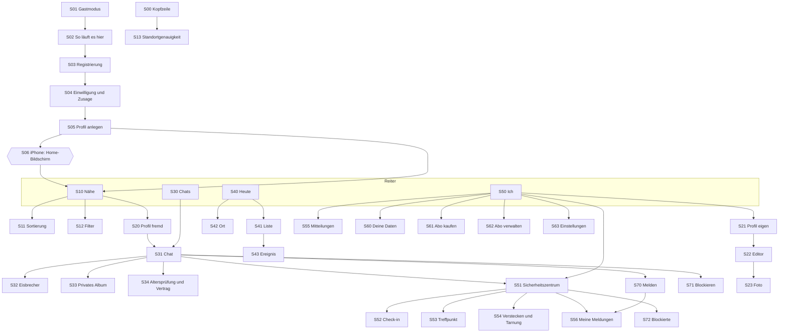

# Wireframe-Textspezifikation — klickbarer Prototyp

> ## ⚠ ENTWURF — Vorfassung vor den Interviews
> **Briefing für die externe Gestaltung** (Handbuch B: UI-Gestaltung, 10 Tage, 6.000 €). Beschrieben wird, *was* auf jedem Bildschirm steht und *wie* es sich verhält — nicht, wie es aussieht. Die visuelle Umsetzung ist der externe Schritt.
> **Zeitplan-Regel:** Was von den Interviews abhängt, wird vor den Interviews nicht finalisiert. Die Bildschirme stehen; Absichten, Antwortquoten-Bänder, Namen und Reihenfolgen kommen nach A-19 noch einmal auf den Tisch. Alle Texte stehen als ID aus `systemtexte-ENTWURF.md` (A-14) — sie werden dort gepflegt, nicht hier.
> **Hinweis vom 17.09.2026 (A-29):** Die Produktspezifikation führt in `produktspezifikation.md`, Abschnitt 16.3, welche Bildschirme und Anker bei der Überarbeitung anzupassen sind. Bis zur Überarbeitung nach A-19 bleibt diese Beschreibung unverändert; wo sie der Spezifikation widerspricht, gilt bis dahin die Spezifikation.

Erstellt: 15.09.2026, 15:51 Uhr · Aufgabe A-15 · Rolle: UX-Designer · Fenster **V2**, als Vorfassung vorgezogen
Grundlagen: Handbuch A (Reiterstruktur, Funktionskatalog, Streichliste, Mikro-UX, Gestaltungssystem) · `systemtexte-ENTWURF.md` (A-14) · `moderationsarchitektur.md` (A-37) · `../70-entwicklung-ab-monat-4/code-planer.md` · `../01-steuerung/offene-entscheidungen.md` (Nr. 14, 39, 40, 46–51)
Gehört zu: A-29 (Spezifikation) · A-30 (Abläufe) · Code: Phase 1b und 1c

---

## Auf einen Blick

- **39 Bildschirme in 8 Gruppen** (Rahmen, Einstieg, Nähe, Profil, Chats, Heute, Ich, Abläufe), **226 nummerierte Ankerpunkte** für den Gestalter.
- Jeder Bildschirm hat Zweck, Einstieg, Handbuch-Bezug, Elemente von oben nach unten mit Daumenzone, Zustände, Interaktionen mit Zielbildschirm und offene Punkte.
- **Programmatisch geprüft:** alle 284 verwendeten Text-IDs existieren in der Systemtext-Bibliothek · alle Interaktionen zeigen auf vorhandene Bildschirme und Anker · jede Hauptaktion liegt im unteren Drittel · alle 15 gestrichenen Funktionen kommen nicht vor (Abschnitt 11).
- **Der wichtigste Befund für den Gestalter:** Das MVP ist eine Web-App. Drei Schutzfunktionen und die Mitteilungen verhalten sich dort anders als in Handbuch A beschrieben (Abschnitt 12, Entscheidung Nr. 47). Die betroffenen Bildschirme zeigen die Grenze offen, statt sie zu verstecken.

---

## 0 · Wie man dieses Dokument liest

| Zeichen | Bedeutung |
|---|---|
| **S10.04** | Bildschirm 10, Element 4 — die Nummer dient als Name der Ebene in Figma |
| **Zone O / M / U** | oberes Drittel (Anzeige) · Mitte (Inhalt) · unteres Drittel (Hauptaktionen, Daumenzone). Die App wird einhändig, im Dunkeln und im Gehen bedient (Handbuch A). |
| **ST-…** | Text aus `systemtexte-ENTWURF.md`. In Figma den dortigen Text einsetzen, nicht neu formulieren. |
| **„…“ in der Inhaltsspalte ohne ID** | Beschriftung, die als einfacher Vorschlag reicht; sie kommt bei der Endfassung in die Bibliothek |
| **[GROSSBUCHSTABEN]** | fehlt noch — als Platzhalter zeichnen |
| **→** | führt zu |
| **⚠ offen** | noch nicht entschieden; die Stelle wird gezeichnet, aber markiert |

**Aufbau eines Bildschirms:** Zweck · Einstieg · Bezug · Elementtabelle (von oben nach unten) · Zustände · Interaktionen · Hinweise · offene Punkte.

---

## 1 · Gestaltungsrahmen

**Verbindlich aus Handbuch A:**

| Bereich | Festlegung |
|---|---|
| Grundton | sehr dunkles Neutral, leicht kühl — nicht reines Schwarz (Schlieren auf OLED; Hauttöne wirken natürlicher) |
| Akzentfarbe | ein einziger kräftiger, kühler Akzent — nicht Grindr-Gelb, ROMEO-Orange, Scruff-Rot, Sniffies-Grün; auf dem Startbildschirm sofort unterscheidbar |
| Regenbogen | nirgends in der Grundoberfläche |
| App-Symbol | abstrakt, ohne Personen, ohne Regenbogen, neben Arbeits-Apps unauffällig; mindestens vier Alternativen |
| Berührflächen | mindestens 44 × 44 pt |
| Hauptaktionen | im unteren Bildschirmdrittel |
| Schriftgröße | dynamische Größen bis „sehr groß“ ohne Abschneiden |
| Kontrast und Vorlesen | WCAG AA durchgängig; vollständige Beschriftungen für VoiceOver und TalkBack, auch für Rasterkacheln |
| Bewegung | 150–200 ms, ease-out, kein Konfetti |
| Haptik | nur bei Nachrichteneingang, Verifizierung, Sicherheitsalarm — nie bei Bezahlaufforderungen |
| Offline | letztes Raster und alle Chats lesbar |
| Startzeit | unter 1,2 Sekunden bis zum ersten Raster auf einem vier Jahre alten Android-Gerät |
| Entfernungen | genau vier Bänder, keine Meterangaben |
| Aktivität | fünf Bänder, kein grüner Onlinepunkt |
| Bezahlaufforderungen | nie blockierend, nie im Chat, höchstens alle 30 Tage je Funktion |

**Vorschläge, nicht verbindlich** (Handbuch A nennt dazu nichts):

| Bereich | Vorschlag | Begründung |
|---|---|---|
| Rahmengrößen in Figma | 360 × 800 (Android) und 375 × 667 (kleines iPhone), zusätzlich jede Hauptansicht mit größter Systemschrift | Handbuch A bezieht Zielwerte auf ein altes Android-Gerät und ein älteres iPhone |
| Raster | 8-pt-Grundraster | übliche Teilbarkeit, passt zu 44-pt-Flächen |
| Web-App | Sicherheitsabstände oben und unten berücksichtigen; im Browser darf die Browserleiste kein Element verdecken | Phase 1 ist eine Web-App |

---

## 2 · Bildschirmkarte

| Bildschirm | Gruppe | erreichbar über |
|---|---|---|
| S00 · App-Rahmen (gilt für alle Hauptbildschirme) | Rahmen | immer nach der Anmeldung |
| S01 · Gastmodus | Einstieg | erster Start ohne Konto |
| S02 · Onboarding Schritt 1 — So läuft es hier | Einstieg | S01 „Konto anlegen“ |
| S03 · Registrierung und Anmeldung — Schritt 2 | Einstieg | S02; S01 „Anmelden“ |
| S04 · Einwilligung und Zusage — Onboarding-Einwilligung | Einstieg | nach erfolgreicher Code-Eingabe bzw. Apple-Anmeldung |
| S05 · Profil anlegen — Schritt 3 | Einstieg | S04 |
| S06 · iPhone: auf den Home-Bildschirm legen | Einstieg | Ende des Onboardings (nur Safari auf iOS, nicht im Standalone-Modus); erneut bei S14 (Mitteilungen) |
| S10 · Nähe — Raster | Nähe | Reiter „Nähe“ (Startreiter) |
| S11 · Nähe — Sortierung (Auswahlblatt) | Nähe | S10 Sortierleiste |
| S12 · Nähe — Filter (Auswahlblatt) | Nähe | S10 Filterleiste |
| S13 · Standortgenauigkeit (Auswahlblatt) | Nähe | Kopfzeile auf jedem Hauptbildschirm |
| S14 · Muster Rechteabfrage (Standort, Mitteilungen, Kamera) | Nähe | Standort: erster Aufruf von S10 · Mitteilungen: erste gesendete Nachricht in S31 · Kamera: erster Upload in S23 |
| S20 · Profil — fremd | Profil | S10 Kachel; S31 Kopf; S41 Zusagenliste (nur für Zusagende) |
| S21 · Profil — eigen (Vorschau) | Profil | S50 „Mein Profil“ |
| S22 · Profil-Editor | Profil | S21 |
| S23 · Foto hinzufügen und Foto-Status | Profil | S05, S22 |
| S30 · Chats — Liste mit zwei Postfächern | Chats | Reiter „Chats“ |
| S31 · Chat — Einzelansicht | Chats | S30, S20 |
| S32 · Eisbrecher (Vorschlagsblatt) | Chats | S31 „Einstieg vorschlagen“ |
| S33 · Privates Album | Chats | S31 Menü „Privates Album teilen“; Albumkarte im Verlauf |
| S34 · Altersprüfung und Community-Vertrag (gebündelt), Erklärbildschirm, Stufe 2 | Chats | erstes Senden in S31; Tipp auf eine nicht zugestellte Nachricht; S21 Prüfstatus; S33 (Stufe 2) |
| S40 · Heute — Karte | Heute | Reiter „Heute“ (Umschalter Karte) |
| S41 · Heute — Liste | Heute | S40 Umschalter |
| S42 · Ort — Detail | Heute | S40, S41, S53 |
| S43 · Ereignis — Detail und temporäre Gruppe | Heute | S41, S42, Mitteilung ST-PUSH-11 |
| S50 · Ich — Übersicht | Ich | Reiter „Ich“ |
| S51 · Sicherheitszentrum | Ich | S50; S31 Symbol „Sicherheit“ |
| S52 · Check-in vor dem Treffen | Ich | S51, S31 |
| S53 · Treffpunkt vorschlagen | Ich | S51, S31 |
| S54 · Schnell verstecken und Tarnung | Ich | S51 |
| S55 · Mitteilungen (Sicherheitsbereich) | Ich | S50; Mitteilung ST-PUSH-10 |
| S56 · Meine Meldungen (Fallübersicht) | Ich | S51; Mitteilung zu einer Entscheidung |
| S60 · Deine Daten (Datenkonto) | Ich | S50 |
| S61 · Abo — Kaufbildschirm | Ich | S50 „Abo“; Hinweis an einer Komfortfunktion (höchstens alle 30 Tage je Funktion) |
| S62 · Abo verwalten und kündigen | Ich | S50 „Abo“ bei laufendem Abo |
| S63 · Einstellungen | Ich | S50 |
| S70 · Melden — Ablauf | Abläufe | S20, S30, S31, S33, S43, S51 |
| S71 · Blockieren — Ablauf | Abläufe | S20, S30, S31, S70 |
| S72 · Blockierte Profile | Abläufe | S51 |

---

## 3 · Rahmen

### S00 · App-Rahmen (gilt für alle Hauptbildschirme)

**Zweck:** Gemeinsamer Rahmen der vier Reiter: Kopfzeile mit Standortstufe, Inhalt, Reiterleiste. Legt fest, was auf jedem Hauptbildschirm gleich ist.  
**Erreichbar über:** immer nach der Anmeldung  
**Bezug:** Reiterstruktur (Handbuch A, Abschnitt 3); F69; Prinzip 2 und 7; Mikro-UX

| Anker | Element | Inhalt / Text-ID | Verhalten | Zone |
|---|---|---|---|---|
| S00.01 | Kopfzeile: Standortstufe | ST-STO-01 („Standort: {stufe}“) mit kleinem Symbol | Tipp öffnet S13 (Standortgenauigkeit). Dauerhaft sichtbar auf Nähe und Heute; auf Chats und Ich mindestens als Symbol mit Beschriftung für Vorlesefunktionen | O |
| S00.02 | Kopfzeile: Titel des Reiters | „Nähe“ · „Heute“ · „Chats“ · „Ich“ | nur Anzeige | O |
| S00.03 | Offline-Leiste | ST-LEER-30 | erscheint unter der Kopfzeile, sobald keine Verbindung besteht; verschiebt den Inhalt, überdeckt ihn nicht | O |
| S00.04 | Inhaltsbereich | je Reiter | scrollt; Kopfzeile bleibt stehen | M |
| S00.05 | Reiterleiste | vier Reiter: Nähe (Start) · Heute · Chats · Ich — je Symbol plus Beschriftung | Reiter „Chats“ zeigt eine Zählmarke nur für das Postfach „Gespräche“, nie für „Anfragen“ (F42). Keine weiteren Reiter, kein Plus-Knopf | U |

**Zustände**

| Zustand | Darstellung |
|---|---|
| offline | letzter Stand bleibt lesbar (Raster und alle Chats), Offline-Leiste sichtbar |
| große Schrift | Beschriftungen der Reiter umbrechen nicht, sondern werden zu Symbolen mit Vorlesetext; Kopfzeile wächst in die Höhe |

**Interaktionen:** S00.01 → S13 Standortgenauigkeit (Bottom Sheet) · S00.05 → S10 · S40 · S30 · S50

**Hinweise**

- Startreiter ist „Nähe“ (Entscheidung Nr. 14: zeitabhängiger Startreiter frühestens ab V2 testen).
- Web-App: Reiterleiste oberhalb der Browserleiste bzw. im Standalone-Modus über dem unteren Sicherheitsabstand; kein Element darf von der Browser-Oberfläche verdeckt werden.
- Grundton sehr dunkles Neutral, leicht kühl, nicht reines Schwarz; ein einziger kräftiger, kühler Akzent; kein Regenbogen in der Grundoberfläche (Gestaltungssystem).

**⚠ offen:** Namen der Genauigkeitsstufen (ST-STO-01) — A-29

---
## 4 · Einstieg

### S01 · Gastmodus

**Zweck:** Zeigen, dass die App lebt, bevor jemand ein Konto anlegt — drei Minuten lang, mit unkenntlichen Fotos.  
**Erreichbar über:** erster Start ohne Konto  
**Bezug:** F1

| Anker | Element | Inhalt / Text-ID | Verhalten | Zone |
|---|---|---|---|---|
| S01.01 | Hinweisleiste | ST-KON-01 | fest oben, nicht wegwischbar | O |
| S01.02 | Restzeit | ST-KON-02 | zählt minutenweise herunter; keine Sekundenanzeige (kein künstlicher Druck) | O |
| S01.03 | Raster (Vorschau) | Kacheln wie S10, Fotos unkenntlich, Namen ausgeblendet, Entfernungsband und Absicht sichtbar | Tipp auf eine Kachel öffnet ST-KON-03 als Hinweis, keine Profilansicht | M |
| S01.04 | Hauptaktion | ST-KON-04 („Konto anlegen“) | führt zu S02 | U |
| S01.05 | Nebenaktion | „Anmelden“ | für vorhandene Konten, führt zu S03 im Anmeldemodus | U |

**Zustände**

| Zustand | Darstellung |
|---|---|
| Zeit abgelaufen | Raster ausgegraut, Hinweis ST-KON-03, Aktionen ST-KON-04 und ST-KON-05 |
| leer | Raster mit Ersatzinhalten wie S10 — nie eine leere Fläche |
| Fehler | ST-FEH-01 als Leiste, Raster zeigt Platzhalter-Kacheln ohne Bild |
| offline | ST-LEER-30; Raster nicht verfügbar, Hauptaktion bleibt |

**Interaktionen:** S01.04 → S02 · S01.05 → S03 (Anmelden) · S01.03 → Hinweis ST-KON-03

**Hinweise**

- Keine Fotos in Originalqualität vor dem Konto — auch nicht verkleinert.
- Standortabfrage im Gastmodus nur, wenn das Raster sie braucht; dann Muster S14.

**⚠ offen:** Ob der Gastmodus eine Standortfreigabe voraussetzt oder mit einer groben Region arbeitet, legt Handbuch A nicht fest — A-29

---
### S02 · Onboarding Schritt 1 — So läuft es hier

**Zweck:** In einem Bildschirm sagen, was diese App anders macht, bevor jemand Daten eingibt.  
**Erreichbar über:** S01 „Konto anlegen“  
**Bezug:** Die fünf Sätze (Handbuch A)

| Anker | Element | Inhalt / Text-ID | Verhalten | Zone |
|---|---|---|---|---|
| S02.01 | Fortschritt | „1 von 3“ | Anzeige, keine Punkte-Animation | O |
| S02.02 | Titel | ST-KON-10 | — | O |
| S02.03 | Text | ST-KON-11 | — | M |
| S02.04 | Drei Zeilen mit Symbol | ST-FEST-06 · ST-FEST-08 · ST-FEST-09 | statisch, keine Karussell-Mechanik | M |
| S02.05 | Hauptaktion | ST-KON-12 („Weiter“) | führt zu S03 | U |
| S02.06 | Zurück | Systemgeste bzw. Pfeil oben links | führt zu S01 | O |

**Zustände**

| Zustand | Darstellung |
|---|---|
| große Schrift | Zeilen stapeln sich; Hauptaktion bleibt sichtbar am unteren Rand (fixiert) |

**Interaktionen:** S02.05 → S03

**Hinweise**

- Kein Überspringen-Knopf nötig: Der Schritt hat keine Eingabe und dauert Sekunden.

---
### S03 · Registrierung und Anmeldung — Schritt 2

**Zweck:** Ein Konto mit dem Minimum an Daten anlegen: E-Mail und Passwort oder Apple.  
**Erreichbar über:** S02; S01 „Anmelden“  
**Bezug:** F2, F3; Streichliste (kein Google, kein Meta)

| Anker | Element | Inhalt / Text-ID | Verhalten | Zone |
|---|---|---|---|---|
| S03.01 | Fortschritt | „2 von 3“ (nur bei Registrierung) | — | O |
| S03.02 | Titel | ST-KON-20 | im Anmeldemodus: „Anmelden“ | O |
| S03.03 | Text | ST-KON-21 | — | O |
| S03.04 | Feld E-Mail | Beschriftung „E-Mail-Adresse“ über dem Feld | Tastatur E-Mail, Autovervollständigen erlaubt | M |
| S03.05 | Feld Passwort | Beschriftung „Passwort“, Anzeigen-Schalter | Passwort-Manager erlaubt; Mindestanforderung unter dem Feld, nicht erst als Fehler | M |
| S03.06 | Hauptaktion | ST-KON-22 („Mit E-Mail weiter“) | sendet Bestätigungscode (ST-MAIL-02 bis 04), öffnet 03.08 | U |
| S03.07 | Apple-Anmeldung | ST-KON-23 plus Hinweis ST-KON-24 | nach Apples Gestaltungsvorgaben; öffnet den Apple-Dialog | U |
| S03.08 | Code-Eingabe (Unterschritt) | sechs Felder für den Code, Hinweis „Code nicht bekommen? Neu senden“ ab 60 Sekunden | Einfügen aus der Zwischenablage unterstützen | M |
| S03.09 | Hilfe-Verweis | „Warum nicht Google oder Facebook?“ → ST-KON-25 | klappt einen Text auf, kein neues Fenster | U |
| S03.10 | Passwort vergessen (nur Anmeldemodus) | „Passwort vergessen“ | schickt ST-MAIL-05/06 | U |

**Zustände**

| Zustand | Darstellung |
|---|---|
| Fehler Eingabe | Feldbezogene Meldungen unter dem Feld, im Muster was/wie/weiter |
| Fehler Code | „Der Code stimmt nicht. Prüf ihn oder lass dir einen neuen schicken.“ — Muster wie ST-FEH-* |
| lädt | Hauptaktion zeigt Ladezustand und ist gesperrt, Felder bleiben lesbar |
| offline | ST-FEH-01; Eingaben bleiben erhalten |

**Interaktionen:** S03.06 → 03.08 Code-Eingabe → S04 · S03.07 → Apple-Dialog → S04 · S03.10 → E-Mail-Versand, Bestätigung im Bildschirm

**Hinweise**

- Keine Telefonnummer, kein Klarname, kein Geburtsdatum an dieser Stelle.
- Die Absender- und Betreffzeilen der E-Mails sind neutral (ST-MAIL-01 bis 06).

**⚠ offen:** Neutraler E-Mail-Absender (ST-MAIL-01) — Nr. 49

---
### S04 · Einwilligung und Zusage — Onboarding-Einwilligung

**Zweck:** Die ausdrückliche Einwilligung nach Art. 9 DSGVO einholen und die Zusage zu Sicherheitsmitteilungen geben — bevor irgendetwas gespeichert wird, das Rückschlüsse zulässt.  
**Erreichbar über:** nach erfolgreicher Code-Eingabe bzw. Apple-Anmeldung  
**Bezug:** Handbuch A Rechtsauflagen (Art. 9 Abs. 2 lit. a, Rechtsnachfolge); Entscheidung Nr. 12 und 46

| Anker | Element | Inhalt / Text-ID | Verhalten | Zone |
|---|---|---|---|---|
| S04.01 | Titel | „Bevor wir etwas speichern“ (Entwurf) | — | O |
| S04.02 | Rahmensatz | ST-KON-26 | — | O |
| S04.03 | Einwilligungstext | ST-KON-27 — Wortlaut vom Fachanwalt | scrollbar im Bildschirm, kein eingebettetes Fenster; Verweis auf die Datenschutzerklärung als Textlink | M |
| S04.04 | Kontrollkästchen | „Ich willige ein“ (Wortlaut Anwalt) | nicht vorangekreuzt; Hauptaktion erst danach aktiv | M |
| S04.05 | Block Sicherheitsmitteilungen | ST-KON-28 (Titel) · ST-KON-29 · ST-KON-30 · ST-KON-31 | immer sichtbar, nicht einklappbar | M |
| S04.06 | Hauptaktion | ST-KON-32 („Verstanden“) — zusammen mit der Einwilligung | speichert die Einwilligung mit Zeitstempel und Textversion, führt zu S05 | U |
| S04.07 | Nebenaktion | „Nicht einwilligen“ | erklärt, dass ohne Einwilligung kein Konto möglich ist, und löscht die bis dahin erfassten Anmeldedaten | U |

**Zustände**

| Zustand | Darstellung |
|---|---|
| Fehler | Speichern fehlgeschlagen → ST-FEH-02; Kontrollkästchen bleibt gesetzt |
| offline | ST-FEH-01; Hauptaktion gesperrt |

**Interaktionen:** S04.06 → S05 · S04.07 → Hinweis, danach S01

**Hinweise**

- Der Bildschirm ist die einzige Stelle, an der die Einwilligung eingeholt wird (Prinzip 7: eine Handlung, ein Ort). Widerruf liegt im Datenkonto (S60).
- Die Textversion der Einwilligung wird mitgespeichert — nötig für den späteren Nachweis und für die Rechtsnachfolge.

**⚠ offen:** Wortlaut der Einwilligung und Verhalten bei „Nicht einwilligen“ — Fachanwalt

---
### S05 · Profil anlegen — Schritt 3

**Zweck:** Mit drei Angaben sichtbar werden: Foto oder Initiale, Name, Absicht.  
**Erreichbar über:** S04  
**Bezug:** F10–F14

| Anker | Element | Inhalt / Text-ID | Verhalten | Zone |
|---|---|---|---|---|
| S05.01 | Fortschritt | „3 von 3“ | — | O |
| S05.02 | Titel und Text | ST-KON-40 · ST-KON-41 | — | O |
| S05.03 | Foto-Auswahl | drei Optionen als große Flächen: ST-KON-42 · ST-KON-43 (mit Erklärung ST-KON-45/46) · ST-KON-44 | Auswahl „Foto“ öffnet S23; Kamera-Erklärung nach Muster S14 beim ersten Upload | M |
| S05.04 | Feld Name | Hilfetext ST-KON-47 | Pflicht, höchstens 20 Zeichen (Vorschlag) | M |
| S05.05 | Absicht | Überschrift ST-KON-48, Auswahl ST-PRO-02 bis ST-PRO-05, Hilfetext ST-KON-49 | eine Auswahl, Zeitfenster wird angezeigt (ST-PRO-07) | M |
| S05.06 | Hauptaktion | ST-KON-50 („Fertig“) | aktiv, sobald Name und Foto-Option gewählt sind; Absicht darf leer bleiben (dann „Offen“) | U |

**Zustände**

| Zustand | Darstellung |
|---|---|
| Foto in Prüfung | Vorschau mit Hinweis ST-FEH-16; Fertig bleibt möglich — das Foto erscheint nach Freigabe |
| Foto abgelehnt | ST-FEH-12 mit markierter Stelle, Wahl eines anderen Fotos |
| Fehler | ST-FEH-02 |

**Interaktionen:** S05.03 → S23 Foto hinzufügen · S05.06 → S06 (nur iPhone/Safari) sonst S10

**Hinweise**

- Interessen, Freitext, Geschlechtsidentität und „Wen ich sehen möchte“ kommen erst im Editor (S22) — das Onboarding bleibt bei drei Angaben.

**⚠ offen:** Namen und Zeitfenster der Absichten 3 und 4 — nach den Interviews

---
### S06 · iPhone: auf den Home-Bildschirm legen

**Zweck:** Auf iOS erklären, warum und wie die Web-App auf den Home-Bildschirm kommt — sonst kommen keine Mitteilungen an.  
**Erreichbar über:** Ende des Onboardings (nur Safari auf iOS, nicht im Standalone-Modus); erneut bei S14 (Mitteilungen)  
**Bezug:** Code-Planer (Web-Push auf iOS); F59; Entscheidung Nr. 47

| Anker | Element | Inhalt / Text-ID | Verhalten | Zone |
|---|---|---|---|---|
| S06.01 | Titel | ST-KON-60 | — | O |
| S06.02 | Text | ST-KON-61 | — | M |
| S06.03 | Symbolwahl (falls Tarnung für die Web-App umgesetzt wird) | ST-KON-62, darunter vier Symbole zur Wahl | Auswahl bestimmt das Symbol, das beim Hinzufügen übernommen wird | M |
| S06.04 | Anleitung | drei Schritte als Bildfolge der Safari-Oberfläche | statisch, keine eingebetteten Videos | M |
| S06.05 | Hauptaktion | ST-KON-63 („Zeig mir, wie“) | hebt den Teilen-Knopf von Safari hervor, soweit technisch möglich | U |
| S06.06 | Nebenaktion | ST-KON-64 („Nicht jetzt“) | schließt, führt zu S10; Hinweis kommt bei S14 (Mitteilungen) wieder | U |

**Zustände**

| Zustand | Darstellung |
|---|---|
| bereits hinzugefügt | Bildschirm wird nicht gezeigt |

**Interaktionen:** S06.05 → Anleitung · S06.06 → S10

**Hinweise**

- Nach bisheriger Kenntnis übernimmt iOS spätere Änderungen an Symbol oder Name nicht — deshalb liegt die Symbolwahl vor dem Hinzufügen.

**⚠ offen:** Technische Machbarkeit der Symbolwahl für die Web-App — Nr. 47, vor dem Bau auf Geräten prüfen

---
## 5 · Nähe

### S10 · Nähe — Raster

**Zweck:** Beantwortet „Wer ist in meiner Umgebung und passt zu meiner Absicht?“ — ohne Werbung, ohne verdeckte Rangfolge, nie leer.  
**Erreichbar über:** Reiter „Nähe“ (Startreiter)  
**Bezug:** F23–F27, F29, F20, F19, F14; Reiterstruktur; Prinzip 5

| Anker | Element | Inhalt / Text-ID | Verhalten | Zone |
|---|---|---|---|---|
| S10.01 | Kopfzeile | siehe S00 (Standortstufe) | — | O |
| S10.02 | Sortierleiste | aktive Sortierung als Beschriftung, z. B. „Sortiert nach: Nähe“ | Tipp öffnet S11; die Sortierung ist immer benannt (Prinzip 5) | O |
| S10.03 | Filterleiste | bis zu zwei aktive Filter als Chips, dahinter „Filter“ | Tipp öffnet S12; Chip mit Schließen-Symbol entfernt den Filter sofort | O |
| S10.04 | Rasterkachel (3 Spalten) | Foto oder unkenntliches Foto oder Initiale · Name · Entfernungsband (ST-STO-10 bis 13) · Absicht · Antwortquoten-Band · ggf. Prüfzeichen | Tipp öffnet S20. Vorlesetext je Kachel vollständig: Name, Entfernung, Absicht, Antwortquote, Prüfstatus | M |
| S10.05 | Abschnitt „Weiter weg“ | Trenner mit ST-STO-14 und Erklärung ST-STO-15 | erscheint, wenn die Zielgröße von ~100 Profilen nur mit Ferne erreicht wird; Radius auf 10 km gerundet, höchstens 150 km | M |
| S10.06 | Abschnitt Wochenaktive | Überschrift und ST-LEER-03 | schaltet sich automatisch zu bei unter 20 Profilen im 10-km-Umkreis; Liste statt Raster | M |
| S10.07 | Ersatzinhalt „Heute“ | ST-LEER-04 mit Vorschau von zwei Orten oder Ereignissen | Tipp wechselt zu S40 | M |
| S10.08 | Zeitstempel bei Offline | „Stand: {uhrzeit}“ | nur im Offline-Zustand | M |
| S10.09 | Reiterleiste | siehe S00 | — | U |

**Zustände**

| Zustand | Darstellung |
|---|---|
| lädt | Kachelgerüst in der Rasterform, keine Drehkreisel über dem ganzen Bildschirm |
| wenig los | ST-LEER-01, danach Ersatzinhalte in der Reihenfolge weiter weg → Wochenaktive → Heute (Vorschlag, Handbuch A nennt keine Reihenfolge) |
| Filter ohne Treffer | ST-LEER-05 mit direktem Entfernen der Filter |
| kein Standort | ST-REC-05 mit Aktion „Standort erlauben“ (Muster S14) |
| Fehler | ST-FEH-02 als Leiste, letzter Stand bleibt stehen |
| offline | letztes Raster lesbar, ST-LEER-30 und Zeitstempel |

**Interaktionen:** S10.02 → S11 Sortierung · S10.03 → S12 Filter · S10.04 → S20 Profil fremd · S10.07 → S40 Heute

**Hinweise**

- Kein grüner Onlinepunkt, keine Meterangaben, keine Werbekacheln, keine „Wer hat mich angesehen“-Anzeige, keine Wischmechanik (Streichliste).
- Die Kachel zeigt die Antwortquote nur als Band, nie als Zahl; ist sie beim Betrachter ausgeschaltet, sieht er sie auch bei anderen nicht (F19, symmetrisch).
- Aktualisierung durch Ziehen nach unten; kein automatisches Nachladen, das Kacheln unter dem Finger verschiebt.

**⚠ offen:** Reihenfolge der Ersatzinhalte · Raster ohne Standortfreigabe · Bänder der Antwortquote — A-29

---
### S11 · Nähe — Sortierung (Auswahlblatt)

**Zweck:** Die Rangfolge sichtbar und umschaltbar machen.  
**Erreichbar über:** S10 Sortierleiste  
**Bezug:** F24; Prinzip 5

| Anker | Element | Inhalt / Text-ID | Verhalten | Zone |
|---|---|---|---|---|
| S11.01 | Titel | „Sortieren nach“ | — | O |
| S11.02 | Optionen | Nähe · Antwortquote · Neu hier · Passende Absicht — je mit einem Satz Erklärung | eine Auswahl, sofort wirksam, Blatt schließt | U |
| S11.03 | Schließen | Wischgeste oder „Fertig“ | — | U |

**Interaktionen:** S11.02 → S10 mit neuer Sortierung

**Hinweise**

- Die Erklärungen sagen, was sortiert wird — keine verdeckte Gewichtung (Prinzip 5). Keine bezahlte Sortierung (Boosts gestrichen bis 50.000 MAU).

---
### S12 · Nähe — Filter (Auswahlblatt)

**Zweck:** Positiv filtern — nach Entfernung, Absicht oder Alter, höchstens zwei zugleich.  
**Erreichbar über:** S10 Filterleiste  
**Bezug:** F26; Streichliste (keine Ausschlussfilter)

| Anker | Element | Inhalt / Text-ID | Verhalten | Zone |
|---|---|---|---|---|
| S12.01 | Titel | „Filter“ mit Hinweis „höchstens zwei gleichzeitig“ | — | O |
| S12.02 | Entfernung | Auswahl aus den vier Entfernungsbändern | — | M |
| S12.03 | Absicht | Auswahl aus den Absichten | — | M |
| S12.04 | Alter | Spanne mit zwei Reglern, Schritt ein Jahr, ab 18 | Regler zusätzlich per Zahleneingabe bedienbar (Barrierefreiheit) | M |
| S12.05 | Trefferzähler | „{zahl} Profile“ | aktualisiert sich in Echtzeit bei jeder Änderung | U |
| S12.06 | Hauptaktion | „Anzeigen“ | übernimmt und schließt | U |
| S12.07 | Zurücksetzen | „Alle Filter entfernen“ | — | U |

**Zustände**

| Zustand | Darstellung |
|---|---|
| dritter Filter | ST-FEH-61; der dritte Bereich ist deaktiviert, solange zwei aktiv sind |
| null Treffer | Zähler zeigt 0, Hauptaktion bleibt möglich, Hinweis ST-LEER-05 |

**Interaktionen:** S12.06 → S10 gefiltert

**Hinweise**

- Es gibt kein Feld, das jemanden ausblendet (Ethnie, Körperform, HIV-Status — Streichliste „nie“). Ein Positionsfilter kommt erst ab 15.000 MAU.

---
### S13 · Standortgenauigkeit (Auswahlblatt)

**Zweck:** Die eigene Standortgenauigkeit sehen und mit einem Tipp ändern; Zonen verwalten.  
**Erreichbar über:** Kopfzeile auf jedem Hauptbildschirm  
**Bezug:** F69, F60, F70; Prinzip 2

| Anker | Element | Inhalt / Text-ID | Verhalten | Zone |
|---|---|---|---|---|
| S13.01 | Titel und Frage | ST-STO-02 | — | O |
| S13.02 | Stufen | [STUFEN — A-29], Voreinstellung ist die ungenaueste | eine Auswahl, sofort wirksam | M |
| S13.03 | Erklärung Entfernung | „Andere sehen nur: unter 1 km · 1–3 km · 3–10 km · über 10 km“ | statisch | M |
| S13.04 | Zonen | ST-STO-30 · ST-STO-31, Liste der Zonen, „Zone anlegen“ | Zone anlegen öffnet eine Karte mit Kreis; ⚠ Wirkung einer Zone offen (Nr. 48) | U |
| S13.05 | Schließen | Wischgeste oder „Fertig“ | — | U |

**Zustände**

| Zustand | Darstellung |
|---|---|
| Standort aus | Hinweis und Aktion „Standort erlauben“ (S14) |

**Interaktionen:** S13.04 → Zone anlegen / bearbeiten

**Hinweise**

- Der Client erhält nie eine exakte fremde Koordinate; auch die Zonenkarte zeigt nur die eigene Position (F70).

**⚠ offen:** Stufenbezeichnungen und Wirkung von Zonen — A-29, Nr. 48

---
### S14 · Muster Rechteabfrage (Standort, Mitteilungen, Kamera)

**Zweck:** Jede Rechteabfrage mit einer eigenen Erklärung vorbereiten und im Kontext stellen — nie auf Vorrat.  
**Erreichbar über:** Standort: erster Aufruf von S10 · Mitteilungen: erste gesendete Nachricht in S31 · Kamera: erster Upload in S23  
**Bezug:** Mikro-UX „Rechteabfragen“

| Anker | Element | Inhalt / Text-ID | Verhalten | Zone |
|---|---|---|---|---|
| S14.01 | Symbol | Standort / Glocke / Kamera, neutral gestaltet | — | O |
| S14.02 | Titel | ST-REC-01 · ST-REC-10 · ST-REC-20 | — | O |
| S14.03 | Text | ST-REC-02 · ST-REC-11 und ST-REC-12 · ST-REC-21 | — | M |
| S14.04 | Hinweis Web-App (nur Mitteilungen) | ST-REC-15 | ⚠ nur, wenn auf den Zielgeräten bestätigt | M |
| S14.05 | Hauptaktion | ST-REC-03 · ST-REC-13 · ST-REC-22 | löst danach die System- bzw. Browserabfrage aus | U |
| S14.06 | Nebenaktion | ST-REC-04 · ST-REC-14 · ST-REC-23 | schließt ohne Abfrage | U |

**Zustände**

| Zustand | Darstellung |
|---|---|
| abgelehnt | ST-REC-05 · ST-REC-16 · ST-REC-24 |
| im Browser blockiert | ST-REC-06 mit Anleitung |
| iPhone ohne Home-Bildschirm (Mitteilungen) | zuerst S06 |

**Interaktionen:** S14.05 → Systemabfrage → zurück zum Ausgangsbildschirm · S14.06 → Ausgangsbildschirm ohne Recht

**Hinweise**

- Als Blatt vom unteren Rand, nicht als Vollbild — der Nutzer bleibt im Kontext.

**⚠ offen:** Verhalten des Rasters ohne Standort — A-29

---
## 6 · Profil

### S20 · Profil — fremd

**Zweck:** Eine Person so zeigen, dass man entscheiden kann, ob man schreibt — mit allem, was sie freiwillig zeigt, und nichts darüber hinaus.  
**Erreichbar über:** S10 Kachel; S31 Kopf; S41 Zusagenliste (nur für Zusagende)  
**Bezug:** F6, F10–F16, F18–F22, F43, F61, F62

| Anker | Element | Inhalt / Text-ID | Verhalten | Zone |
|---|---|---|---|---|
| S20.01 | Zurück | Pfeil oben links | — | O |
| S20.02 | Menü | „…“ oben rechts | öffnet Melden (S70), Blockieren (S71), Merken (ST-PRO-50/51) | O |
| S20.03 | Fotobereich | bis zu 8 Fotos, waagerecht blätterbar; unkenntliches Foto mit ST-VER-23; Prüfzeichen mit ST-VER-22 bei Tipp | Seitenzahl als Text („2 von 5“), nicht nur Punkte | O |
| S20.04 | Name, Entfernungsband, Aktivitätsband | ST-STO-10–13 · ST-PRO-20 | — | M |
| S20.05 | Absicht mit Laufzeit | ST-PRO-02–06 · ST-PRO-07 | — | M |
| S20.06 | Antwortquote | Band ST-PRO-10–12, Tipp zeigt ST-PRO-13 | nur wenn beide Seiten sie eingeschaltet haben | M |
| S20.07 | Interessen | strukturierte Merkmale als Chips | Grundlage der Eisbrecher | M |
| S20.08 | Freitext | bis 400 Zeichen | ganz lesbar, kein „mehr anzeigen“ unter 400 Zeichen | M |
| S20.09 | Geschlechtsidentität | nur wenn die Person sie zeigt (ST-PRO-40/41) | — | M |
| S20.10 | Hauptaktion | „Schreiben“ | öffnet S31; ohne Altersprüfung zuerst S34; Hinweis ST-CHAT-04 im Eingabefeld | U |
| S20.11 | Nebenaktion | „Merken“ (ST-PRO-50) | ohne Benachrichtigung der Person | U |

**Zustände**

| Zustand | Darstellung |
|---|---|
| lädt | Gerüst mit Bildplatzhaltern |
| Profil nicht mehr verfügbar | „Dieses Profil gibt es nicht mehr.“ — ohne Grund (Blockierung, Löschung und Sperre sehen gleich aus) |
| offline | zuletzt geladenes Profil lesbar, Hauptaktion schreibt in den Ausgang (ST-LEER-31) |

**Interaktionen:** S20.02 → S70 · S71 · Merken · S20.10 → S31 oder S34

**Hinweise**

- Kein „Profil angesehen“-Signal, keine Besucherliste (Streichliste).
- Gesundheitsangaben (F22) erst ab V2, dann als eigene Aussage, nie filterbar.

---
### S21 · Profil — eigen (Vorschau)

**Zweck:** Zeigen, wie andere mich sehen, und von dort bearbeiten.  
**Erreichbar über:** S50 „Mein Profil“  
**Bezug:** F6, F10–F19

| Anker | Element | Inhalt / Text-ID | Verhalten | Zone |
|---|---|---|---|---|
| S21.01 | Umschalter | „So sehen dich andere“ / „Bearbeiten“ | — | O |
| S21.02 | Vorschau | Aufbau wie S20, ohne Menü und Hauptaktion | — | M |
| S21.03 | Prüfstatus | Altersprüfung: erledigt/offen · Fotoprüfung: erledigt/offen · ST-VER-20/21 | Tipp startet die jeweilige Prüfung | M |
| S21.04 | Hauptaktion | „Bearbeiten“ | öffnet S22 | U |

**Zustände**

| Zustand | Darstellung |
|---|---|
| Foto in Prüfung | Hinweis ST-FEH-16 an der Kachel |
| Foto abgelehnt | ST-FEH-12, Tipp öffnet S23 |

**Interaktionen:** S21.04 → S22 · S21.03 → S34 (Alter) · Fotoprüfung

**⚠ offen:** Verfahren der Fotoprüfung (ST-VER-21) — A-29, Nr. 24

---
### S22 · Profil-Editor

**Zweck:** Alle eigenen Angaben an einem Ort ändern.  
**Erreichbar über:** S21  
**Bezug:** F10–F19, F22 (V2)

| Anker | Element | Inhalt / Text-ID | Verhalten | Zone |
|---|---|---|---|---|
| S22.01 | Fotos | bis zu 8 Felder, Reihenfolge per Ziehen, je Foto „unkenntlich“ und „Löschen“; Hinweis ST-PRO-60 | Hinzufügen öffnet S23; Ziehen hat eine Alternative per Menü (Barrierefreiheit) | O |
| S22.02 | Name | Feld mit Hilfetext ST-KON-47 | — | M |
| S22.03 | Absicht | Auswahl, Laufzeit, ST-KON-49 | — | M |
| S22.04 | Interessen | strukturierte Auswahl | — | M |
| S22.05 | Freitext | mehrzeilig, Zähler „{zahl}/400“ | Prüfung beim Speichern: ST-FEH-62 oder ST-FEH-63 (⚠ offen) | M |
| S22.06 | Geschlechtsidentität | [nach Gegenlesen] mit Schalter ST-PRO-41 | — | M |
| S22.07 | Wen ich sehen möchte | ST-PRO-30 mit ST-PRO-31 | nur Positivauswahl | M |
| S22.08 | Antwortquote | Schalter mit ST-PRO-13/14 | — | M |
| S22.09 | Speichern | „Speichern“ fest am unteren Rand | nur aktiv bei Änderungen; Verlassen mit ungespeicherten Änderungen fragt einmal nach | U |

**Zustände**

| Zustand | Darstellung |
|---|---|
| Speichern fehlgeschlagen | ST-FEH-02, Eingaben bleiben |
| Freitext zu lang | ST-FEH-64 |

**Interaktionen:** S22.01 → S23 · S22.09 → S21

**Hinweise**

- Kein Feld „wen ich nicht sehen will“. Keine Pflichtfelder außer Name.

**⚠ offen:** Hinweis oder Sperre bei ausschließenden Formulierungen — A-29 · Taxonomie — Nr. 13

---
### S23 · Foto hinzufügen und Foto-Status

**Zweck:** Ein Foto aufnehmen oder wählen, zuschneiden, als unkenntlich markieren und die Prüfung abwarten.  
**Erreichbar über:** S05, S22  
**Bezug:** F10, F11, F72; Moderationsarchitektur Zone 1

| Anker | Element | Inhalt / Text-ID | Verhalten | Zone |
|---|---|---|---|---|
| S23.01 | Quelle | „Kamera“ · „Aus der Galerie wählen“ (ST-REC-23) | Kamera beim ersten Mal über Muster S14 | U |
| S23.02 | Zuschnitt | Hochformat-Rahmen | Zoom und Verschieben, Alternative per Knöpfen | M |
| S23.03 | Option unkenntlich | Schalter mit ST-KON-45 | — | M |
| S23.04 | Hinweis Aufbereitung | ST-REC-21 (Ortsangaben werden entfernt) | statisch | M |
| S23.05 | Hauptaktion | „Hochladen“ | startet Aufbereitung und Prüfung | U |
| S23.06 | Status | geprüft · in Prüfung (ST-FEH-16) · abgelehnt (ST-FEH-12 mit markierter Stelle) | bei Ablehnung: „Anderes Foto“ und „Einspruch einlegen“ | M |

**Zustände**

| Zustand | Darstellung |
|---|---|
| zu groß / falsches Format | ST-FEH-10 · ST-FEH-11 |
| offline | Upload wartet, Hinweis ST-LEER-31 sinngemäß |

**Interaktionen:** S23.05 → Prüfung → S22 · S23.06 → Einspruch → Fallansicht S56

**Hinweise**

- Ein Hash-Treffer zeigt keinen Text an dieser Stelle (ST-FEH-17 → A-36).

**⚠ offen:** Ablehnungsgründe mit den Nutzungsbedingungen abstimmen (ST-FEH-14)

---
## 7 · Chats

### S30 · Chats — Liste mit zwei Postfächern

**Zweck:** Zeigen, mit wem ich gerade schreibe, und Erstnachrichten getrennt halten, damit sie keinen Druck erzeugen.  
**Erreichbar über:** Reiter „Chats“  
**Bezug:** F41, F42, F46, F47

| Anker | Element | Inhalt / Text-ID | Verhalten | Zone |
|---|---|---|---|---|
| S30.01 | Umschalter Postfächer | „Gespräche“ (ST-CHAT-02, Arbeitstitel) · „Anfragen“ (ST-CHAT-01) | Zählmarke nur bei Gesprächen; Anfragen ohne Zahl (F42) | O |
| S30.02 | Erklärung Anfragen | ST-CHAT-03 | nur im Postfach Anfragen, einklappbar | O |
| S30.03 | Gesprächszeile | Foto oder Initiale · Name · letzte Nachricht (eine Zeile) · Zeitangabe · Symbol für verfallende Nachrichten | Tipp öffnet S31; langes Drücken öffnet ein Menü mit Blockieren und Melden | M |
| S30.04 | Archiv | „Archiv“ am Listenende mit Hinweis ST-CHAT-20 | öffnet die Archivliste | M |
| S30.05 | Reiterleiste | siehe S00 | — | U |

**Zustände**

| Zustand | Darstellung |
|---|---|
| leer Gespräche | ST-LEER-11 mit Aktion „Zum Raster“ |
| leer Anfragen | ST-LEER-10 |
| leer Archiv | ST-LEER-12 |
| offline | alle Chats lesbar, Offline-Leiste |
| Fehler | ST-FEH-02 als Leiste |

**Interaktionen:** S30.03 → S31 · S30.04 → Archivliste → S31 (archiviert)

**Hinweise**

- Keine Lesebestätigung, kein „schreibt gerade“ — auch nicht als Symbol in der Liste (Streichliste).
- Keine Nachrichtenlimits, auch nicht im kostenlosen Teil (F41).

**⚠ offen:** Name des zweiten Postfachs — A-29

---
### S31 · Chat — Einzelansicht

**Zweck:** Schreiben, freundlich absagen, sich schützen — alles aus einem Bildschirm, ohne dass die Gegenseite mehr erfährt als nötig.  
**Erreichbar über:** S30, S20  
**Bezug:** F12, F41–F48, F54–F56, F61–F63

| Anker | Element | Inhalt / Text-ID | Verhalten | Zone |
|---|---|---|---|---|
| S31.01 | Kopf | Zurück · Foto/Initiale · Name · Aktivitätsband | Tipp auf den Namen öffnet S20 | O |
| S31.02 | Sicherheit | Symbol mit Beschriftung „Sicherheit“ (ST-SIC-01) | öffnet S51 mit Bezug auf dieses Gespräch — von jedem Chat mit einem Tipp (F54) | O |
| S31.03 | Menü | „…“ | Melden (S70) · Blockieren (S71) · Verfallende Nachrichten (ST-CHAT-30/31) · Gesicht zeigen (ST-CHAT-50/51) · Privates Album teilen | O |
| S31.04 | Hinweisleisten | verfallende Nachrichten (ST-CHAT-32) · Bildschirmfoto-Hinweis (ST-CHAT-44/45/46 je Plattform) | über dem Verlauf, einmal pro Gespräch einblendbar | O |
| S31.05 | Nachrichtenverlauf | eigene rechts, fremde links; Zeitangaben gruppiert; Albumanfragen als Karte (ST-CHAT-40–42) | keine Lese- oder Tippanzeige | M |
| S31.06 | Treffpunkt und Check-in | Karte „Treffpunkt vorschlagen“ (ST-SIC-20) und „Check-in vor dem Treffen“ (ST-SIC-10) — erscheint erst, wenn beide geschrieben haben | öffnet S53 bzw. S52 | M |
| S31.07 | Aktionsleiste über dem Eingabefeld | „Einstieg vorschlagen“ (ST-CHAT-05, nur solange kein Verlauf besteht) · „Freundlich absagen“ (ST-CHAT-10) | Absagen sendet den festen Text nach fünf Sekunden (ST-CHAT-11 mit „Rückgängig“), keine Bestätigungsabfrage | U |
| S31.08 | Eingabefeld | Platzhalter ST-CHAT-04 beim Erstkontakt, sonst „Nachricht“ | Bild-, Sprach- und Videoknöpfe beim Erstkontakt ausgegraut mit Erklärung ST-FEH-30 | U |
| S31.09 | Senden | Pfeil, 44 × 44 pt | beim ersten Senden ohne Altersprüfung → S34; bei aktiver Grenze → ST-FEH-31 | U |

**Zustände**

| Zustand | Darstellung |
|---|---|
| Erstkontakt | nur Text; Eisbrecher-Leiste sichtbar |
| nach der Absage | ST-CHAT-12 (eigene Seite) bzw. ST-CHAT-13 (Gegenseite); Eingabefeld ersetzt durch „Gespräch wieder öffnen“ (ST-CHAT-21, Hinweis ST-CHAT-22) |
| archiviert | Kopf ST-CHAT-20, Hinweis ST-CHAT-23 |
| nicht zugestellt | Nachricht markiert, Tipp öffnet S34 (Erklärbildschirm F9) |
| offline | Ausgang ST-LEER-31; nicht gesendet ST-FEH-33 |
| blockiert | Gespräch verschwindet aus der Liste; ein offener Bildschirm schließt mit ST-BLO-02 |

**Interaktionen:** S31.02 → S51 · S31.03 → S70 · S71 · Album · Gesicht zeigen · S31.06 → S52 · S53 · S31.07 → S32 Eisbrecher · Absage · S31.09 → S34

**Hinweise**

- Die Absage zählt als Antwort und schützt die eigene Antwortquote (F19, F45).
- Verfallende Nachrichten haben Vorrang vor dem Archiv (F46); die Wechselwirkungen Archiv × verfallende Chats und Blockieren × Archiv gehören in die Tests (Handbuch A).
- Web-App: Eine Bildschirmfoto-Sperre ist nicht möglich — der Hinweis ST-CHAT-46 ersetzt sie (Nr. 47).

**⚠ offen:** Wer verfallende Nachrichten einschalten darf · Bildschirmfoto-Verhalten je Plattform — A-29, Nr. 47

---
### S32 · Eisbrecher (Vorschlagsblatt)

**Zweck:** Beim ersten Kontakt einen Einstieg vorschlagen, der aus den Merkmalen beider Profile entsteht — als Entwurf, nie als Direktversand.  
**Erreichbar über:** S31 „Einstieg vorschlagen“  
**Bezug:** F44; KI-Regeln (keine generative KI)

| Anker | Element | Inhalt / Text-ID | Verhalten | Zone |
|---|---|---|---|---|
| S32.01 | Titel | „Ein Einstieg“ | — | O |
| S32.02 | Vorschläge | zwei bis drei feste Vorlagen (Inhalt: A-40) | Tipp setzt den Text ins Eingabefeld und schließt das Blatt (ST-CHAT-06) | M |
| S32.03 | Anderer Vorschlag | „Andere Vorschläge“ | zeigt weitere feste Vorlagen | U |

**Zustände**

| Zustand | Darstellung |
|---|---|
| keine passenden Merkmale | allgemeine Vorlagen |
| offline | Vorlagen sind lokal vorhanden |

**Interaktionen:** S32.02 → S31 mit gefülltem Eingabefeld

**Hinweise**

- Kein Senden aus diesem Blatt heraus. Keine Textgenerierung, keine Personalisierung über das Profil hinaus.

**⚠ offen:** Vorlagen selbst — A-40 (⏳)

---
### S33 · Privates Album

**Zweck:** Bilder zeigen, die nur für eine Person bestimmt sind — mit beidseitiger Freigabe und Wasserzeichen.  
**Erreichbar über:** S31 Menü „Privates Album teilen“; Albumkarte im Verlauf  
**Bezug:** F48, F63, F12; Moderationsarchitektur Zone 2; Entscheidung Nr. 40

| Anker | Element | Inhalt / Text-ID | Verhalten | Zone |
|---|---|---|---|---|
| S33.01 | Anfrage (Gegenseite) | ST-CHAT-40 mit ST-CHAT-41 und ST-CHAT-42 | ohne Vorschau der Bilder | M |
| S33.02 | Stufe-2-Hürde | ST-VER-40 bis 43, falls Stufe 2 verlangt wird | „Prüfung starten“ führt zu S34 (Stufe 2) | M |
| S33.03 | Albumansicht | Raster der Bilder, Hinweis ST-CHAT-43 | Vollbild beim Tipp; kein Speichern-Knopf, kein Teilen-Knopf | M |
| S33.04 | Freigabe beenden | „Nicht mehr zeigen“ | wirkt nur vorwärts; Hinweis wie ST-CHAT-51 | U |

**Zustände**

| Zustand | Darstellung |
|---|---|
| nur Stufe 1 | Kachel ST-VER-43, Album bleibt geschlossen |
| Bild gemeldet | Hinweis ST-MEL-13 vor dem Absenden der Meldung |

**Interaktionen:** S33.01 → Albumansicht oder Ablehnung · S33.02 → S34 Stufe 2

**Hinweise**

- Kein Klassifikator in dieser Zone; Hash-Abgleich nur, wenn der Schalter für Zone 2 an ist (Nr. 30).

**⚠ offen:** Stufe 2 und Schalter Zone 2 — Nr. 1, 30, 39, 40

---
### S34 · Altersprüfung und Community-Vertrag (gebündelt), Erklärbildschirm, Stufe 2

**Zweck:** Vor der ersten Nachricht in zwei kurzen Schritten das Alter bestätigen und die vier Sätze annehmen; erklären, warum eine Nachricht nicht ankam.  
**Erreichbar über:** erstes Senden in S31; Tipp auf eine nicht zugestellte Nachricht; S21 Prüfstatus; S33 (Stufe 2)  
**Bezug:** F4, F5, F8, F9; festgelegte Formulierungen; Entscheidungen Nr. 39, 40, 51

| Anker | Element | Inhalt / Text-ID | Verhalten | Zone |
|---|---|---|---|---|
| S34.01 | Titel | ST-CV-00 | — | O |
| S34.02 | Schritt A: Einstieg | ST-FEST-01, Link „Warum?“ → ST-VER-10 (bzw. ST-FEST-03, ⚠ Nr. 51) | — | O |
| S34.03 | Schritt A: Wege | ST-VER-06 mit ST-VER-07 · ST-VER-08 · (ST-VER-09) | Selfie-Weg zeigt vorher ST-FEST-02 | M |
| S34.04 | Schritt A: Ergebnis | ST-VER-12 · ST-VER-11 (Puffer) · ST-VER-13/14 (nicht volljährig) | — | M |
| S34.05 | Schritt B: Community-Vertrag | ST-CV-01 · ST-CV-02 · vier Zeilen ST-CV-03 bis 06 mit je eigenem Kontrollkästchen · ST-CV-08 | Weiter (ST-CV-07) erst nach vier Haken | M |
| S34.06 | Hauptaktion | je Schritt „Weiter“, am Ende „Nachricht senden“ | die zurückgehaltene Nachricht wird erst danach gesendet — ⚠ Verhalten festlegen (ST-VER-03) | U |
| S34.07 | Erklärbildschirm (F9) | ST-VER-01 · ST-VER-02 · ST-VER-03 · ST-VER-04 · ST-VER-05 | erscheint beim Tipp auf eine nicht zugestellte Nachricht | M |
| S34.08 | Stufe 2 | ST-VER-40 · ST-VER-41 · ST-VER-42 | eigener Ablauf, nur beim Betreten privater Alben | M |

**Zustände**

| Zustand | Darstellung |
|---|---|
| abgebrochen | ST-FEH-40 |
| technischer Fehler | ST-FEH-41 · ST-FEH-42 |
| offline | ST-FEH-01; Prüfung nicht startbar |

**Interaktionen:** S34.02 → Warum-Text · S34.03 → Prüfpartner (eingebettet) → 34.04 · S34.06 → S31

**Hinweise**

- Die Prüfung läuft beim Prüfpartner; die App erhält nur das Ergebnis (festgelegte Formulierung ST-FEST-02).
- Community-Vertrag höchstens vier Zeilen (F5).
- „Nur Verifizierte zulassen“ ist bei allen standardmäßig an (F8) — der Erklärbildschirm ist deshalb der häufigste Weg in die Prüfung.

**⚠ offen:** Welcher Weg für Stufe 1 und Stufe 2 · Rückverfolgbarkeits-Satz · Zustellung nach der Prüfung — Nr. 39, 40, 51, A-29

---
## 8 · Heute

### S40 · Heute — Karte

**Zweck:** Beantwortet „Was passiert hier gerade — und wo lohnt es sich hinzugehen?“  
**Erreichbar über:** Reiter „Heute“ (Umschalter Karte)  
**Bezug:** F30–F33; Reiterstruktur

| Anker | Element | Inhalt / Text-ID | Verhalten | Zone |
|---|---|---|---|---|
| S40.01 | Kopfzeile | siehe S00 | — | O |
| S40.02 | Umschalter | „Karte“ · „Liste“ | — | O |
| S40.03 | Karte | Orte als Symbole; Personen nur als grobe Gruppen mit ST-HEU-05 | keine Einzelpunkte für Personen; Gruppen unter einer Mindestgröße werden nicht gezeigt (ST-LEER-22) | M |
| S40.04 | Ortsvorschau | Blatt vom unteren Rand beim Tipp auf einen Ort: Name, Art, heute geöffnet, nächstes Ereignis | „Mehr“ öffnet S42 | U |
| S40.05 | Eigene Position | Symbol | zeigt die eigene Position nur für mich | M |

**Zustände**

| Zustand | Darstellung |
|---|---|
| keine Ereignisse | ST-LEER-20 |
| keine Orte | ST-LEER-21 |
| zu wenige Personen | ST-LEER-22 |
| offline | letzter Kartenstand, Offline-Leiste; Karte ohne Nachladen |

**Interaktionen:** S40.02 → S41 · S40.04 → S42

**Hinweise**

- Kein Feed, keine Beiträge, keine Personen-Pins (Streichliste). Auslastungsanzeige erst ab V2 (F35).

**⚠ offen:** Mindestgröße einer Personengruppe — A-29

---
### S41 · Heute — Liste

**Zweck:** Dieselben Inhalte wie die Karte, zeitlich sortiert: was heute läuft.  
**Erreichbar über:** S40 Umschalter  
**Bezug:** F31, F32, F33

| Anker | Element | Inhalt / Text-ID | Verhalten | Zone |
|---|---|---|---|---|
| S41.01 | Abschnitt „Jetzt und heute Abend“ | Ereigniszeilen: Uhrzeit · Titel · Ort · Entfernungsband · „{zahl} Zusagen“ nur für Zusagende | Tipp öffnet S43 | M |
| S41.02 | Abschnitt „Orte, die heute geöffnet haben“ | Ortszeilen | Tipp öffnet S42 | M |
| S41.03 | Abschnitt „Diese Woche“ | Ereigniszeilen | — | M |

**Zustände**

| Zustand | Darstellung |
|---|---|
| leer | ST-LEER-20 · ST-LEER-21 |
| offline | letzter Stand |

**Interaktionen:** S41.01 → S43 · S41.02 → S42

**Hinweise**

- Die Zusagenzahl sehen nur Menschen, die selbst zugesagt haben (F32).

---
### S42 · Ort — Detail

**Zweck:** Einen Ort beschreiben: was es ist, wann geöffnet, was ansteht.  
**Erreichbar über:** S40, S41, S53  
**Bezug:** F31 (Ortsverzeichnis mit Claiming); Abschnitt 3 „Sechs Wege, wie ein Ort in die App kommt“

| Anker | Element | Inhalt / Text-ID | Verhalten | Zone |
|---|---|---|---|---|
| S42.01 | Kopf | Name · Art · Stadtteil · Kennzeichnung „vom Ort bestätigt“ bei beanspruchten Orten | — | O |
| S42.02 | Öffnungszeiten | heute hervorgehoben | — | M |
| S42.03 | Kommende Ereignisse | Liste | Tipp öffnet S43 | M |
| S42.04 | Adresse | Text mit „In Karten-App öffnen“ | öffnet die System-Karten-App | M |
| S42.05 | Hinweis für Betreiber | „Ist das dein Ort? Hier bestätigen“ | führt zum Beanspruchen (Prüfung binnen 24 Std. laut Handbuch A) | U |

**Zustände**

| Zustand | Darstellung |
|---|---|
| vorangelegt, nicht beansprucht | ohne Kennzeichnung; Hinweis für Betreiber sichtbar |
| offline | letzter Stand |

**Interaktionen:** S42.03 → S43 · S42.05 → Beanspruchen

**Hinweise**

- Beanspruchen kostet den Ort fünf Minuten (Handbuch A); die Oberfläche dafür ist B2B und wird eigens spezifiziert.

**⚠ offen:** Kennzeichnung beanspruchter Orte (Wortlaut) — A-29

---
### S43 · Ereignis — Detail und temporäre Gruppe

**Zweck:** Zusagen und — zwei Stunden vor Beginn — in die temporäre Gruppe.  
**Erreichbar über:** S41, S42, Mitteilung ST-PUSH-11  
**Bezug:** F32, F33

| Anker | Element | Inhalt / Text-ID | Verhalten | Zone |
|---|---|---|---|---|
| S43.01 | Kopf | Titel · Datum und Uhrzeit · Ort (Link zu S42) | — | O |
| S43.02 | Beschreibung | Text des Veranstalters | — | M |
| S43.03 | Zusagen | nach eigener Zusage: Anzahl und Liste (nur für Zusagende), Hinweis ST-HEU-03 | Tipp auf eine Person öffnet S20 | M |
| S43.04 | Temporäre Gruppe | ST-HEU-04; ab zwei Stunden vor Beginn „Zur Gruppe“ | Gruppe verschwindet 24 Stunden nach dem Ende | M |
| S43.05 | Hauptaktion | „Ich komme“ (ST-HEU-02) bzw. „Zusage zurücknehmen“ | — | U |

**Zustände**

| Zustand | Darstellung |
|---|---|
| vorbei | Zusage nicht mehr möglich, Gruppe bis 24 Stunden danach |
| abgesagt | Hinweis des Veranstalters |

**Interaktionen:** S43.03 → S20 · S43.04 → Gruppenchat (Aufbau wie S31, ohne Absage-Knopf)

**Hinweise**

- Temporäre Ereignisgruppen sind keine öffentlichen Gruppen im Sinne der Streichliste: Sie sind an eine Zusage gebunden und zeitlich begrenzt.

**⚠ offen:** Moderation und Melden in temporären Gruppen — A-29

---
## 9 · Ich

### S50 · Ich — Übersicht

**Zweck:** Beantwortet „Wer bin ich hier, was ist gespeichert, wie schütze ich mich?“  
**Erreichbar über:** Reiter „Ich“  
**Bezug:** Reiterstruktur; F54, F68

| Anker | Element | Inhalt / Text-ID | Verhalten | Zone |
|---|---|---|---|---|
| S50.01 | Kopf | eigenes Foto/Initiale · Name · Absicht | Tipp öffnet S21 | O |
| S50.02 | Mitteilungen | ST-SIC-50 mit Zahl ungelesener Sicherheitsmitteilungen | öffnet S55 | O |
| S50.03 | Liste | Mein Profil · Sicherheit · Deine Daten · Abo · Einstellungen · Hilfe und Rückmeldung · Rechtliches | je Zeile ein Ziel (Prinzip 7) | M |
| S50.04 | Rückmeldung | ein Textfeld „Was sollen wir besser machen?“ mit „Senden“ | kein Fenster, keine Aufforderung (Handbuch B, Feedbackwege) | M |
| S50.05 | Abmelden | „Abmelden“ | am Ende der Liste | U |
| S50.06 | Reiterleiste | siehe S00 | — | U |

**Zustände**

| Zustand | Darstellung |
|---|---|
| offline | Liste bedienbar, Aktionen mit Netzbedarf ausgegraut |

**Interaktionen:** S50.01 → S21 · S50.02 → S55 · S50.03 → S21 · S51 · S60 · S61/S62 · S63 · Hilfe · Rechtliches

**Hinweise**

- Keine Profilaufruf-Statistik als Bezahlköder (Reiterstruktur „enthält bewusst nicht“).
- Rechtliches enthält Impressum (§ 5 DDG), Nutzungsbedingungen, Datenschutzerklärung und die zwei Kontaktstellen nach Art. 11 und 12 DSA.

---
### S51 · Sicherheitszentrum

**Zweck:** Alles, was schützt, an einem Ort — kostenlos und aus jedem Chat mit einem Tipp erreichbar.  
**Erreichbar über:** S50; S31 Symbol „Sicherheit“  
**Bezug:** F54–F63; Prinzip 6; Alleinstellungsmerkmale 8 und 13

| Anker | Element | Inhalt / Text-ID | Verhalten | Zone |
|---|---|---|---|---|
| S51.01 | Kopf | ST-FEST-04 · ST-SIC-02 | — | O |
| S51.02 | Notfall | ST-MEL-11 mit „112 anrufen“ | Tipp öffnet die Telefon-App mit vorausgefüllter Nummer, ohne sofort zu wählen | O |
| S51.03 | Check-in | ST-SIC-10 | öffnet S52 (aus einem Chat: vorausgefüllt mit diesem Gespräch) | M |
| S51.04 | Treffpunkt vorschlagen | ST-SIC-20 | öffnet S53 | M |
| S51.05 | Schnell verstecken | ST-SIC-30 | öffnet S54 | M |
| S51.06 | Symbol und Name | ST-SIC-40 | öffnet S54 | M |
| S51.07 | Standort und Zonen | Standortstufe, ST-STO-30 | öffnet S13 | M |
| S51.08 | Nur geprüfte Profile | ST-VER-30 mit Schalter | Ausschalten in zwei Schritten (ST-VER-32–34) | M |
| S51.09 | Blockiert | ST-BLO-09 | öffnet S72 | M |
| S51.10 | Meine Meldungen | „Meldungen“ mit Fallnummern | öffnet S56 | M |
| S51.11 | Was wir prüfen | Titel aus ST-DAT-20 | öffnet den Text in der gültigen Fassung | U |

**Zustände**

| Zustand | Darstellung |
|---|---|
| aus einem Chat geöffnet | Zeile „Dieses Gespräch melden“ und „blockieren“ oben ergänzt |
| offline | Notfall bleibt bedienbar; übrige Zeilen lesbar |

**Interaktionen:** S51.03 → S52 · S51.04 → S53 · S51.05 → S54 · S51.06 → S54 · S51.07 → S13 · S51.09 → S72 · S51.10 → S56

**Hinweise**

- Nichts auf diesem Bildschirm trägt ein Abo-Zeichen. Weitere Zonen im Abo sind ein offener Widerspruch (Nr. 48).
- Reisewarnung (F64), stiller Alarm (F65) und Ortsmuster-Warnung (F66) kommen in V2 hierher.

**⚠ offen:** Zonen im Abo — Nr. 48

---
### S52 · Check-in vor dem Treffen

**Zweck:** Ort und Zeit eines Treffens verschlüsselt hinterlegen — unsichtbar für die Gegenseite.  
**Erreichbar über:** S51, S31  
**Bezug:** F55

| Anker | Element | Inhalt / Text-ID | Verhalten | Zone |
|---|---|---|---|---|
| S52.01 | Titel und Text | ST-SIC-10 · ST-SIC-11 | — | O |
| S52.02 | Mit wem | vorausgewählt aus dem Chat oder Auswahl | — | M |
| S52.03 | Ort | Suche im Ortsverzeichnis oder freie Adresse | — | M |
| S52.04 | Uhrzeit | Datum und Uhrzeit | — | M |
| S52.05 | Was dann passiert | ST-SIC-12 — [Mechanismus offen] | ⚠ ohne festgelegten Mechanismus keine Aussage | M |
| S52.06 | Hauptaktion | ST-SIC-13 | speichert verschlüsselt | U |
| S52.07 | Rückmeldung danach | ST-SIC-14 mit „Ja“ und „Nein“ | „Nein“ führt zu Hilfe und Melden | U |

**Zustände**

| Zustand | Darstellung |
|---|---|
| offline | Speichern nicht möglich, Hinweis ST-FEH-01 |

**Interaktionen:** S52.06 → S51 · S52.07 → Hilfe/Melden

**Hinweise**

- Die Gegenseite sieht weder den Check-in noch, dass es einen gibt.

**⚠ offen:** Mechanismus des Check-ins und Löschung danach — A-29

---
### S53 · Treffpunkt vorschlagen

**Zweck:** Für ein erstes Treffen Orte mit Publikum vorschlagen, am besten Partnerorte.  
**Erreichbar über:** S51, S31  
**Bezug:** F56, F31

| Anker | Element | Inhalt / Text-ID | Verhalten | Zone |
|---|---|---|---|---|
| S53.01 | Hinweis | ST-SIC-21 | — | O |
| S53.02 | Ortsliste | Orte in der Nähe beider (auf Basis grober Entfernung), mit Art und Öffnungszeit | Tipp auf einen Ort zeigt Details (S42) oder „Vorschlagen“ | M |
| S53.03 | Vorschlagen | „Im Chat vorschlagen“ | schickt eine Ortskarte in den Chat | U |

**Zustände**

| Zustand | Darstellung |
|---|---|
| keine Orte | ST-LEER-21 |

**Interaktionen:** S53.03 → S31 mit Ortskarte

**Hinweise**

- Die Berechnung „in der Nähe beider“ darf keine genaue Position der Gegenseite preisgeben (F70) — PRÜFUNG ERFORDERLICH im Code.

---
### S54 · Schnell verstecken und Tarnung

**Zweck:** Die App im Ernstfall sofort unauffällig machen und dauerhaft unauffällig auf dem Startbildschirm liegen lassen.  
**Erreichbar über:** S51  
**Bezug:** F58, F59; Entscheidung Nr. 47

| Anker | Element | Inhalt / Text-ID | Verhalten | Zone |
|---|---|---|---|---|
| S54.01 | Schnell verstecken: Erklärung | ST-SIC-30 · ST-SIC-31 (native App) bzw. [Web-Auslöser — Nr. 47] | — | O |
| S54.02 | PIN festlegen | ST-SIC-32, Ziffernfeld | — | M |
| S54.03 | Harmlose Ansicht (Vorschau) | Beispiel der Ansicht, die nach dem Auslösen erscheint | — | M |
| S54.04 | Symbol und Name | ST-SIC-40 · ST-SIC-41, vier Symbole zur Wahl, Namensfeld | Web-App: Hinweis wie ST-KON-62; ⚠ Nr. 47 | M |
| S54.05 | Speichern | „Übernehmen“ | — | U |

**Zustände**

| Zustand | Darstellung |
|---|---|
| Web-App | Auslöser und Symbolwechsel nur in der Form, die Nr. 47 festlegt; bis dahin sichtbarer Hinweis, was die Web-App nicht kann |

**Interaktionen:** S54.05 → S51

**Hinweise**

- Ein Sicherheitstext, der mehr verspricht als die Funktion, ist schlimmer als keiner — deshalb zeigt die Web-App ihre Grenze offen.

**⚠ offen:** Web-Fassung von F58 und F59 — Nr. 47

---
### S55 · Mitteilungen (Sicherheitsbereich)

**Zweck:** Der einzige Kanal für Sicherheitsmitteilungen — neutral betitelt, ohne E-Mail.  
**Erreichbar über:** S50; Mitteilung ST-PUSH-10  
**Bezug:** Entscheidung Nr. 46; A-18; Art. 34 DSGVO; Art. 16 und 17 DSA

| Anker | Element | Inhalt / Text-ID | Verhalten | Zone |
|---|---|---|---|---|
| S55.01 | Titel | ST-SIC-50 | — | O |
| S55.02 | Liste | Datum · Betreff · ungelesen-Markierung | Tipp öffnet die Mitteilung vollständig | M |
| S55.03 | Mitteilung | Volltext, Datum und Uhrzeit, ggf. Fallnummer; „Speichern“ als Datei | Speichern erzeugt einen dauerhaften Beleg (auch für ST-ABO-32, falls rechtlich ausreichend) | M |

**Zustände**

| Zustand | Darstellung |
|---|---|
| leer | ST-SIC-51 |
| offline | zuletzt geladene Mitteilungen lesbar |

**Interaktionen:** S55.02 → Mitteilung

**Hinweise**

- Zustellnachweis: Die App speichert, wann eine Mitteilung angezeigt wurde (A-29).
- Keine Vorschau auf dem Sperrbildschirm; die Mitteilung ST-PUSH-10 sagt nur, dass es etwas gibt.

**⚠ offen:** Ob die Kündigungsbestätigung hier genügt — Nr. 49

---
### S56 · Meine Meldungen (Fallübersicht)

**Zweck:** Jeden gemeldeten Fall mit Nummer, Verlauf und Begründung nachverfolgen; widersprechen.  
**Erreichbar über:** S51; Mitteilung zu einer Entscheidung  
**Bezug:** F62; Art. 16, 17 DSA; Art. 22 DSGVO

| Anker | Element | Inhalt / Text-ID | Verhalten | Zone |
|---|---|---|---|---|
| S56.01 | Fallliste | Fallnummer · Datum · Status (ST-MEL-18/19/20) | — | M |
| S56.02 | Falldetail | Verlauf, Entscheidung (ST-MEL-21/22 bzw. 23/24), Begründung | — | M |
| S56.03 | Widersprechen | ST-MEL-25, danach ST-MEL-26 | nur bei eigenen eingeschränkten Inhalten oder Konten | U |

**Zustände**

| Zustand | Darstellung |
|---|---|
| leer | „Du hast noch nichts gemeldet.“ |

**Interaktionen:** S56.03 → Widerspruch

**Hinweise**

- Auch eigene Einsprüche gegen abgelehnte Fotos erscheinen hier (S23).

**⚠ offen:** Widerspruchsfrist 72 oder 48 Stunden — A-29

---
### S60 · Deine Daten (Datenkonto)

**Zweck:** Sehen, was gespeichert ist; mit je einem Tipp exportieren oder löschen; Einwilligungen verwalten.  
**Erreichbar über:** S50  
**Bezug:** F68, F69; Art. 7 Abs. 3, Art. 15, 17, 20 DSGVO

| Anker | Element | Inhalt / Text-ID | Verhalten | Zone |
|---|---|---|---|---|
| S60.01 | Titel und Einleitung | ST-DAT-01 · ST-DAT-02 | — | O |
| S60.02 | Was gespeichert ist | Kategorien mit kurzer Beschreibung: Konto · Profil · Nachrichten · Standortstufe · Einwilligungen · Meldungen | Tipp klappt die Beschreibung auf | M |
| S60.03 | Einwilligungen | erteilte Einwilligungen mit Datum und „Widerrufen“ | Widerruf der Art.-9-Einwilligung erklärt die Folge (Konto nicht fortführbar) — Wortlaut Anwalt | M |
| S60.04 | Was wir prüfen | ST-DAT-20 | — | M |
| S60.05 | Export | ST-DAT-03 · danach ST-DAT-04 · ST-DAT-05 · ST-DAT-06 | Download erscheint hier, nicht per E-Mail | U |
| S60.06 | Löschen | ST-DAT-10 · danach ST-DAT-11 bis 16 | ein Tipp startet die Karenz; Abbruch jederzeit (ST-DAT-14) | U |

**Zustände**

| Zustand | Darstellung |
|---|---|
| Löschung läuft | Banner mit ST-DAT-13 und ST-DAT-14 auf allen Bildschirmen |
| Export fehlgeschlagen | ST-FEH-60 |
| offline | lesbar, Aktionen gesperrt |

**Interaktionen:** S60.05 → Export · S60.06 → Löschung

**Hinweise**

- Löschen braucht keine Rückfrage, weil die 30 Tage Karenz selbst die Rückfrage sind (F68).

**⚠ offen:** Schutz der Exportdatei · Profil während der Karenz · Folgen des Einwilligungswiderrufs — A-29, Anwalt

---
### S61 · Abo — Kaufbildschirm

**Zweck:** PLUS und PRO ehrlich anbieten — wegwischbar, nie blockierend, nie im Chat.  
**Erreichbar über:** S50 „Abo“; Hinweis an einer Komfortfunktion (höchstens alle 30 Tage je Funktion)  
**Bezug:** Prinzip 1; Mikro-UX „Bezahlaufforderungen“; Handbuch B Abonnements; § 312j BGB

| Anker | Element | Inhalt / Text-ID | Verhalten | Zone |
|---|---|---|---|---|
| S61.01 | Schließen | „Nicht jetzt“ (ST-ABO-21) oben und Wischgeste | immer sichtbar, gleich groß wie andere Schaltflächen | O |
| S61.02 | Titel und Einleitung | ST-ABO-01 · ST-ABO-02 | — | O |
| S61.03 | Leistungen | ST-ABO-03 · ST-ABO-04 [offen] | Vergleich in zwei Spalten, darunter „Kostenlos bleibt“ mit den Schutzfunktionen | M |
| S61.04 | Laufzeiten | ST-ABO-10 bis 13 (PLUS) bzw. 14 bis 17 (PRO) | Laufzeit zuerst, Gesamtpreis groß, Monatswert klein; Vorauswahl ⚠ Nr. 50 | M |
| S61.05 | Rechtliche Angaben | ST-ABO-18 [Anwalt] · ST-ABO-19 · ST-ABO-22 | unmittelbar über dem Kauf-Button | M |
| S61.06 | Kauf-Button | ST-ABO-20 („Zahlungspflichtig bestellen“) | Web: Zahlungsdienst; App: Store-Dialog | U |
| S61.07 | Unterstützer-Beitrag | ST-ABO-40 | ganz unten, nicht hervorgehoben (nie beworben) | U |

**Zustände**

| Zustand | Darstellung |
|---|---|
| Zahlung fehlgeschlagen | ST-FEH-50 |
| Store ausstehend | ST-FEH-51 |

**Interaktionen:** S61.01 → vorheriger Bildschirm · S61.06 → Kauf → Bestätigung in S55 und S62

**Hinweise**

- Keine Haptik, kein Zähler, keine durchgestrichenen Preise, kein Beschämungs-Button.
- Das Blatt darf keinen anderen Bildschirm blockieren; es liegt über dem Inhalt und ist jederzeit wegwischbar.

**⚠ offen:** Leistungen PLUS/PRO · Vorauswahl · Verlängerungswortlaut · Abrechnungsname — Nr. 49, 50

---
### S62 · Abo verwalten und kündigen

**Zweck:** Laufendes Abo sehen und mit zwei Tipps kündigen — ohne Rückhaltefragen.  
**Erreichbar über:** S50 „Abo“ bei laufendem Abo  
**Bezug:** Mikro-UX „Kündigung“; § 312k BGB; Handbuch B (eine freiwillige Frage)

| Anker | Element | Inhalt / Text-ID | Verhalten | Zone |
|---|---|---|---|---|
| S62.01 | Status | Stufe · Laufzeit · nächste Verlängerung · Zahlungsweg | — | O |
| S62.02 | Kündigungsschaltfläche | ST-ABO-30 („Verträge hier kündigen“) | Tipp 1: öffnet die Bestätigungsseite | U |
| S62.03 | Bestätigungsseite | Angaben zum Vertrag, Kündigungszeitpunkt, ST-ABO-31 („Jetzt kündigen“) | Tipp 2: Kündigung abgegeben | U |
| S62.04 | Nach der Kündigung | ST-ABO-32, „Speichern“ (Datei mit Datum und Uhrzeit) | Bestätigung zusätzlich in S55 — ⚠ ob das genügt, Nr. 49 | M |
| S62.05 | Freiwillige Frage | ST-ABO-33 mit Textfeld | erst nach der Kündigung, überspringbar | M |
| S62.06 | Store-Abo | ST-ABO-34 mit Link in die Store-Einstellungen | statt 62.02–62.04 | U |

**Zustände**

| Zustand | Darstellung |
|---|---|
| offline | Kündigung nicht möglich, Hinweis ST-FEH-01 |

**Interaktionen:** S62.02 → 62.03 · S62.03 → 62.04

**Hinweise**

- Zwischen Tipp 1 und Tipp 2 steht nichts anderes — kein Angebot, keine Frage.

**⚠ offen:** Kündigungsbestätigung in Textform — Nr. 49

---
### S63 · Einstellungen

**Zweck:** Alle Voreinstellungen an einem Ort, die nicht in Sicherheit oder Daten gehören.  
**Erreichbar über:** S50  
**Bezug:** Mikro-UX (Push, Ruhezeiten, Schriftgröße); F8, F19, F47

| Anker | Element | Inhalt / Text-ID | Verhalten | Zone |
|---|---|---|---|---|
| S63.01 | Mitteilungen | Ein/Aus · ST-PUSH-04 mit Warnung ST-PUSH-05 · Ruhezeit ST-PUSH-20 | — | M |
| S63.02 | Gespräche | Voreinstellung für verfallende Nachrichten (ST-CHAT-30) | — | M |
| S63.03 | Antwortquote | Schalter (ST-PRO-14) | — | M |
| S63.04 | Konto | E-Mail ändern · Passwort ändern · Anmeldung mit Apple | — | M |
| S63.05 | Darstellung | folgt der Systemschriftgröße; kein eigener Schriftgrößenregler nötig | — | M |
| S63.06 | Rechtliches | Impressum · Nutzungsbedingungen · Datenschutzerklärung · Kontaktstellen (Behörden, Nutzer) | — | U |

**Zustände**

| Zustand | Darstellung |
|---|---|
| offline | Änderungen gesperrt |

**Interaktionen:** S63.06 → Rechtstexte

**Hinweise**

- „Nur geprüfte Profile“, Zonen, Tarnung und Schnell verstecken liegen im Sicherheitszentrum, nicht hier (Prinzip 7).

---
## 10 · Abläufe

### S70 · Melden — Ablauf

**Zweck:** Niedrigschwellig melden, eine Fallnummer bekommen, verstehen, was mit der Meldung passiert.  
**Erreichbar über:** S20, S30, S31, S33, S43, S51  
**Bezug:** F62; Art. 16, 18 DSA; Moderationsarchitektur Zone 3

| Anker | Element | Inhalt / Text-ID | Verhalten | Zone |
|---|---|---|---|---|
| S70.01 | Schritt 1: Grund | ST-MEL-02, Gründe ST-MEL-03 bis 10 | eine Auswahl; Notfall-Hinweis ST-MEL-11 immer sichtbar | M |
| S70.02 | Schritt 2: Beschreibung | ST-MEL-12, Textfeld freiwillig | bei Bildern: ST-MEL-13 vor dem Absenden | M |
| S70.03 | Schritt 2: Auswahl von Nachrichten oder Bildern | Markieren im Verlauf | nur beim Melden aus einem Chat | M |
| S70.04 | Option | ST-MEL-14 („Auch blockieren“) | — | U |
| S70.05 | Absenden | ST-MEL-15 | — | U |
| S70.06 | Bestätigung | ST-MEL-16 · ST-MEL-17 | Link zu S56 | M |

**Zustände**

| Zustand | Darstellung |
|---|---|
| Grund „Gewalt oder Gefahr“ | Hinweis auf 112 hervorgehoben; Fall erhält Vorrang (Art. 18 DSA) |
| offline | Meldung wird gespeichert und gesendet, sobald Netz da ist — Hinweis ST-LEER-31 sinngemäß |

**Interaktionen:** S70.05 → Bestätigung → S56

**Hinweise**

- Melden ist aus jedem Ort mit Inhalten erreichbar, aber immer über denselben Ablauf (Prinzip 7).

**⚠ offen:** Meldegründe mit den Nutzungsbedingungen abstimmen — Anwalt

---
### S71 · Blockieren — Ablauf

**Zweck:** Sofort und vollständig blockieren, 24 Stunden rücknehmbar; die zweite Sperre ist endgültig.  
**Erreichbar über:** S20, S30, S31, S70  
**Bezug:** F61

| Anker | Element | Inhalt / Text-ID | Verhalten | Zone |
|---|---|---|---|---|
| S71.01 | Auslösen | ST-BLO-01 | ohne Rückfrage beim ersten Mal | — |
| S71.02 | Bestätigung | ST-BLO-02 · ST-BLO-03 · ST-BLO-05, Knopf ST-BLO-04 | Leiste am unteren Rand, 10 Sekunden sichtbar, danach in S72 rücknehmbar bis zum angegebenen Zeitpunkt | U |
| S71.03 | Zweite Sperre | ST-BLO-06 mit ST-BLO-07 und ST-BLO-08 | Rückfrage, weil endgültig | M |

**Zustände**

| Zustand | Darstellung |
|---|---|
| offline | Sperre wirkt lokal sofort und wird nachgereicht |

**Interaktionen:** S71.02 → Rückgängig → Zustand vorher · S71.03 → endgültig blockiert

**Hinweise**

- Blockieren wirkt in Raster, Chat, Heute und Alben (Testpflicht laut Entwicklungsauftrag S7).

---
### S72 · Blockierte Profile

**Zweck:** Sperren innerhalb von 24 Stunden zurücknehmen und sehen, welche endgültig sind.  
**Erreichbar über:** S51  
**Bezug:** F61

| Anker | Element | Inhalt / Text-ID | Verhalten | Zone |
|---|---|---|---|---|
| S72.01 | Titel und Hinweis | ST-BLO-09 · ST-BLO-10 | — | O |
| S72.02 | Liste | Initiale statt Foto · Name · „rücknehmbar bis {datum}“ oder „endgültig“ | Tipp auf „Rückgängig“ nur innerhalb der Frist | M |

**Zustände**

| Zustand | Darstellung |
|---|---|
| leer | „Du hast niemanden blockiert.“ |

**Interaktionen:** S72.02 → Rückgängig

**Hinweise**

- Keine Fotos blockierter Personen in der Liste — wer blockiert hat, will sie nicht mehr sehen.

---
## 11 · Prüfung gegen die Streichliste

Keine der 15 gestrichenen Funktionen kommt vor. Wo eine Verwechslung naheliegt, ist der Ausschluss am Bildschirm vermerkt.

| Gestrichene Funktion | kommt vor? | Wo ausdrücklich ausgeschlossen |
|---|---|---|
| Sozialer Feed | nein | S40, S41: Heute zeigt Orte und Ereignisse, keine Beiträge |
| Stories, flüchtige Beiträge | nein | nirgends vorgesehen |
| Wischmechanik | nein | S10: Raster mit Tipp, keine Wischentscheidung; wischbar sind nur Blätter und die Absichtsleiste |
| „Wer hat mich angesehen“-Zähler | nein | S10, S20, S50: ausdrücklich ausgeschlossen |
| Ausschlussfilter | nein | S12: nur Positivfilter; S22: kein Feld „wen ich nicht sehen will“ |
| Werbung im Raster oder Chat | nein | S10, S31: keine Werbeflächen |
| KI-Chatbot, KI-Profiltexte | nein | S32: feste Vorlagen, keine Generierung |
| Serien, Punkte, Stufen | nein | nirgends vorgesehen |
| Anmelden mit Google oder Meta | nein | S03: nur E-Mail und Apple, Begründung ST-KON-25 |
| Exakte Personen-Pins | nein | S40: nur grobe Gruppen, ST-HEU-05 |
| Öffentliche Gruppen und Foren | nein | S43: nur temporäre, an eine Zusage gebundene Ereignisgruppen |
| Escort- und Bezahlbereich | nein | S70: Meldegrund ST-MEL-08 |
| Lesebestätigung | nein | S30, S31: weder Haken noch „schreibt gerade“ |
| Boosts | nein | S11: keine bezahlte Sortierung |
| Videoanrufe | nein | S31: kein Anruf-Knopf; beim Erstkontakt sind auch Videos gesperrt |

---

## 12 · Web-App-Grenzen — Entscheidung Nr. 47

| Funktion | Handbuch A | Web-App (Phase 1) | native App (Phase 2) | Bildschirm |
|---|---|---|---|---|
| Schnell verstecken (F58) | Doppeltippen auf die Geräterückseite | Die Web-App erkennt dieses Tippen nicht; ein anderer Auslöser ist nötig | wie Handbuch A, sofern das Betriebssystem es der App erlaubt | S54 |
| Symbol und Name tarnen (F59) | mindestens vier alternative Symbole | Wahl vor dem Hinzufügen zum Home-Bildschirm; spätere Änderungen übernimmt iOS nach bisheriger Kenntnis nicht, Android nur verzögert | nach den Möglichkeiten der Plattform | S06, S54 |
| Bildschirmfoto-Warnung (F63) | unter Android erzwingbar, unter iOS nur Warnung | auf keiner Plattform eine Sperre, nur ein Hinweis | wie Handbuch A | S31, S33 |
| Mitteilungen ohne Absender | Standard ohne Namen und Vorschau | je nach Browser kann die Internetadresse erscheinen | Name der (ggf. getarnten) App | S14 |
| Mitteilungen auf dem iPhone | — | erst nach „Zum Home-Bildschirm“ | regulär | S06, S14 |

Alle Angaben zur Web-App sind vor dem Bau auf den Zielgeräten zu prüfen. Bis Nr. 47 entschieden ist, zeichnet der Gestalter die Web-Fassung mit sichtbarem Hinweis.

---

## 13 · Prüfprotokoll

Programmatisch geprüft am 15.09.2026.

| Prüfung | Ergebnis |
|---|---|
| Bildschirme / Ankerpunkte | 39 / 226 |
| Verwendete Text-IDs | 284, alle in `systemtexte-ENTWURF.md` vorhanden |
| Interaktionen | alle Anker und Zielbildschirme vorhanden |
| Hauptaktionen außerhalb des unteren Drittels | keine |
| Bildschirme ohne eigene Zustände | S11 (Auswahlblatt ohne Datenabhängigkeit) |
| Gestrichene Funktionen | 0 von 15 vorhanden |

**Was die Prüfung nicht leistet:** Sie findet kaputte Verweise, keine schlechten Entscheidungen. Ob ein Bildschirm verständlich ist, zeigt erst der klickbare Prototyp in der zweiten Interviewrunde (Zeitplan V2).

---

## 14 · Offene Punkte — gesammelt

| Bildschirm | Punkt |
|---|---|
| S00 | Namen der Genauigkeitsstufen (ST-STO-01) — A-29 |
| S01 | Ob der Gastmodus eine Standortfreigabe voraussetzt oder mit einer groben Region arbeitet, legt Handbuch A nicht fest — A-29 |
| S03 | Neutraler E-Mail-Absender (ST-MAIL-01) — Nr. 49 |
| S04 | Wortlaut der Einwilligung und Verhalten bei „Nicht einwilligen“ — Fachanwalt |
| S05 | Namen und Zeitfenster der Absichten 3 und 4 — nach den Interviews |
| S06 | Technische Machbarkeit der Symbolwahl für die Web-App — Nr. 47, vor dem Bau auf Geräten prüfen |
| S10 | Reihenfolge der Ersatzinhalte · Raster ohne Standortfreigabe · Bänder der Antwortquote — A-29 |
| S13 | Stufenbezeichnungen und Wirkung von Zonen — A-29, Nr. 48 |
| S14 | Verhalten des Rasters ohne Standort — A-29 |
| S21 | Verfahren der Fotoprüfung (ST-VER-21) — A-29, Nr. 24 |
| S22 | Hinweis oder Sperre bei ausschließenden Formulierungen — A-29 · Taxonomie — Nr. 13 |
| S23 | Ablehnungsgründe mit den Nutzungsbedingungen abstimmen (ST-FEH-14) |
| S30 | Name des zweiten Postfachs — A-29 |
| S31 | Wer verfallende Nachrichten einschalten darf · Bildschirmfoto-Verhalten je Plattform — A-29, Nr. 47 |
| S32 | Vorlagen selbst — A-40 (⏳) |
| S33 | Stufe 2 und Schalter Zone 2 — Nr. 1, 30, 39, 40 |
| S34 | Welcher Weg für Stufe 1 und Stufe 2 · Rückverfolgbarkeits-Satz · Zustellung nach der Prüfung — Nr. 39, 40, 51, A-29 |
| S40 | Mindestgröße einer Personengruppe — A-29 |
| S42 | Kennzeichnung beanspruchter Orte (Wortlaut) — A-29 |
| S43 | Moderation und Melden in temporären Gruppen — A-29 |
| S51 | Zonen im Abo — Nr. 48 |
| S52 | Mechanismus des Check-ins und Löschung danach — A-29 |
| S54 | Web-Fassung von F58 und F59 — Nr. 47 |
| S55 | Ob die Kündigungsbestätigung hier genügt — Nr. 49 |
| S56 | Widerspruchsfrist 72 oder 48 Stunden — A-29 |
| S60 | Schutz der Exportdatei · Profil während der Karenz · Folgen des Einwilligungswiderrufs — A-29, Anwalt |
| S61 | Leistungen PLUS/PRO · Vorauswahl · Verlängerungswortlaut · Abrechnungsname — Nr. 49, 50 |
| S62 | Kündigungsbestätigung in Textform — Nr. 49 |
| S70 | Meldegründe mit den Nutzungsbedingungen abstimmen — Anwalt |

Alle Punkte gehen an A-29; die mit Entscheidungsnummer zusätzlich an die Gründer.

---

## 15 · Was dieses Dokument nicht ist

| Nicht enthalten | Wo es hingehört |
|---|---|
| Visuelle Gestaltung, Farbwerte, Schriften, Symbole | externe UI-Gestaltung (Handbuch B) |
| Endgültige Texte | Systemtext-Bibliothek, Endfassung durch Menschen |
| Moderations-Backend (Fallansicht, Zugriffsprotokoll, Vier-Augen-Freigabe) | neue Aufgabe **A-41** |
| Veranstalterportal, Beanspruchen eines Ortes im Detail | V2, B2B |
| V2-Funktionen (Auslastung, Kalender-Abo, Reiseankündigung, Sprachnachrichten, Ortsfreigabe auf Zeit, stiller Alarm) | Fortschreibung mit Stufe V2 |
| Native Besonderheiten jenseits der Web-App-Grenzen | Phase 2 |
| Rechtstexte | Fachanwalt |
